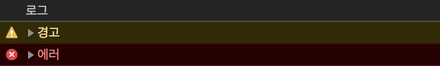

```toc
exclude: Table of Contents
from-heading: 1
to-heading: 5
```

# 1. 브라우저 내부 객체

브라우저 (크롬) 에서는 자바스크립트 엔진이 있어서 브라우저 내부 콘솔을 이용해서 자바스크립트 언어를 실행할 수 있다.

`콘솔` : 브라우저 시스템 내부를 키보드라는 입력장치를 통해 접근할 수 있는 장치

그리고 브라우저가 실행되면 자바스크립트의 실행컨텍스트 내부요소인 :bulb: scope chain에 `window`라는 객체가 담긴다.

[자바스크립트작동원리>실행컨텍스트](https://taeny.dev/environment/environment2_%EC%9E%90%EB%B0%94%EC%8A%A4%ED%81%AC%EB%A6%BD%ED%8A%B8%EC%9E%91%EB%8F%99%EC%9B%90%EB%A6%AC/#3-%EC%8B%A4%ED%96%89-%EC%BB%A8%ED%85%8D%EC%8A%A4%ED%8A%B8)

## window 객체

`window 객체` : 브라우저 내 여러기능들(뒤로가기, 창닫기, 팝업창, document 등)를 담고있는 `전역객체`

> 크롬에서는 tab 기능으로 하나의 브라우저에서 여러 창을 킬 수 있는데 각 창마다 각각의 window 객체를 가지는 것 같다.

```javascript
window.close() // 현재 보고있는 탭이 하나 닫힌다.
```

## document 객체

`document 객체` : 전달받은 html 파일을 document 객체 트리형태로 저장해서 window객체 내부에 들어간다.

```javascript
window.console.log(window.document) // 현재 페이지의 html 정보가 나온다!
```

[브라우저작동원리>렌더링엔진,DOM](https://taeny.dev/environment/environment1_%EC%9B%B9%EB%B8%8C%EB%9D%BC%EC%9A%B0%EC%A0%80%EC%9E%91%EB%8F%99%EC%9B%90%EB%A6%AC/#2-1-%EB%A0%8C%EB%8D%94%EB%A7%81%EC%97%94%EC%A7%84-dom)

> 그리고 window 객체는 전역객체로 scope chain 안에 담기기 때문에, window 내부 객체나 메소드는 window를 생략하고 사용할 수 있다.

```javascript
close() // close()는 window 내부 메소드기 때문에 window 생략가능
console.log(window.document) // console도 window 내부 객체이기 때문에 window 생략가능
```

# 2. window 내부 속성 및 객체

브라우저의 전역객체인 window 내부 속성, 객체, 메소드에는 어떤 것들이 담겨져있을까?

## 2-1. innerWidth, innerHeight (속성)

현재 window의 `내부 컨텐츠 길이`를 저장한다.

## 2-2. outerWidth, outerHeight (속성)

현재 window의 `sidebar를 포함한 전체 길이`를 저장한다.

> 크롬의 경우, 북마크 툴바나 devTools 모두 포함한다.

## 2-3. pageXoffset, pageYoffset (속성)

window 의 좌상단 좌표를 저장하는데, page가 window보다 커서 스크롤이 발생하면 page에 대한 window의 상대적 위치를 저장한다.

## 2-4. frames, frameElement (속성)

###### :question: \<iframe\> 학습 후 돌아오기!

## 2-5. length (속성)

###### :question: \<iframe\> 학습 후 돌아오기!

## 2-6. console (객체)

window 내부의 콘솔에 접근한다. 개발 초보인 나에게 한줄기 빛이 되어주는 `console.log`가 이 console 객체 안의 메소드를 사용하는 것!!

```javascript
console.log() // '갓'솔로그
console.warn() // 메시지를 경고형식으로 출력
console.error() // 메시지를 에러형식으로 출력
```



## 2-7. history (객체)

history 객체는 현재 사용하는 window 에서 내가 방문한 페이지들을 기록한다.

```javascript
var history = {
    length: 1; // length 속성을 통해 몇개의 페이지들이 기록되었는지 확인할 수 있다.
}

history.back() // 뒤로가기
history.forward() // 앞으로가기
history.go(2) // 해당 페이지로 가기
```

## 2-8. location (객체)

현재 페이지 url에 대한 내용이 담긴다.

```javascript
var location = {
  host: 'taeny.dev',
  href: 'https://taeny.dev/',
  pathname: '/',
  protocol: 'https:',
  search: '', //쿼리스트링에 대한 정보들
  port: '', //포트번호
}

location.reload() // 페이지를 새로고침한다!
location.replace() // url을 교체한다. history에 남지 않는다는 특징이 있다.
```

## 2-9. screen (객체)

브라우저 사용환경에 대한 정보들이 저장된다.

모바일 기기나 데스크탑 기기의 스펙 등이 해당된다. window의 innerWidth와 같은 속성과 다르게 `고정값`이다!! 즉, 브라우저의 크기를 줄이거나 해도 변하지 않음.

```javascript
var screen = {
  width: 1440,
  height: 900,
  availHeight: 1440, // 작업표시줄을 제외한 값, mac의 경우 상단 작업표시줄과 하단의 Dock 등이 제외됨.
  availWidth: 814, // 작업표시줄을 제외한 값
  colorDepth: 24, // 색상값
  pixelDepth: 24, // 픽셀값
}
```

###### :question: 반응형 웹 제작시, 명백히 어떤 환경인지(데스크탑, 태블릿, 모바일) 체크가 가능할듯!

# 3. window 내부 메소드

## 3-1. open(), close(), stop()

`open()` : 새로운 window 전역객체를 생성하고 탭, 또는 창을 연다.

```javascript
open() // about:blank 빈 페이지를 연다.
open('https://taeny.dev') // url 주소로 새창에서 연다. (두번째 parameter _blank 가 디폴트값으로 들어있음.)
open('https://taeny.dev', '_self') // url주소로 창을 여는데, 현재 페이지에서 연다.
open('https://taeny.dev', 'width:400,height:400') // 세번째 parameter 로 window 설정을 직접 지정할 수 있다.
```

`close()` : 현재 window 를 닫는다.

```javascript
close() // parameter가 없이 실행되는 메소드
```

`stop()` : 현재 window 의 로딩을 중지한다.

```javascript
stop() // parameter가 없이 실행되는 메소드
```

한 윈도우에서 다른 윈도우 객체를 컨트롤 할 수도 있다.

```javascript
const taenyLog = open('https://taeny.dev')
taenyLog.close() // 변수에 window 를 담아서 컨트롤
```

## 3-2. alert(), confirm(), propmt()

`alert()`: 일방적인 메시지를 전달하는 대화상자를 띄운다.

```javascript
alert('반가워요!') // 대화상자에는 ok 만 존재
```

`confirm()` : 메시지에 대한 응답을 양자택일해야하는 대화상자를 띄운다.

```javascript
confirm('회원정보를 등록할까요?') // 대화상자에는 ok, cancel 존재
```

`prompt()` : 메시지에 대한 응답을 input 형태로 묻는 대화상자를 띄운다.

```javascript
prompt('너의 이름은..?') // 대화상자에 input 창과 ok, cancel, input창이 존재
prompt('너의 이름은..?', '김00') // 두번째 parameter로 기본값(화면에도 보여짐) 설정가능
```

## 3-3. setTimeout(), clearTimeout()

`setTimeout()` : 두번째파라미터(ms) 시간 후, 첫번째파라미터(함수) 실행

```javascript
setTimeout(() => {
  console.log('3초지남')
}, 3000)
```

`clearTimeout()` : setTimeout() 메소드를 중지한다. setTimeout 메소드를 변수에 담고 첫번째 parameter에 변수명을 넣어준다.

```javascript
var timer = setTimeout(() => {
  console.log('3초지남')
}, 3000)

clearTimeout(timer)
```

## 3-4. setInterval(), clearInterval()

`setInterval()` : 두번째파라미터(ms) 시간마다, 첫번째파라미터(함수) 실행

```javascript
setInterval(() => {
  console.log('3초마다')
}, 3000)
```

`clearInterval()` : setInterval() 메소드를 중지한다. setInterval 메소드를 변수에 담고 첫번째 parameter에 변수명을 넣어준다.

```javascript
var interval_timer = setInterval(() => {
  console.log('3초마다')
}, 3000)

clearInterval(interval_timer)
```

## 3-5. moveBy(), moveTo()

`moveBy()` : 지정된 window 를 현재위치에서 주어진 값만큼 이동

`moveTo()` : 지정된 window 를 주어진 값의 절대적 위치로 이동

```javascript
// 현재 위치가 50,50인데 300,300 으로 이동하고 싶을 때,
moveBy(250, 250)
// or
moveTo(300, 300)
```

## 3-6. scrollBy(), scrollTo()

`scrollBy()` : 스크롤 위치를 현재위치에서 주어진 값만큼 이동

`scrollTo()` : 스크롤 위치를 주어진 값의 절대적 위치로 이동

```javascript
// 현재 위치가 0,50인데 0,300 으로 이동하고 싶을 때,
scrollBy(0, 250)
// or
scrollTo(0, 300)
```

## 3-5. resizeBy(), resizeTo()

`resizeBy()` : 지정된 window 의 크기를 현재크기에서 주어진 값만큼 변화시킴

`resizeTo()` : 지정된 window 의 크기를 절대적 크기로 변화시킴

```javascript
// 현재 크기가 50,50인데 300,300 사이즈를 키우고 싶을 때,
resizeBy(250, 250)
// or
resizeTo(300, 300)
```
