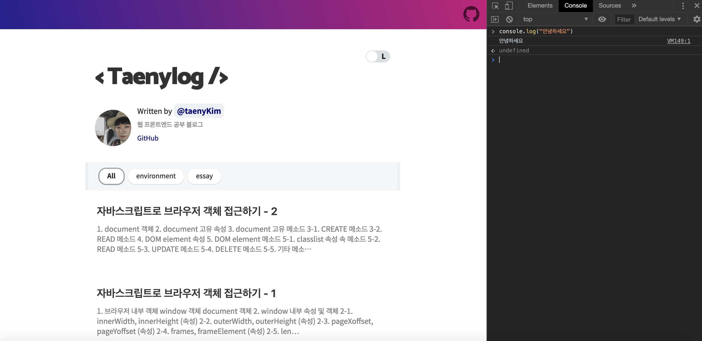
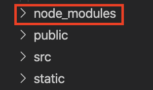

```toc
exclude: Table of Contents
from-heading: 1
to-heading: 5
```

# 1. nodeJS?

앞선 포스트에서 브라우저가 자바스크립트엔진을 통하여 자바스크립트를 실행하고 더나아가 브라우저 객체 혹은 DOM (html을 비롯한 태그요소들의 객체형태) 에 접근하는 방식에 대해 다뤘다.

- [웹브라우저작동원리](https://taeny.dev/environment/environment1_%EC%9B%B9%EB%B8%8C%EB%9D%BC%EC%9A%B0%EC%A0%80%EC%9E%91%EB%8F%99%EC%9B%90%EB%A6%AC/)

- [자바스크립트로브라우저객체접근하기-1](https://taeny.dev/environment/environment3_%EC%9E%90%EB%B0%94%EC%8A%A4%ED%81%AC%EB%A6%BD%ED%8A%B8%EB%A1%9C%EB%B8%8C%EB%9D%BC%EC%9A%B0%EC%A0%80%EA%B0%9D%EC%B2%B4%EC%A0%91%EA%B7%BC%ED%95%98%EA%B8%B01/)

- [자바스크립트로브라우저객체접근하기-2](https://taeny.dev/environment/environment4_%EC%9E%90%EB%B0%94%EC%8A%A4%ED%81%AC%EB%A6%BD%ED%8A%B8%EB%A1%9C%EB%B8%8C%EB%9D%BC%EC%9A%B0%EC%A0%80%EA%B0%9D%EC%B2%B4%EC%A0%91%EA%B7%BC%ED%95%98%EA%B8%B02/)

## 1-1. nodeJS란?

브라우저 프로그램은 자체 자바스크립트엔진을 내장해서 브라우저를 컴퓨터에 설치하면 자동으로 자바스크립트엔진이 설치되고 브라우저 내에서 자바스크립트를 실행할 수 있다.



> 이렇게 개발자도구 콘솔을 이용하면 된다.

하지만, 브라우저 없이 자바스크립트의 실행환경을 구성할 수 없을까?

이 때, 브라우저 없이 내 컴퓨터에서 자바스크립트를 실행할 수 있는 프로그램이 바로 `nodeJS` 이다.

> 즉, 내 자바스크립트 프로그램을 프로세스로 만들어 주는 것이 바로 nodeJS !

> nodeJS는 크롬과 같은 v8 자바스크립트 엔진을 사용한다.

[브라우저작동원리>자바스크립트엔진](https://taeny.dev/environment/environment1_%EC%9B%B9%EB%B8%8C%EB%9D%BC%EC%9A%B0%EC%A0%80%EC%9E%91%EB%8F%99%EC%9B%90%EB%A6%AC/#2-2-%EC%9E%90%EB%B0%94%EC%8A%A4%ED%81%AC%EB%A6%BD%ED%8A%B8%EC%97%94%EC%A7%84)

그리고 html에서는 `<script></script>` 태그로 자바스크립트파일을 불러와 실행 시켰다면 nodeJS 에서는 `node 파일이름.js` 처럼 명령어를 통해 자바스크립트를 실행한다.

# 2. nodeJS 가 하는일

그럼 구체적으로 nodeJS로 무엇을 할 수 있을까?

## 2-1. 웹 서버 구동

웹의 작동원리는 브라우저에서 다른 컴퓨터(서버)의 프로세스에 포트를 통해 접근해서 필요한 소스를 받아오는 식이다.

[웹작동원리](https://taeny.dev/environment/environment1_%EC%9B%B9%EB%B8%8C%EB%9D%BC%EC%9A%B0%EC%A0%80%EC%9E%91%EB%8F%99%EC%9B%90%EB%A6%AC/#1-%EC%9B%B9-%EC%9E%91%EB%8F%99%EC%9B%90%EB%A6%AC)

만약 다른 사용자가 웹을 통하여 내 프로그램에 접근하고 싶을 때, 내 프로그램은 컴퓨터 어디선가 프로세스 형태로 돌아가고 있어야 하고 nodeJS는 내 컴퓨터의 리소스를 사용해 프로그램을 돌려준다. (즉 nodeJS 내장 자바스크립트 엔진을 이용해 자바스크립트를 실행시켜준다.)

## 2-2. 모듈 시스템

`모듈` : 특정한 기능을 하는 함수나 변수들의 집합

방대한 프로그램의 덩치를 관리가 용이하게 쪼개거나 외부 잘 만들어진 프로그램을 쉽게 내 프로그램에도 쓸 수 있게 해주는 것이 모듈!

> 모듈은 자체로도 하나의 프로그램이면서 전체 프로그램의 부품으로 사용된다.

### commonJS, AMD, ES6(작성중)

직접 모듈을 만들어서 메인 프로그램에 넣어줄 수 도 있고,

```javascript
// modules.js
const name = 'taeny'
module.exports = { name }

// main.js
const { name } = require('./modules.js')
console.log(name)
```

외부(npm) 에서 잘 만들어진 모듈을 가져와 쓸 수 도 있다.

> 외부

## 2-3 npm(작성중)

node_modules



# 3. nodeJS 작동원리

nodeJS는 실행컨텍스트 내에서 대표적으로 싱글스레드, 비동기 방식으로 자바스크립트를 실행한다.

[자바스크립트작동원리](http://localhost:8000/environment/environment2_%EC%9E%90%EB%B0%94%EC%8A%A4%ED%81%AC%EB%A6%BD%ED%8A%B8%EC%9E%91%EB%8F%99%EC%9B%90%EB%A6%AC/)
