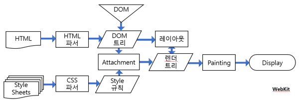

```toc
exclude: Table of Contents
from-heading: 1
to-heading: 5
```

# 1. 웹 작동원리

## 1-1. 프로그램

우리가 컴퓨터 프로그래밍 언어(c, java, javascript 등)으로 작성한 코드들의 집합을 `프로그램`이라고 부른다.

> js 로 작성한 계산기 프로그램 // calculator.js

그리고 이 프로그램이 프로그램을 실행할 수 있는 환경에서 실행되어 실제로 동작하게 되면 프로그램은 `프로세스`가 된다.

> nodeJS로 프로그램을 실행 // node calculator.js

이 환경은 보통 컴퓨터가 해주며 이 실행되어지는 프로세스에는 `포트`를 통해 접근할 수 있다.

그리고 포트를 통해 접속한 프로세스에서는 `스레드`라는 작업흐름 단위를 통해 코드를 읽고 일을 수행한다.

## 1-2. 인터넷, 웹, HTTP

우리는 인터넷을 통해 전세계에 많은 프로그램에 접근할 수 있다.

`인터넷`은 TCP/IP라는 통신 프로토콜(패킷이라는 자그마한 단위를 통해 정보들을 전송할 수 있게 만들어놓은 규칙)을 이용해 정보를 주고받는 컴퓨터 네트워크이다. 이 인터넷 덕분에 와이파이로 카톡을 보내고 컴퓨터로 게임을 할 수 있게 되었다.

비슷한 개념으로 `웹`은 이러한 인터넷이라는 하나의 환경을 통해 사람들이 정보를 공유할 수 있는 전 세계적인 정보 공간을 의미한다.

> 인터넷이라는 기술로 우리는 웹을 사용한다!

우리는 웹에서 `HTTP`(HyperText Transfer Protocol) 통신프로토콜을 이용해 하이퍼텍스트(정보의 형태)를 주고 받는다. 대표적으로 하이퍼텍스트를 작성하는 언어가 `HTML`(HyperText Markup Language)이다.

> HTTP통신으로 HTML을 주고받을 수 있게 됨!

## 1-3. 브라우저, 클라이언트, 서버

우리는 일반적으로 엔드유저로서 `브라우저`라는 프로그램을 사용해 웹에 접근한다.

브라우저는 `Url`을 통해 전세계에 흩뿌려져 있는 프로그램이 담긴 컴퓨터의 프로세스에 포트를 통해 접근한다.

> 포트 표준 HTTP:80 / HTTPS:443

표준 포트를 사용했으면 보통 url에서 포트번호를 생략한다.

프로그램이 담긴 컴퓨터 중 요청을 응답해주는 역할을 하는 컴퓨터를 `서버` , 서버에 요청을 보내는 역할을 하는 것을 `클라이언트` 라고 한다.

> 말그대로 client 는 요청을 하는 고객이고 server 는 서비스를 제공한다. ('serve' + er)

## 1-4. 프론트 서버, 백엔드 서버

서버는 사용자에게 html을 던져주거나, 데이터베이스의 자료를 가져오는 등 다양한 역할을 하는데, 서버의 역할에 따라 서버를 분리하기도 한다.

**브라우저 -> 컴퓨터1 -> 컴퓨터2**

> 요청형태에서 컴퓨터1은 클라이언트의 역할도 서버의 역할도 함.

위의 컴퓨터1을 `프론트 서버`로, 컴퓨터2를 `백엔드 서버`로 명명했을 때,

프론트서버는 `사용자에게 GUI 환경을 제공해주는 서버`의 역할을 맡으며

백엔드서버는 `사용자 정보나 해당 어플리케이션의 데이터에 접근하는 것을 가능하게 해주는 서버`의 역할을 맡음.

> 나누는 이유 : 서버의 역할을 분리함으로써, 높은 안정성과 빠른 속도, 관리용이

> 나눴을 때의 이슈 : cors ( 일반적으로 주소가 다른 컴퓨터의 정보교환은 제한됨.)

###### :question: (분리하는 경우와 통합하는 경우에 대해, jsp 와 nodeJS로 알아보기)

# 2. 브라우저 작동원리

브라우저에는 렌더링엔진, 자바스크립트엔진, 자료저장소(쿠키저장)가 대표적으로 내장되어 있다.

## 2-1. 렌더링엔진, DOM

`렌더링엔진`은 전달받은 하이퍼텍스트 정보(대표적으로 html)를 화면에 그리는 역할을 한다.

> 렌더링엔진 : webkit gecko ...



여기서 `DOM`(Document Object Model) 이라는 개념이 나오는데, DOM은 html 정보를 객체기반으로 표현한 방식으로, 전달받은 html을 객체형태로 만들어서 조작을 가능하게 만들어준다.


> document 안의 html, 그 아래의 트리구조의 태그들 모두 객체이며 모두 `객체`로서 접근 및 컨트롤 할 수 있다.

> 객체에 접근하는 메소드 (document.getElementById(id) 등) 을 사용할 수 있게 됨.

렌더링 엔진은 이러한 DOM 방식을 통해 tree형태(`DOM tree`)로 구조화하고 CSS와 함께 `Rendering tree`를 구조화해 화면을 그려준다.

## 2-2. 자바스크립트엔진

브라우저에는 렌더링뿐만 아니라 자바스크립트를 해독하는 `자바스크립트엔진`도 존재한다.

> 대표적으로 크롬의 v8...

> nodeJS 런타임도 v8을 사용한다고 한다.

### 싱글스레드, 비동기 방식

자바스크립트는 자바스크립트엔진을 통해 `싱글스레드`와 `비동기 방식`으로 해독된다.

- `싱글스레드` : 자바스크립트는 프로세스 내에서 하나의 스레드를 통해 작업을 수행한다.

- `비동기 방식` : 비동기(Asynchronous)는 작업이 동시에 일어나는 것이 아니라 각자 별개로 일어남을 의미한다.

> 동기, 비동기의 개념이 많이 헷갈렸는데 동기[同期]는 같을 동자를 써서, 작업의 흐름이 모두 같은 맥락에서 일어나고, 비동기[非同期]는 그와반대로 작업이 작업의흐름과 상관없이 개별적으로 일어난다고 이해하였다!

> 비동기 방식을 `Non-Blocking processing model`(막힘이 발생하지 않음) 라고도 한다. 즉, A, B, C 작업의 흐름에서 B에서 blocking이 일어나도 C를 수행한다.

그럼 blocking은 언제 발생할까?

blocking은 요청을 보내서 **시간이 걸리는 작업들**에서 발생한다.

> ex) 서버에서 데이터를 요청하고 받아오는 경우(AJAX), DOM 조작, setTimeout() 같은 내장 함수

- `AJAX`(Asynchronous Javascript And Xml) : JavaScript를 사용한 비동기 통신, 클라이언트와 서버간에 XML 데이터를 주고받는 기술

그럼 자바스크립트는 blocking을 어떻게 막힘이 없는 비동기 방식으로 처리할까?

### 자바스크립트 이벤트루프


- `heap` : 자바스크립트 내의 객체, 전역 변수 등 메모리할당하는 역할

- `stack`: 자바스크립트 내의 지역 변수, 콜 함수 등 메모리할당하는 역할

이벤트루프 매커니즘

1. 자바스크립트의 함수들이 실행되면 함수들은 stack에 push(저장)되고 실행이 완료되면 pop(제거)된다.

> ㄴ 싱글스레드 개념

2. blocking (시간이 걸리는 작업들)이 들어오면 콜백함수와 함께 pop(제거)되며 web API 로 보내진다. 이 때, 다음 stack의 함수들을 실행한다.

> ㄴ 비동기 방식

3. web API 의 콜백 응답결과를 callback Queue에 저장하고, stack 에 남은 함수들이 없으면 콜백함수는 다시 stack에 push 되서 실행된다.

> ㄴ 이벤트루프

이렇게 callback Queue에 작업이 들어있는지, stack이 비어있는지 끊임없이 감시하고 작업을 실행하는 것을 `이벤트 루프`가 담당한다.

> web API 와 콜백 큐, 이벤트루프 덕분에 자바스크립트는 비동기 방식으로 작동할 수 있다.
