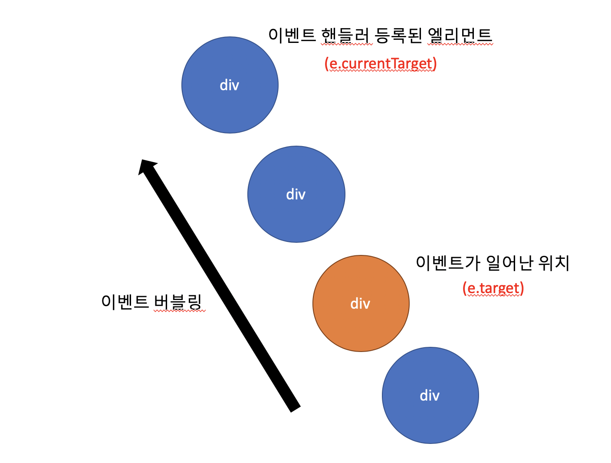

```toc
exclude: Table of Contents
from-heading: 1
to-heading: 5
```

# 1. document 객체

[자바스크립트로 브라우저 객체 접근하기 - 1](https://taeny.dev/environment/environment3_%EC%9E%90%EB%B0%94%EC%8A%A4%ED%81%AC%EB%A6%BD%ED%8A%B8%EB%A1%9C%EB%B8%8C%EB%9D%BC%EC%9A%B0%EC%A0%80%EA%B0%9D%EC%B2%B4%EC%A0%91%EA%B7%BC%ED%95%98%EA%B8%B01/)

브라우저가 실행되면 전역객체 window가 자바스크립트 실행 컨텍스트 this 에 담기고 document 객체는 `window 객체 안에 들어있는 하나의 객체이며 html을 트리구조로 객체화시킨 root객체`이다.

그럼 document 객체 안에는 어떤 속성들과 객체, 메소드가 들어있고, 어떻게 객체화된 html 태그들을 조작할 수 있을까?

# 2. document 고유 속성

```javascript
var document = {
    head : <head>, // html 의 head 부분 반환
    body : <body>, // html 의 body 부분 반환
    charaterSet : "UTF-8", // html 의 캐릭터셋 반환
    documentElement : <body> // html을 반환
    // document.html 이 아니다!!
    forms : HTMLCollection[], // 현재문서에서 모든 form 태그들 반환
    links : HTMLCollection[], // 현재문서에서 모든 하이퍼링크 태그들 반환
    images : HTMLCollection[], // 현재문서에서 모든 이미지들 반환
}
```

# 3. document 고유 메소드

## 3-1. CREATE 메소드

`document.createElement()` : 해당 태그를 참조하는 DOM element 생성.

```javascript
document.createElement('div')
```

`document.createTextNode()` : parameter 로 문자열을 받고, 텍스트노드를 생성.

**\<p\>내가바로텍스트노드!\<\/p\>**

```javascript
var newtext = document.createTextNode('내가바로텍스트노드!')
document.body.appendChild(newtext)
```

`document.createDocumentFragment()` : .

###### :question: dom 리렌더링 과정 학습 후 다시오기

## 3-2. READ 메소드

`getElement`

**document.getElementById()** : parameter에 해당되는 id를 가진 DOM element를 읽어온다.(단수)

**document.getElementsByClassName()** : parameter에 해당되는 class 이름을 가진 DOM element들을 **HTMLCollection** 형태로 읽어온다.(복수)

**document.getElementByTagName()** : parameter에 해당되는 태그들을 HTMLCollection 형태로 읽어온다.(복수)

`querySelector`

**document.querySelctor()** : parameter에 해당되는 선택자를 가진 DOM element를 읽어온다.(단수)

**document.querySelectorAll()** : parameter에 해당되는 선택자를 가진 DOM element들을 **노드리스트** 형태로 읽어온다.(복수)

`getElement vs querySeletor`

> getElement 메소드는 문자열형태의 parameter 값을 넣어서 element를 찾는 반면, querySelector 메소드는 parameter에 직접 선택자(#id .class div)를 넣어 비교적 자유롭게 사용가능하다.

## 4. DOM element 속성

```javascript
var elem = {
    id : "", // id 를 가져온다.
    className: "n1 n2", // 클래스 이름들을 가져온다. 공백으로 구분. 설정도 가능하다.

    // :star: children vs childNodes
    children: HTMLCollection[], // 모든 자식 태그들을 가져온다
    childNodes: NodeList[], // 모든 자식 노드들을 가져온다 (텍스트노드포함)

    // :star: NodeList vs NamedNodeMap
    attributes: NamedNodeMap{}, // 속성들을 가져온다.

    // :star: element와 vs node
    parentElement : // 부모 element 를 가져온다.
    parentNode : // 부모 node 를 가져온다.

    nodeType: 1, // 노드타입, 1일경우 element(태그객체)

    // 엘리먼트의 전체크기 (border,padding : o / margin: x)
    offsetWidth: 100,
    offsetHeight: 40,

    // 엘리먼트의 실제크기 (padding: o / border, margin: x)
    clientWidth: 90,
    clientHeight: 30,

    innerHTML : "", // element의 자손을 STRING 형태로 반환
    outerHTML : "" // element의 자손을 STRING 형태로 반환 (나포함)

    // :star: innerText vs innerContent
    innerText : "", // element의 렌더링된 텍스트부분 반환
    innerContent : "", // element Node의 텍스트부분 반환
}
```

`children vs childNodes`

> children 속성은 element 인터페이스의 속성이고 childNodes는 node 인터페이스의 속성이다. **차이점**은 텍스트노드가 node에는 포함되지만 element에는 포함되지 않는다는 것이다. 일반적으로 생각하는 태그들에 해당하는 DOM element를 불러오고 싶으면 children 속성을 참조하는 게 맞다.

`Node vs Element vs EventTarget`

> DOM 트리 내부 객체들의 모든 요소들은 Node를 상속 받고(텍스트노드, 주석 포함), 그 중에서 id, class 처럼 식별자를 가지는 태그 객체들은 Element를 상속 받는다. 즉, element는 node 이며, node의 타입 중 하나가 element 이다. 그리고 node는 또 부모인 EventTarget 의 속성을 상속받는다.


> 예) html 의 부모노드는 document 이지만, html 의 부모 엘리먼트는 null.

###### :question: 그럼 텍스트노드에도 이벤트리스너를 등록할 수 있는건가? (해보기)

`NodeList vs NamedNodeMap`

> NodeList[] 와 NamedNodeMap{} 의 **차이점** : 둘다 collection 형태로 데이터'들'을 가져오지만 NodeList는 순서가 있는 반면 NamedNodeMap은 순서가 없다.

`innerText vs innerContent 예제`

```html
<div>
  렌더링되는 부분
  <div style="display:none">숨겨진 부분</div>
</div>
```

**innerText** : "렌더링되는 부분" 반환!

**innerContent** : "렌더링되는 부분 숨겨진 부분 반환!

# 5. DOM element 메소드

## 5-1. CREATE 메소드

**elem.classList.add()** : 해당 element 에 클래스 추가

**elem.classList.remove()** : 해당 element 에 클래스 제거

## 5-1. READ 메소드

**elem.contains()** : 해당 element가 특정 element를 `자손`으로 가지고 있는지 판단. (boolean 값 반환)

**elem.hasChildNodes()** : 해당 element가 특정 element를 `자식`으로 가지고 있는지 판단. (boolean 값 반환)

**elem.getBoundingClientRect()** : 해당 element의 크기요소를 `DOMRect` 객체 형태로 반환

```javascript
var DOMRect = {
  x,
  y,
  width,
  height,
  top,
  right,
  bottom,
  left,
}
```


## 5-2. UPDATE 메소드

**elem.append()** : 해당 element를 특정 부모 element의 마지막 자식으로 넣음

**elem.appendChild()** : 해당 element를 특정 부모 element의 마지막 자식으로 넣음.

`append() vs appendChild()`

> append() 는 텍스트노드도 자식으로 넣을 수 있지만 appendChild() 는 태그가 존재하는 element만 자식으로 넣을 수 있다.

```html
<button>클릭해주</button>
<script>
  document.getElementByTagName('button')[0].append('세요')
</script>
```

> 클릭해주세요 버튼이 가능해진다.

**elem.prepend()** : 해당 element를 특정 부모 element의 첫번째 자식으로 넣음.

> 얘도 텍스트노드 자식추가가 가능하다.

## 5-3. DELETE 메소드

**elem.remove()** : 해당 객체를 DOM 트리에서 제거.

**elem.removeAttribute()** : 해당 객체의 속성 제거. (parameter 에 속성을 넣어준다.)

## 5-4. 기타 메소드

**elem.scrollIntoView()** : 컨테이너에서 해당 element의 위치로 스크롤한다.

## 5-4. EVENT 메소드

**elem.addEventListener()** : 이벤트리스너 등록

**elem.removeEventListener()** : 이벤트리스너 제거

**elem.dispatchEvent()** : 해당 elem 에 event 디스패치 (parameter 로 이벤트 객체가 들어감)

# 4. 이벤트 핸들러

## 3-1. 이벤트 핸들러란?

DOM 객체는 속성값으로 이벤트핸들러를 가질 수 있다.

이벤트핸들러란 클릭하거나, 값을 입력하는 등 사용자가 직접 브라우저에서 하는 액션(이벤트)들을 감지해서 반응해주는 역할을 한다.

이 때 반응은 함수를 실행시키며, javascript가 해준다.

## 3-2. 이벤트란?

1. 이벤트는 객체이며, 스스로 속성을 갖는다.

2. 이벤트가 발생하면 이벤트핸들러의 속성값인 함수를 실행시킨다.

3. 이 때, 함수에 이벤트객체를 같이 보내준다. (보통, e, event로 명칭함)

## 3-3. 이벤트 버블링

중첩된 DOM 요소들이 이벤트를 처리하는 방식

```javascript
<div onclick="alert('outer')">
  <button onclick="alert('inner')">click me</button>
</div>
```

버튼을 누르면 버튼만 눌리는 것이 아니라 버튼을 감싸는 div Element 도 같이 눌러진다.

이 때, 이벤트핸들링 순서는 DOM tree 에서 가장 깊은곳부터 시작해서 root인 document로 쭉 올라간다.

이러한 메커니즘을 이벤트 버블링이라고 한다. (반대 방식은 이벤트 캡쳐링이라고 함)

## 3-4. 이벤트 속성

```javascript
var e = {
  type: 'click', // 이벤트 타입
  target: elem, // 이벤트버블링 최하위 엘리먼트 반환 (실제 이벤트발생한 애)
  currentTarget: elem, // 이벤트핸들러가 위치한 엘리먼트 반환
}
```

`target vs currentTarget`



## 3-3. 이벤트 타입

[MDN문서](https://developer.mozilla.org/en-US/docs/Web/Events)

`1. 마우스 이벤트`

**click** : 클릭

**dblclick** : 더블클릭

**contextmenu** : 마우스 오른쪽 클릭

**mouseover** : 마우스가 해당 element 위를 지나감

**mouseout** : 마우스가 해당 element 위에서 벗어남

**mousedown** : 마우스가 클릭한 상태

**mouseup** : 마우스가 클릭을 해제한 상태

**mousemove** : 마우스 이동

`2. 폼 이벤트`

**submit** : formData 제출

**focus** : input element가 활성화된 상태

**change** : 값의 변화

`3. 키보드 이벤트`

**keydown** : 키보드의 키를 누름

**keyup** : 키보드의 키를 뗌

`4. DOM 이벤트`

**DOMContentLoaded** : html이 DOM 트리를 구성 완료하였음

`5. CSS 이벤트`

**transitionend** : CSS의 애니메이션이 끝남

## 3-3. 이벤트 핸들러 종류

이벤트 핸들러는 `on + 이벤트` 형태로 DOM element의 속성값으로 존재!

> onclick, onchange, onsubmit ...

## 3-4. 이벤트 핸들링 방식

**1. html only**

```html
<button type="button" onclick="alert('안뇽')">click me</button>
```

`주의` : 이벤트핸들러의 속성 값으로 string 형태가 들어가므로 함수 내부에 string 사용 시, 큰 따옴표로 작은따옴표로 감싸줘야함.

> or

**2. 태그 이벤트핸들러 속성 값에 함수 삽입**

```html
<button type="button" onclick="sayHi()">click me</button>

<script>
  function sayHi() {
    alert('안뇽')
  }
</script>
```

> or

**3. DOM 접근 후 속성 값에 함수 대입**

```html
<button id="hiBtn" type="button">click me</button>

<script>
  function sayHi() {
    alert('안뇽')
  }

  document.getElementById('hiBtn').onclick = sayHi
</script>
```

`주의` : DOM 객체로 속성값을 넣어줄 경우, 함수를 호출형태인 sayHi() 가 아니라 객체변수형태로 넣어줘야함!

> or

**4. DOM 접근 후 addEventLister 메소드 사용**

```html
<button id="hiBtn" type="button">click me</button>

<script>
  function sayHi() {
    alert('안뇽')
  }

  document.getElementById('hiBtn').addEventListener('click', sayHi)
</script>
```
