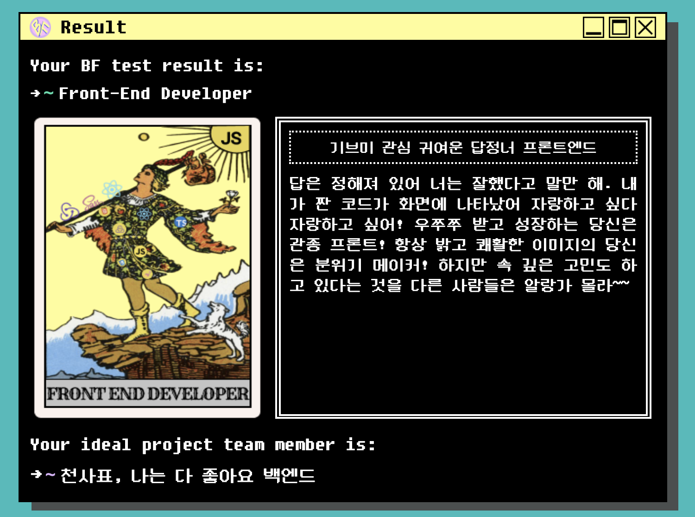

우연한 계기로 개발 커뮤니티에서 Frontend VS Backend 성향테스트 웹 어플리케이션을 알게되었다. 직접 테스트를 해보고 공감도 많이되고 재밌어서 테스트 후기에 대한 포스팅을 작성해보려고 한다. 테스트는 아래 링크에서 진행할 수 있다.

[http://bftest.wecode.co.kr/](http://bftest.wecode.co.kr/)

# 1. 테스트

메인 디자인 컨셉은 `레트로` 이다. 디자인이 개인적으로 정말 취향저격이었다..ㅠㅠ

**"그럼 테스트 시작!"**

테스트 항목은 전체가 아니라 몇개만 추려서 캡쳐해보았다.

내가 다니는 학교 아주대학교에는 미대가 없고, 디자인을 가르치는 학과가 우리학과 (미디어학과) 가 유일했다. 그래서 팀플에서 미디어학과임을 밝히는 순간 PPT 제작자로 전직할 수 있었다.

내가 제일 좋아하는 항목..인데, 아이언맨도 아이언맨 수트와 자비스의 합작이듯, (로다주는 사용자 및 개발자라고도 볼 수 있을듯!) 웹 서비스도 프론트 백엔드 모두 중요하다고 생각한다. 나는 아이언맨 수트를 선택했다!

은근 고민했는데 아무리 생각해도 귀요미인 것 같다.

ㅎㅎ.. 믿고 싶은 것만 믿을래요..

# 2. 결과

> 기브미 관심 귀여운 답정너 프론트엔드

결과는 현재 내가 프론트엔드 공부하는 방식과 비슷한 점이 많아서 너무 만족스러웠다.

## 2-1. 기브미 관심

내가 개발자를 하기로 마음먹고나서 블로그를 시작했다. 블로그 포스팅은 최대한 사람들에게 알리려고 했다. 기존에 나는 혼자 공부하는 것을 선호했지만 블로그를 시작하고 방식을 바꿨다. `private` 보다는 `public` 이 나에게 더 큰 도움이 되었다. 잘못된 지식에 대한 지적도 댓글을 통해 받은 적도 있었고, 무엇보다 사람들이 내 글을 볼 수도 있다 생각은 나에게 더 깊은 공부를 하게 했다.

그리고 스터디도 시작하고 개발 커뮤니티를 통해 다양한 사람들의 좋은 글들과 생각들도 접하기 시작했다. 또 다른 사람의 코드나 글을 보고 내 의견도 말해보면서 혼자는 배울 수 없는 것들도 많이 배울 수 있었던 것 같다.

## 2-2. 분위기 메이커

사실 분위기 메이커인 것은 모르겠지만, 다른 사람과 스터디, 팀플 혹은 프로젝트를 하게되면, '이럴때는 어떤 식으로 말하는 것이 좋을까?', '상대방이 기분 나쁘진 않을까?' 이런 고민을 되게되게 많이 한다. 그래서 여태껏 팀플하면서 큰 트러블이 생긴 적은 없었던 것 같다.

## 2-3. ideal team member

저도 다 좋아요.. 즐건 코딩 해효..☺️
