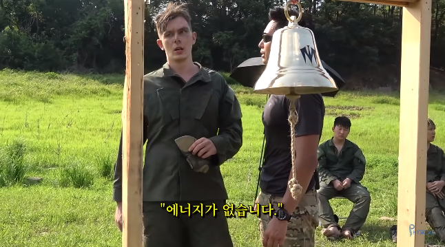

벌써 다음주면 부스트캠프 챌린지가 끝이난다. 시간이 참 빠른듯.ㅠㅠ 이번주도 마찬가지로 느낀점들을 공유해보려한다. (의식의 흐름 주의..!!)

**TMI 모음**

```
- 미션 난이도가 많이 올라간 것 같다ㅎㅎ..
- 다른 부스트캠퍼분들 덕분에 맥북 용량 문제를 해결했다!! (집단지성의 힘)
- 팀원분들이 블로그를 잘 봤다고 해주셔서 정말 감사했다
- 릴레이프로젝트 자기소개 때 웃음캐리해주신 익명의 00님에게도 감사를
```

```toc
exclude: Table of Contents
from-heading: 1
to-heading: 1
```

# \#. Series

<details>
<summary>부스트캠프 챌린지 후기 시리즈 한눈에보기[접기/펼치기]</summary>
<div markdown="1">

- [1. 꾸준히 성장할 수 있는 개발자 [부스트캠프 2020 챌린지 1주차 후기]](https://taeny.dev/essay/boostcamp-challenge-1/)

- [2. 적극적이지만 말랑말랑한 개발자 [부스트캠프 2020 챌린지 2주차 후기]](https://taeny.dev/essay/boostcapm-challenge-2/)

- [3. 멘탈과 체력이 튼튼한 개발자[부스트캠프 2020 챌린지 3주차 후기]](https://taeny.dev/essay/boostcamp-challenge-3/)

- [4. 🏕 부스트캠프 챌린지를 마치며](https://taeny.dev/essay/boostcamp-challenge-4/)

</div>
</details>

# 1. 프론트도 DB, 백엔드를 알아야하나?

부스트캠프 프로그램은 웹 풀스택과정이지만, 평소에 **프론트엔드 개발자도 백엔드를 알아야할까?** 라는 의문이 있었고, 이번주 릴레이 프로젝트를 통해 약간의 해답을 찾을 수 있었다.

프론트엔드 기준으로 데이터를 서버로 보내거나 서버에서 데이터를 받는 과정에서 어떤 형식으로 데이터를 주고 받을 것인지 정하고, 데이터가 잘 전달되는지 커뮤니케이션을 하기위해서는 결국엔 데이터가 처리되는 곳(서버)의 상황을 아는 것이 중요했다.

프론트엔드도 백엔드도 결국 웹 개발자이고 전문적인 분야를 파기전에 전체적으로 데이터가 어떻게 처리되고 서버나 DB등이 어떻게 작동하는지는 기본적으로 알야겠구나 생각하게 되었다.

같은 맥락으로 프로세스나 OS, CPU같은 컴퓨터 지식도 프로그램 동작에 대한 이해도를 위해서 개발자로서 꼭 알아야하는 개념이겠구나 하는 생각이 들었다.

> 이런 부분들을 부캠에서 많이 배워가는 것 같다.

# 2. 온라인 vs 오프라인

3주동안 부캠을 온라인으로 진행한 결과, 온라인의 장점들도 많이 보였다.

편안한 공간(집)에서 진행할 수 있어서 좀 더 긴장이 덜했고, 이동시간도 들지 않아서 좀 더 개발과 학습하는데 시간을 더 투자할 수 있었다. 그리고 멀티가 안되는 나로서는, 미션할 때도 좀 더 집중할 수 있었던 것 같다.

질의응답 또한 개개인에게 오프라인으로 직접 하는 것이 아니라 모든 부스트캠퍼분에게 할 수 있어서 양질의 정보를 빠르게 얻을 수 있었던 점도 큰 장점이었다.

그리고 화상회의도 불편한점이 별로 없었던 것 같다. 이번주는 화상회의 화면공유를 많이 이용했는데, 화면공유를 통해서 다수의 사람들이 한 화면을 보면서 회의를 하거나 라이브코딩도 할 수 있어서 너무 좋았던 것 같다.

첫주차에는 캠키는게 어색하고 창피했지만 이제는 적응을 했는지, 이번주에는 주말에도 (모이기로하지도 않았는데) 팀원사람들이랑 줌에서 만나서 이야기를 나눴다.ㅋㅋ

# 3. 구현먼저 vs 설계먼저

영화촬영을 할 때,

탄탄한 시나리오와 스토리보드를 바탕으로 똑같이 재현하는 스타일의 감독이 있는 반면에,

시나리오 없이(혹은 러프하게 짜서) 유동적인 촬영을 선호하는 감독이 있다.

봉준호 감독이 전자로 유명하며, 홍상수 감독이 후자로 유명하다.

개발 또한 구현먼저하는 방식, 설계먼저하는 방식 어떤 것이 더 좋은지는 스타일의 차이라고 생각한다.

하지만 두 영화감독 모두 내공이 어마어마해서 자기가 맞는 스타일로 디렉팅할 수 있는 것처럼 개발에 있어서도 구현먼저하는 방식도 해보고 여러 설계방식도 공부해보면서 먼저 개발내공을 쌓는 것이 중요한 것 같다.

TMI) 슬랙에 구현을 먼저하는지 설계를 먼저하는지에 대해 투표도 있었는데 신기하게도 반반의 결과가 나왔다.(55대56)

> 역시, 정답이 없는 게 정답!

> 페북의 초창기 모델도 **구현먼저**로 이루어지지 않았나..?

# 4. Reusable!

현대의 프로그램들은 모든 로직을 개발하기보다는 이미 개발된 것들을 조합해서 만드는 경우가 많다는 말은 어디선가 들은 것 같다.

나도 미션을 하면서 예전 미션에서 만들었던 함수를 다시 사용하는 경우가 많았다.

어떤 기능을 하는 함수를 모듈단위로 잘게 쪼개놓는 것은 미래의 나에게 시간을 많이 줄여주는 일인 것 같다.

앞으로도 의존성을 최소화하고 쉽게 재사용할 수 있는 코드를 작성하려고 신경써야겠다.

# 5. 코드리뷰

이전의 피어세션에서는 미션을 하면서 배운 점, 공부한 점들을 공유하는 방식 위주로 진행했다.

하지만 이번주에는 시간이 남으면 코드리뷰하는 시간도 가졌다.

평소에는 다른 사람의 코드를 읽어보는 것에만 집중했는데 코드리뷰를 해보니까 내 코드는 다른 사람들에게 어떻게 보일까? 라는 생각도 해보게 되었다.

그래서 코드를 짜면서 주석도 달아보고 JSdoc(함수 타입에 대한 주석)도 사용해보았다. 내 코드가 어떻게 보일까라는 생각도 하기 시작하니까 뭔가 리팩토링도 더 신경쓰게 되었던 것 같다.

> 팀원분들이 메소드를 상수화해서 코드량을 줄인 거나 모듈로 분리한 부분을 칭찬해주셔서 기분이 좋았다..!

# 6. 멘탈과 체력이 튼튼한 개발자

저번 2주차 후기 포스팅에서 개발자에게 중요한 것은 **개발에 대한 흥미를 잃지 않는 것**이 아닐까 생각했었는데, 이번주 해보면서 좀 더 중요한 것이 있다는 것을 알게되었다.

그것은 바로 `튼튼한 멘탈`과 `체력`이다. (aka. 건강)

이번 주 미션 중에 조금 버거운 부분이 있었는데 미션은 수행하였지만 에너지를 다 써버려서 학습정리를 바로 이어서 할 수 없었다. 그래서 일찍 자고 새벽에 해야겠다고 생각하고 일찍 자버렸다.



개발도 많은 에너지를 소모하는 일이여서 튼튼한 멘탈을 기르고 오랫동안 유지할 수 있도록 체력을 기르는 것이 정말 중요하겠구나 생각했다. 공부하고 코딩하는 것도 중요하지만 내 컨디션을 잘 조절하고 무리하지 않는 것도 중요한 것 같다.
