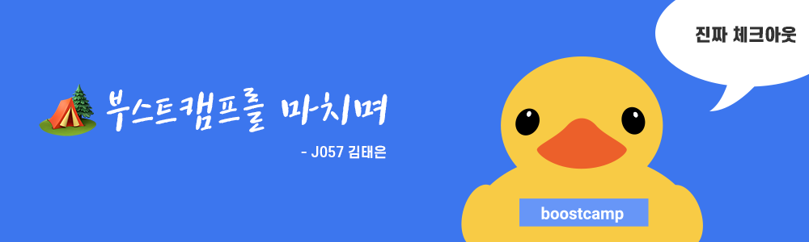

부캠 챌린지 4주차 마지막 후기이다. 시간은 참 빨리갔지만, 4주간 정말 많은 것들을 배웠다. 마지막 후기인만큼 4주차가 아닌 부캠 전체를 리뷰해보려 한다.

**TMI 모음**

```
- 사실 아직 부캠이 끝났다는게 실감이 나지않는다.
- 사실 블로그에는 느낀점만 적지만, 내가 평소 부족했던 CS에 대해서도 엄청 많이 공부할 수 있었다.
- 마지막에 롤링페이퍼를 썼는데 코딩하느라 사라졌던 감성들을 다시 느낄 수 있어서 좋았다.
- 멋있는 분들이 참 많다. 나도 실력을 떠나 인간적으로 멋있는 사람이 되고싶다.
```

```toc
exclude: Table of Contents
from-heading: 1
to-heading: 1
```

# \#. Series

<details>
<summary>부스트캠프 챌린지 후기 시리즈 한눈에보기[접기/펼치기]</summary>
<div markdown="1">

- [1. 꾸준히 성장할 수 있는 개발자 [부스트캠프 2020 챌린지 1주차 후기]](https://taeny.dev/essay/boostcamp-challenge-1/)

- [2. 적극적이지만 말랑말랑한 개발자 [부스트캠프 2020 챌린지 2주차 후기]](https://taeny.dev/essay/boostcapm-challenge-2/)

- [3. 멘탈과 체력이 튼튼한 개발자[부스트캠프 2020 챌린지 3주차 후기]](https://taeny.dev/essay/boostcamp-challenge-3/)

- [4. 🏕 부스트캠프 챌린지를 마치며](https://taeny.dev/essay/boostcamp-challenge-3/)

</div>
</details>

# 1. 내가 원하던 교육

여태 받았던 교육은 대체로 지식을 주입하는 방식이었다.

강사 혹은 교수님께서는 수준이 높으신 분들이어서 학생들에게 요구하는 배경지식 또한 높았고, 강의나 수업을 듣다가 이해가 안되서 포기하곤 했었다. 애초에 어렵다는 인식을 가져서 흥미가 잘 생기지 않았던 것 같기도 하다.

하지만 부캠의 교육은 기존에 내가 받았던 교육과는 달랐다. 학습해야할 개념을 기반으로 만들어진 `미션` 은 자기만의 방식으로 스스로 공부해서 자기만의 방식으로 스스로 수행해야 했다.

학생들은 각자 자신이 선호하는 매체(책, 영상, 인터넷)를 이용해서 관련 개념을 학습하고 코드 구현 또한 자신의 방식대로 구현할 수 있었다.

스스로 공부하는 방식이었기 때문에, 내가 잘 모르는 부분은 무엇이고 부족한 부분은 무엇인지 파악하여 능동적으로 공부할 수 있었다. 예를들어, **"호스트마다 프로세스를 가지고있고, 포트로 연결하며, 소켓을 통해 데이터를 주고받는다."** 라는 문장이 있다고 치면, 예전에는 그냥 그렇구나 외우고 넘어갔지만, 호스트가 뭔지 프로세스가 뭔지, 각각의 개념들에 대해서 알아야 코드로 구현할 수 있었고, 그렇기 위해서는 추가적으로 필요한 개념들을 꼬리에 꼬리를 물며 학습해야했다. 이런식으로 추상적인 개념들을 코드로 구체화시키면서 이해하기도 쉬웠고 재밌게 공부할 수 있었던 것 같다.

또한 정말 좋았던 부분은 `피어세션` 이었다. 관련 개념들에 대해서 다른 팀원들과 매일매일 토의할 수 있는 시간이 있어서 내가 잘못 이해했거나, 헷갈리는 것들을 바로 잡을 수 있었다. 혹은 다른 팀원들에 의해서 미처 찾아보지 못했던 새로운 개념들을 알 수 있게 되기도 했다.

새로운 지식을 강의자 입맛대로 주입되는 방식이 아니라, 나의 배경지식을 토대로 스스로 학습할 수 있어서 너무 좋았고 내가 원하던 교육방식이 이런게 아니었을까? 하는 생각을 하게 되었다.

> 부캠을 하면서 스스로 학습할 수 있는 능력을 많이 키울 수 있었던 것 같다.

# 2. 지속가능한 성장

부스트캠프 챌린지는 기본기를 스스로 학습하는 시간이었다고 생각한다. CS지식 뿐만 아니라, 사람들과 커뮤니케이션 하는 방법, 모르는 개념에 대해서 대처하는 방법 등등 개발자가 갖춰야할 기본적인 능력, 덕목에 대해서 많이 생각해보게 되었고 실제로 이 부분에 대해서 많이 성장했다고 느낄 수 있었다.

부스트캠프는 다음단계인 멤버쉽 프로그램이 존재한다. 챌린지가 기본기를 다지는 단계였다면 멤버쉽은 여기서 배운 기본기를 바탕으로 팀을 이뤄 실제 프로그램을 만들어보고 좀 더 실무에 가까운 협업을 할 수 있는 것으로 알고 있다.

멤버쉽 프로그램 또한 정말 좋은 기회이기 때문에 나를 포함해서 모든 캠퍼분들이 하고싶어할 것 같다. 나도 정말 열심히 했다고 생각하지만, 나 뿐만 아니라 거의 대부분의 분들이 정말 열심히 했다는 것을 알기 때문에 멤버쉽까지 갈 수 있을지는 잘 모르겠다.

하지만 부스트캠프가 추구하는 가치는 지속가능한 성장이고, 멤버쉽에 참여여부는 내가 정할 수 있는 부분이 아니기 때문에, 중요한 건 앞으로 챌린지를 하며 자신에게서 느꼈던 개발에 대한 열정과 흥미를 쭉 유지해나가며 지속적인 성장을 해 나가는 것이 중요한 게 아닐까 생각해본다.

> 부캠의 챌린지 프로그램은 멤버쉽 프로그램의 **PASS / FAIL** 을 결정하는 단계가 아니라 지속가능한 성장을 위한 개발 기본기를 쌓는 프로그램이다.

# 3. 기본기가 탄탄한 나다운 개발자

챌린지를 하면서 내가 평소에 부족했던 CS에 대해서 공부할 수 있었고, JavaScript의 좋은 패턴이나 다양한 코딩스타일을 접할 수 있었다.

그리고 많은 사람들이 참여하는 프로그램이니 만큼, 정말 다양한 사람들이 많다는 것도 느낄 수 있었다.

인공지능에 대해서 잘 아시는 분, 디자인적으로 감각이 뛰어나신 분, 코드를 객체지향적으로 짜시는 분, 함수형으로 짜시는 분, 커뮤니케이션을 주도하시는 분, 주도하시지 않지만 존재감이 크신 분, 재밌으신 분, 친절하신 분, 꼼꼼하신 분 등등 정말 여러 스타일의 사람들이 계셨다.

하고싶은 분야또한 달랐다. 프론트나 백엔드에 대해서 확실하게 자기 꿈을 갖고 계신분도 계셨고, 아직 정하지 못했다고 하신 분도 계셨고 풀스택으로 모두 다하고 싶다고 하신 분도 계셨다. 아직 개발을 좋아하는지 잘 모르겠다고 하셨던 분도 계셨다.

이처럼 정말 개성이 넘치는 사람들을 보면서 여러 생각이 들었고 덕분에 많이 에너지를 얻기도, 자극을 얻기도 했던 것 같다.

사실, 나도 프론트엔드를 할지, 그래픽쪽을 할 지 정하지 못했다. 둘다 시각적인 부분을 개발한다는 점에서 공통적이지만, 그것을 서비스에 적용시킬지, 좀더 예술분야에 적용시킬지의 차이가 있겠지만 앞으로 멤버쉽이 되든 안되든 앞으로 내가 무엇을 공부할 지 더 고민해봐야겠다.

각자가 다양한 꿈을 가지고 있듯, 나도 이제 챌린지에서 기본기를 쌓았으니, 앞으로 나다운, 나만의 강점을 찾아 깊게 파보고 싶다.

> 이제 진짜 시작이다

# 에필로그. 블로그 글을 쓰는 이유

사실 블로그 글도 매주 느낀 점들이 너무 많아서 기억들을 기록으로 남기기 위해서 시작했다.

어쩌다보니 주차마다 글을 쓰게 되었고 글을 쓸 시간을 오래 가질 수 가 없어서 의식의 흐름대로 막 적어서 글의 완성도도 높지 않지만 글을 쓰면서 머리속에 추상적으로 남아있던 생각들을 정리할 수 있어서 좋았던 것 같다.

> 매 주 나를 돌아보면서 다음 주를 준비하는 시간이 되기도 해서 계속 글을 썼던 것 같다.

첫주차 글이 부스트캠프 SNS계정에 공유되면서 (정말정말 감사합니다 ㅠㅠ 저는 이제 죽어도 여한이..없읍니다) 다른 부스트캠퍼분들이 글을 잘 읽었다고 해주실 때면, 쑥스러워서 제대로 대답을 못했지만 마음속으로는 정말정말 감사했다.

> 내가 다시 읽어봐도 정말 부족한 글인데,, 빈말이라도 칭찬을 해주셔서 너무 기분이 좋았다.

미션을 하루에 하나씩 수행하다 보니 좀더 깊게 공부할 수 없어서 아쉬웠는데, 앞으로는 그 중에서 내가 좀더 공부하고 싶은 분야나 관심있는 분야에 대해 좀더 깊게 공부해서 전문적이고 기술적인 글도 쓰고싶다.
