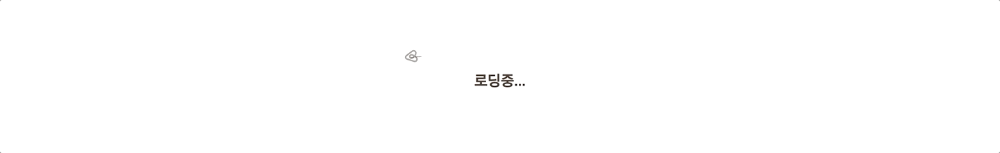
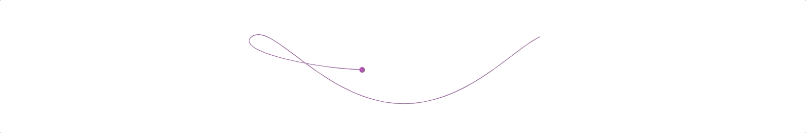
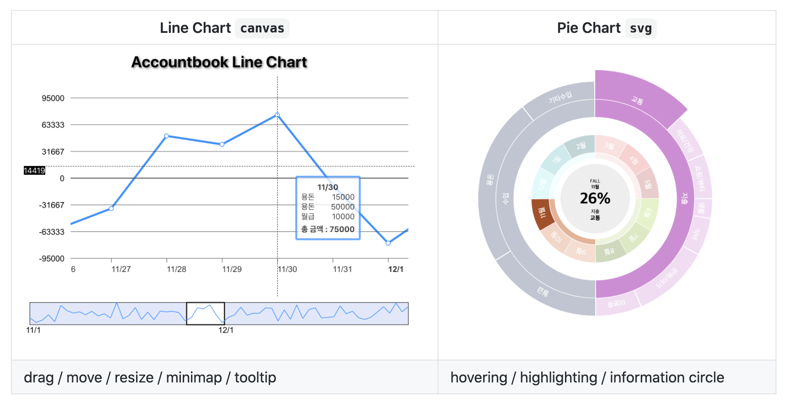
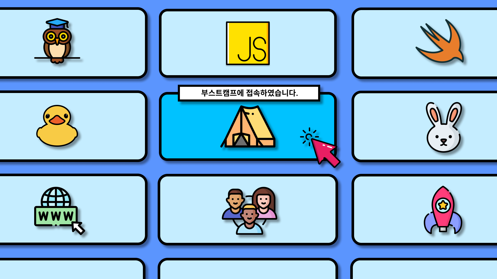
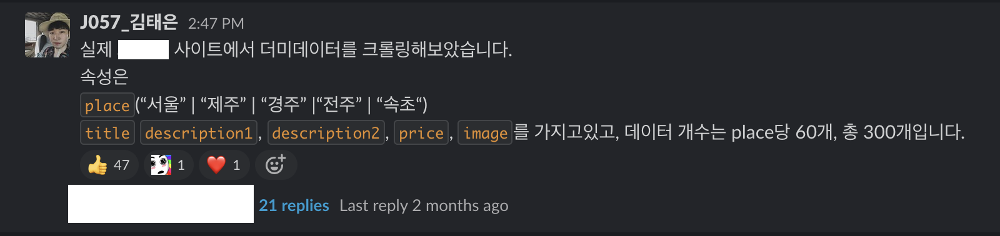

부스트캠프 멤버십 학습스프린트 기간이 끝이 났다. CS를 학습했던 챌린지와 달리 멤버십은 실제 웹 서비스에 대한 학습을 진행했다. 요구사항 기한은 하루단위에서 일주일단위로 늘어났고, 자유도도 올라갔으며, 스스로 공부해야할 것들도 끝이 없었다.

이번 포스팅에서는 멤버십 학습스프린트 기간동안 학습한 기술적인 내용들보다 개인적으로 느꼈던 것들 위주로 적어보려한다.

# Table of Contents

```toc
exclude: Table of Contents
from-heading: 1
to-heading: 1
```

# 1. 요구사항 구현 vs 공부

부스트캠프 멤버십 학습스프린트는 2주마다 요구사항이 적힌 기획서를 보면서 스스로 요구사항을 해결하는 식으로 진행이 되었다. 총 6주간 3개의 프로젝트를 해결해야했는데 프로젝트를 진행할 때마다 이런 의문이 있었다.

> 이번 학습 스프린트에서는 요구사항 구현을 우선으로 해야할까? 개념에 대한 공부를 우선으로 해야할까?

첫번째 프로젝트 때는 어쨋든 구현이 중요하다고 생각해서 공부보다는 요구사항을 맞추는 것에 초점을 두고 진행했고, 두번째 프로젝트 때는 공부가 중요하다고 생각해서 공부에 초점을 두어서 진행했다. 공부에 집중했던 두번째 프로젝트는 요구사항을 해결하지 못하고 미완성으로 프로젝트를 마치게 되었다.

그래서 마지막 미션때에는 요구사항 구현에 초점을 두되, 공부는 요구사항에 필요한 부분까지만 진행하고 요구사항 구현을 마치면 다시 부족한 부분을 공부하기로 했다. 이렇게 하니까 요구사항도 많이 구현할 수 있었고, 학습도 더 다양하게 할 수 있었던 것 같다.

학습 스프린트는 사실 학습이 주이지만, 요구사항을 시간 내에 구현하는 것 또한 개발자의 역량이라고 생각한다. 또한 학습은 공부만 의미하는 것이 아니고 구현하며 깨친 생각들이나 찾아본 자료들 모두 학습의 일부이기 때문에 구현하면서도 충분히 학습이 된다고도 생각한다.

실제 회사 업무 또한 요구사항을 제한시간 안에 해결하는 것의 연속일테고, `어떤 개념이나 라이브러리를 공부하는 과정`도 어쨋든 실제로는 **잘 써먹기 위해서 하는 과정** 이고 실제 **프로덕트를 위한 수단들** 이기 때문에 어쨋든 중요한 것은 구현이 아닐까? 생각하게 되었다.

시간은 한정되어있고, 내 뇌의 용량도 한정되어있다. 그렇기 때문에 무작정 공부하는 것보다는 내가 필요한 만큼만, 구현이나 개선과정에 필요한 만큼만 공부하는 것도 좋은 방법이 아닐까 생각해보게 되었다.

> 요구사항에 대해서 얼만큼을 공부에 투자하고 얼만큼을 개발에 투자할 지 스스로 정할 수 있느냐가 실력이 아닐까?

# 2. 요구사항을 넘어 공부하기

이번 학습스프린트는 그래도 자유도가 있었다. 마스터님들께서도 여러 시도들을 많이 해보라고 말씀해주셨다. 파일구조도 직접 고민해보고 스스로 만들어보거나, 필요하다면 디자인패턴을 공부해서 좋은 예시들을 적용해도 되었다.

그래서 나는 매 프로젝트마다 파일구조도 다르게 해보았고, 요구사항에 없는 기능들도 직접 만들어서 추가해보기도 하였다.

## svg animation

첫번째 프로젝트에서는 요구사항에 없는 로딩 애니메이션을 구현해보았다. 사실 계획에는 없었는데 [2020 FEconf](https://2020.feconf.kr/) 사이트를 보고 svg 애니메이션이 너무 멋있어서 공부해서 비슷하게 적용해보고 싶었다.



사실, 프로젝트가 무겁지 않아서 로딩화면이 필요없지만 `setTimeout` 으로 페이지 초기에 로딩화면을 강제로 보여지게 하였다. (실제로 이러면 안된다..ㅋㅋ)

> 추가로 [깃허브 프로필](https://github.com/taenykim/taenykim)에도 적용해보았다.



## 디자인 패턴

두번째 프로젝트에서는 container presenter 패턴을 시도해봤는데 잘 적용하지는 못했던 것 같다. 사실 예전에 네이버 핵데이 때 리액트로 적용해봤었는데, 바닐라 JS로 해보려니까 쉽지 않았던 것 같다.

리뷰어님께 이 패턴을 잘 적용하고 있는지 여쭤봤는데, `디자인 패턴을 잘 따르고 있는가?` 보다는 `이 패턴을 왜 사용하려고 하였는가?` 를 먼저 질문해보라고 하셨을 때는 머리에 망치를 맞는 느낌이었다.

객체에게 어떤 역할을 부여할 것인지, 어떻게 코드를 더 효율적으로 관리할 것인지가 중요한 것인데, 나는 맹목적으로 이렇게 해야돼! 하면서 패턴에 내 코드를 맞추기 급급했던 것 같았다.

하지만 이러한 시도는 다음 프로젝트부터 스스로 필요에 따라 객체지향적인 설계를 해봐야겠다고 다짐해보는 계기가 되었다.

## 차트 라이브러리 [Interactive-chart](https://github.com/taenykim/interactive-chart)

마지막 프로젝트에서는 시각화 차트를 직접 구현해보는 요구사항이 있었는데 평소에 canvas와 svg에 관심이 많았어서 처음부터 라이브러리를 염두해두고 작업하기로 하였다. 데이터가 많이 포함되는 **Line Chart**는 `canvas` 로, 앨리어싱이 생기는 **Pie Chart**는 `svg` 로 구현하기로 하였고 프로젝트 내에 라이브러리를 제작해서 적용까지 해보았다.



차트를 만들면서 내가 개발을 하는건지, 수학공부를 하는건지 종이에 뭔가를 쓰는일이 많았는데 내가 계획한대로 구현이 하나씩 될 때마다의 쾌감이 매우 커서 힘들지는 않았던 것 같다.

## 성능 개선 애니메이션


마찬가지로 마지막 프로젝트에서 카드가 무한으로 움직이는 애니메이션을 추가해보았다. `Intersection Observer` 와 `requestAnimationFrame` 으로 리플로우가 일어나지 않도록 구현해보았다. 사실 인터랙션도 몇개 추가 하고 싶었는데 못한 게 조금 아쉬웠다.

## 다양한 시도를 해보면서..

사실 부스트캠프는 풀스택과정이지만, 입과 이전부터 프론트엔드쪽에 관심이 많았던 나는 학습스프린트를 하면서 좀 더 프론트엔드에 치중해서 작업을 해보았던 것 같다. ~~그래도 기본적인 백엔드 학습도 같이 병행했기 때문에 조금 부족하더라도 백엔드쪽 지식도 많이 늘었던 것도 같다.~~

물론 하면서 삽질도 많이 하고, 평가도 직접 했어야 해서 어려운점이 많았지만 챌린지 때도 그렇고 부캠은 스스로 성장할 수 있는 개발자가 되기 위한 베이스캠프라고 생각하기 때문에 힘들 때마다 `내가 잘하고 있구나` 하면서 계속 스스로를 격려해주었다.

# 3. 같이하기

멤버십 학습스프린트는 프로젝트를 혼자서 진행하는 식이었지만 매일 아침마다 스크럼이 있었고, 금요일마다는 동료들과의 코드리뷰를 하였고, 격주에 2번은 리뷰어님께 코드리뷰를 받을 수 있었다.

만약 혼자 했었더라면 가독성이고 뭐고 신경안썼을텐데, 다른 캠퍼들과 같이 코드를 공유하고, 리뷰어님께도 코드를 보여줘야했기 때문에 자연스럽게 가독성에도 많은 신경을 썼던 것 같다.

그리고 다른 잘하는 캠퍼분들의 작업방식이나 코드를 보면서 자극을 받기도 하였다. 역시 부스트캠프의 가장 큰 장점은 열정이 넘치는 사람들과 같이 학습할 수 있다는 것인 것 같다.

> 오프라인으로 이러한 열정을 부대꼈으면 좀 더 좋지 않았을까하는 아쉬움도 들었다..ㅠㅠ

# 4. TMI 추억들

이제는 부캠이 일상이 되어버려서 추억들도 많이 쌓였다.

## zoom 가상배경 공모전

멤버십 합격 후, zoom 가상배경 공모전을 했는데 수상했다! 😋



Figma 에디터를 이용하였고, 부스트캠프랑 관련된 아이콘들을 무료 벡터이미지 사이트에서 줍줍해와서 제작하였다. 몇몇 캠퍼분들이 직접 사용해주시는 것을 보고 너무너무 기분이 좋았다.

## 크롤링한 더미데이터 공유

첫번째 미션에서 사용할 더미데이터를 직접 크롤링해서 공유해보았다. 이미지를 하나하나 복사붙여넣기로 가져오다가 너무 비효율적이라고 생각해서 직접 데이터를 크롤링해서 슬랙을 통하여 공유했는데 많은 분들이 좋게 반응해주셔서 뿌듯했다.



## 더블모니터 설치

첫번째 스프린트 그룹에서 더블모니터 주제가 나왔는데 뽐뿌가 와서 더블모니터를 설치해보았다.. ㅋㅋ 케이블,젠더가 잘 안되서 10만원을 허공에 날렸지만 어쨋든 설치했고, 신세계를 경험했다.

## 마스터 클래스

매주 3번 마스터 클래스가 있었는데, 배우는 것도 많았지만, 특히 마스터분들이 너무 재밌으셔가지고 항상 웃었던 것 같다.ㅋㅋㅋ 퍽퍽한 온라인 일상에서 그나마 많이 웃을 수 있어서 너무 좋았던 시간이었다.

## 랜선 meet up & 수료생 tea time & 옥토버페스트

학습 스프린트 중간중간에 여러 행사들도 있었는데, 부스트캠프를 수료하고 현업에서 개발자로 일하시는 선배들의 조언과 팁을 들을 수 있는 자리가 있었다. 집중이 풀리고 멘탈이 흔들릴 때 쯤 이런 자리가 있어서 정말정말 큰 힘과 자극이 되었다.

이런 경험이 쌓이면 쌓일수록 나도 나중에 후배 개발자나 도움이 필요한 사람들에게 가치있는 사람이 되고 싶다는 생각이 계속 든다. 아직은 내코가 석자기 때문에 더더욱 열심히 공부하고 많이 경험해봐야겠다. 👊

## tech talk

캠퍼분들이 직접 연사가 되어서 발표하는 자리도 있었는데, 나는 면접준비 때문에 신청을 못해서 아쉬웠는데 발표하신분들의 퀄리티를 보고 안하길 잘했다는 생각을 했다.ㅋㅋ 역시 세상엔 멋있는 사람들이 많구나를 느꼈다.

## 비공식 모임

서울에서 비공식으로 캠퍼들과 오프라인 모임을 가졌는데, 너무너무 재밌었다.ㅋㅋ 부스트캠프 네임드분들을 봤을 때는 신기하기도 했고, 피어세션을 같이했던 분들을 봤을 때는 너무 반갑기도 하였다. 나중에 부캠출신들이 창업도 하고, 유명한 개발자가 되어있고 그러면 더더욱 신기하면서 반가울 것 같다.

# 5. 앞으로!!!

학습스프린트는 RPG게임으로 치면 스스로 퀘스트를 수행하고 경험치를 쌓는 단계였다고 생각한다. 어떤 사람은 마을에서 무시무시한 자신만의 무기를 만들기도 하였고, 어떤 사람은 직접 몰라도 부딪히며 몸으로 체득하는 사람들도 있었다.

그룹프로젝트는 좀 더 중요한 팀으로 성장하는 방법에 대해 고민해볼 시간인 것 같다. 개개인이 학습 스프린트를 통해서 배운점이나 느낀점은 모두 다르겠지만, 혼자 앞서달리려고 하기보다는 여럿일 때의 시너지를 더 낼 수 있는 방법을 찾고 같이 문제를 해결하는 방법들에 대해서 많이 배웠으면 좋겠다.

마지막으로 슬랙에 이것저것 많이 공유하는 습관을 들여야겠다. 너무 나서는 것이 아닌가? 라는 생각이 머리에 배여있어서 그런지 잘 공유를 하지 않았는데, 개발이라는 분야는 더 많이 나서고 많이 알리려 하는 것이 자신에게도, 상대방에게도 좋은 것 같다. 이제껏 계속 공유받기만 했는데 앞으로는 좀 더 공유하는 사람이 되려고 노력해야겠다.
