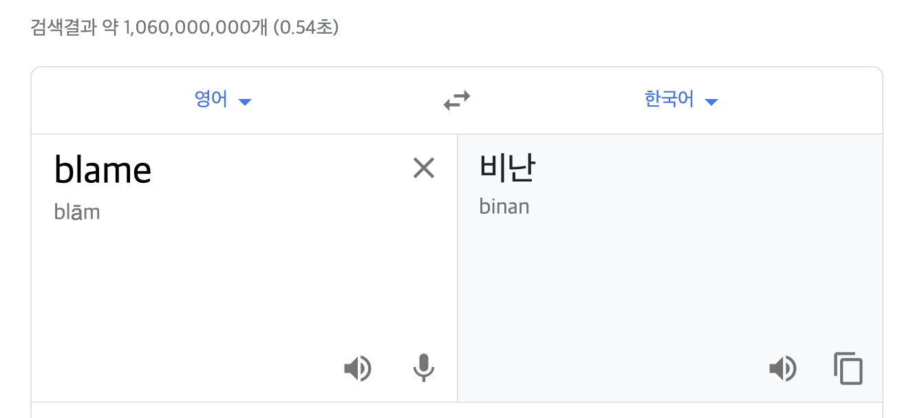

2020 오픈소스 컨트리뷰톤 멘티선정 발표와 함께 선착순으로 오픈소스101 교육 프로그램을 신청할 수 있었다. 평소 깃을 써보긴했지만, 타임테이블을 보니까 **rebase**, **blame** 등 익숙하지 않은 git 기능들도 배울 수 있었고, 평소에 궁금했던 오픈소스 협업 생태계(?)도 알려주신다고 해서 바로 신청하게 되었다.

교육은 리얼리눅스의 [송태웅](https://github.com/Taeung)님께서 진행해주셨다. 강사님께서도 정말 친절하게 그리고 재밌게 가르쳐주셨고 조교님들도 계속 돌아다니면서 궁금한 점, 막히는 점들도 같이 봐주셔서 너무 즐겁게 깃을 배울 수 있었던 것 같다.

교육 프로그램은 기본실습과 고급실습 두 섹션으로 나누어져있었는데, 기본실습은 온라인으로 듣기로 하고 고급실습은 오프라인으로 직접 가서 배우기로 하였다.

---

```toc
exclude: Table of Contents
from-heading: 1
to-heading: 1
```

# history

이번에 깃을 배우면서 가장 인상깊었던 점은 바로 **히스토리(역사)** 였다.

평소 깃은 버전 업데이트를 위해서 쓰이는 도구라는 개념이 머릿속에 박혀있었다. git을 통한 기능들(새로운 기능 추가, 버그수정,브랜치작업이나 커밋, 푸시 등)은 `과거`보다는 `미래`를 위해 존재한다고 생각했다.

하지만 깃은 VCS(Version Control System)으로 마냥 프로그램의 새로운 버전, 새로운 기능을 위해서 존재하는 것이 아니라 이전 버전과 기능의 히스토리의 기록을 추적하기 위함에도 있다는 것을 알 수 있었다. 우리 삶도 내일을 향해 한발짝 전진하는 데에 목적이 있지만 현재를 만들어 준것들은 모두 과거의 행위이고 많은 사람들의 컨트리뷰션이 있기에 현재가 존재한다는 점에서 깃도 우리삶과도 많이 닮았다는 생각도 하게 되었다.

> 그렇기에 앞으로는 커밋 하나하나도 중요하게 생각하고 잘 작성해야겠다는 생각도 해보았다.

# GUI vs CLI

나는 평소에 깃 명령 (스테이징, 커밋, 푸시 등등)을 vscode의 메뉴 GUI를 이용했었다. 필요에 따라 CLI도 쓰긴했지만 CLI가 아직은 익숙치 않아서였을까? 아니면 GUI가 더 쓰기 편해서 그랬을까? 아무튼 GUI를 쭉 사용했던 탓에 실제 git 명령어들은 뭔가 익숙하지 않은 느낌이었다.

하지만 이번 오픈소스101 교육프로그램을 통해서 웬만하면 GUI를 쓰지않고 CLI를 써보기로했다. 버튼을 눌러서 조작하지 않고 직접 명령어를 한줄한줄 치다보니 git에 대해서 더 많이 이해할 수 있었고 자신감도 생기게 되었다. CLI 경험은 git을 이해하는데 정말 필요한 과정이라는 것을 경험으로 느낄 수 있었다.

앞으로는 **"간단한 git 기능들은 GUI를 쓰되, reset이나 rebase 등의 디테일한 작업은 CLI를 쓰자!!"** 같은 나만의 규칙(?)도 만들 수 있었다.

# rebase

git rebase 기능은 말그대로 베이스를 다시 맞춘다는 의미이다. 만약 upstream/master에 변경사항이 있다면 나의 작업물은 변경사항 이전이 아니라 변경사항 이후가 base가 되어야 한다. (그래야 정상적인 merge가 가능하다) rebase는 베이스를 다시 맞춘다는 의미에서 정말 중요한 기능이라는 생각이 들었다.

또한 `rebase -i (--interactive)` 를 통해 이전 역사로 되돌아가 이전에 했던 커밋을 수정하거나 커밋을 합칠 수도 있었다. 작업 후에는 `rebase --continue` 를 통해 다시 되돌아가기전의 상태로 돌아올 수도 있었다. 이것이야말로 타임머신같은 기능이었는데 앞에서 언급했듯, git은 미래뿐만 아니라 과거 모두가 기록되는 역사(history)이기 때문에 쌓이는 패턴 뿐만 아니라 과거로 돌아가 커밋을 조작하는 것도 충분히 알고 있어야겠다는 생각을 하게 되었다.

# reset

rebase 뿐만 아니라 reset으로도 과거로 돌아가는 것이 가능했다. 이전에는 `git reset --hard` 는 **커밋삭제하는 거다!** 라고만 생각했는데, 이번 실습을 통해 삭제라기보다는 HEAD를 돌려 과거로 돌리는 것이라는 표현이 맞는 것 같다는 생각을 하게 되었다. `rebase -i` 는 현재로 돌아올 수 있는 타임머신 왕복권이라면 reset은 현재로 돌아오지 못하는 타임머신 편도권 같았다.

# blame



> blame의 뜻은 비난이다..😅

그리고 git blame을 통해 파일의 코드에 대한 컨트리뷰터 정보도 볼 수 있었다. 깃은 프로그램의 역사를 다루는 시스템이기 때문에 코드를 누가 어느 시점에 작성했는지도 정말 중요한 요소이구나를 느꼈다. 근데 명령어를 blame으로 지어준 덕분에 **"코드 이거 누가짰어!"** 하면서 마음을 벼르고 `git blame` 을 치는 사람의 모습만 그려질 뿐이지만, 오픈소스를 기여할 때, 그만큼 책임감을 가지고 신중하게 해야겠다는 생각을 하게 되었다.

# 마무리

평소 배우고싶었던 깃을 너무 쉽고 재밌게 무료로! 배울 수 있어서 너무 좋았던 시간이었다. 실습을 통해 직접 CLI도 쳐보고 충돌이슈도 해결해보았다. 아직은 익숙하지 않아서 버벅대기는 했지만 이러한 기술적인 부분보다 git이 왜 나왔는지, 왜 중요한지를 조금 이해한 것 같아서 신기하기도 하고 재밌기도 했다. 앞으로 여러시도를 많이 해봐야겠다.

그리고 깃을 통하여 하나의 프로그램이 여러명의 컨트리뷰터들을 통해서 역사를 남기며 나아간다는 것 자체가 너무너무 매력적인 것 같다는 생각도 하게 되었다. 어떠한 훌륭한 프로젝트에 내 발자취를 꾹 남기는 것도 정말 좋은 의미인 것 같다. 언능 나도 실력을 쌓아서 여러 오픈소스에 기여할 수 있었으면 좋겠다.

# 부록

> 내가 참고하기 위해 적어놓는 깃 명령어 모음 😎

## 조회

```bash
git log --oneline #커밋 조회
git log --oneline -n #n개의 커밋조회
git log --oneline --reverse #역순으로 커밋 조회

git show <commit ID> # 1개의 커밋확인

git blame <file NAME> #해당파일의 코드 컨트리뷰터 정보
```

## 되돌리기

```bash
git reset --hard HEAD~1 #최근 커밋 이전으로 되돌리기 (파일변경사항 삭제)
git reset --soft HEAD~1 #최근 커밋 이전으로 되돌리기 (파일변경사항 유지)

git rebase -i #pick->edit으로 이전으로 돌아갈 수 있다.
git rebase --continue #현재로 다시 돌아오기
```

## 수정

```bash
git commit --amend #커밋 수정
```

## 동기화

```bash
git fetch upstream master #upstream의 히스토리를 가져오기
git rebase upstream/master #베이스 갱신
```
