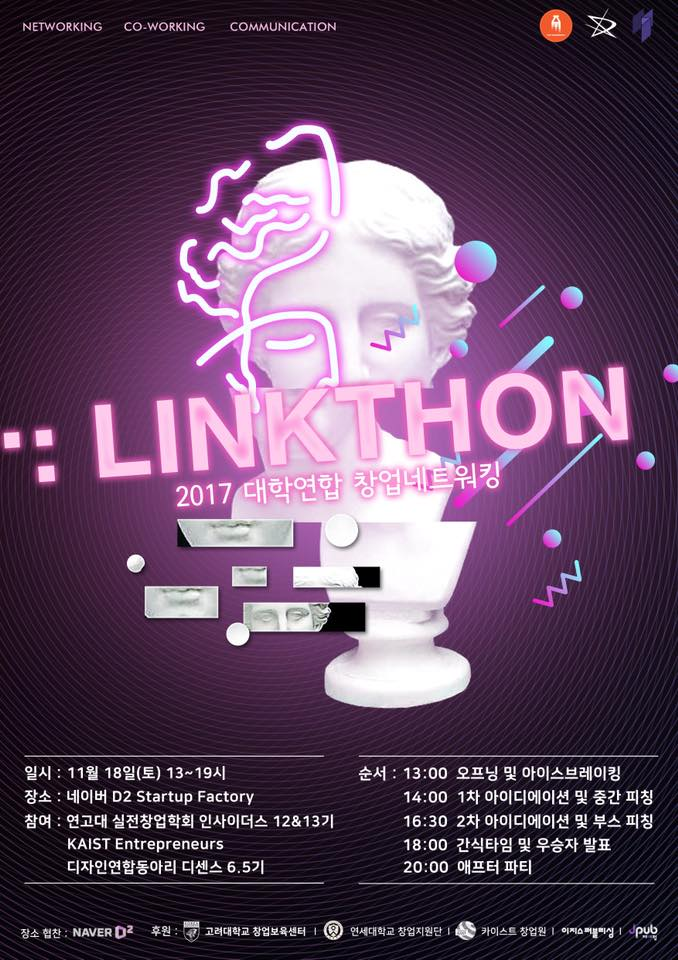
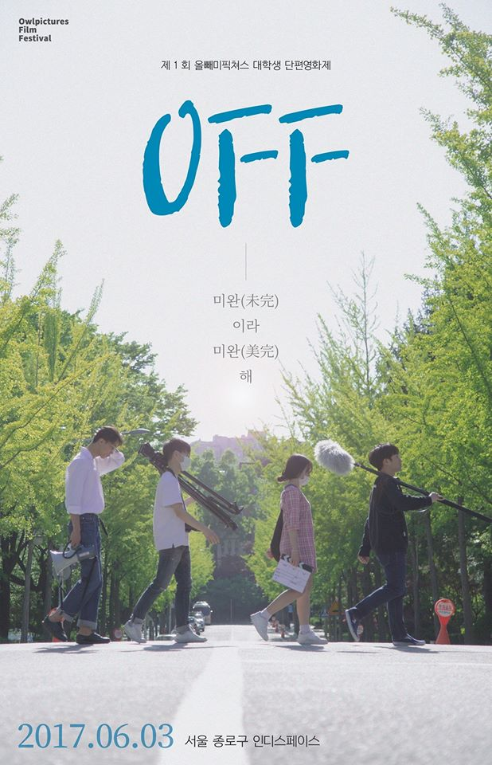

```toc
exclude: Table of Contents
from-heading: 1
to-heading: 6
```

# 1. 블로그를 시작하며

`첫 글`.

올 해, 공부하다가 헷갈리는 개념이나 자주쓰는 문법을 모아두기 위해 [velog](https://velog.io/@kimtaeeeny) 를 시작했다.

공부한 것을 이해하고 넘어가는 것이 아니라 기록해서 생각날때마다 보고 하니까 이해도 잘 되고 좋았다. 블로그에 여러 편의 기능들도 많아서 만족하며 사용했다.

그러다 정보의 양이 많아지다보니 내가 무슨 글을 썼는지 기억도 잘 안나고 썼던 내용임에도 구글링해서 다시 찾아보고 내가 썼던 글을 다시금 봤을 때 내가 쓴 글임에도 이해못하는 사태가 발생했다..:cold_sweat:

그래서 새로 블로그를 파서 공부한 내용을 최대한 구조화하고 구체화하는 정제과정을 통해 올려야겠다고 생각했다.

역시 첫 시작, 첫 마음가짐은 책상치우기!

블로그를 뭘로하나? 찾아보다가 `gatsby` 라는 정적 사이트 생성기가 있다는 것을 알게되고 jbee 님의 [gatsby-starter-bee 스타터팩](https://github.com/JaeYeopHan/gatsby-starter-bee) 을 이용해서 블로그를 만들기로 결정하였다. 이 스타터팩 덕분에 요란한 책상치우기는 예방할 수 있었다.


(요란한책상치우기...)

이제 책상은 치웠으니, 계획표 짜기를 하려한다...!:sweat_smile:

역시, 블로그의 묘미는 **컨셉**!

`지피지기는 백전백승`이라는 타이틀로

- 지기[知己] : 내가 개발을 왜 선택했는지와, 지금까지의 나의 상태를 돌아보고
- 지피[知彼] : 무엇을 어떻게 공부해나갈 것인지 방향성을 고민해보려 한다.

# 2. 지기 [知己]

## 2-1. 영화광 :movie_camera:

어렸을 적부터 영화보는 것을 좋아했다. 영화 중에서도 현실에서 일어날 법 하지만 가능하지 않은 (타임워프물이나 좀비영화 등등)을 유독 좋아했다. (드라마 중에서는 블랙미러)

영화를 보는 것과 함께 혼자 말도안되는 상상을 하거나 친구와 공상(a.k.a 뻘소리)을 나누는 것도 취미 중 하나였다.

뭔가 현실에서는 실현되지 않은 것들을 눈으로 보거나 상상함으로서 현실에서의 지루함을 해소했던 것 같다.

그렇게 공상만 하던 나는 `미디어학과`를 입학하고 학교에서 여러 신세계들을 접하게 되었다.

## 2-2. 마법 🔮 (말이 안되는 것을 가능하게해주는)

학과에서는 전문적인 공학,기술이나 학문을 깊게 파는 것이 아니라 여러 ICT분야를 접할 수 있게 커리큘럼이 짜여져 있었다. 학과의 교육 지향점도 예술, 공학, 인문학을 갖춘 T자형 인재를 목표로 하고 있었다.

머리 쓰는 일이 싫었던 신입생인 나는 처음 학과에 입학하고 디자인, 영상에 먼저 눈이 갔다.(하지만 디자인영역 또한 넘기힘든 감각의 영역이 존재한다..) 조금만 배우면 주위에서 우와~ 하는 결과물이 나오니까 정말 뿌듯하고 재미있었다. 여기서 처음 `마법`을 접했다.

포토샵이나 애프터이펙트같은 툴로 툭툭 편집하니 정말 내가 좋아하는 영화에서 보던 말도 안되는 장면들을 직접 만들 수 있어서 정말 신기했다.

그렇게 `디자인 연합동아리 활동`을 통해 디자인 고수들도 만나보고



학과 사람들과 `단편영화 제작사 창업 프로젝트`를 통해 영화도 찍어보고, 영화제도 개최해보았다. (많이 힘들었지만 값진 경험이었다.)



## 2-3. 모로가도 서울 도착 :blue_car:

`사실 개발공부를 시작하게 된 계기는 취업이 잘된다는 말을 듣고이다.` 프로그래밍을 생각하게 된 계기는 현실적인 이유였다. 학교를 다니다 잠깐 쉬고 싶어서 한학기 휴학하고 고향 🏝제주에 내려가 진로에 대한 고민을 많이 했다. 영화도 볼때는 정말 재미있었지만 직접 찍어보니 몸과 마음이 너무 힘들었고, 주위 선배들이 취업하려면 프로그래밍 테크로 빨리 갈아타라고 했던 말이 계속 떠올랐다.

학과에서는 프로그래밍 과목이 필수로 들어가 있어서 다음학기는 프로그래밍과목만 수강하고 **적성에 맞으면 하고, 안맞으면 하지말자** 라는 마인드로 학교에서 `컴프`, `자료구조`, `객프` 등 기본적인 과목을 수강하기로 했다.

막상 프로그래밍을 배우니 디자인과 영상을 접했을 때의 신세계를 또 느낄 수 있었다. 막 코드를 작성하고 프로그램을 돌렸을 때 원하는 값이 나오면 정말 기분이 너무너무 짜릿했다. 내가 영화를 좋아하는 이유인 말도 안되는 것을 되게 하는 `마법`이 여기서도 벌어지고 있었다.

> "Hello World"

## 2-4. 프론트엔드 개발자 :computer:

자료구조와 컴프, 객프처럼 데이터를 다루는 기본적인 CS를 배울 때는 재미있었지만 점점 deep 하게 들어가기도 하고 이론수업이 이어지다보니 조금씩 흥미를 잃어가고 있었다. 그래서 나는 학교에서 배우지 않는 실무 기술들을 배워보고 싶어서 `생활코딩` 의 웹전반에 대한 강좌와 html, css, javascript 강좌를 모두 들어보게 되었다.

영화와 공상을 통해 일방향적인 마법을 경험하다가 사용자와 서비스, 서비스와 서비스의 쌍방향적인 마법들(`슈퍼매직`)을 경험하니 제주도에서 겪었던 내 고민들이 바로 해결되고 비교적 쉽게 진로를 결정 할 수 있었다.

> Web FrontEnd Developer

그렇게 어플리케이션의 UI, UX와 서비스 앞단의 프로그램 로직을 담당하는 프론트엔드 개발자라는 직업에 대한 매력을 느끼고 유명한 프론트엔드 로드맵에 있는 `마법기술` 등을 닥치는대로 학습하기 시작했다.


(반토막이 이정도..)

리액트부터 리덕스, next SSR, nodeJS 백엔드 서버 구축, ionic 앱개발까지 어찌저찌 `핥짝`대며 로드맵을 주욱 타고 내려오긴 했지만 codepen.io 사이트에 있는 간단한 자바스크립트 코드를 이해하지 못하는 나를 발견하고 크게 좌절하게 된다.


> 다람쥐로 변신시키는 마법을 썼지만, 내가 다람쥐가 되었다..

# 3. 지피 [知彼]

## 3-1. 기본기 수련 :punch:

나는 웹서비스에 횡스크롤 조작버튼을 통해 뷰가 바뀌는 기능을 추가하고 싶어서 [codepen.io](https://codepen.io/) 에서 참고할만한 것들을 찾아보고 있었다. (애초에 javascript mouse EventListener 를 모르고 있었다...)

하지만 이벤트리스너에 대한 개념이 부족한 나는 그제서야 자바스크립트 이벤트루프를 학습했고 리액트에서는 어떻게 DOM 접근을 해야할지도 애매했고, 이럴때는 useRef()를 써야되나? 이벤트 리스너 코드는 어느시점에서 실행되는거지? 등 머리에서 정리가 되지 않았다.

stackoverflow 의 코멘트와 코드를 쑤셔넣고 구현만 하게 하자로 진행했던 학교 프로젝트가 남는게 별로 없었었던 경험이 생각나 이대로는 안되겠다 싶어서 기본적인 html, css, js (특히 js!) 부터 시작해서 공식문서도 꼼꼼히 읽고 이해하며 다시 공부해야겠다고 생각했다.

별로 남지는 않았지만 아직 학생이라는 본분(이라고 말하고 특권이라 읽음)에 맞게 `기능 개발이나 에러와의 사투`보다는 `기본에 대한 학습과 깊은 이해`에 관해 집중하자는 생각을 하게 되었다.

사실 전자가 프로그래밍의 실제이지만, 그것을 효율적이고 완벽하게 하려면 후자가 필요하다고 생각한다.

## 3-2. 블로그 ❣️

앞서 블로그를 내가 공부한 내용을 더욱 구조화하고 구체적으로 올리기 위해 새로 팠다고 했지만, 또 한가지 블로그를 하게된 이유가 있다.

개발자는 배워야하는 `마법`도 많고 적을 대처하는 방법도 경험을 통해 많이 익혀야 한다. 즉, 개발자의 길은 멀고도 험하기 때문에 이 여정을 기록하고 참고하며 공유하고 싶다.

> 긴 여정에서 중요한 것은 속도가 아니라 방향이다.

그리고 개발공부를 하면서 개발자 커뮤니티가 정말 잘 형성되었다고 느꼈는데 나도 아직 꼬맹이지만 블로그를 통해서 그 크고 방대한 커뮤니티에 발을 한발짝 다가서고 싶다. (물론 배보다 배꼽이 더 크면 안된다.)

# 4. 백전 백승 [百戰百勝]

개발자라는 길을 가기로 마음 먹은지 별로 되지는 않았지만, 분명히 재밌다.

한 때, 왕좌의 게임을 몰아보기 위해 밤을 새면서 잠자는 시간이 아까웠었는데 지금 개발공부를 하며 비슷한 감정을 느낀다.

인생은 어떻게 될지 아무도 모르는 거지만 나는 지금 재미있고 마음이 이끄는 것을 열심히 하고싶다.

원래는 슈퍼 마법사가 되어서 나는 이렇게 걸어왔다고 말하는 것이 더 멋있었겠지만

프로그래밍만큼은 실력으로 인정받는 업[業]이니까

충분한 시간과 올바른 학습만 있으면 언젠가는 잘 될 것이라 확신한다.
