올해는 나에게 의미있는 해이다.

**처음**하는 것도 많았고, 기존에는 폐쇄적으로 공부를 했다면, 앞으로는 **개방적**으로 공부하기로 마음먹었던 해이기도 하다.

그리고 오늘 부스트캠프 2020 챌린지 합격여부 발표가 났는데, 지난 나를 돌아보고 앞으로 내가 할 것들을 계획하기 좋은 시점이라 생각해서 상반기 회고글을 적기로 마음먹었다.

---

```toc
exclude: Table of Contents
from-heading: 1
to-heading: 1
```

# 블로그시작 (2/6~)

> 올해, 51개의 포스팅을 하였다.

올해 제일 잘한 일 중 하나는 블로그를 시작한 것이다. 우연한 계기로 [jbee](https://github.com/JaeYeopHan)님의 [starter-bee-starter](https://github.com/JaeYeopHan/gatsby-starter-bee)라는 블로그 스타터 패키지를 알게 되었고, UI도 예쁘고 사용법도 상세히 나와있어서 이 테마로 블로그를 시작하기로 했다. 그리고 이전에는 PR이 뭔지도 몰랐는데 리드미의 use case를 추가하기 위해서 열심히 구글링하고, 다른 사람들이 PR한 것을 참고해보며 첫 PR도 해보았다. 리드미의 한줄 추가하는 거지만 contributor에 추가된 것과 공식 리드미에 내 블로그가 올라간 걸보고 신기하기도, 뿌듯하기도 했다.

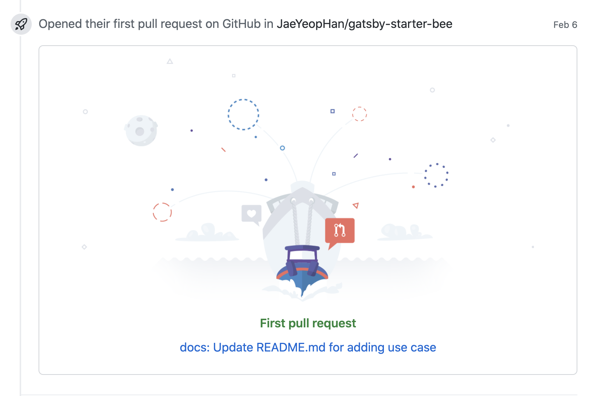

> 뭐든지 첫 경험은 잊지 못할 중요한 순간이다.

그리고 블로그를 나만의 일기장으로 쓰는 게 아니라 독자를 만들어야겠다고 생각했다. 나의 생각이나 내가 공부한 내용을 정리하는 것도 좋지만 누군가가 읽을 수도 있다는 가정은 글을 좀더 신중하게 쓰게 하였고, 무엇보다 누구나 읽기 쉽게 구조화하려는 노력을 하게 되었다. (하지만 이것은 정말 쉽지 않은 일인 것 같다.) 그래서 페이스북 그룹 `프론트엔드 개발그룹` 을 통해 모든 글은 아니더라도 주기적으로 내 글을 노출시키려 하였다. 가끔씩 달리는 댓글들은 나에게 정말 큰 힘이 되었다.

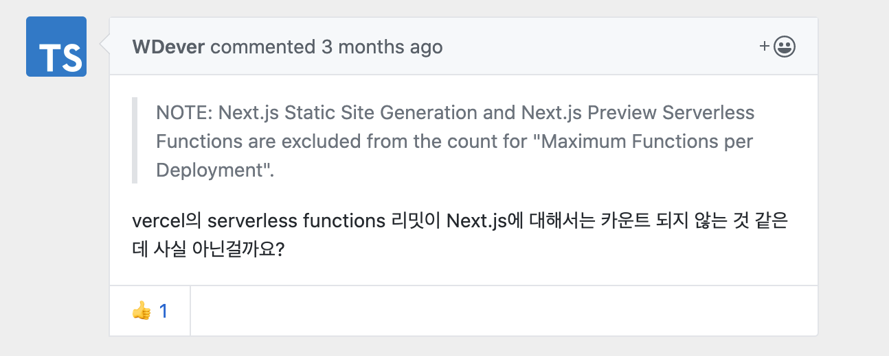

<div align="center">
<sup><a href="https://taeny.dev/javascript/nextjs-with-deployment-platform/">nextJS 뭘로 배포할까?</a>에 대한 코멘트</sup></div>

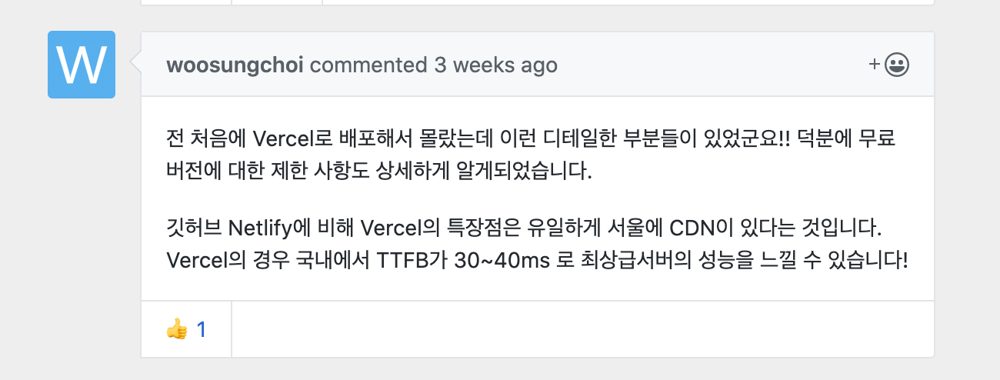

<div align="center">
<sup><a href="https://taeny.dev/javascript/nextjs-with-deployment-platform/">nextJS 뭘로 배포할까?</a>에 대한 코멘트</sup></div>

> 잘못된 정보지적과 추가적인 정보제공해주시는 분들 덕분에 더 배울 수 있었고,

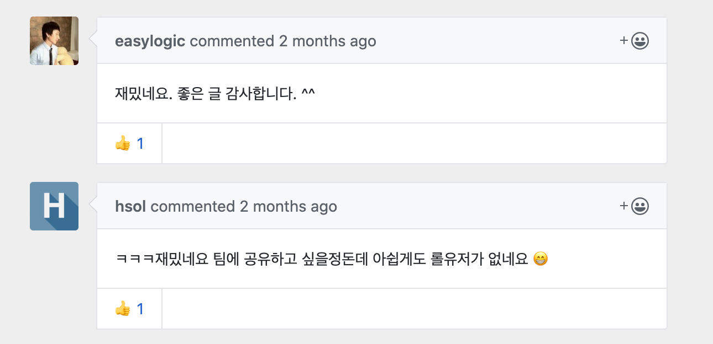

<div align="center">
<sup><a href="https://taeny.dev/essay/%EB%A6%AC%EA%B7%B8-%EC%98%A4%EB%B8%8C-%EB%94%94%EB%B2%A8%EB%A1%9C%ED%8D%BC/">리그오브디벨로퍼</a>에 대한 코멘트</sup></div>

> 글을 읽어주시고 좋게 반응해주시는 분들 덕분에 개발공부하는데 큰 힘을 얻기도 하였다.

사실 내 지식을 모든 사람들이 열람할 수 있는 공개적인 공간인 웹으로 표출하는 것은 그만큼 어려운 일이고 책임감이 필요한 일이다. 아직 지식의 넓이와 깊이가 모두 부족한 나에게는 더더욱 글이 잘못될 정보를 가질 가능성도 높고 알맹이가 부족한 글이 될 가능성이 높다고 생각한다. 하지만 지식을 내 머릿속에만 담아두기보다는 그래도 공유하는 것이 더 가치있는 일이라고 생각한다. 앞으로 좀더 고민하고 공부해서 더 질좋은 포스팅을 공유할 수 있도록 노력해야겠다.

인프런에서 강의를 찍고 계시는 [캡틴판교](https://github.com/joshua1988)님께서는 컨텐츠를 만들 때, 철저하게 계획하고 여러번 회고하면서 컨텐츠를 만든다고 하셨다. 그리고 불특정다수의 사람들이 잘 이해할 수 있도록 짧은 문체와 쉬운 단어를 일부러 사용하신다고 하셨다. 개발 뿐만 아니라 효율적이고 확실한 정보전달할 수 있는 방법들에 대해서도 꾸준히 고민해봐야겠다.

# NAVER 핵데이 (5/7~5/28)

블로그를 통해 개발공부를 본격적으로 시작하고, 좋은 기회로 [2020 NAVER 핵데이](https://github.com/2020-NAVER-CAMPUS-HACKDAY)에도 참여하게 되었다. NAVER 핵데이는 네이버 개발자와 함께하는 대학생 해커톤으로 COVID-19의 영향으로 1박2일 춘천 네이버 연수원 합숙은 취소가 되고 팀별 온/오프라인 모임으로 진행되었다.

사실 프로그래밍이 재미가 있어서 혼자서 이것저것 만들어보기는 했지만 협업은 해본 적이 없어서 팀원에게 피해를 주진 않을까 걱정했지만 좋은 팀원을 만난 덕분에 짧은 기간동안 정말 많이 성장할 수 있었다. 이번 핵데이를 통해 협업시, 가져야할 마음가짐과 프로젝트 매니징 방법 등에 대해서 특히 많이 배웠다.

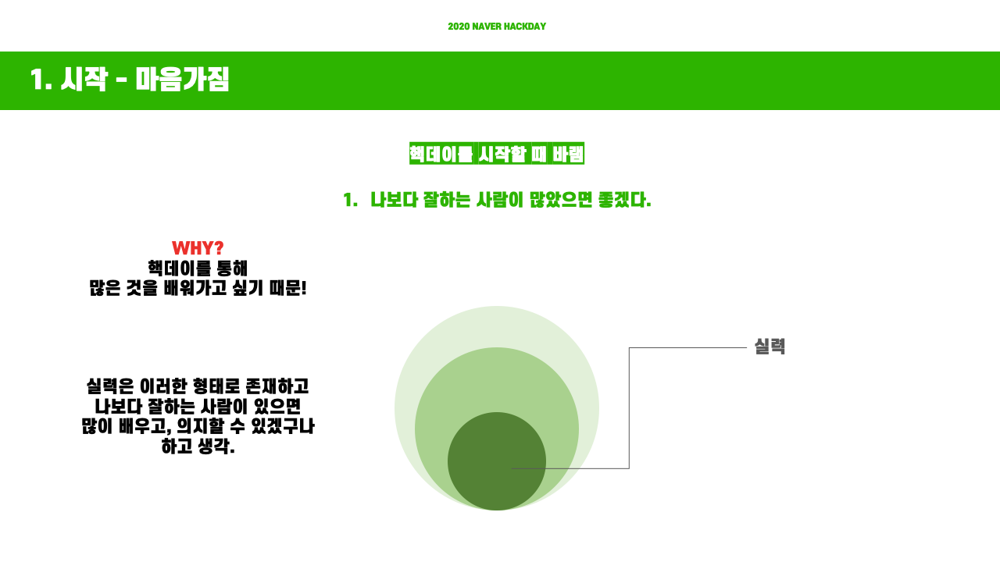

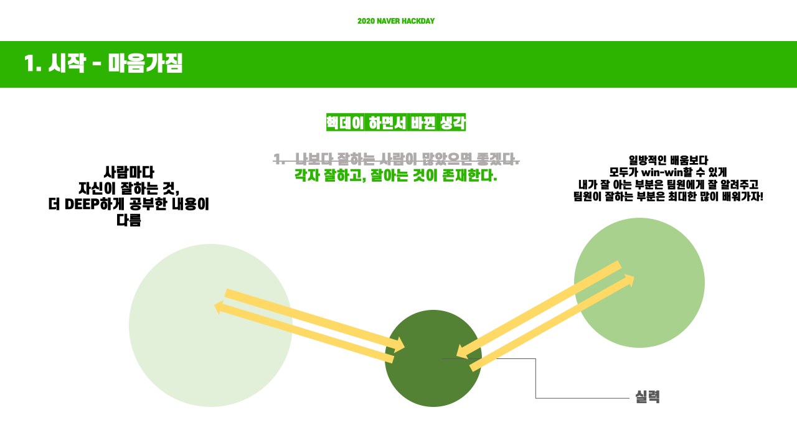

> 배움은 쌍방향으로 이뤄질 수 있다.

<div align="center">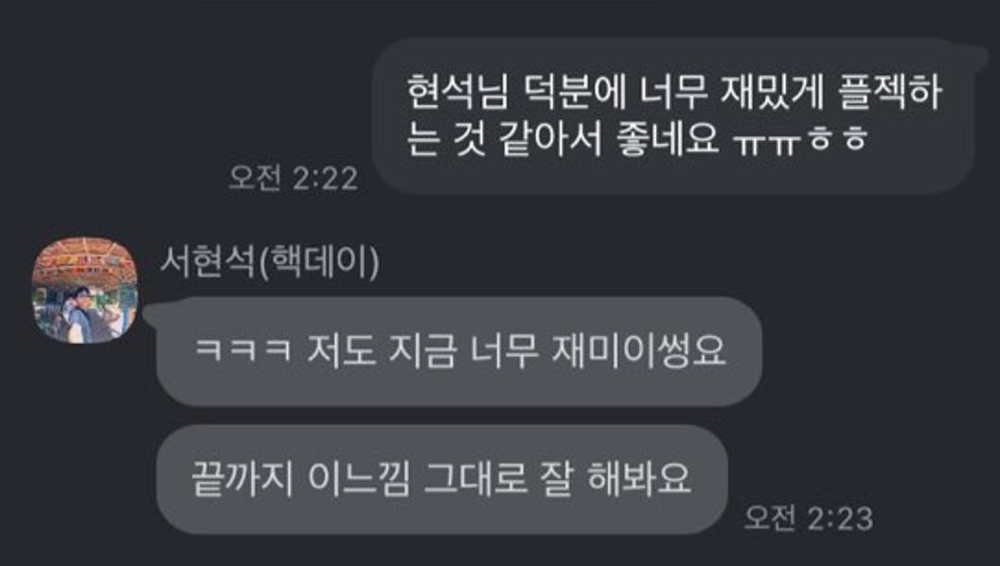
</div>

> 무엇보다 팀프로젝트는 팀원이 누구인가가 정말 중요한 것이라는 것을 알게 되었다.

그리고 내가 참여한 핵데이 주제가 `네이버 웹툰 썸네일 저작도구` 여서 프론트단에서 여러 많은 이벤트들을 다뤄보았는데 그래서 그런지 프로젝트 내내 개발이 너무 재미있었다. 그리고 canva같은 웹 이미지 에디터들과 실시간 ppt 제작 툴인 구글 프레젠테이션 등 따로 어플리케이션을 다운로드 받지 않아도 웹에서 이러한 작업들이 가능하다는 게 신기하고 흥미로웠다. 평소에 시각적인 것과 인터랙션에 관심이 많았기 때문에 이런 분야가 있다는 것을 알게 되어서 너무 좋았다.

# OOP 스터디 & JS 스터디 (4월중)

그리고 올해 4월중에 2개의 스터디를 진행했다. [OOP스터디](https://github.com/OOP-study-media)는 학과 선후배들 5명이 모여서 진행했다. 스터디는 프로그램을 설계하는 것, 테스트하는 법을 중심으로 진행했다. 그리고 스터디는 Java 언어를 사용했지만 나는 JavaScript를 사용해서 참여했다.(꼽사리) 언어가 달랐기에 실제 코드에 대한 피드백은 많이 받지 못해서 아쉽지만 각각의 언어의 개발철학도 비교해볼 수도 있고 무엇보다 언어에 국한되지 않는 테스트와 객체지향적인 설계, 클린코드 등을 배울 수 있어서 너무 좋았다.

그리고 프론트엔드를 공부하는 친구랑 둘이서 [책스터디](https://github.com/group-studyjs)도 진행했다. 중간에 서로 바빠져서 현재 중단상태지만, 책을 읽고 배운점을 정리하고 공유하는 과정자체가 너무 도움이 많이 되었고 서로 놓쳤던 점이나 고민이 필요한 주제에 대해 각자의 생각을 얘기해보는 과정도 너무 재미있었다. 언젠가 둘다 여유가 생기면 다시 진행해야겠다.

# 개인 프로젝트

올해는 공부뿐만 아니라 개인프로젝트도 부지런히 진행하였다. 공부만 하는 것보다 실제로 아이디어를 구현해보면서 거기서 부딪히는 문제들을 해결하기 위해서 공부하는 방식이 나에게는 동기부여도 잘되고 재밌었다.

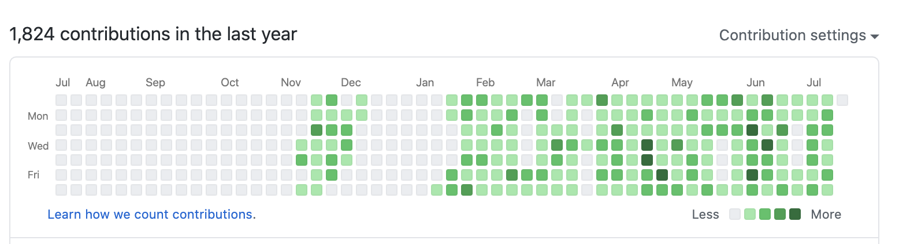

> 잔디를 꽤 심었다. 휴식기간이 종종 보이는게 인상적이다.

## 1. Diet Together

[제로초](https://www.zerocho.com/)님의 [react-nodebird](https://www.inflearn.com/course/%EB%85%B8%EB%93%9C%EB%B2%84%EB%93%9C-%EB%A6%AC%EC%95%A1%ED%8A%B8-%EB%A6%AC%EB%89%B4%EC%96%BC) 강의를 듣고 nextJS, react, react-saga, express를 이용해서 서비스를 하나 만들어보았다. 강의를 듣고 코드를 따라서 쳐본 수준이라 스스로 만들었다고 하기 조금 그렇지만 기존의 코드에 API도 추가해보고 스타일도 내가 직접 만들어봤다. ~~AWS EC2에 코드를 올렸다가 과금이 들어가길래 바로 삭제해버렸다..!~~

## 2. Small Magic Project

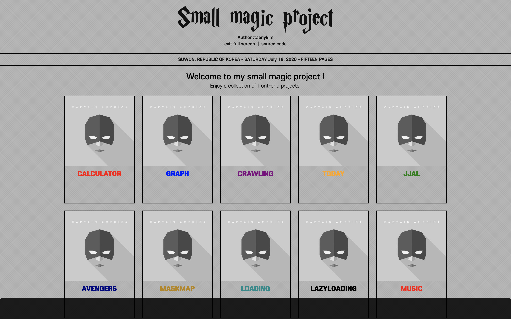

복합적인 서비스를 만들어보기보다는 프론트 단에서 일어나는 기능들을 하나씩 구현해보고 공부하기 위한 목적으로 [소마법 프로젝트](https://github.com/taenykim/small-magic-project)라는 프로젝트도 진행했다. 크롤링, 짤방생성기, 코로나 마스크지도, 음악플레이어 등 이것저것 시도해봤다.

## 3. Interactive Pixelator

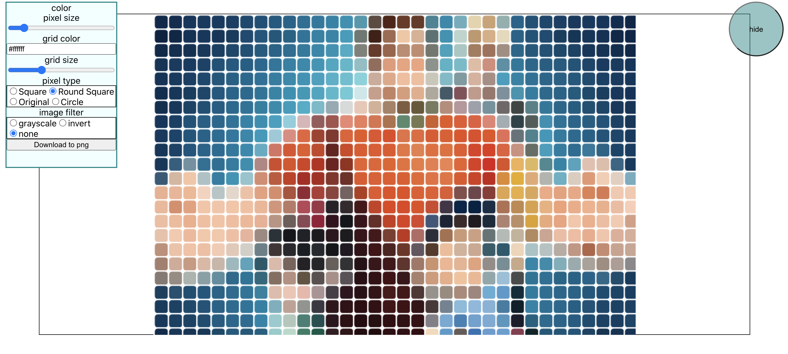

이미지를 픽셀화시켜주는 어플이 있으면 어떨까 문득 떠오른 생각을 그대로 구현해본 프로젝트. 교육을 받거나 강의를 보고 따라 만든 것이 아니라 아이디어를 먼저 생각하고 그것을 구현하기 위해서 구글링을 엄청 하면서 만들었다. 그리고 누구나 사용할 수 있도록 npm에 패키지형태로 배포도 해보았다. [interactive-pixelator](https://github.com/taenykim/interactive-pixelator)

학교에서는 정해진 커리큘럼에 따라 과제를 하거나 주어진 범위에 대해서 시험을 본다. 하지만 개인프로젝트는 이것과 달리 내가 구현해보고 싶은 아이디어를 자유롭게 코드로 구체화시켜볼 수 있어서 너무너무 재밌었고 덜 스트레스받으며 했던 것 같다.

# 엔젤핵 해커톤 (7/10~7/22)

살짝은 충동적으로 신청했던 [엔젤핵 해커톤](https://angelhackseoul.kr/)..! 백엔드 개발자와 디자이너와 소통, 협업을 하고싶어서 지원했으나, 갑자기 하고싶은 아이디어가 떠올라버린 바람에(?) 결국 프론트엔드 프로젝트를 하게 되었다. 아이디어는 UN의 지속가능한 개발목표 17개에 대한 Data Simulation Component를 각각 만드는 것인데 이번 해커톤에서는 4번째 목표인 **Quality Education**에 대한 컴포넌트만 만들기로 했다.

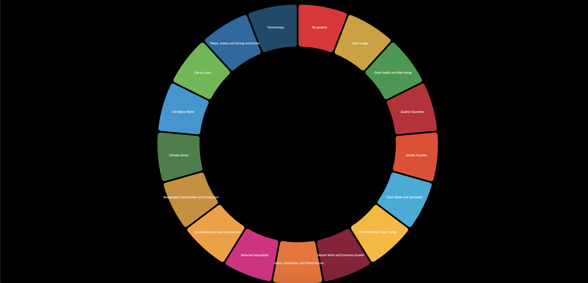

> 웹사이트 메인화면

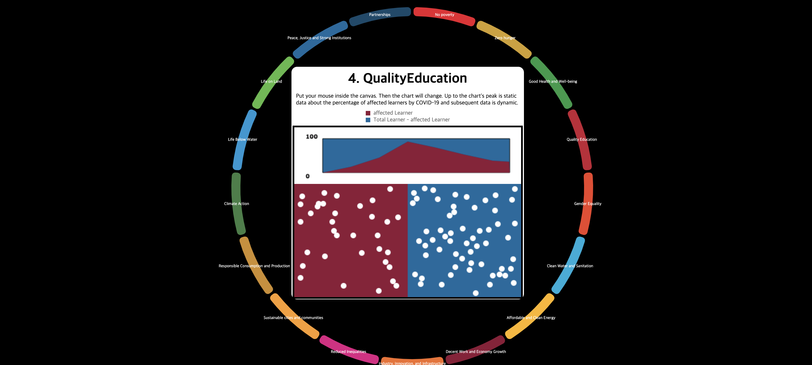

> Data Simulation 컴포넌트

생각했던 아이디어는 구현했지만, 컴포넌트를 여러번 호출할 때, 애니메이션이 느려지는 듯한 느낌을 받았다. 하지만 이번 해커톤을 통해 requestAnimationFrame() 과 setInterval()도 사용해보고 canvas를 라이브러리의 도움 없이 내가 원하는 아이디어를 구현해냈다는 점에서 정말 좋은 경험이었다.

그리고 감사하게도 내 아이디어에 관심을 가져주신 팀원분께서 웹사이트 제작과 도커랑 express를 이용해서 ainize에 배포하는 것을 맡아서 해주었기 때문에 컴포넌트에 더 집중해서 개발할 수 있었던 것 같다.

그리고 엔젤핵 해커톤을 하면서 UN의 `17가지 지속가능한 개발목표` 를 여러번 보다보니 삶에 있어서 좀 더 큰 가치가 있다는 것을 알게되었다. 앞으로는 내 개인의 행복도 중요하지만 평등이나 교육, 환경 등의 사회적 이슈에 대해서도 좀더 관심을 가져야 겠다고 생각하게 되었다.

> 나도 언젠가는 사회에 **선한영향력** 을 퍼트리는 사람이 되고싶다.

# 마치며

올해는 블로그도 시작하고 깃허브를 통해서 개인프로젝트도 진행해보고, 해커톤도 해보고 스터디도 해보았다. 그리고 개발과 관련된 정보를 얻기위해서 끊었던 페이스북도 다시 시작했다. 모든게 처음이여서 걱정도 많았고 미숙한 점도 많았다. 좋은 기회를 잡기도 하고, 좋지않은 결과를 받기도 하였다. 코드를 짜며 성취감을 느끼기도 하였고, 좌절감도 느끼기도 하였다. 하지만 모든 과정이 재미있었던 것 같다.

COVID-19로 세상은 아직 싱숭생숭이다. 이런 언택트 시대일 때일수록 개발자의 역량과 덕목이 중요하다고 생각한다. 하지만 아직은 실력이 없기 때문에 이런 마음가짐은 마음속 깊이 지닌채로 올해는 좀더 지속가능한 개발자가 되기위한 역량을 쌓는 것에 목적을 두고 공부해야겠다. 올해말에 다시 회고를 했을 때, 내가 걸어온 길을 돌아보며 좋은 기억들을 많이 떠오를 수 있었으면 좋겠다.

남은 올해도 화이팅!
