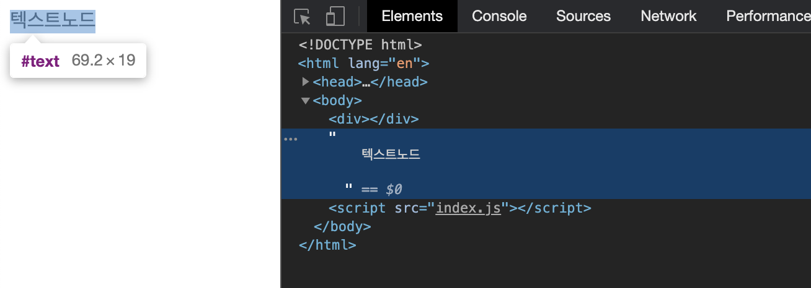
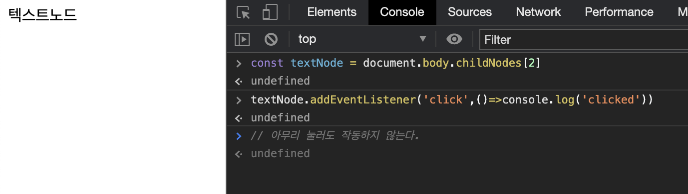
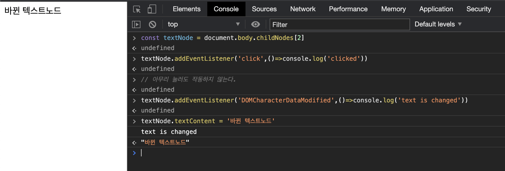
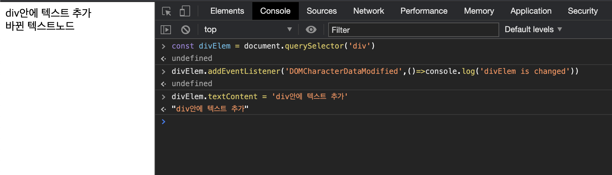
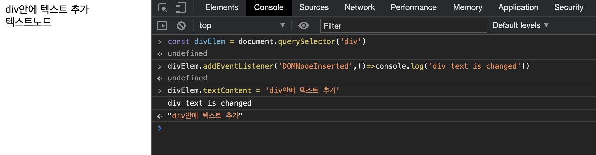
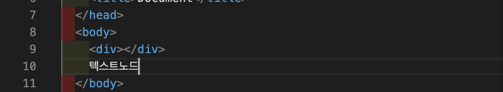
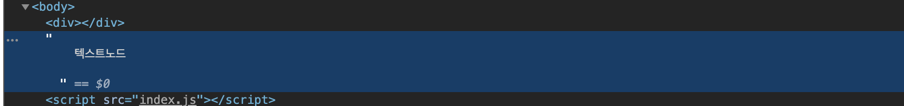

### TL;DR

- 텍스트노드에 이벤트핸들러를 추가할 수 있음.
- 근데 텍스트노드에는 click 같은 엘리먼트 이벤트말고 DOMCharacterDataModified 같은 변화 감지 이벤트만 발생함.

<br/>

---

<br/>

텍스트노드에도 이벤트핸들러를 추가할 수 있을까? 라는 막연한 호기심에 텍스트노드에 클릭 이벤트핸들러를 등록해보았다.

**Node**는 **EventTarget**을 상속받아서 이벤트가 잘 작동할 줄 알았지만 클릭 이벤트핸들러는 작동하지 않았고, 여러 자료를 찾아보고 직접 실험을 하면서 배운 내용들을 정리해보기로 했다.

# Table of Contents

```toc
exclude: Table of Contents
from-heading: 1
to-heading: 1
```

# 1. Node와 Element

브라우저의 렌더링 엔진은 HTML문서를 파싱해서 의미있는 토큰으로 나누고 이러한 토큰들을 객체형태로 추상화해서 트리를 구성한다. 이를 DOM Tree라고 부른다.

<div align="center"><sub><a href='https://developers.google.com/web/fundamentals/performance/critical-rendering-path/constructing-the-object-model?hl=ko'>이미지출처 : 객체 생성 모델</a></sub></div>


이러한 DOM Tree의 개체 하나하나를 노드라고 부르며, DOM Tree자체도 하나의 큰 노드이다.

## 노드의 종류

그리고 노드의 종류는 대표적으로 다음과 같다.

1. **Document 노드** : DOM tree 노드
2. **Element 노드** : html부터 head, body, input, div까지 id, class와 같은 식별자를 가질 수 있는 노드
3. **Text 노드** : 텍스트를 표현하는 노드
4. **Comment 노드** : 주석을 표현하는 노드(렌더링 트리에는 항상 포함되지 않음)

> 그외에 ProcessingInstruction 노드도 있다고 하는데 잘 사용할 것 같지 않아서 패쓰!

## 노드의 계층관계

그리고 Node들은 모두 eventTarget을 상속받는다.


- eventTarget : 이벤트핸들러 조작 메소드를 가지는 추상 클래스

이러한 상속관계를 통해 **텍스트노드**도 eventTarget을 상속받으니까 이벤트핸들러를 등록할 수 있겠거니 생각하게 되었다.

# 2. 텍스트노드에 이벤트핸들러 등록해보기

실제 텍스트 노드를 만들고 렌더링 해주었다.

<div align="center"><sub><a href='https://developer.mozilla.org/en-US/docs/Web/API/Node'>이미지출처 : Node - MDN</a></sub></div>



그다음 childNodes를 이용해서 node를 참조한 뒤, 이벤트핸들러를 등록해주었다.



분명 Node타입이기 때문에 addEventListenr가 자동완성으로 콘솔에서 추천해주었지만 이벤트는 발생하지 않았다.

# 3. 그럼.. 텍스트노드에는 이벤트핸들러가 등록이 안되는건가?

텍스트노드는 원래 이벤트핸들러가 등록이 안되는지 궁금했고 구글링을 통해 [텍스트노드에서는 대부분의 이벤트는 발생하지 않고 발생하는 이벤트는 존재한다](https://stackoverflow.com/questions/4789342/textnode-addeventlistener) 라는 정보를 얻을 수 있었다.



클릭 이벤트는 작동하지 않지만, `DOMCharacterDataModified` 이벤트는 작동하는 것을 확인할 수 있었다.

---

근데 엘리먼트 노드에는 또 `DOMCharacterDataModified`가 작동하지 않았다.



하지만, `DOMNodeInserted` 이벤트를 썼을 때는 잘 작동했다.



즉, 텍스트노드도 하나의 노드이고 `Node.textContent`는 노드 내부의 텍스트를 직접 변화시키는 게 아니라, 노드의 child Node인 텍스트노드 참조하고 변화시키는 것이라는 것을 알 수 있었다.

# 4. 결론

텍스트노드는 EventTarget의 이벤트핸들러 추가 메소드를 상속받기는 하지만, click, change 등의 이벤트는 발생하지 않고, DOM의 변화를 감지하는 이벤트만 발생한다는 것을 알 수 있었다.

즉, EventTarget의 메소드를 상속받지만, 엘리먼트와 텍스트노드가 발생하는 이벤트의 종류는 달랐다. (일반적으로 사용하는 click 이벤트의 근원지는 `div`같은 엘리먼트이다. 하지만, 텍스트노드 또한 발생하는 이벤트는 존재하긴 했다.)

그리고 엘리먼트 노드가 텍스트라는 정보를 가지는 형태가 아니라 엘리먼트 노드의 child로 텍스트 노드를 갖는다는 것도 추가로 알 수 있었다.

또한 `DOMCharacterDataModified`, `DOMNodeInserted` 같은 이벤트는 DOM 변화감지 이벤트는 설계결함, 성능문제와 크로싱브라우징 등등의 이슈로 [Mutation Oberver API](https://developer.mozilla.org/en-US/docs/Web/API/MutationObserver)를 권장한다는 새로운 사실도 알 수 있었다.

# 5. TMI

1. 실용성이 떨어지는 삽질을 한 것 같지만, 그래도 DOM 트리의 EventTarget, Node Element에 대해 좀 더 깊게 볼 수 있어서 좋았다.
2. 텍스트를 엘리먼트로 감싸주는 것이 좋은 패턴인 듯 하지만, 모든 것에 정답이 없듯, 텍스트노드도 알아두면 좋은 개념인 것 같다.
3. 밑의 HTML을 보고 깊이가 3, 너비가 2인 트리가 떠오르면 잘 이해한듯..!

   **\<div\>나는텍스트노드\<span\>스팬태그내의텍스트\<\/span\>\<\/div\>**

4. Node와 Element 별로 DOM을 참조하는 메소드도 각각 다양해서 적재적소에 사용하는 게 중요한 것 같다. Node 메소드는 보통 텍스트노드를 포함하는 경우가 많은 것 같다.

   `Element.children` vs `Node.childNodes`

5. HTML 파싱시, 공백도 원래는 텍스트노드에 다 포함된다.
   > before
   > 
   > after
   > 
