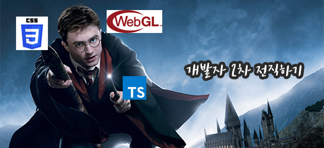
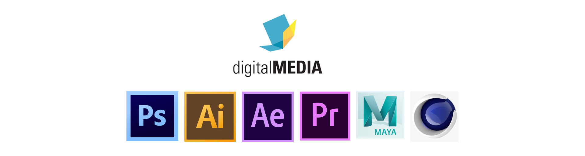

이번 포스팅에서는 내가 웹 그래픽스에 관심을 갖게된 과정과, 앞으로 공부할 것들에 대해서 정리해보려고 한다.

<hr/>

```toc
exclude: Table of Contents
from-heading: 1
to-heading: 1
```

# 1. 1차 전직 - Web 프론트엔드


나는 DOM을 조작하고 서비스 앞단에서 사용자와 인터렉션하는 부분을 만들어낸다는 것에 매력을 느끼고 프론트엔드 공부를 시작했다. 그리고 접근성이 좋다는 이유로 네이티브 앱보다는 WEB에 더 끌렸던 것 같다. 커뮤니티 활동을 하고 블로그를 운영하기 시작하면서 웹과 FE에 대한 흥미와 관심은 더더욱 커졌다.

> [블로그를 시작하며](https://taeny.dev/essay/essay1_%EB%B8%94%EB%A1%9C%EA%B7%B8%EB%A5%BC%EC%8B%9C%EC%9E%91%ED%95%98%EB%A9%B0/)

그렇게 web을 공부하고, 기본적으로 알아야할 사항들 (javascript 기본기나 관련 라이브러리)에 대해서 학습하였고, 학습한 내용을 바탕으로 서비스를 바로 만들어보기보다는 자바스크립트의 최대한 `다양하고 많은 기능들을 구현해보고 싶어서` [소마법 프로젝트](https://github.com/taenykim/small-magic-project) 라는 토이프로젝트도 진행했다. 처음부터 깊게 파는 것도 좋지만 다양한 기능을 많이 접해보고싶어서 크롤링, 코로나 마스크 맵, 음악플레이어, 게임 등 일부러 다양한 기능들을 시도해보았던 것 같다.

> 별거아닌데 많은 분들이 스타를 눌러주셔서 너무 뿌듯/감사했따...ㅎ

# 2. 2차 전직 - 웹 그래픽스



그러다가 정말 좋은 기회로 [2020 NAVER HACK-DAY](https://github.com/2020-NAVER-CAMPUS-HACKDAY) 라는 해커톤 프로젝트를 하게되었다. 여러 프로젝트 주제 중에 자신이 선택해서 신청할 수 있었는데 나는 그 중에서 가장 재밌어보이는 **"네이버 웹툰 썸네일 저작도구"** 라는 주제를 신청했다.

학교 전공수업에서 다뤄보았던 다양한 그래픽작업 툴들(Photoshop, After Effect, Maya 등) 을 직접 만든다니 너무 흥미로웠고, 예전에 내가 들었던 코딩과 관련 없는 전공수업들(그래픽디자인, 컴퓨터 애니메이션, 인터렉션디자인, 타이포그래피 등)도 많은 도움이 되는 것을 느끼며 의미없는 삽질이 아니였구나를 느낄 수 있었다. 그리고 무엇보다 브라우저에서 그래픽을 다루는 것은 너무너무너무 재미있었다.

> 짧은 시간이지만 좋은 팀원, 좋은 멘토님들을 만난 덕분에 기술뿐만 아니라 여러 면으로 정말 많은 것들을 배울 수 있었다.

또한 응용프로그램을 컴퓨터에 깔지 않아도 브라우저만으로 작업할 수 있는 [구글 프레젠테이션](https://www.google.com/intl/ko_kr/slides/about/)이나 [Canva](https://www.canva.com/ko_kr/) 같은 웹페이지들도 알게되었는데 너무 신기했고, `웹 그래픽스` 분야를 좀 더 깊게 공부해보고싶다는 생각을 하게 되었다.

> 우오오..! 욕구가 샘솟는다

# 3. 전직퀘스트

그래서 다시 백수가 된 나는 이 포스팅을 통해 앞으로 공부할 것들에 대해서 정리해보려한다.

> 📄 공부할 내용, 공부한 내용에 따라 주기적으로 수정할 것!

## 3-1. 기초

웹 그래픽스 API를 바로 사용해보는 것보다 브라우저(JS)가 이미지나 영상을 어떻게 처리하는지, 그래픽작업은 어떻게 수행하는지 기초적인 부분 먼저 공부하는 것이 좋을 것 같다고 생각했다.

- [ ] OS vs Browser

- [ ] 컴퓨터 그래픽스 vs 컴퓨터 비전

- [ ] 이미지 표현방식 (비트맵, 벡터, svg 등)

- [ ] 영상 표현방식 (프레임, 실제 영상과 만들어낸 그래픽의 차이)

- [ ] 디지털 타이포그래피 (otf, ttf, woff)

- [ ] 그래픽작업 : DOM조작 방식 vs canvas조작 방식

- [ ] 그래픽작업 : CSS 방식 vs JS 방식

- [ ] 그래픽스 저장방식 (JSON, Blob 등)

- [ ] 그래픽스 가공방식 (렌더링, 이벤트처리 등)

## 3-2. 그래픽작업 API 및 라이브러리

다양한 그래픽작업 API 들을 살펴보며 각각의 특징과 사용법에 대해 학습하기

- [ ] canvas

- [ ] webGL

[MDN 문서](https://developer.mozilla.org/ko/docs/Web/HTML/Canvas)에 나와있는 여러 라이브러리들 중에 p5.js를 우선적으로 학습하기

- [ ] p5.js

- [ ] fabric.js

3D 작업 라이브러리 학습하기

- [ ] three.js

데이터 시각화 라이브러리 학습하기

- [ ] D3.js

## 3-3. 토이프로젝트 시작

FE공부를 시작하면서 같이 진행했던 [소마법 프로젝트](https://github.com/taenykim/small-magic-project)는 **"여러 기능들을 체험해보자!"**가 목적이었다면 이제는 좀 더 DEEP하게 생각하고 많은 것들을 고려해보는 프로젝트를 다시 진행하면 좋을 것 같다. 게임을 만들든, 에디터와 같은 어플리케이션을 만들든 **"디자인패턴이나 코드 품질을 좀 더 고려해서"** 진행해보려한다..!

- [ ] Toy Project (title 미정)

# 4. 레퍼런스

🛠 계속 추가할 예정..

## webGL

- [webGL 학습 페이지](https://xem.github.io/articles/webgl-guide.html?fbclid=IwAR1tjeDBtiTnx1Ul2ysvmWnkQeQ7-HQYVpcVN1Rq3nz-ESs2SwCEHngIve8#1)

## interactive pages

- [How big is the DMZ? - Washington Post](https://www.washingtonpost.com/graphics/2017/world/mapping-the-dmz/?noredirect=on)

- [중앙일보 - 그 곳 판문점](https://news.joins.com/digitalspecial/290)

- [apple - AirPods Pro](https://www.apple.com/kr/airpods-pro/)

## Reference for Reference

- [codepen.io](https://codepen.io/)

- [awwwards](https://www.awwwards.com/)
