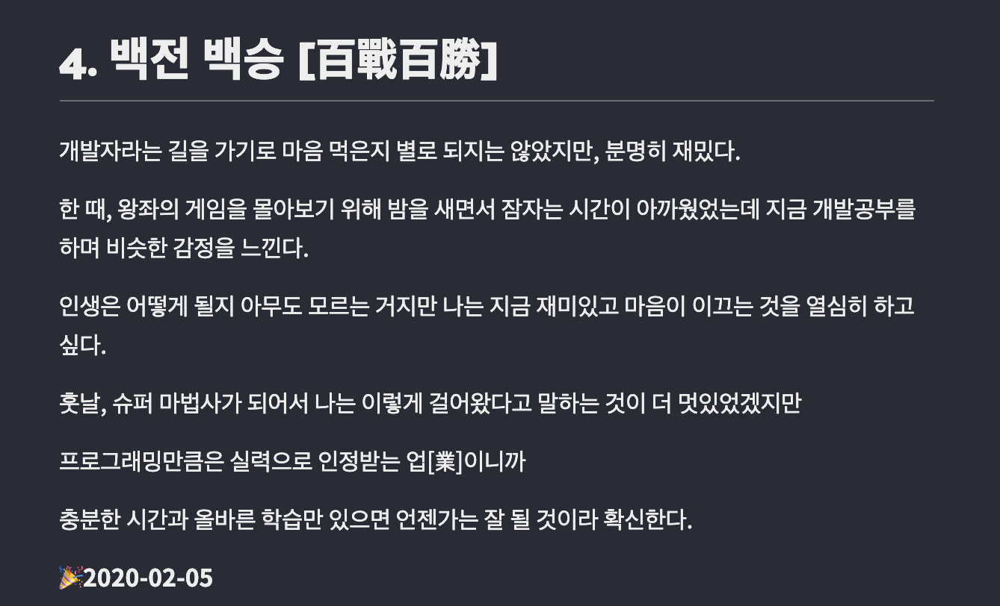

올해, [글또](https://www.notion.so/ac5b18a482fb4df497d4e8257ad4d516)를 시작했다.

> 글또(글쓰는 또라이가 세상을 바꾼다) : 글쓰는 개발자 모임

블로그를 시작하고 자연스레 개발자 글쓰기 모임 **글또**가 있다는 것을 알게되었는데, 당시 4기가 진행중이어서 다음 기수 모집 때는 꼭 해야지 다짐했었는데 5기를 뽑자마자 고민없이 지원했다.

# 블로그는

블로그는 올해 2월부터 시작해서, 현재 글또 다짐글을 쓰는 시점까지 59개의 포스팅을 했다..! 4~5시간 투자한 글도 있고, 3일 이상을 투자한 글도 있고, 마무리를 못지은 글도 있지만 나름 꾸준히 글을 적었던 것 같다.

2월에 작성했던 첫 글 [블로그를 시작하며](https://taeny.dev/essay/essay1_%EB%B8%94%EB%A1%9C%EA%B7%B8%EB%A5%BC%EC%8B%9C%EC%9E%91%ED%95%98%EB%A9%B0/) 를 참고해보자면 3가지 이유였다.

1. 공부한 내용을 구조화하고 더 구체적으로 정리하기 위해서
2. 내 개발 여정 공유와 기록
3. 개발 커뮤니티로 한발짝 내딛기

먼저 1번은 공부한 내용을 글로 적어내는 행위 자체도 개념을 이해하는데 큰 도움이 되었으며, 나중에 면접준비를 하거나 개발하면서 참고하고 싶을 때 많이많이 참고할 수 있어서 큰 도움이 되었다.

2번은 글쓰기 자체를 좋아해서 회고를 하면서 생각정리도 하고, 마음의 안정도 찾고, 주기적으로 회고를 하니까 중간에 번아웃(공허해지는 그런..것?) 같은 게 없었다. 무작정 열심히 하는 것보다 내가 해왔던 것을 돌아보면서 앞으로의 방향을 생각해보는 행위가 정말 중요한 것 같았다.

마지막으로 몇몇글들은 페북그룹이나 슬랙을 통해서 공유하기도 했는데, 사람들의 칭찬은 에너지를 주었고, 피드백은 또다른 공부거리를 주었다. 그리고 개발업계가 좁다는 것도 많이 느꼈다. 친구를 통해서 내 글이 공유되고 있다는 것을 건너서 듣거나 동료 개발자분들이 글을 잘 읽었다고 해주실 때면 너무너무 고마웠다.ㅎㅎ

# git checkout 예전글

깃을 통해서 블로그를 관리했기 때문에 배포한 글 말고도 수정전의 초안 글도 보고싶을 때 볼 수 있었고, 예전에 작성했던 글을 보면서 정보를 얻기도 하였다.

글또 다짐글을 적으려다 문득 [블로그 첫 글](https://taeny.dev/essay/essay1_%EB%B8%94%EB%A1%9C%EA%B7%B8%EB%A5%BC%EC%8B%9C%EC%9E%91%ED%95%98%EB%A9%B0/)도 다시 읽었는데 오글오글거리긴 하지만 지금 다시보니까 이 때는 암 것도 모르면서 엄청난 패기가 느껴져서 지금의 나한테 큰 위로가 되었다.

요근래 잘하시는 분들도 많이 만나고 취업에 대한 불안감으로 인해서 **내가 잘 할 수 있을까?** 라는 생각이 계속 들었었는데, 첫글을 보니까 다시 긍정적으로 생각할 수 있는 계기가 되었다.



> 중요한 건 자신감과 의지 + 열심히 파고드는 능력!!

> 앞으로 더욱더 꾸준히 성장할 수 있는 개발자가 되자!

예전에 짰던 코드(💩)를 보면서 만족 못하는 것처럼 글도 몇개는 읽기 조금 창피한 글도 있지만 예전에 이런 생각을 했다는 것을 볼 수 있는 것 자체가 나중에는 나에게 큰 자산이 될 것 같다. 앞으로도 꾸준히 계속 기록해야겠다.

# 앞으로의 계획

이번 글또를 하면서 개발지식을 쌓는 거 이외에 글쓰기 자체도 많이 염두하면서 글을 써보고 싶다.

소재는 이 중에서 땡기는 걸로 쓸 예정인데, 웬만하면 정보전달 뿐만 아니라 내 생각이나 경험을 녹아내면서 글을 써보고 싶다.

1. 프론트엔드 삽질 경험
2. 프론트엔드 관련 개념정리 및 생각
3. 개발 혹은 커뮤니케이션에 대한 생각
4. 웹 그래픽(UI, webGL, canvas, svg) 시리즈

```
이번에도 의식의 흐름대로 막 적은 것 같다.
계속 쓰다보면 늘긴하겠지.. 😅
```
