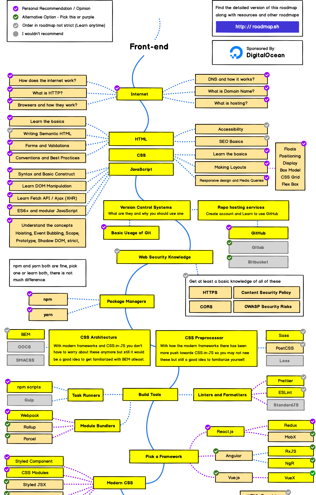

```toc
exclude: Table of Contents
from-heading: 1
to-heading: 6
```

# 0. Intro

:sparkling_heart: **주의** :sparkling_heart: 본 포스팅은 개발공부를 시작한지 얼마 안된 학생이 작성한 글 입니다. 가볍게 읽어주시고 피드백은 환영합니다!!!


## 0-1. 내가 가는길이 정답 :red_car:

모든 사람들은 걸어온 길이 다르고 앞으로 걸어갈 길도 다르듯이

각자의 템포와 방향, 가치관이 있다.

삶을 살아가는 방식이 사람마다 다르듯이,

정보를 얻는 방식과

같은 정보를 기억하는 방식에 있어서도

전세계 모든 사람들은 개인차가 존재하며 정답이 없다고 생각한다.

> 사실 나는 자신이 하는 방법을 자신이 정당화 할 수 있으면 그것이 바로 `정답`이라고 생각한다.

그래서 나는 내가 개발 공부를 하면서 개인적으로 괜찮았던 방식에 대해 써보려한다.

> 현재 나만의 `정답`이며 충분히 **바뀔 가능성**을 열어놓을 것이다.

> 본 포스팅의 취업을 위한 공부가 아닌 공부를 위한 공부에 대해 적었다.

# 1. STEP1 : 준비단계 (지피지기면 백전백승)

- [✏️ 블로그를 시작하며 (지피지기면 백전백승)](https://taeny.dev/essay/essay1_%EB%B8%94%EB%A1%9C%EA%B7%B8%EB%A5%BC%EC%8B%9C%EC%9E%91%ED%95%98%EB%A9%B0/)

> **공부를 하기 앞서 자신이 왜 공부를 해야하는지, 어떤 공부를 할 지 정하는 것이 가장 중요하다고 생각한다.**

## 1-1. 자신의 상태 파악하기 :muscle:

사람마다 개발에 대한 각자의 철학이 있으며 실력을 평가하는 기준이 각자 다를 수도 있다.

그리고 동일한 것을 바라보는데에 있어서 시각차이도 사람마다 다를 수 있다.

> 예컨데 각자 동일한 시간을 가지고 동일한 책을 보아도 그 둘이 가지고 있는 정보는 차이가 날 수 밖에 없다.

그렇기 때문에 `모자란 점` 역시 자신이 직접 **자신의 상태**를 보고 판단해야 해야 하며, `앞으로 공부방향` 또한 **자신의 철학과 가치관**에 맞게 스스로 설정해야한다.

> 현재 회사 혹은 팀프로젝트가 없었던 나는 공부하면서 기술적인 부분이나 비즈니스적인 부분보다는 프로그래밍의 원리에 대해 공부하려고 했고, 어떠한 기능이 어떻게 작동하는 지 기본적인 원리에 대해 이해하려고 했다.

# 2. STEP 2 : 인풋을 넣는 단계 (감 잡기)

사실 처음에는 자신이 뭘 공부해야할 지 감이 아예 안오는 경우가 있다.

그럴 땐 자신을 돌아보기보다는 `외부`에서 방법을 참고하는 것이 좋다.

> `외부`는 다른 개발자들이 걸어왔던 길이나 그분들이 추천, 조언하는 내용들을 말한다.

## 2-1. 로드맵 :tangerine:



[로드맵 링크](https://github.com/kamranahmedse/developer-roadmap)

깃허브에서 되게 유명한 `웹 개발자 로드맵`인데 실력있는 개발자가 되기 위한 공부 커리큘럼이 잘 나와있다.

뭘 공부해야 할 지 모른다면 로드맵을 참고하는 것이 좋은 방법이다.

## 2-2. 인터넷 강의 :tangerine:

로드맵을 통해 학습주제를 정했다면 인터넷강의를 통해 정보를 얻는 것을 추천한다.

개발공부를 하면서 느낀 것이 정말 퀄리티 높은 인터넷 강의가 정말 많다는 점이었다.

> 나는 **생활코딩**님 강의를 통해 웹전반, html, css, js 를 공부했고

> **velopert**님 강의를 통해 리액트를 접했고

> **zerocho**님 강의를 통해 여러 프레임워크들과 js 백엔드를 접했다.

> 그 외에도 캡틴판교님, 노마드코더님 등 많은 **스타**:star: 강의자분들이 계시고 정말 적은 비용으로 🔮마법기술들을 학습할 수 있다.

나는 주로 [인프런](https://www.inflearn.com/)을 통해서 여러가지 무/유료 강의를 들었는데 개인적으로 별로였던 강의는 한개도 없었다.

> 그리고 인터넷 강의는 내가 템포조절을 주체적으로 할 수 있다는 점에서 정말 좋은 것 같다.

## 2-3. 책 :tangerine:

책은 출판되는데 정말 많은 비용이 들어간다고 생각한다.

> 집필자의 노력과 시간, 돈, 등등..

그만큼 정제화가 많이 되어서 담고있는 정보가 인터넷보다는 비교적 정확하고 질이 높다.

> 나는 개인적으로 참고용, 내가 현재 알고 있는 지식과 비교용으로 책을 이용한다.

# 3. STEP 3 : 구조화 단계 (능동적으로 공부하기)

어느정도 감이 오면 이제 조금은 추상적인 개념들을 자신만의 언어로 가공(`구조화`)하는 작업이 필요하다.

> 자신이 부족한 점, 아직 추상적이거나 이해하지 못한 점 등 공부가 필요한 부분을 아는경우, 강의나 책보다는 주체적인 학습방법이 더 효율적일 수 있다.

## 3-1. 구글링 :earth_americas:

개발 커뮤니티가 정말 잘 되어있다고 느낀게 내가 궁금한 것은 대체적으로 남들도 궁금해했고 구글에는 그 궁금증을 해결해주는 정보들이 많이 있었다.

해당 정보에 대해 자신의 `개인 블로그`에 잘 정리해주시는 분들도 계셨고

**stackoverflow** 나 **github** 같은 커뮤니티에서 `질문을 답변`해주는 분들도 많이 계셨다.

하지만 개방적이라는 특성이 정보를 쉽게 얻을 수 있다는 장점도 있지만

정보를 얻을 때 여러 자료들을 스스로 비교하고 선별하는 과정이 필요하다.

> 영어를 잘한다면 금상첨화 [錦上添花]

> 많은 개발자분들이 정보를 공유하는 것에 거리낌이 없으신 것 같다. 인터넷에는 정말 많은 오픈소스들과 가공된 정보들이 많고 공유문화가 너무 잘되어있다. (감사합니다.)

나는 강의를 통해 마법기술의 맛을 본 후, 해당 기술들의 원리나 심화적인 내용, 혹은 내가 헷갈리는 개념들을 구글링을 통해 학습했다.

## 3-2. 꼬리에 꼬리를 물기 :snake:

모르는 개념이나 공부하고싶은 주제를 정했을 때,

그것에서 파생된 모르는 개념이 먼지털듯이 계속 쏟아져 나올 가능성도 크다.

> 예를 들어, 리액트를 공부하려면, class, hooks, binding, this 등 여러 개념들이 나오고

> 꼬리에 꼬리를 물다보면 자바스크립트의 객체, prototype, 호이스팅 등 여러 개념들을 공부해야한다.

이렇게 나는 꼬리에 꼬리를 무는 방식으로 학습을 하였고, 능동적으로 모르는 개념이 나올 때마다 꼬리의 꼬리를 물다보니 정보들이 하나의 스토리처럼 결합이 잘 되었던 것 같다.

여기서 중요한 점은 꼬리에 꼬리를 물다보면 끝이 없어서 자신이 생각해서 중간에 끊어줘야 한다는 것이다.

> 꼬리에 꼬리를 물다보면 c로 비롯된 언어들의 역사, 언어를 읽는 엔진의 원리, 더 나아가서는 자연과학, 물리학까지 이를 수 있다.


> 물론 전부 알면 좋지만 시간은 한정되어있기 때문에 우선순위를 매겨 자신에게 필요한 정보인지 선별하고 아닐 경우, 필요한 것을 먼저 학습한 후 나중에 다시 파이를 넓혀나가도 된다.

## 3-3. 공부 블로그 만들기 ❣️

나는 공부한 내용을 정리하는 방법으로 나는 블로그를 이용했다.

그리고 블로그를 처음에 지인이나 커뮤니티를 통해 알리는 것이 나에게는 큰 도움이 되었던 것 같다.

누군가 내 글을 보든 안보든 누군가 볼 수 있다는 상태를 두면 정보를 정리하고 구체화(언어화) 하는 과정을 더욱더 신경쓰고 정제하려 하고 틀리지 않기 위해 더 많은 정보들을 비교하게 된다.

> 그래도 여전히 잘못된 지식을 내가 가지고있을 가능성이 있다고 생각해서 주기적으로 내가 쓴 글을 보려고 하고 있다.

그리고 공부한 실제 추상적인 개념들을 그냥 이해하고 넘어가는 것보다 구체적인 언어로 옮기고 실제로 설명하는 순간 정보들이 머릿속에 잘 기억이 되었다.

# 4. 앞으로 내가 공부할 방향

## 4-1. 마인드1 : TDD 학습법 :baby_chick:

`TDD (Test Driven Development)` 라고 개발을 하는데 있어서의 방법론 적인 개념이 있다.

TDD는 프로젝트의 전체 기능에 대하여 처음부터 모든 테스트 케이스를 작성하는 것이 아니라, 지금 가장 먼저 구현할 기능 하나씩 테스트 케이스를 작성하는 방식을 이야기한다.

> 즉, 처음부터 집을 지으려고 하지 않고 토지를 갈고 토지가 완성되면 문짝을 만들고 문짝이 잘 작동하면 다음 문짝을 만들고 다시 두개의 문짝을 잘 작동하는 지 확인하는 방식

물론!! 어떤 일을 전체적으로 구상하는 것도 중요하지만 여기서 말하고 싶은 것은

개발을 공부함에 있어서 개발을 `너무 큰 산`으로 볼 필요 없다는 것이다. (큰 산이긴하다..ㅎ)

처음부터 잘하는 사람은 없진 않지만 드물다.

자신이 마법사가 아닌 인간임을 인정하고 자신이 부족한점을 하나하나 공부해나가는 것이 정신적으로도, 공부의 효율면으로도 좋을 것이다.

## 4-2. 마인드2 : 개발 === 협업 :family:

개발은 사실 혼자할 수도 있지만, `개발의 꽃은 협업`이라고 생각한다.

하나의 서비스를 만들 때, 디자인, 개발, 홍보 등 많은 분야의 전문가들이 투입된다.

> 개발만 해도, 프론트엔드, 백엔드, 보안, 데브옵스 등 많은 포지션이 있다.

즉, 자신이 어떤 하나의 전문성을 가지고 공부하는 것이 중요하기도 하고

자신의 분야의 전문성을 넘어서 다른 분야의 감수성 (기본적인 이해와 관련지식) 을 아는 것도 중요하다고 생각한다.

나도 디자인도 좋아하고 개발도 좋아하지만 내 전문성을 위한 공부를 하되, 다른 부분의 분야에 대한 생각도 놓치지 않고 싶다.

## 4-3. 소마법 프로젝트 🔮

내가 하고싶은 분야에 대해 실제 구현도 해보고 공부도 하기 위해 `소마법 프로젝트`로 시작했다. (a.k.a 토이 프로젝트)

이번프로젝트는 기본적인 기능들과 로직, 혹은 디자인(ux,ui)에 포커스를 맞추고 앞으로 내가 구상한 것을 실제로 구현해보고자한다.

최대한 프로젝트를 하면서 느낀 것이나 배운 것들을 블로그에 기록할 것이다.

- [소마법 프로젝트 - 1 (container)](https://taeny.dev/project/%EC%86%8C%EB%A7%88%EB%B2%95-%ED%94%84%EB%A1%9C%EC%A0%9D%ED%8A%B81/)

# 5. 마치며

공부방법은 정말 많고 다양하다고 생각한다.

이번 포스팅에서는 혼자서 학습하는 방법만을 다뤘지만

부트캠프나 학원 혹은 스터디 등 다른 사람들과 정보를 교환하는 방식도 겪어보진 못했지만 실력을 올릴 수 있는 좋은 방법들인 것 같다.

마지막으로 어떠한 공부방법을 택하든 가장 중요한 것은

자신이 감당할 수 있는 만큼 해야하고

> 오래 달렸으면 꼭 쉬어야한다.

공부하는 과정 속에서 흥미와 성취감을 느끼며 기분좋게 지속하는 것이 중요하다고 생각한다.

나도 아직 너무너무 부족한게 많고 배워야할 것도 정말 많지만

**기분좋은 자극을 느끼며 오랫동안 공부하고 싶다.**

:tada:**2020-03-03**
