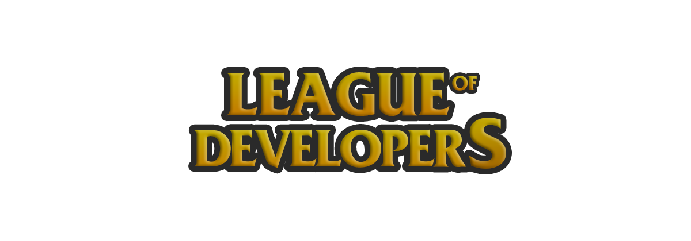
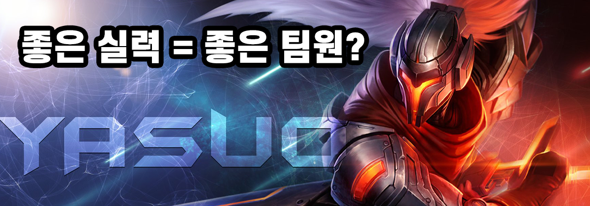
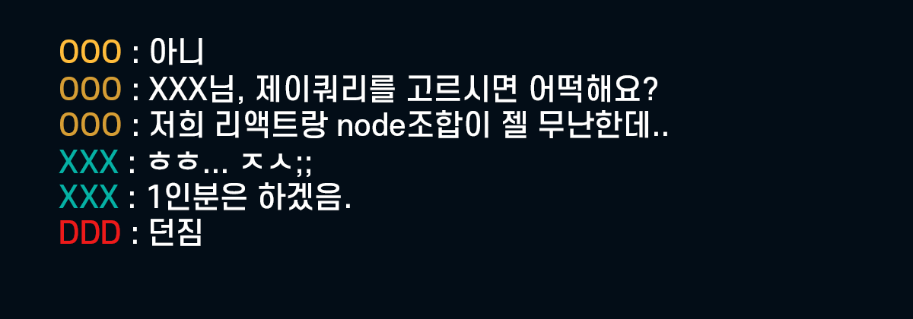
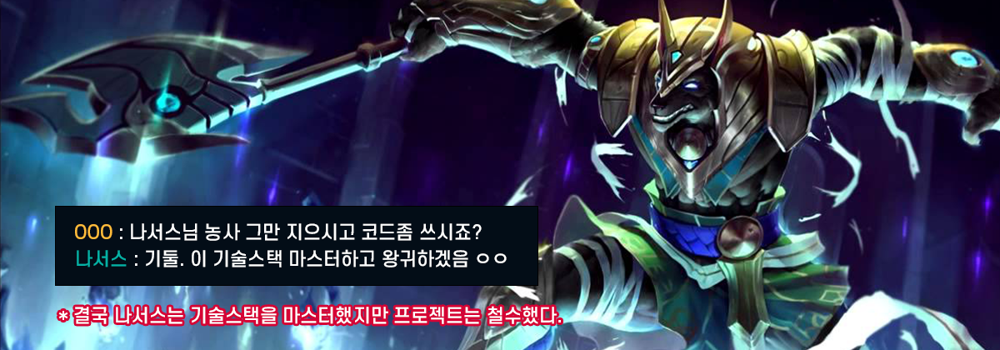
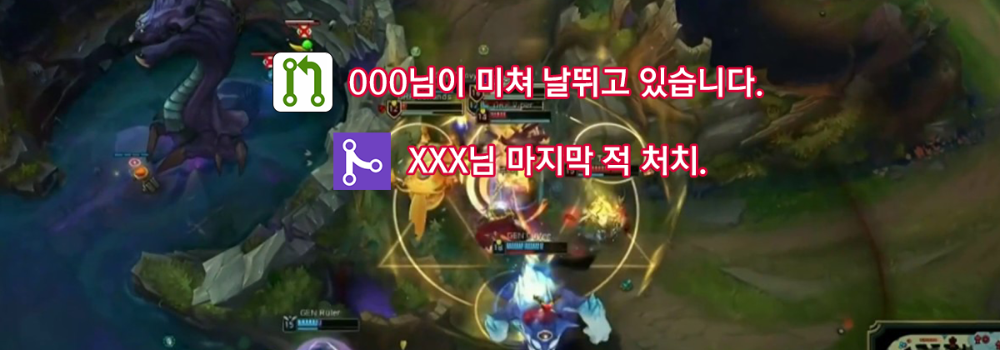
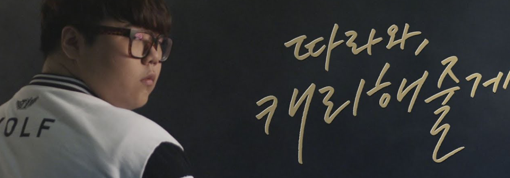

평소 혼자 개발공부를 하다가 좋은 기회가 생겨서 팀을 이뤄 개발을 하게 되었다. (롤로 비유하면 계속 1대5 컴까기만 하다가 랭크게임을 하게되었다고 볼 수 있다.) 혼자 하는 것과 **'같이'**하는 것의 차이는 매우 컸고, 개발이라는 것을 팀게임인 리그오브레전드(LOL)에 빗대어 어떤 마음가짐을 가지면 좋을지에 대해서 개인적인 생각들을 적어보았다.

> **TMI** : 글 작성자의 티어는 시즌7기준 실버 2 이며, 악명높은 딜서폿 유저이다. 롤을 한 지도 오래되었고, 잘하지도 못하지만 방구석 씨맥, 페이커로써 철저한 개인적인 생각을 적어보려한다.

👀 잘못된 정보 지적, 피드백은 언제나 환영입니다~!

<hr/>

```toc
exclude: Table of Contents
from-heading: 1
to-heading: 1
```

# 1. 용어정리

- **리그오브레전드 : 개발**

- 프로팀 (skt T1) : 회사 혹은 팀

- 팀원 (Faker) : 개발자

- 챔피언 (갈리오, 럭스 등) : 기술스택

- CS (경험치) : 공부, 삽질 등 모든 성장을 위한 행위 (~~Computer Science와 혼동 주의~~)

- 적 팀 : 버그,에러

- KILL : 버그,에러 해결

- 넥서스 파괴 : 디플로이 (서비스 배포)

- 한타 : PR

- 채팅 : 코드리뷰

- 오더 : 오더

- 실력 : 실력

# 2. 팀원선발



롤은 5대5 팀게임이다. 프로팀이 존재하며, 감독은 각자의 포지션별로 잘하는 사람들을 선발한다. 선수선발의 기준은 무엇일까? 나는 롤 프로팀 감독이 아니기 때문에, 만약 내가 감독이었다면 어떤 선수를 선발할까 생각해보았다. (방구석 롤챔스 시청경력이 꽤 되긴한다.)

내가 감독이라면 먼저 실력이 좋은 선수에게 눈이 많이 갈 것 같다. 실력이 최고의 팀워크라는 말도 있듯, 어나더레벨로 잘하는 선수들은 정말 좋은 인재이다. 그리고 팀워크능력과 인성도 중요한 요소가 될 수 있을 것 같다. 롤 프로경기는 솔랭과 다르다. 자기만 잘해서도 안되고 팀 전체에게 도움이 되어야한다.

즉, 롤은 팀게임이며, 무조건 실력, 무조건 인성 이런식으로 뽑지 못할 것이다. 복합적으로 우리팀과 팀원, 현재 메타에 잘 맞는 선수인가 고려해서 선발해야할 것이다.

> 마찬가지로 개발자 또한 비슷하다고 생각한다. 무조건 실력이 좋은 사람보다는 우리 팀과 잘 맞는가도 중요할 것이다. (물론 실력이 비슷할 때의 이야기이다.)
> 그렇기 때문에 자신이 회사의 선택을 받지 못했을 때, 실력이 부족하지 않다고 판단된다면 자신을 자책하기보다는 그 회사 혹은 팀에 맞지 않다고 생각하는 것이 좋다고 생각한다.

또한 롤의 경우, 솔랭은 가볍게 즐겜해도 상관 없지만, 프로팀의 팀원으로 선택이 되었으면 프로팀을 대표한 선수로서 프로의식(책임감)을 갖는 것이 중요하다. 프로팀의 팀원이 되어서 계약을 하게되면 그 프로팀에게서 돈을 받고 그 팀을 대표해서 출전하는 것이기 때문에 팀에 도움이 되지는 못할 망정, 피해는 절대 끼쳐선 안된다.

> 개발자의 경우에도 개인 사이드프로젝트와 회사업무랑은 느낌이 다르다. 회사의 선택을 받았을 경우, 이제는 회사에서 돈을 받는 입장이 되기 때문에 프로의식(책임감)을 갖고 팀에 기여할 수 있는 것들을 생각해야 한다. 즐겁게 하되, 직업의식(책임감)을 갖고 최대한 피해안주고 자신의 역할을 다하는 것이 중요하지 않을까 생각한다.

# 3. 밴픽



운 좋게 프로팀의 러브콜을 받고 팀에 들어갔다. 그럼 실제 경기를 하게된다. 리그오브레전드의 경우, 게임이 시작되기 전에 자신이 게임에서 사용할 챔피언을 고르는 '밴픽'이라는 시간이 있다. 이 때, 상대방의 챔피언을 고려하고 우리 팀원의 픽을 고려해서 챔피언을 선택한다.

그럼 항상 내가 좋아하는, 그리고 잘하는 픽만 하면 될까?

아니다. 밴픽은 상대의 픽과 우리팀원의 픽을 최대한 고려해서 팀에 도움될만한 픽을 해야한다. 그렇기 때문에 롤 프로선수들은 자기 포지션에 대한 웬만한 챔피언들은 능숙히 다룰 수 있어야 한다.

> 개발의 경우에도 마찬가지인 것 같다. 예를들어, 프론트엔드 프로젝트가 만들어졌을 때, 자기가 리액트 장인이라고 해서 무조건 그것을 고수하는 것은 옳지 않은 것 같다. 프로젝트에 따라, 그리고 같이 작업하는 동료에 따라, 어떤 프레임워크, 라이브러리를 쓸 지 상의 후에 팀 모두에게 도움될 결정을 하는 것이 옳을 것이다.

> 또한, 롤과 비슷하게, 개발도 메타가 빠르게 변하는 분야이기 때문에 신기술이나 새로운 디자인패턴 등에 관심을 가지며 다양하게 학습하는 것도 중요한 것 같다.

# 4. 성장



롤의 경우, 게임을 시작하면 무턱대고 바로 싸우지 않는다. 처음에는 각 선수들 모두 서로 긴장의 끈을 놓지 않으며 cs(중립몬스터)를 먹는다. 이를 '성장'한다고 하는데, 바로 싸우기보다는 cs를 먹으며 경험치를 쌓고 자신의 성장을 도모한다.

> 개발의 경우도 무턱대고 코드를 짜고 수많은 에러와 전쟁을 하기보다는 현재 프로젝트에서 사용되는 기술스택에 대한 충분한 자료를 읽어보고, 어떤 식으로 코드를 짜면 좋을 지 설계하는 것이 먼저인 것 같다. 충분한 공부로 '성장'한다면, 에러와의 전쟁은 큰 무리 없이 승리할 것이다.

또한 롤에서는 cs말고 적을 KILL했을 때도 경험치를 얻는다. 즉, cs(중립몬스터)를 잡는 것이 아니라 실제 전투를 해서 이겼을 때도 '성장'할 수 있다. 예를들어, 정글의 경우 보통 두가지 성장방식이 있다. 초반에는 cs위주로 먹고 성장 후 후반 한타를 도모하는 **초식정글러**, 초반에 cs를 먹기보다는 적을 잡아눕히면서 성장하는 **육식정글러** 이렇게 두가지 성장방식이 존재한다.

> 개발의 경우에도 공부말고, 직접 코드를 써보고 구현해보고 하는 과정을 통해서도 '성장'할 수 있다. 그리고 위에서 언급한 초식정글러와 육식정글러처럼 사실 정답이란 게 없고 이론부터 차근차근 공부하며 성장하는 타입이 있을 수 있고, 프로젝트로 부딪혀가며 실제 체감하고 배우며 성장하는 타입이 있을 수 있다.

그리고, 아무리 성장해도 써먹지 못하면 아무 의미가 없다. 그래서 어떤 기술스택에 대해서 마스터하고 시작해야겠다는 마음가짐보다는 중요한 코어부분을 학습한 후, 적절히 사용하면서 부족한 부분이나 필요한 부분을 틈틈히 공부하는 식의 방법이 개인적으로는 좋은 것 같다.

# 5. 한타, 오더



롤의 경우, 충분한 성장이 되었으면 한타(모여서 싸우는 행위)를 한다. 이 때, 한타각을 잡은 팀원이 있으면 오더를 내리고 팀원들은 그것에 맞게 스킬을 연계해서 공격하고 한다.

> 개발의 경우, 한타를 PR에 비유해보았다. 자신의 코드가 프로젝트에 쓰여도 될지 판단되면 PR을 보내고, 팀원들은 그것에 대해서 자신들의 의견을 말해준다.

팀원이 생각하는 한타각이 내가 생각하기에는 이르다 싶을 수 있다. 이 때, 크게 두가지로 분류해서 자신의 의견을 말 할 수 있다.

1. 미쳤냐? 지금 싸우면 안돼. 바텀가서 cs나 좀 먹어라.

2. 상대 원딜이 너무 쎄서 지금 싸우는 것보다 좀 더 성장하고 30분쯤 싸우는 게 좋지 않을까요?

지금보다 나중을 도모하자는 똑같은 말이다. 하지만 차이점은 `문체` 와 `논리성` 이다. 먼저 문체인데 1번의 경우, 명령조에 반말에 상대방을 기분나쁘게 할 수 있는 요소가 많다. 반면에, 2번은 자신의 의견을 전달하고 다시 되물음을 통해서 처음 오더했던 상대방을 존중해준다. 같은 팀원이 오랜시간 같이 지냈던 친구면 비속어나 반말 등은 친숙함의 표시일 수 있지만 그게 아니라면 최대한 존중하게 이야기 하는 것이 최소한의 예의라고 생각한다.

> 내가 상대를 존중하지 않으면 상대도 나를 존중하지 않을 것이다.

두번째로는 논리성인데, 1번의 경우, 왜 싸우면 안되는지 말을 하지 않은 채, 싸우지말고 해야할 것을 말한다. 반면에 2번은 왜 싸우면 안되는지에 대한 충분한 근거를 대서 자신의 의견을 피력한다. 사람들은 각자 생각하는 것들이 다르기 때문에 상대방을 납득시키기 위해서는 최대한 근거를 대서 말하는 것이 중요하다.

> 개발의 경우에도 온갖 라이브러리들도 많고 코딩스타일도 다양하다. 분명 좋은 케이스들은 있겠지만 하나가 아닌 여러개가 존재할 수도 있다. 그럴 때, PR을 날렸을 때, 자신과 다른 의견이나 코딩 스타일이 있다면 확실한 논리를 갖고 최대한 공손하게 리뷰하는 것이 나를 위해서도 상대를 위해서도 좋지 않을까 생각한다.

그럼 끝까지 의견이 수렴하지 않는 경우 어떻게 하는 것이 좋을까? 롤에서는 상황에 따라 누구나 오더할 수 있지만, 보통 메인오더가 존재한다. 보통 주장이 메인오더를 하는 경우가 많은데 의견이 많이 갈릴 경우 메인오더에게 선택을 맡기고 자신과 의견이 다르더라도 일단 따르는 게 맞다고 생각한다. 잘못된 오더여도 팀게임에서는 팀원들이 **같이** 하는 것이 중요하지, 자기맘대로 행동하는 것은 옳지 않다고 생각한다.

> 개발의 경우에도 의견이 갈릴 경우, PM이나 팀장의 말에 일단은 따르는 것이 좋다고 생각한다. 물론 논리적으로 말이 안된다면 문제가 되지만, 논리적으로 크게 오류가 없다면 따르는 것이 맞다고 본다. 팀장, 리더들이 책임을 지는 이유이다.

# 6. 희생



롤에 있어서, 솔랭의 경우 '희생'은 많이 벌어지지 않지만 프로팀의 경기에서는 종종 볼 수 있다. 롤도 팀게임이지만 개인의 욕심이 존재하지 않을 수 없다. 돋보이고 싶고 캐리하고 싶고 높은 킬뎃을 유지하고 싶은 것이 당연하다. 하지만 사람들이 알아주지 않더라도, 팀을 위해 희생하는 것은 쉽지 않기 때문에 더욱 대단한 것이라고 생각한다. 롤에서는 보통 서포터 포지션에서 많이 '희생'한다.

> 개발의 경우에는 어떤 것들이 있을까? 팀으로 작업을 할 경우, 사람마다 선호하는 것이나 취향이 다르기 때문에 의견이 갈릴 수 있다. 이 때, 한번 양보하는 것. 혹은 상대방이나 팀이 필요한 정보나 기술에 대한 자료를 정리하거나 세미나를 여는 것. 등 자기의 개인 시간을 쪼개서 팀을 위해 하는 활동들은 모두 '희생'이라고 볼 수도 있을 것 같다.

> 희생은 작은 일이든 큰일이든 쉽지 않은 일이다. 하지만 희생하는 팀원들이 분명 존재하고 이들 덕분에 여러 상황 속에서 팀과 개인은 좋은 영향과 긍정적인 결과를 얻을 수 있지 않았나 생각해본다.

# 7. 복기


롤은 상대방 넥서스를 파괴하면 게임이 끝난다. 마찬가지로 우리팀 넥서스가 파괴되어도 게임이 끝난다. 하지만 게임이 이겼든 졌든, 그 게임의 과정은 자신의 실력을 조금이라도 상승시켰을 것이다.

> 개발로 따졌을 때, 넥서스 파괴를 디플로이(서비스 배포), 우리팀 넥서스가 파괴당한 것을 프로젝트 철수..라고 볼 수 있겠다. 마찬가지로 성공한 경험, 실패한 경험 모두 자신에게 큰 실력상승의 경험으로 남을 것이다.

프로팀의 경우, 이기든 지든 경기내용에 대해서 다시 보면서 자신이 잘했던 점과 못했던 점에 대해서 다시 한번 생각해보는 시간을 갖는다. 그 과정에서 자주 실수하는 점이나 잘못 판단했던 점을 교정하면서 다음 경기를 도모한다.

> 개발의 경우에도 하나의 프로젝트가 끝나면 다음 프로젝트가 있다. 했던 프로젝트에 대해서 복기하고 스스로 교정하고 공부하는 과정을 가진다면 더욱 효율적으로 실력을 상승시킬 수 있지 않나 생각한다.

# 마무리

롤은 팀원끼리 서로 싸우기도 하고, 협동하기도 하지만 결국 최종 목적는 팀의 승리이다.

> 개발 또한 **'안정적이고 좋은 경험을 제공하는 서비스 제작'**이라는 공통된 목적을 위해 여러 개발자들이 힘을 합친다.

개발 작업과 롤을 빗대어 생각해보면서 가장 크게 느낀 것은 **"팀작업의 본질은 모두 비슷하다"** 였다. 실력은 둘째치고, 배려하고 이왕이면 모두가 좋은 방향을 바라보며 진행하는 것이 필수 중 필수인 것 같다.

또한, 실력도 '어떻게 하면 팀의 승리를 이끌 수 있을까?', '어떻게 하면 이 팀에 기여할 수 있을까?' 하는 고민들로 인해 쌓여가는 것이 아닐까?

물론, 처음부터 게임이든 오더든 팀원과의 소통이든 잘할 수 없다. 하지만 이런 것들에 대해 최대한 인지하고 어떻게 하면 좋은 방향을 만들어낼 수 있을까 고민하는 행위 자체가 중요하지 않나 생각해본다.

🎉**2020-05-12**
