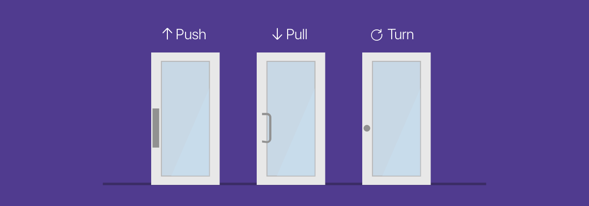
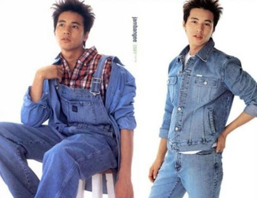
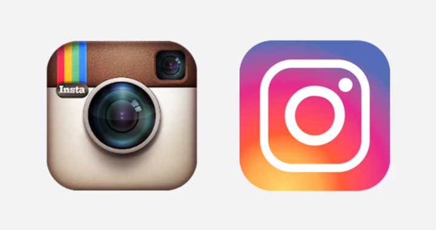
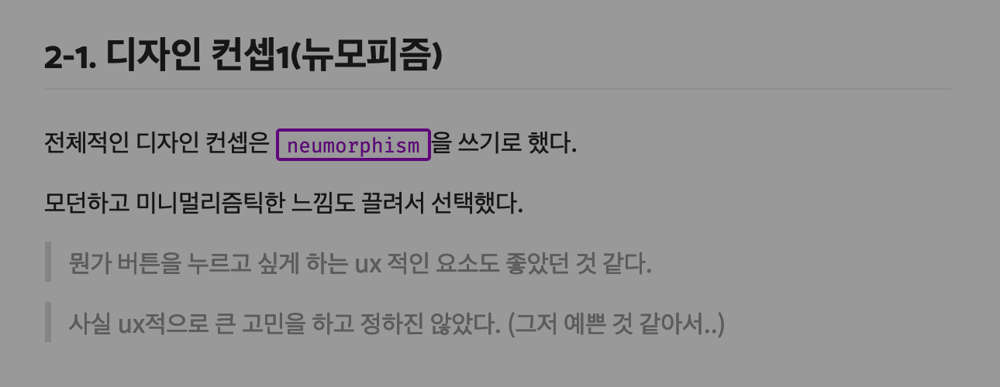

```toc
exclude: Table of Contents
from-heading: 1
to-heading: 5
```

# 0. Intro

UI, UX 디자인에 관한 간단한 저의 생각들을 정리해보았습니다. 디자인 전공이 아니며 전문성이 다소 떨어질 수 있습니다. 피드백 환영합니다~! ☺️



# 1. 디자인

## 1-1. 영화의 목적

> 디자인에 앞서서 내가 좋아하는 `영화의 목적`에 대해 한번 생각해보았다.

사람들은 영화를 **상업영화**, **예술영화**로 크게 둘로 나누곤한다. 나는 이렇게 둘로 나누는 기준을 영화의 가치와 목적에 있다고 생각한다.

**상업영화**는 `돈과 흥행`에 가치를 좀 더 둔 영화이고, **예술영화**는 `예술적인 가치`에 목적을 더 둔 영화이다.

상업영화는 흥행이 주 목적이기 때문에 **재미와 볼거리**가 중요하다.

반면에 예술영화는 영화가 가지는 **메시지나 예술적인 표현**이 더 중요하다.

그렇다고 반대되는 개념이 아니며 충분히 겹칠 수 있다. 다만 어느쪽에 가치와 목적을 더 두었느냐에 대한 차이만 있다고 생각한다.

> 그렇기 때문에 두마리 토끼를 잡은 '기생충'은 다시 생각해도 정말 대단한 영화이다...

그럼 상업영화와 예술영화의 **공통점**은 무엇일까?

바로 `사람들에게 보여진다`는 것이다. 즉, 영화는 사람들에게 상영될 목적을 가지고 있으며 아무도 관람하지 않는 영화는 목적을 잃는다.

상업영화는 많은 사람들에게 상영되어야 하므로 재미와 감동에 초점을 두고, 예술영화는 사람들에게 더 깊은 울림을 주기 위해 메시지와 표현방식에 많은 초점을 둔다는 차이점이 있지만, 둘 다 공통적으로 사람들이 봐야지 목적을 이룰 수 있으며, 영화를 보여지는데 성공해도 영화가 추구하는 가치를 사람들이 느껴야 좋은 영화가 된다.

> 즉, 영화의 장르에 상관없이 주 목적은 관람객에게 영화를 보여주는 것에 있으며, 가치도 관람한 사람들에게서 나온다.

## 1-2. 디자인의 목적

> **디자인(design)** : 주어진 목적을 조형적으로 실체화하는 것. [출처: 두산백과](https://terms.naver.com/entry.nhn?docId=1086152&cid=40942&categoryId=33074)

디자인이라는 용어는 지시하다·표현하다·성취하다의 뜻을 가지고 있는 라틴어의 데시그나레(designare)에서 유래되었고, **어떠한 목적을 실체화하는 행위(동사)와 실체(명사)를 포괄하는 의미**를 가졌다.

즉, 추상적인 목적만 가져서도 안되고 목적성 없이 실체화해서도 안되고 어떠한 `목적`과 명분으로 추상적인 대상을 `실체화`해서야 사전적 의미의 디자인이 성립된다.

결국 디자인의 표면적 목적은 실체화이지만 궁극적으로는 실제 목적을 달성하는 목적을 가지고 있다.

# 2. UI, UX 디자인

## 2-1. 개념

> **UI 디자인(User Interface)** : 사용자와의 인터페이스를 실체화하는 디자인 작업

> > **인터페이스(interface)** : 사물과 사물 사이 또는 사물과 인간 사이의 경계에서, 상호 간의 소통을 위해 만들어진 물리적 **매개체나 프로토콜** [출처: 두산백과](https://terms.naver.com/entry.nhn?docId=2837557&cid=40942&categoryId=32828)

> **UX 디자인(User eXperience)** : 사용자경험에 목적을 두고 가치를 만들어내는 디자인 작업

## 2-2. UI, UX 디자인의 목적

`UI 디자인의 목적`은 컨테이너부터 작은 버튼까지 어떤 **인터페이스**(레이아웃과 구조, 색상, 모양 등의 시각적요소)를 통해 사용자에게 **긍정적인 가치**를 주는 것이라고 생각한다.

> 가치라 함은 유용성이 될 수도 있고 심미성이 될 수도 있고 목적에 따라 다르다.

`UX 디자인의 목적`은 언어 그대로 사용자에게 **좋은 경험**을 제공하는 것이라고 생각한다.

> 그렇기 때문에 UX는 디자이너뿐만 아니라 개발자에게도 중요하게 생각해야하는 부분이다.

UI 와 UX 또한 자주 같이 나오는 개념이고 헷갈리는 개념이지만 위에서의 **상업영화 vs 예술영화**의 예처럼 무엇에 더 목적을 두느냐에 따라 달라지는 개념이라고 생각한다.

> 물론, 기생충처럼 두마리 토끼를 잡을 수 있다.

그리고 상업영화와 예술영화의 목적이 공통적으로 관객에게 가치를 제공하는 것이었듯, UI, UX 디자인도 모두 사용자에게 `좋은 인터페이스`와 `좋은 경험` 같은 좋은 가치들을 제공한다는 목적이 있다.

# 3. 좋은 UI, UX 디자인

## 3-1. 목적 충족

좋은 UI, UX 디자인은 바로 디자인의 목적이 충족된 디자인일 것이다. 하지만, 의도하지 않았어도 사용자에게 새로운 가치와 좋은 경험을 주는 경우도 좋은 디자인이 될 수 있다고 생각한다.

> 즉, 사용자에게 **주옥**같은 경험을 주기 위해 의도적으로 **주옥**같은 디자인을 해서 실제로 사용자가 **주옥**같은 감정을 얻었다면 성공한 디자인, 좋은 디자인이 될 수 있다.

디자인 또한 영화와 마찬가지로 많은 사람들이 선호하는 객관적인 '좋음'이 있을지 몰라도 수학처럼 정답이 있는 것이 아니라 사람마다의 주관적인 취향이 있을 수 있다.

그래서 나는 디자인의 `목적을 달성하는 것`이 `좋은 디자인`이라고 생각한다.

그리고 UI, UX가 다른 개념이듯, 목적에 따라 한쪽을 포기해야 할 상황도 있을 수 있다.

> 버튼의 인터렉션 애니메이션이 무척 예쁘지만 해당 프로그램의 성능에 영향을 준다면 해당 프로그램의 목적에 따라 애니메이션을 없앨지, 성능을 포기할 지 선택해야 할 것이다.

## 3-2. 디자인 트렌드



> 앗... 트렌드의 완성은 얼굴?

패션과 마찬가지로 UI 디자인에 있어서도 트렌드가 존재해왔다.

크게 스큐어모피즘(Skeuomorphism) -> 플랫 디자인(Flat design)의 트렌드 변화가 있었는데 많은 제품과 서비스들이 트렌드의 변화에 맞게 디자인을 수정하였다.



> 인스타그램 리디자인 (스큐어모피즘 -> 플랫)

이런 스큐어모피즘 디자인에서 플랫 디자인으로서의 트렌드 변화 역시 그냥 일어난 것이 아니라 `디자인의 목적`에 따라 변화하였다.

기존의 **스큐어모피즘 디자인**은 사용자들에게 용도를 직관적으로 알릴 수 있고, 제품에 대한 친밀감을 가질 수 있었지만 과도한 디테일로 인해 사용자의 주의를 분산시켰고, 좀 더 단순하고 추상적인 2차원 평면의 **플랫 디자인**으로 변화하게 되었다.

> 즉, 사용자와 인터렉션이 많이 발생하는 IT 제품과 서비스에서는 디자인의 목적에 부합한 변화였다고 생각한다.

## 3-3. 앞으로의 방향 :apple:

디자인에 있어 트렌드는 매우 중요하다.

> 트렌드는 현재 시장이 주목하고 있다는 의미에서만 봐도 좋은 디자인이다.

예를들어, 사용자가 A 어플을 쓰고 느낀 경험(experience)들은 내 어플을 쓸 때 배경지식으로 사용될 수도 있다. 즉, 트렌드는 사람들이 주목하고 있다는 점에서 내가 그 디자인을 사용하지 않더라도 나 혹은 내 서비스에게 영향을 준다.

> 디자인 트렌드는 알게모르게 내 디자인에도 작용된다.

하지만 트렌드에 사로잡혀 내 제품이나 서비스에 부합하지 않는 디자인을 선택하는 것은 더더욱 좋지 않다.

그렇기 때문에 좋은 디자인을 위해서 디자인 `트렌드`에 관심을 가지면서 안목을 기르고 현재 사람들이 무엇을 좋아하는지 파악하는 동시에, 자신이 만드는 제품이나 서비스의 `목적성`에 부합하는 디자인을 선택하고 적용하는 것이 중요하다고 생각한다.

# 4. 마치며

현재 진행중인 프로젝트([소마법 프로젝트](https://small-magic-project.now.sh))에 디자인 트렌드 중 하나인 `뉴모피즘`을 적용했었다.



> 제작노트 박제..

제작노트에도 썼듯이, 큰 고민 없이 디자인컨셉을 결정했다.

하지만 오늘 [뉴모피즘 디자인은 어떻게 좀비가 되었나](https://wormwlrm.github.io/2020/03/10/Neumorphism-the-zombie-trend.html)라는 글을 읽고 다시 디자인에 대해 생각해보고 생각을 정리하는 시간을 가졌다.

앞으로 디자이너분들과 커뮤니케이션할 상황들이 있을텐데 그전까지 안목도 기르고, 깊고 넓게 생각하는 능력을 키워야겠다.

> 역시 배보다 배꼽이 커선 안된다..!

:tada:**2020-03-12**
