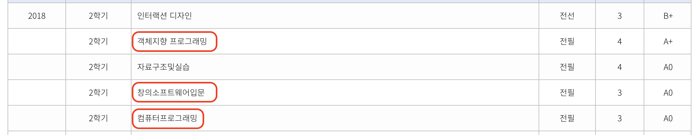
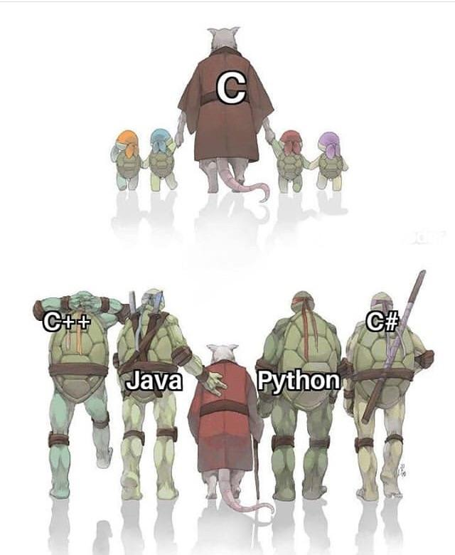
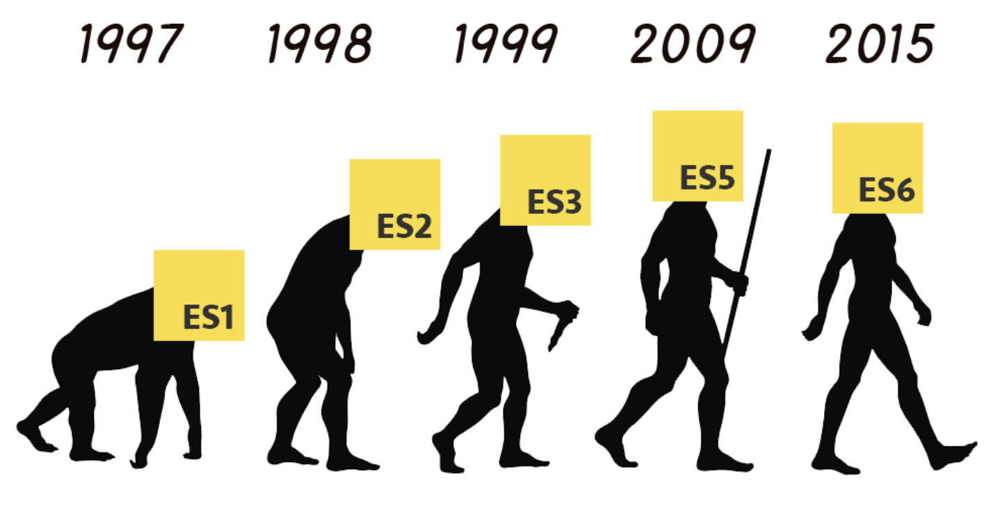
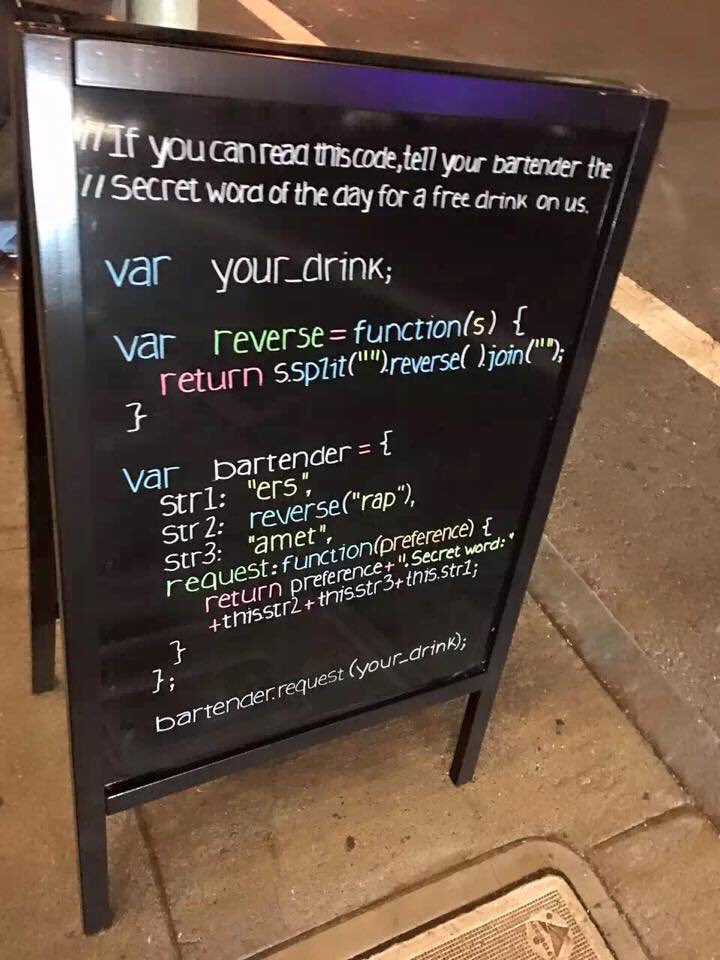

대학교에서 자료구조 수업을 들을 때, 교수님께서 한 말씀이 있습니다.

> **_개발자로 살면서 한번쯤 코드만을 보고 "우와! 진짜 이 코드는 진짜 잘짰다" 하고 감탄하는 일이 분명 생길 것이다._**

단지 짧게 작성하거나 어려운 알고리즘을 사용한 것이 아님에도 문학책에서 느낄법한 아름다운 코드를 발견할 경우가 생길 것이라고 하셨습니다.

글을 잘 쓰시거나 글쓰는 일을 업으로 삼고있는 사람들을 **작가**라고 부릅니다. 그럼 코드를 잘 짜시는 분들도 **작가**라고 부를 수 있을까하는 생각이 들었고 프로그램에 쓰이는 개발언어를 '언어'로서 접근해서 포스팅해보았습니다.

좁은 식견으로 의식의 흐름대로 적어보았는데 가볍게 읽어주시면 감사하겠습니다.

<hr/>

```toc
exclude: Table of Contents
from-heading: 1
to-heading: 5
```

# 1. 언어의 목적

작가는 글을 쓰는 사람이고 `글`이라는 것을 통해 자신의 생각과 느낌을 표현한다.

개발자는 코드를 쓰는 사람이고 `코드` 라는 것을 통해 자신의 추상적인 아이디어를 표현한다.

> 물론 개발자는 코드작성 뿐만 아니라 설계 등 더욱 복합적인 역량이 요구되지만 본 포스팅에서는 코드를 쓰는 사람으로 좁은 의미로 정의해보았다.

그리고 글과 코드는 특정 `언어`를 통하여 작성이 된다. 그럼 언어란 무엇일까?

언어[言語]는 국어사전에서

: **생각, 느낌 따위를 나타내거나 전달하는 데에 쓰는 음성, 문자 따위의 수단. 또는 그 음성이나 문자 따위의 사회 관습적인 체계.**

라고 정의가 되어있다.

> 출처 : 표준국어대사전

언어란 소통, 커뮤니케이션을 위한 문자체계, 정의내려진 **약속**이며, 언어의 목적은 상대방에게 **생각, 느낌을 전달**하는 데에 있다. 그렇기 때문에 글이나 코드, 혹은 간단한 대화까지 언어를 사용한 모든 것들은 생각과 느낌을 전달하려는 목적을 갖고있다.

연설의 경우 듣는 청중이 있고, 글의 경우 읽는 독자가 있으며, 코드의 경우 코드를 해독하는 컴파일러 혹은 같은 팀의 동료개발자가 있듯이, 연설과 글, 코드 모두 갖고 있는 공통점은 바로 상대방이 있다는 것이고, 쓰여진 글이나 코드는 상대방으로 하여금 쉽게 이해되어야 한다.

전달하는 사람의 생각과 전달받는 사람의 생각의 차이는 분명 존재하겠지만, 중요한 포인트는 그 생각이 잘 전달되었는가이다. 자신의 생각이 상대방의 생각과 다르더라도 생각과 느낌만 잘 전달이 된다면 그것은 잘 전달된 글, 코드는 좋은 글, 코드라고 생각한다.

<hr/>

1️⃣ 좋은 **연설** = 생각, 느낌을 잘 전달한 연설

2️⃣ 잘 쓴 **글** = 생각, 느낌을 잘 전달한 글

3️⃣ 잘 쓴 **코드** = 생각, 느낌을 잘 전달한 코드

<hr/>

> 3️⃣ 잘 쓴 **코드**의 경우, 사람(나 or 다른 개발자) 뿐만 아니라 컴퓨터(컴파일러)도 읽기 때문에 더욱더 까다롭다.. 컴퓨터의 경우 솔직하고 빠른 피드백을 주는 점은 좋은 것 같다

그렇다면 1️⃣,2️⃣,3️⃣ 간의 차이점은 무엇일까? 아마 언어의 표현방식에 있을 것이다.

`예시`

1️⃣ **연설**은 의 경우 사실의 열거보다는 자신을 극대화하고 상대를 설득시키기 위해서 수사적 표현이나 긍정적인 기운을 주는 언어의 표현들이 중요하고, 2️⃣ **글**의 대표적인 장르인 문학의 경우에는 독자로 하여금 상상을 유도할 수 있는 묘사나, 흥미를 잃지 않게해주는 재미있는 표현 등이 중요시될 수 있다. 그리고 3️⃣ **코드**는 컴퓨터가 알아들을 수 있게 변환되어야 하기 때문에 최대한 에러를 줄여야 하고, 다른 개발자들과 언어가 공유되기 때문에 명확하고 이해하기 쉬워야 한다.

<hr/>

이는 일반적인 예시일 뿐,

**연설**도 설득 목적이 아닌 학회에서의 발표의 경우, 사실에 입각한 정보전달이 주가 될 수도 있고

**글**도 문학 뿐만 아니라 논설문, 시나리오, 편지 등 장르에 따라 표현방식을 달리하여야 한다.

마찬가지로 **코드**도 회사바이회사 부서바이부서로 회사마다 팀마다 선호하는 코딩스타일이 있을 수도 있고 만드는 프로그램이 어떤 가치에 중심을 두는 지에 따라 다를 수 있다.

물론 생산성과 효율이 좋고 많은 사람들이 선호하는 매뉴얼(방법)이 존재한다.

> 코드에서의 **매뉴얼** 예 : 변수명을 지을 때 camelCase를 이용한다, scope에 따라 들여쓰기를 맞춰준다 등등..

> "클린코드"라는 깨끗한 코드에 대해 다룬 책도 존재한다. 아직 안읽어봤지만 꼭 읽어볼것!!

하지만 코드도 언어로 작성된 하나의 글로 접근한다면 매뉴얼보다는 `읽어줄 사람이 누군인지`를 잘 아는 것이 더 중요하지 않을까? 오픈소스의 경우에는 많은 개발자들이 선호하는 스타일로 작성하는 것이 좋을 것이고, 모르는 사람들과 프로젝트를 진행한다면 서로의 코딩스타일을 고려한 코드가 좋은 코드일 것이다. 그리고 개인프로젝트의 경우 내가 코드를 쉽게 이해하고 빠르게 수정할 수 있다면 자신의 스타일로 작성된 좋은 코드가 될 수 있다고 생각한다.


> 좋아하는 이성에게 보내는 편지도 받는이가 누군가에 따라 잘쓴 글이 될 수도 있고 오그라드는 별로인 글이 될 수도 있다.

<hr/>

그런데 읽는 사람이 누구인지 파악했다고 해서 좋은 글과 코드를 잘 쓸 수 있는 것은 아니다. **글**의 경우 자신의 독자에게 생각과 느낌을 효과적으로 표현하고 잘 전달하기 위해서는 그만큼의 어휘력이나 문장력이 필요하다.

**코드**도 역시 자신의 환경에서 좋은 전달력을 얻기 위해서는 그만큼 해당 `언어에 대한 지식`과 `그 언어가 추구하는 가치`에 대해서 잘 알아야한다고 생각한다.

그럼 현재 내가 공부중인 자바스크립트라는 언어는 정말 나의 생각과 느낌을 잘 전달할 수 있는 언어일까? 생각이 들었고 그전에 나는 어떻게 첫 프로그래밍 언어를 접하게 되었는지부터 생각해보았다.

# 2. 당신의 모국어는 무엇인가요?

기술은 점점 발달하고, 정보는 더욱더 많아지고 접근하기 쉬워지면서, 10대 초반의 학생들부터 개발을 통해 제2의 인생을 꿈꾸는 멋진 중년분들까지 사람들이 개발을 배우는 시점의 폭이 정말 많이 넓어졌다.

따라서 개발을 시작하는 사람들이 모국어(첫 프로그래밍 언어)를 익히는 시점도 다양하고 언어의 종류도 다양해졌다.

`전공자`인 경우는 고등학교, 혹은 대학교에서 프로그래밍 개론 수업(컴퓨터 프로그래밍, 객체지향 프로그래밍, 소프트웨어 입문 등의 교과수업)에서 ~~강제적으로~~ 교수님이 채택한 언어를 첫 언어로 배웠을 것이고,

그리고 `비전공자`인 경우는 학원이나 독학(인터넷강의 혹은 서적)을 통하여 비교적 주체적으로 첫 언어를 골라 학습했을 것이다.

우리 학과 전공과목 중에는 프로그래밍 과목이 있었고 나는 2018년도에 컴퓨터 프로그래밍, 객체지향 프로그래밍이, 창의 소프트웨어 입문이라는 세개의 프로그래밍 입문 과목을 동시에 수강했다. 그리고 과목은 각각 `c, java, python` 언어를 사용했다.



> 4학점짜리 객체지향 프로그래밍언어 과목과 자료구조 과목은 매주 실습이 있어서 좀 힘들었다..ㅠㅠ

어린아이들이 첫 언어를 배우듯, 엄마의 말 대신 교수님, 책에 실린 코드들을 따라했고 여러번 반복하고 이해안되던것도 여러번 반복해서 보니까 감이 조금씩 생겼고 재미도 따라 붙었던 것 같다.

> 개인적 경험으로, 인수분해도 처음 배울 때는 한문제 푸는 것도 어려웠지만 반복해서 풀다보니 나중에는 몸에 익어 나중에는 이걸 왜 어려워했었지? 했던 기억이 있다.

그렇게 변수는 어떤 것을 임시로 담아두는 공간이구나! 변수에 값을 할당할 때는 메모리가 필요해, 이 기호는 이런 뜻이구나 등 언어가 뜻하는 바와 원리를 이해하니 공부가 점점 재미있었고,

많은 시행착오와 에러들을 거쳐 간단한 프로그램들(별찍기 등.. ⭐️)을 완성했을 때의 성취감은 공부하는데의 원동력을 주었다.

그리고 동시에 c, java, python을 함께 학습하면서 세 언어가 문법적으로 달라 헷갈려서 공부하기 힘들기도 했지만, 언어마다 각각 갖고있는 특징들을 비교하며 배울 수 있어서 더욱 도움이 많이 되었던 것 같다.



> "프로그래밍 언어들은 종류가 다양한 만큼 각각의 다양한 개발 철학과 나름의 장단점들을 가지고 있다. "

# 3. 자바스크립트길 걷기🌸

사실 처음 입문과목은 어린아이가 새로운 언어를 빠르게 습득하듯 재밌게 공부했지만 계속되는 대학교 CS 이론수업에 프로그래밍에 흥미가 점점 떨어지고 있었다.

그러다 실무적인 것을 해보고 싶어서 주체적으로 html, css, javascript 강의를 듣게 되며 웹에 대해서 접하게 되었고, 그렇게 웹 프론트엔드라는 분야에 매력을 느끼게 되었고 다시 주체적인 공부를 시작할 수 있었다.

> 이 시점에서 나는 위에서 언급했던 **나의 생각,느낌을 표현하기 위한** 수단으로 `웹`을, 언어로는 `자바스크립트`를 선택했던 것 같다.

우리가 쉽게 접할 수 있는 브라우저의 주력 언어이기도 했고 내가 직접 구현한 쌍방향 인터렉션 기능이 내 눈 앞에서 샥샥! 동작하는 것이 정말 신기했다. 그리고 디자인, 영상을 공부했던 경험과 쉬운 접근성 덕분에 내가 잘할 수 있는 분야겠구나 하고 생각하게 되었다.

또한 우리가 제2외국어를 배울 때, 모국어인 한국어와 비교하며 공부하듯, 내가 처음 배웠던 `c, java, python`의 문법들은 자바스크립트를 공부하는 데 큰 도움을 주었다.

> c의 포인터개념은 변수의 참조타입(객체나 배열 등)을 이해하는데 도움이 되었고, java의 generic, class, interface 개념은 typescript와 모던 자바스크립트를 배우는 데 도움이 되었다. 그리고 파이썬의 동적타입 특징도 자바스크립트의 특징과 많이 비슷했다.

내 새끼가 제일 이쁘다는 말처럼 학교에서 다소 수동적으로 배웠던 모국어들(?)과 다르게 주체적으로 학습했기 때문에 더욱 재미있었고, 그럴수록 더더욱 애착이 갔던 것 같다.

그리고 접근성도 좋은데다가 모바일 앱, 데스크탑 앱, 서버, DB 까지 많은 분야에서도 사용이 가능하다는 사실들은 오랜 후에 알게 되었지만 신기하기도 했다.

그리고 우리가 쓰는 언어의 특징과 유사하게 자바스크립트에는 표준화 작업들과 파생언어들도 많이 있었다.

## 표준어와 방언\[方言\]



자바스크립트 언어 커뮤니티 내부에서는 `ECMAScript` 처럼 표준 javascript 문법을 표준화하는 단체가 존재했으며,

Jquery, React, Typescript 등 자바스크립트 언어의 단점을 보완하려고 나온 `파생 언어들`도 많이 존재했다.

이러한 표준화작업과 파생 언어들 역시 내가 작성한 **코드를 컴퓨터와 동료개발자에게 쉽고 안전하게 잘 전달하려는 목적**을 위해서 생겨나게 되었고 현재도 더 좋은 언어로 거듭나기 위해 진행중인 것 같다.

> 새로운 ES 문법이나 자바스크립트 프레임워크들은 처음 공부할 때는 어렵지만, 공부하고나면 내 생각을 코드로 더 효율적으로 쉽게 전달할 수 있었다.

## 인용\[引用\]


글이나 논문의 경우 필요에 따라 적절히 인용을 사용한다. 자바스크립트에서도 마찬가지로 `라이브러리`라는 게 존재해서 기존에 연구가 되었던 혹은 작성되었던 코드를 필요에 따라 내 프로그램에 비교적 쉽게 가져다 쓸 수 있었다.

바퀴를 다시 발명하지 말라는 말이 있듯이, 적절히 라이브러리를 사용하는 것도 내 코드를 잘 전달하는 좋은 방법이지 않나하는 생각을 하게 되었다.

# 4. 코드 = 글 !



본 포스팅을 통해 프로그래밍 언어를 언어적 측면으로 다시한번 생각해보는 시간을 가지며, 코드와 글이 되게 유사하다는 생각을 많이 하게 되었다.

소설이 글로 이루어져있듯, 프로그램도 코드로 이루어져있고 코드도 특정한 언어로 이루어진 하나의 글이고 생각한다. 주목적이 컴파일러에서 전달되는 것이어서 실제 언어에서의 수사적인 표현을 쓰진 못하지만 결국 코드도 사람이 짜는 것이기에 저마다 다른 코드 작성 스타일이 존재한다.

> 이 때문에 코딩스타일을 잡아주는 esLint, prettier 라는 프로그램도 있다.

그렇기 때문에 좋은 코드를 작성하기 위해서 여러 코딩 스타일도 접해보고, 무엇보다 해당 언어에 대해 깊이있는 공부가 필요하겠구나 하고 생각하게 되었다.

<hr/>


마지막으로,

다독(多讀), 다작(多作), 다상량(多商量) 이라는 말이 있다.

글을 잘 쓰고 싶다면

1️⃣ 다독(多讀) : 많이 읽고,

2️⃣ 다작(多作) : 많이 쓰고,

3️⃣ 다상량(多商量) : 많이 생각하라.

라는 뜻인데, 글을 읽고 쓰는 것도 역시 똑같은 책만 읽거나 자신만의 문체에 얽매인다면 발전할 수 없다고 생각한다. 코드도 비슷하다고 생각한다.

> 대표적으로 Jquery 가 얼마전까지만 해도 자바스크립트와 함께 필수적으로 학습해야되는 언어였던 것 같지만, 현재는 필수까지는 아닌 것처럼..

좋은 코드를 쓰기 위해서 많은 사람들의 코드도 보고, 많이 써보고, 많이 생각해보는 개발습관을 들여야겠다.

:tada:**2020-04-01**
