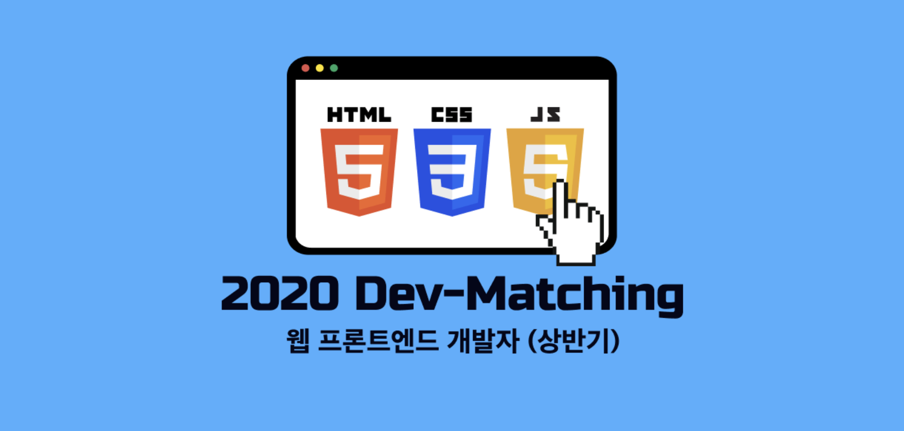

2020년 3월 14일 토요일, 오후 1시부터 5시까지 [프로그래머스](https://programmers.co.kr/)에서 진행했던 웹 프론트엔드 Dev-matching 에 대한 후기 글입니다. 테스트 이후 과제를 다시 풀어보며 과정과 생각을 기록해보았습니다.



> 사과 emoji는 과제테스트에서 요구하는 필수 기능입니다.

<hr/>

```toc
exclude: Table of Contents
from-heading: 1
to-heading: 5
```

# 1. 신청하게 된 계기

웹 프론트엔드 개발자라는 꿈을 향해 하루하루 즐겁게 공부하고는 있지만 나도 이제 막학기여서 취업에 대한 생각도 하지 않으면 안되었다. 그러던 도중 프로그래머스라는 사이트에서 `웹 프론트엔드 Dev-matching`이라는 개발자 채용 프로그램 신청을 받고 있다는 것을 알게 되었다.

프로그래머스는 코테 문제를 풀기위해서 자주 이용했었는데,

> 문제의 입출력이 함수형으로 되어있어서 자바스크립트로 문제를 푸는 나에게는 정말 편하고 좋았다.

이러한 채용 프로그램도 있다는 것을 처음 알게 되었고 좋은 기회, 경험이 될 것 같아 고민없이 지원하게 되었다.


> 출처 : [프로그래머스](<(https://programmers.co.kr/)>)

Dev-matching은 코딩테스트가 아니라 과제테스트로 진행이 되었고 과제는 실제 어플리케이션에 대한 기능을 추가하고 수정하는 방식으로 진행된다고 적혀져있었다. 프론트엔드 개발자 역량을 판단하기에 좋은 테스트라고 생각이 들었다.

# 2. 준비


> 출처 : [프로그래머스](<(https://programmers.co.kr/)>)

과제테스트에 대한 간략한 정보도 테스트 이전에 공개되었는데, 이전에 개인 프로젝트로 [배경화면 검색 크롤링 사이트](https://small-magic-project.now.sh/crawling)를 만들어본 적이 있어서 괜히 자신감이 생겼다.

그런데 문제가 어떤 식으로 나올지 전혀 감이 오지 않아서 자바스크립트 문자열, 배열 관련 메소드들이나 자바스크립트로 DOM을 조작하는 함수들 정도만 숙지하고 테스트를 보게 되었다.

# 3. 출제문제 다시보기

과제테스트는 테스트 이전에 공개되었듯이, 고양이 검색 웹사이트의 기본 틀이 주어졌다.


> 다시만들어본 고양이 검색 웹사이트 (과제)

## 3-1. 코드 구조

처음에는 주어진 코드를 이해하는데만 엄청 오래걸렸다.

먼저 `index.html`의 body태그 안에는 전체 컨테이너를 담당할 \<div\> 하나만 존재하였고, 모든 프로그램은 \<script\>로 자바스크립트 파일을 불러와 코드를 실행하는 식이였다.

그리고 ES6 class 문법이 주된 프로그램 구성 방식이었으며, 각각의 class 내부에는 setState 메소드와 render 메소드가 정의되어있었다. 그리고 constructor 내부에 render() 함수를 실행하는 코드가 있어서 constructor 시행 후, render() 를 시행하며 DOM을 구성하는 식이었다.

> 문제는 모두 javascript로 되어있었지만, setState 리렌더링이나 render() 안의 innerHTML을 통해 자손DOM을 구성하는 것, class 내부 state를 사용하는 것 등의 코드구조가 리액트와 무척 비슷하다는 느낌을 받았다.

```js
// 이미지상세보기창 js
class ImageInfo {
  $imageInfo = null
  data = null

  constructor({ $target, data }) {
    const $imageInfo = document.createElement('div')
    $imageInfo.className = 'ImageInfo'
    this.$imageInfo = $imageInfo
    $target.appendChild($imageInfo)

    this.data = data

    this.render()
  }

  setState(nextData) {
    this.data = nextData
    this.render()
  }

  render() {
    if (this.data.visible) {
      const { name, url, temperament, origin } = this.data.image

      this.$imageInfo.innerHTML = `
        <div class="content-wrapper">
          <div class="title">
            <span>${name}</span>
            <div class="close">x</div>
          </div>
                  
          <div class="description">
            <div>성격: ${temperament}</div>
            <div>태생: ${origin}</div>
          </div>
        </div>`
      this.$imageInfo.style.display = 'block'
    } else {
      this.$imageInfo.style.display = 'none'
    }
  }
}
```

> 이처럼 코드는 class의 인스턴스를 만듬으로써, DOM을 렌더링하였고, 해당 코드에는 없지만 setState() 메소드를 호출하면 리렌더링하는 등 class형식의 자바스크립트 파일은 리액트의 `컴포넌트`와 많이 닮아있다고 생각했다.

## 3-2. HTML, CSS 관련

### 시맨틱 태그 작성

첫 문제가 짜여진 코드를 시맨틱하게 바꾸는 것이었는데 평소에 div 외의 다른 태그의 존재만 알고있었던 나는 해결하지 못하고 다음 문제로 넘어갔지만, 코드 역시 하나의 언어이고 각각 요소들을 명시해주는 것이 중요하겠구나 느끼게 되었다.

<hr/>

### 반응형 처리

크롤링한 고양이 데이터를 디바이스별로 레이아웃을 달리해주는 문제도 있었다. 우선 이미지 레이아웃 방식은 `grid` 였는데, 평소 레이아웃잡을 때, flex밖에 안해서 당황하긴 했지만 @media 쿼리를 이용해 디바이스 width 에 따라 `grid-template-columns` 속성을 다르게 해주었다.

<hr/>

### 다크모드

OS 다크모드 설정에 따른 CSS 변경과 직접 테마를 바꿀 수 있는 토글 박스를 만드는 문제도 있었다. @media 쿼리를 통해 OS 다크모드 설정을 인식할 수 있구나(`@media (prefers-color-scheme: dark)`)에 대해서 알 수 있었고 토글 박스는 만드는데는 어렵지 않았지만 CSS 속성 우선순위에 따라 테마가 바뀌어도 다크모드의 CSS 속성을 따라가는 문제가 있었다.ㅠㅠ 내 블로그에도 테마 토글 박스가 있는데 참고하면서 공부해봐야겠다고 생각했다.

## 3-3. 이미지 상세보기 모달

### 반응형 처리

이미지를 클릭했을 때, 상세보기 모달이 뜨는데, 이 또한 디바이스에 따른 크기 처리를 해주어야 했다.

<hr/>

### 모달 닫기 기능 구현 :apple:

뒤에 붙은 `사과` emoji는 테스트에서 요구하는 `필수기능`이다. 이러한 필수 기능이 있다는 것을 후기글을 포스팅하는 지금 시점에 알게되었다.. ㄴㅇㄱ!! 과제 메뉴얼을 복사해서 다른 곳으로 옮긴 후 과제를 진행했는데 복사하는 과정에서 누락되서 못봤나보다...ㅠㅠ

주어진 코드에는 모달 닫기 기능이 아예 없었고, 모달 영역 밖을 누르거나 / 키보드의 ESC 키를 누르거나 / 모달 우측의 닫기(x) 버튼을 누르면 닫히도록 코드를 짜는 문제였다.

모달 x 버튼에 **onclick** 이벤트핸들러와, window 객체에 **onkeydown**, **onclick**이벤트핸들러를 등록해주면 되었다.

<hr/>

### 고양이 정보 불러오기 (AJAX)

크롤링한 데이터는 api 형태로 주어졌으며 `/cats/:id` 에 GET 요청을 통해 가져오면 되었다.

AJAX 비동기요청이 완료된 후에 해당 모달창에 받은 정보를 바탕으로 렌더링 되게끔 구현하기 위해서 Promise **then() 메소드체이닝**을 통하여 구현하였다.

## 3-4. 검색 페이지

### autofocus , 검색창 비우기

페이지 진입시 검색창으로 focus를 이동시키고 검색창에 키워드를 입력한 상태에서 검색창 재클릭시 기존의 키워드를 삭제하라는 문제였다. 비교적 쉽게 input의 autofocus 속성을 true로 하고, click 이벤트 시, input value를 빈 문자열로 바꾸게 하여서 해결하였다.

<hr/>

### 데이터 로딩 UI 구현 :apple:

데이터 불러오는 중임을 사용자에게 알리는 UI를 만드는 문제였다. 데이터가 로드되면 div.SearchResult 선택자 태그 안의 innerHTML 속성값으로 정보를 넣는 구조였는데, 데이터 비동기 요청 전에 innerHTML로 로딩중이라는 텍스트를 넣어주어서 어차피 데이터 로드가 되면 innerHTML로 정보가 덮어써지는 것을 이용해서 구현하였다.


<hr/>

### 데이터 없음 UI 구현 :apple:

렌더 함수 내부 조건문 처리로 응답받는 데이터배열 길이가 0일경우, '데이터 없음' 이라는 텍스트를 넣어주었다.

<hr/>

### 최근 검색어 기능

키워드를 검색했을 때, 최근 검색어 5개를 남기고 해당 검색어를 누르면 검색도 가능하게끔 하는 문제였다. 테스트 중에는 검색어 5개 보여지는 거만 구현했는데 테스트 끝나고 검색어 클릭 시, 검색이 가능되게끔 다시 구현해보았다.

```js
const TEMPLATE = '<input type="text">'

class SearchInput {
  $latestDOM = null
  latest_arr = []
  onSearch = null

  constructor({ $target, onSearch }) {
    const $searchInput = document.createElement('input')
    const $latestDOM = document.createElement('div')
    this.$latestDOM = $latestDOM
    this.$searchInput = $searchInput
    $searchInput.autofocus = true
    this.$searchInput.placeholder = '고양이를 검색해보세요.|'
    this.onSearch = onSearch

    $searchInput.className = 'SearchInput'
    $target.appendChild($searchInput)
    $target.appendChild($latestDOM)

    $searchInput.addEventListener('keypress', e => {
      if (e.keyCode === 13) {
        this.latest_arr.unshift(e.target.value)
        if (this.latest_arr.length > 5) {
          this.latest_arr.pop()
        } else {
        }
        console.log(this.latest_arr, e.target.value)
        this.render()
        onSearch(e.target.value)
      }
    })

    $searchInput.addEventListener('click', () => {
      $searchInput.value = ''
    })

    console.log('SearchInput created.', this)
  }

  render() {
    this.$latestDOM.innerHTML = this.latest_arr
      .map(item => {
        return `<span class="latest" style="cursor:pointer; border:1px solid black; padding: 3px; margin:3px">${item}</span>`
      })
      .join('')

    this.$latestDOM.querySelectorAll('.latest').forEach(($item, index) => {
      $item.addEventListener('click', e => {
        this.onSearch(this.latest_arr[index])
      })
    })
  }
}
```

> 먼저 검색어가 저장될 DOM 을 생성하고, 부모 노드에 DOM을 추가해준 뒤, 검색(keypress) 시, innerHTML 을 통해, 내부 요소들도 만들고, click 이벤트핸들러도 같이 등록하는 방식으로 구현해주었다.

그리고 초기 코드에서는 검색 이벤트가 `keypress` 가 아니라 `keyup` 이었다. 그런데 keyup 이벤트 발생시, 키워드가 영어일 시는 문제가 없지만 한글 키워드일 경우, 두번 쳐지는 현상이 일어나서 keypress 로 바꾸어주었다.

<hr/>

### 페이지 새로고침 시, 마지막 검색결과 유지

새로고침시, 마지막 검색결과를 유지하라는 문젠데, 테스트 중에는 쿠키를 이용해야될지 어떻게 해야될지 감이 안와서 테스트 중에는 해결하지 못하고 테스트 끝난 후에 다시 구현해보았다.

window 객체 내부에 `localStorage` 속성을 이용하면 마지막 검색 키워드를 로컬에 저장할 수 있었다.

```js
myStorage = window.localStorage
```

localStorage 속성의 setItem() 메소드를 이용해서 마지막 검색결과를 로컬에 저장해뒀다가 나중에 새로고침하여도 DOM이 로드된 후, getItem() 메소드를 이용해 저장했던 결과를 이용해 크롤링데이터를 요청하면 정상적으로 마지막 검색결과를 유지하는 것을 확인할 수 있었다.

<hr/>

### 랜덤 고양이 검색 버튼 구현 :apple:

새로운 api 주소(GET `/api/cats/random50`)를 이용해 버튼 클릭시 랜덤 고양이들이 화면에 그려지는 기능을 구현하는 문제인데, 필수문제인 것도 모르고 앞에서 시간을 다써버려서 못풀었지만 테스트 끝나고 풀어보니 간단하게 만들 수 있었다.

```js
// App.js

this.searchInput = new SearchInput({
  $target,
  onSearch: keyword => {
    api.fetchCats(keyword).then(({ data }) => this.setState(data))
  },
  onRandomClick: () => {
    api3.fetchCats().then(({ data }) => this.setState(data))
  },
})
```

> App.js 의 SearchInput 객체에 onRandomClick 메소드를 전달한다. 검색시 응답받는 데이터 형식이 같아서 api명만 바꿔주었다.

그리고 SearchInput.js 에서 버튼을 만들고 그 버튼 click 이벤트핸들러에 전달받은 onRandomClick() 만 넣어주면 되는 문제였다.

<hr/>

### 이미지 lazy load 구현

lazy load 개념이 생소했는데 나중에 날잡고 학습을 해야겠다.

## 3-5. 스크롤 페이징

스크롤이 바닥에 닿았을 시, 다음페이지를 로딩하라는 문제이다.

window 객체에 `scroll` 이벤트핸들러를 등록하고 scrollHeight와 scrollY,clientHeight를 이용해서 스크롤이 바닥에 닿을 때 이벤트가 발생하는 것까지는 했는데 다음 페이지로 가는 방법을 모르겠다. api 요청부분에도 페이지부분이 없어서 우선은 console창에만 뜨게끔하였다.

## 3-6. 코드 구조 변경

### ES6 모듈 형태로 코드변경

이해하지 못했다. ㅜ

<hr/>

### fetch -> async await 변경

ES7 비동기 처리문법인 async await 을 사용해서 코드를 변경하라는 문제였다.

변경전.

```js
const api3 = {
  fetchCats: () => {
    return fetch(`${API_ENDPOINT}/api/cats/random50`).then(res => res.json())
  },
}
```

변경후.

```js
const api3 = {
  fetchCats: async () => {
    const response = await fetch(`${API_ENDPOINT}/api/cats/random50`)
    return response.json()
  },
}
```

<hr/>

### API 의 status code 에 따라 에러 메시지를 분리하여 작성 :apple:

변경후.

```js
const api3 = {
  fetchCats: async () => {
    const response = await fetch(`${API_ENDPOINT}/api/cats/random50`)
    if (response.status === 200) {
      return response.json()
    } else {
      console.error(`${response}에러 : ${response.statusText}`)
    }
  },
}
```

> 근데 이게 맞는 답인지는 잘 모르겠다. :sweat_smile:

<hr/>

### 이벤트 위임 (Event Delegation)

SearchResult 에 각 아이템을 클릭하는 이벤트를 `Event Delegation` 기법을 이용해 수정해주세요. 라는 문제였다.

즉, 검색해서 나온 고양이를 클릭할 때, 이벤트핸들러를 고양이 이미지가 아니라 고양이 이미지 컨테이너에 등록하는 문제였다.

먼저 기존의 코드.

```js
this.$searchResult.querySelectorAll('.item').forEach(($item, index) => {
  $item.addEventListener('click', () => {
    this.onClick(this.data[index])
  })
})
```

수정한 부분.

```js
this.$searchResult.innerHTML = this.data
  .map(
    (cat, i) => `
            <div class="item">
              
            </div>
          `
  )
  .join('')
```

고양이 사진들에 name속성에 cat + index를 붙여주었다.

```js
this.$searchResult.addEventListener('click', e => {
  if (e.target.name) {
    this.onClick(this.data[e.target.name.substr(3, e.target.name.length - 4)])
  }
})
```

그리고 고양이 사진 컨테이너에 click 이벤트핸들러를 등록하고, 클릭한 부분이 이미지가 아닐 경우 그냥 넘어가도록 조건문 처리도 해주었다. 필요한 데이터는 index 부분이므로 앞의 cat부분을 substr()로 제거해주었다.

## 3-6. 테스트 관련(가산점)

문제

```
* Test suite와 각 test 의 목적을 이해하기 쉽게 기술해주세요. 예를 들어,


isNumber test (x)
isNumber 함수는 number type 의 argument 를 받으면 True 를 리턴합니다. (o)


* 각 컴포넌트 내부에 있는 함수들이나, Util 함수들을 테스트 할 수 있게 분리합니다.
* 조건문이 있는 함수의 경우, edge case에 대한 테스트를 준비합니다.
* 테스트 코드 내에서 각 테스트마다 반복적으로 필요한 부분을 life cycle 함수를 이용해 관리하도록 합니다.
```

전혀 무슨말인지 모르겠어서 PASS..하였다

# 4. 마치며

이번 테스트는 실력있는 프론트엔드 개발자를 채용하는 것이 목적이지만, 프론트엔드 분야를 공부하는 입장에서도 정말 좋은 경험이 되었던 것 같다. 개인프로젝트를 하면서 접해보지 못했던 여러가지 사용자측면 혹은 개발자측면의 이슈들이나 lazy load나 이벤트위임같은 생소했던 개념들도 알게 되어서 너무 좋았다.

그리고 테스트를 마치고 내 자신이 아직 정말 많이 부족하다고 느끼게 되었는데, 앞으로는 개인공부도 중요하지만 생각이 고이지 않게 이러한 외부 테스트나, 사람들과 코드에 대해서 이야기하는 자리도 많이 가져야겠다는 생각을 하게 되었다.

해결하지 못한 문제나 부족하다고 생각되는 부분은 따로 정리해뒀다가 다시 공부해야겠다.

:tada: **2020-03-19**
