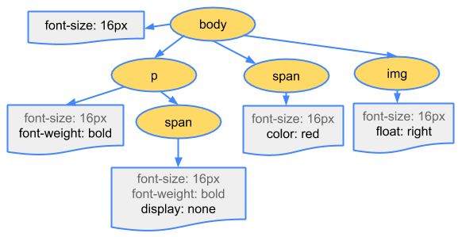

이번 포스팅에서는 그래픽이 무엇인지와 브라우저 렌더링 과정, 렌더링 최적화 방법에 대해 알아보고, 그래픽스에 관련된 용어들에 대해 정리해보았다.

<hr/>

```toc
exclude: Table of Contents
from-heading: 1
to-heading: 1
```

# 1. 그래픽이란?

그래픽은 무엇일까? 위키백과에서는 다음과 같이 정의한다.

- [그래픽](https://ko.wikipedia.org/wiki/%EA%B7%B8%EB%9E%98%ED%94%BD) : 그리스어 낱말 γραφικός(그라피어)에서 온 것으로 어떠한 표면에 표시되는 시각적인 표현
- [컴퓨터 그래픽스](https://ko.wikipedia.org/wiki/%EC%BB%B4%ED%93%A8%ED%84%B0_%EA%B7%B8%EB%9E%98%ED%94%BD%EC%8A%A4) : 이러한 시각적표현을 컴퓨터에서 처리하고 만들어내는 것 (최근에는 일반적으로 3D 작업을 부를 때 많이 쓰인다.)
- [웹 그래픽](https://www.w3.org/standards/webdesign/graphics) : 웹에서 사용자에게 좋은 경험을 제공하기 위해 사용되는 시각적 표현

---

다시말해, 그래픽이란 **지도, 사진, 디자인 및 패턴, 가계도, 다이어그램, 건축 또는 엔지니어링 청사진, 막대 차트 및 원형 차트, 타이포그래피, 회로도, 라인 아트, 플로차트 및 기타 여러 이미지 형식** 등 모든 화면에 표시되는 시각적 표현들을 의미하며, 우리가 웹을 통해서 보는 것, 스크린을 통해서 보는 것 모두 디지털로 만들어진 그래픽이라고 할 수 있다.

그리고 웹의 경우에는 웹 페이지 내부에 있는 텍스트, 버튼, 캔버스 등 모두 DOM 엘리먼트들의 정보들에 의해 시각적으로 `렌더링` 된 그래픽들이며, 스크립트 언어와 엔진의 발달, 그리고 다양한 기술, 솔루션의 등장으로 우리는 이러한 그래픽을 전보다 쉽고 편리하게 다룰 수 있게 되었다.

> **렌더링** : 컴퓨터 프로그램을 사용하여 모델 또는 이들을 모아놓은 장면인 씬 파일(scene file)로부터 `영상` 을 만들어내는 과정

> **영상**은 빛의 굴절이나 반사 등에 의하여 이루어진 물체의 상(像)을 의미하며, 근래에는 동영상(video)라는 의미로 쓰이고 있지만 picture, image가 맞는 의미이다.

# 2. 렌더링

렌더링의 정의는 위에서 언급했듯이, 영상을 만들어내는 과정을 말한다. 예를들어, 동영상,사진 편집 프로그램의 경우, 재가공한 그래픽을 실제 파일로 만드는 과정을 의미하고 웹의 경우 DOM 콘텐츠들을 HTML과 CSS를 파싱하여 화면에 표시는 과정을 의미한다.

그럼 웹에서의 렌더링은 어떤 과정/원리로 일어날까?

브라우저에는 일반적으로 렌더링엔진이 내장되어 있어서, 전달 받은 HTML, XML 파일을 파싱하고, DOM트리를 구성하고 CSS와 함께 Render트리를 구성한다음, 화면을 그려준다.


> 👆 webkit 렌더링 엔진의 구조


그리고 브라우저 플랫폼이 다양하듯, 브라우저마다 사용하는 렌더링 엔진 또한 다양하다.

- 크롬 : Blink (Google)
- 사파리 : WebKit (Apple)
- 파이어폭스 : Gecko (Mozilla)

> 크롬의 경우, **"WebKit이 여러 아키텍처를 지원하면서 WebKit과 크로미움 프로젝트의 복잡성이 증가했고, 이에 따라 집단 혁신 속도가 저하되었다"**라는 이유로 2015년부터 WebKit을 대체하는 Blink라는 WebKit에서 파생된 새로운 웬 렌더링 엔진을 사용하기 시작했다.

# 3. 렌더링 과정

> "오늘날 웹 사용자는 방문하는 페이지가 대화형이고 원활히 작동할 것으로 기대하므로 개발자는 여기에 시간과 노력을 집중해야 합니다. 페이지는 빠르게 로드될 뿐만 아니라 원활히 실행되어야 합니다. 가벼운 손가락 동작만으로 빠르게 스크롤할 수 있고 애니메이션과 상호작용이 매끄러워야 합니다.
> 성능이 우수한 사이트와 앱을 작성하려면 브라우저가 HTML, 자바스크립트 및 CSS를 처리하는 방법을 이해하고 작성하는 코드와 포함된 타사 코드가 최대한 효율적으로 실행되도록 보장해야 합니다." - Paul Lewis

브라우저 엔진의 성능이 좋아졌다고해도 사용자에게 좀더 매끄러운, 만족스러운 경험을 제공하려면 렌더링 최적화 과정이 필요하다. 그리고 렌더링 최적화를 위해서는 렌더링 과정을 정확하게 이해하는 것이 필요하다.

브라우저가 페이지를 렌더링할 때 다음과 같은 과정을 거친다.

## 1. DOM TREE 생성


> 👆 바이트 → 문자 → 토큰 → 노드 → 객체 모델(DOM)

> [이미지 출처 : 객체 모델 생성](https://developers.google.com/web/fundamentals/performance/critical-rendering-path/constructing-the-object-model?hl=ko)

1. **변환**: HTML의 원시 바이트를 읽어와서, 해당 파일에 대해 지정된 인코딩(예: UTF-8)에 따라 개별 문자로 변환
2. **토큰화**: 브라우저가 문자열을 W3C HTML5 표준에 지정된 고유 토큰으로 변환
3. **렉싱**: 변환된 토큰을 해당 속성 및 규칙을 정의하는 '객체'로 변환
4. **DOM 생성**: 마지막으로, 객체간의 관계를 정의하는 트리 데이터 구조의 DOM Tree 생성.

## 2. CSSOM TREE 생성




DOM TREE 생성과 비슷한 방식으로 CSS 스타일시트를 참조해서 **CSSOM TREE**를 생성

> DOM TREE와 CSSOM TREE는 서로 독립적인 객체이며, DOM TREE는 콘텐츠를 설명하고, CSSOM TREE는 문서에 적용되어야 하는 스타일 규칙을 설명한다.

## 3. Rendering TREE 생성


1. DOM 및 CSSOM 트리를 결합하여 렌더링 트리를 형성
2. 렌더링 트리에는 페이지를 렌더링하는 데 필요한 노드만 포함
3. 레이아웃 (Reflow) 프로세스를 통해 각 객체의 정확한 위치 및 크기를 계산
4. 페인트 (Repaint) 프로세스를 통해 픽셀을 화면에 렌더링

# 4. 렌더링 최적화

렌더링 최적화는 어떻게 할 수 있을까? 렌더링 최적화를 위해서는 레이아웃 (Reflow) 프로세스와 페인트 (Repaint) 프로세스 과정을 최소화해주면 된다.

### 1. 레이아웃 (Reflow)이 발생하는 CSS 속성 사용 피하기

Reflow를 발생시키는 CSS 속성(left, top, margin, padding, border, width, height, 등..)보다 transform과 같은 Repaint만 발생시키는 속성 사용하기

또한 `visibilty: invisible`는 레이아웃 공간을 차지하지만 `display: none`은 레이아웃 공간을 차지하지 않아 rendering tree 형성에 제외되기 때문에 성능을 위해 후자를 쓰는 것이 좋다.

### 2. 가능한 최하위 요소의 스타일을 변경

상단의 엘리먼트 속성 변경은 하위 모든 엘리먼트에도 영향을 주기 때문에 가능한 최하위 엘리먼트의 스타일 변경하기

### 3. DOM TREE 깊이 최소화 / 영향 받는 엘리먼트 제한하기

DOMT TREE의 깊이를 최소화하여 탐색시간을 줄이거나 `position: absolute` 또는 `position: fixed` 를 사용하여 영향 받는 엘리먼트 제한하기

### 4. 프레임 줄이기 / 애니메이션은 가능한 CSS 이용

한 프레임 처리가 `16ms(60fps)` 내로 완료되어야 렌더링 시 끊기는 현상 없이 자연스러운 렌더링을 만들어낼 수 있고, 애니메이션은 JavaScript보다 CSS을 사용하는 것이 좋다.

# 5. 그래픽과 관련된 분야들

마지막으로 그래픽과 관련된 여러 용어들이 있는데 이를 정리하고 마무리하려한다.


1. **영상처리** : 컴퓨터를 통해 영상을 처리하여 다른 영상을 만드는 것.

2. **데이터 시각화** : 수치 데이터를 입력 받아 시각적으로 표현될 수 있는 자료구조로 변환하는 과정.

3. **컴퓨터 비전** : 영상을 분석하여 이해하는 것.

4. **VR(가상현실)** : 컴퓨터 등을 사용한 인공적인 기술로 만들어낸 실제와 유사하지만 실제가 아닌 어떤 특정한 환경이나 상황 혹은 그 기술

5. **AR(증강현실)** : VR(가상현실)의 한 분야로 실제로 존재하는 환경에 가상의 사물이나 정보를 합성하여 마치 원래의 환경에 존재하는 사물처럼 보이도록 하는 컴퓨터 그래픽 기법.

# 6. 참고자료

참고자료는 ❤️[Web Graphics Archive](https://github.com/taenykim/Web_Graphics_Archive/tree/master/basic)❤️ 에 업로드 되었으니 참고바랍니다.

## Computer Graphics

- [영상처리, 시각화, 컴퓨터 그래픽스, 컴퓨터 비전](http://blog.naver.com/PostView.nhn?blogId=infoefficien&logNo=220691954109&parentCategoryNo=&categoryNo=446&viewDate=&isShowPopularPosts=true&from=search) 영상처리, 시각화, 컴퓨터 그래픽스, 컴퓨터 비전
- [그래픽 - 위키백과](https://ko.wikipedia.org/wiki/%EA%B7%B8%EB%9E%98%ED%94%BD) 그래픽
- [컴퓨터 그래픽스 - 위키백과](https://ko.wikipedia.org/wiki/%EC%BB%B4%ED%93%A8%ED%84%B0_%EA%B7%B8%EB%9E%98%ED%94%BD%EC%8A%A4) 컴퓨터 그래픽스
- [렌더링 - 위키백과](https://ko.wikipedia.org/wiki/%EB%A0%8C%EB%8D%94%EB%A7%81) 렌더링

## Browser Rendering

- [브라우저는 어떻게 동작하는가?](https://d2.naver.com/helloworld/59361) 브라우저는 어떻게 동작하는가? - naver D2
- [브라우저와 렌더링 엔진 | 필오의 개발일지](https://feel5ny.github.io/2018/05/29/rendering_engine_0/) 브라우저와 렌더링 엔진 | 필오의 개발일지
- [[브라우저엔진] 브라우저 렌더링 엔진](https://12bme.tistory.com/208) 브라우저 렌더링 엔진 - 길은 가면, 뒤에 있다.
- [Comparison of browser engines - Wikipedia](https://en.wikipedia.org/wiki/Comparison_of_browser_engines) 렌더링 엔진의 비교
- [성능 최적화 | TOAST UI](https://ui.toast.com/fe-guide/ko_PERFORMANCE/) 웹페이지의 로딩과 렌더링 최적화방법
- [FrontEnd-성능최적화-기본](https://ideveloper2.dev/blog/2019-05-18--front-end-%EC%84%B1%EB%8A%A5%EC%B5%9C%EC%A0%81%ED%99%94-%EA%B8%B0%EB%B3%B8/) Frontend 성능최적화 기본 - Ideveloper
- [렌더링 성능](https://developers.google.com/web/fundamentals/performance/rendering/?hl=ko) 렌더링 성능 - Paul Lewis
- [객체 모델 생성](https://developers.google.com/web/fundamentals/performance/critical-rendering-path/constructing-the-object-model?hl=ko) 객체 모델 생성 - Ilya Grigorik
- [브라우저 렌더링 과정 - Reflow Repaint, 그리고 성능 최적화](https://boxfoxs.tistory.com/408) 브라우저 렌더링 과정 - 박스여우
- [2019년 브라우저의 상태 - 조은](https://medium.com/@euncho/2019%EB%85%84-%EB%B8%8C%EB%9D%BC%EC%9A%B0%EC%A0%80%EC%9D%98-%EC%83%81%ED%83%9C-e73ab86bcbd0) 2019년 브라우저의 상태 - 조은
