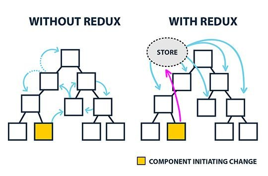

```toc
exclude: Table of Contents
from-heading: 1
to-heading: 5
```

# 0. Intro

앞선 포스트에서 리액트의 상태관리는 컴포넌트 내부에서는 state(클로저든 클래스든) 컴포넌트 간의 상태교환은 props로 한다는 것을 알아봤다.

하지만 상태가 많아지고 상태를 교환하는 컴포넌트들의 트리의 depth(깊이)가 깊어지고 트리의 degree(자식노드의 수)가 많아지면 어떨까?



리덕스는 하나의 `스토어`를 두고 전체 노드들의 상태들을 관리하며 노드의 액션이 발생하면 그걸 캐치하고 상태를 update한다.

> :bulb: 모든 상태를 리덕스 스토어로 관리하는 것보다 필요에 따라 쓰는 것이 중요할듯!

# 1. 리덕스

```
npm i redux
```

```js
import { createStore } from 'redux'

// 리듀서. 전달받은 액션을 처리하고 바뀐 state를 리턴한다.
function counter(state = 0, action) {
  switch (action.type) {
    case 'INCREMENT':
      return state + 1
    case 'DECREMENT':
      return state - 1
    default:
      return state
  }
}

// 리듀서를 바탕으로 스토어를 생성한다.
let store = createStore(counter)

// 액션 디스패치 (액션 타입과 데이터를 보내줌)
store.dispatch({ type: 'INCREMENT' })
// 1
store.dispatch({ type: 'INCREMENT' })
// 2
store.dispatch({ type: 'DECREMENT' })
// 1
```

# 2. 리듀서 코드스플리팅

```js
// rootReducer.js
import { combineReducers } from 'redux'
import reducer1 from './reducer1'
import reducer2 from './reducer2'

const rootReducer = combineReducers({
  reducer1,
  reducer2,
})

export default rootReducer
```

```js
// reducer1.js

// immer사용시 import
import produce from 'immer'

// state
export const initialState = {
  name: ["태니"]
}

// 액션 정의
export const ACTION_TYPE = 'ACTION_TYPE'

export default (state = initialState, action) => {
  return produce(state, draft => {
    switch (action.type) {
      case ACTION_TYPE: {
        draft.name.push("액션")
        break
      }
    }
  }
}
```

# 3. 리액트 X 리덕스

```
npm i react-redux
```

## 3-1. HOC 형태(connect, mapStateToProps, mapDispatchToProps)

[redux TODO 만들기](https://codesandbox.io/s/github/reduxjs/redux/tree/master/examples/todos)

```jsx
import React from 'react'
import { render } from 'react-dom'
import { createStore } from 'redux'
import { Provider } from 'react-redux'
import App from './components/App'
import rootReducer from './reducers'

// store를 reducer를 통해 생성하고 Provider 컴포넌트로 감싸준다.
const store = createStore(rootReducer)

// virtual DOM 에 렌더링
render(
  <Provider store={store}>
    <App />
  </Provider>,
  document.getElementById('root')
)
```

```jsx
import React from 'react'
import { connect } from 'react-redux'
import { addTodo } from '../actions'

const AddTodo = ({ dispatch }) => {
  let input

  return (
    <div>
      <form
        onSubmit={e => {
          e.preventDefault()
          if (!input.value.trim()) {
            return
          }
          dispatch(addTodo(input.value))
          input.value = ''
        }}
      >
        <input ref={node => (input = node)} />
        <button type="submit">Add Todo</button>
      </form>
    </div>
  )
}

export default connect()(AddTodo)
```

```jsx
import { connect } from 'react-redux'
import { toggleTodo } from '../actions'
import TodoList from '../components/TodoList'
import { VisibilityFilters } from '../actions'

const getVisibleTodos = (todos, filter) => {
  switch (filter) {
    case VisibilityFilters.SHOW_ALL:
      return todos
    case VisibilityFilters.SHOW_COMPLETED:
      return todos.filter(t => t.completed)
    case VisibilityFilters.SHOW_ACTIVE:
      return todos.filter(t => !t.completed)
    default:
      throw new Error('Unknown filter: ' + filter)
  }
}

const mapStateToProps = state => ({
  todos: getVisibleTodos(state.todos, state.visibilityFilter),
})

const mapDispatchToProps = dispatch => ({
  toggleTodo: id => dispatch(toggleTodo(id)),
})

export default connect(mapStateToProps, mapDispatchToProps)(TodoList)
```

## 3-2. hooks 형태 :star: (useSelector, useDispatch)

### useSelector

```js
const { name } = useSelector(state => state.user)
```

### useDispatch

```js
const dispatch = useDispatch()
dispatch({
  type: ACTION_TYPE,
  data: {
    name: name,
  },
})
```

# 4. NEXT X 리덕스

```jsx
import React from 'react'
import withRedux from 'next-redux-wrapper'
import { compose, createStore } from 'redux'
import { Provider } from 'react-redux'
import reducer from '../reducers'

const App = ({ store }) => {
  return (
    <Provider store={store}>
      <App2 />
    </Provider>
  )
}

// HOC로 리덕스기능 넣어주기
export default withRedux((initialState, options) => {
  // 리덕스 미들웨어 장착
  const enhancer = compose()
  const store = createStore(reducer, initialState, enhancer)
  return store
})(App)
```
