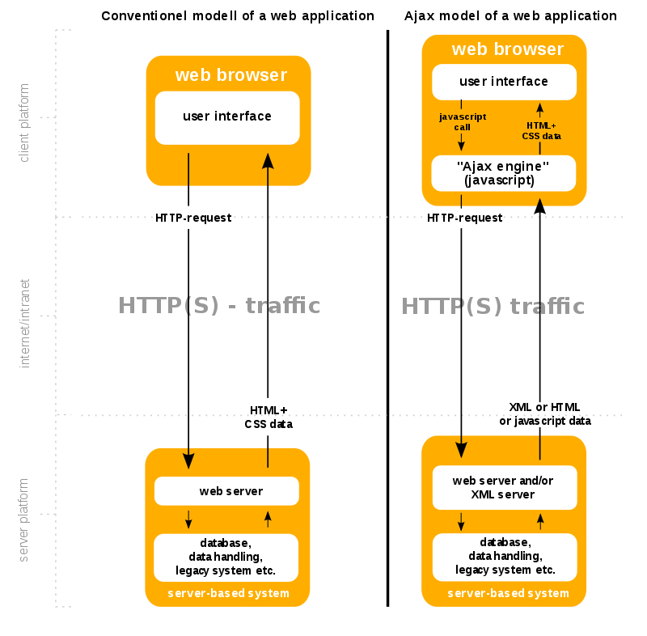

```toc
exclude: Table of Contents
from-heading: 1
to-heading: 5
```

# 0. Intro

앞선 포스트에서 자바스크립트의 비동기 특징에 대해서 알아봤다.

[2) 자바스크립트 작동원리](https://taeny.dev/javascript/2%EC%9E%90%EB%B0%94%EC%8A%A4%ED%81%AC%EB%A6%BD%ED%8A%B8%EC%9E%91%EB%8F%99%EC%9B%90%EB%A6%AC/)

비동기 방식을 `Non-Blocking processing model`(막힘이 발생하지 않음) 이라고도 하며 콜백과 요청을 보내서 응답을 받는데 시간이 걸리는 작업들에서 발생한다.

그중에서 `AJAX`(Asynchronous Javascript And Xml) 와 비동기를 원활히 처리하는 법에서 알아볼까 한다.

# 1. AJAX

## 1-1. AJAX란?

1. JavaScript를 사용한 비동기 통신, 클라이언트와 서버간에 XML 데이터를 주고받는 기술.

2. XMLHttpRequest 객체를 이용해서 전체 페이지를 리로드하지 않고 필요한 데이터를 로드할 수 있음.



> ajax이전과 이후의 방식을 비교해보면 javascript 와 xml이 추가 된 것을 볼 수 있다. (ajax의 이름그대로)

## 1-2. Ajax 구현방식 -1 (fetch)

- 특징

1. javascript 내장 라이브러리이다. import 할 필요 x

2. return 값은 Promise 객체 형태.

```js
fetch('request url', {
  method: 'POST',
  body,
}).then(res => {
  //...
})
```

## 1-3. Ajax 구현방식 -2 (axios)

- 특징

1. javascript 라이브러리 npm i axios

2. return 값은 Promise 객체 형태

```js
axios.post('request url', data).then(function(res) {
  //...
})
```

# 2. 비동기방식의 문제점(?)

비동기의 장점은 단연 `효율성`이다.

한 작업을 동기적으로 기다렸다 다음 작업을 하는 것이 아닌 blocking이 일어나면 web API에 콜백과 함께 보내지며 다음 call stack의 함수를 실행한다.

그리고 web API 에서 완료된 작업은 callback queue에 보내져 이벤트루프를 통해 작업된 결과를 다시 실행한다.

[자바스크립트 이벤트루프](https://taeny.dev/javascript/2%EC%9E%90%EB%B0%94%EC%8A%A4%ED%81%AC%EB%A6%BD%ED%8A%B8%EC%9E%91%EB%8F%99%EC%9B%90%EB%A6%AC/#2-%EC%9E%90%EB%B0%94%EC%8A%A4%ED%81%AC%EB%A6%BD%ED%8A%B8-%EC%9D%B4%EB%B2%A4%ED%8A%B8%EB%A3%A8%ED%94%84)

하지만!! 만약 ajax 의 응답값이 다음 함수의 parameter(데이터)로 들어가야할 경우, 비동기 특징 때문에 다음함수가 요청에 대한 응답을 기다리기전에 처리해버리면 원하는 결과를 얻지 못할 수도 있다.

이럴 때 원하는 결과를 얻기 위해서 `비동기처리`라는 것을 해주어야한다.

# 3. 비동기처리

## 3-1. 콜백함수

**자바스크립트 언어의 비동기 처리방식 1**

`콜백` (callback) : 다른 코드의 인수로서 넘겨주는 실행 가능한 코드

비동기적인 자바스크립트의 코드 방식에 콜백함수를 넣어줌으로써, 비동기적인 방식을 순차적으로 실행할 수 있도록 함.

문제점 : 연산이 복잡해질 경우, 코드가 가독성이 떨어지게 됨.

## 3-2. Promise 객체

**자바스크립트 언어의 비동기 처리방식 2**

`Promise` 방식 : 코드를 리턴하는 함수를 Promise 객체 안에 넣고 리턴하는 부분에 then()메소드를 넣어 결과값이 리턴되어야지만 다음 작업을 실행하게 함.

리턴값은 Promise 객체 형태로 나와 then()메소드 체이닝이 가능하다.

fetch() 함수는 url을 인자로 받고 Promise 객체를 반환한다.

## 3-3. async await

**자바스크립트 언어의 비동기 처리방식 3**

프로미스를 문제점( then() 메소드 체이닝의 연쇄호출 등 )보완하고 코드의 가독성을 높여줌.

```js
async function functionName {
await methodName()
}
```

장점 : 코드가 짧아지고 가독성이 높아짐(비동기방식의 코드를 동기적형태로 한눈에 파악가능)

주의 : await 는 Promise 객체를 반환하는 코드 앞에 붙여야함.

> async await 도 가독성을 높여줄 뿐, 역시 Promise를 이용한다.
