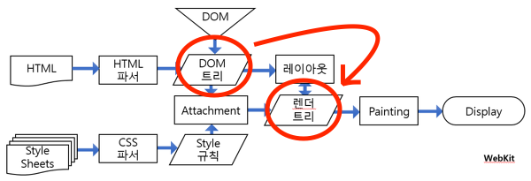

```toc
exclude: Table of Contents
from-heading: 1
to-heading: 5
```

# 0. 기존의 자바스크립트 문제점

앞선 포스트에서 javascript 로 브라우저의 window 객체, document 객체, 더 나아가 그 하위 element 등 (포괄해서 DOM) 에 접근하는 방법에 관해 알아봤다.

- [자바스크립트 X 브라우저 -1 (window)](https://taeny.dev/javascript/3%EC%9E%90%EB%B0%94%EC%8A%A4%ED%81%AC%EB%A6%BD%ED%8A%B8x%EB%B8%8C%EB%9D%BC%EC%9A%B0%EC%A0%801/)

- [자바스크립트 X 브라우저 -2 (document)](https://taeny.dev/javascript/4%EC%9E%90%EB%B0%94%EC%8A%A4%ED%81%AC%EB%A6%BD%ED%8A%B8x%EB%B8%8C%EB%9D%BC%EC%9A%B0%EC%A0%802/)

근데, 프로그램이 커질수록 DOM tree도 복잡해지고 여러 문제점들이 발생한다.

## 0-1. DOM 조작 코드 복잡해짐

```javascript
const state = '바뀐이름'
const name = document.getElementById('change_name')
const btn = document.getElementById('change_name_btn')

btn.onclick = function() {
  name.innerText = state
}
```

위의 코드는 간단하지만, 이러한 코드가 엄청 많아지고 DOM 조작에 필요한 상태(state)들도 많이 생기고, 심지어 DOM과 DOM끼리 상태를 주고받아야하는 상황이 온다면 코드를 관리하기가 무지무지 힘들어진다. (가능은 하겠지만)

> 기존의 DOM 조작을 간편하고 쉽게 해주는 `제이쿼리` 라이브러리를 사용하여도 한계가 있다.

> 새로운 리액트 문법(jsx)로 이어짐.(상태관리 쉽고 코드를 보기쉽고 관리하기 쉽게)

## 0-2. DOM 관리의 어려움

```html
<div>
  <div>
    <div>
      <!-- div 무한의계단-->
    </div>
  </div>
</div>
```

프로그램이 커지고 무수한 DOM element들이 생성되었을 때, DOM 조작은 둘째치고 각각의 element들이 어떤 기능을 하고있는지 파악하거나, 어디에 있는지 찾는 것이 정말 힘들어진다.

> 컴포넌트로 이어짐(코드스플리팅)

## 0-3. 성능의 문제

위와 마찬가지 이유로 프로그램이 커지고 DOM 트리의 요소들이 많아졌을 때, DOM에 접근하고 조작하는 것에서 치명적인 비효율 문제가 발생한다.



위의 그림처럼 브라우저는 수많은 DOM 조작으로 바뀐 DOM tree를 Render tree로 바꾸는 작업을 바뀔 때마다 계속 수행해야 한다.

그럼 브라우저의 렌더링 엔진에 무리가 가거나 사용자에게 bad experience를 줄 수도 있다.

> virtual DOM 으로 이어짐

# 1. 리액트?

`리액트`

사용자 인터페이스를 구축하기 위한 선언적이고 효율적이며 유연한 JavaScript **라이브러리**

**SPA** 를 만드는데 주로 사용된다.

`프레임워크 vs 라이브러리`

> 프레임워크와 라이브러리의 차이 : 둘다 개발에 필요한 인터페이스들을 포함하는 도구들이지만, **프레임워크**가 좀더 틀, 지켜야할 규칙이 명확하고 **라이브러리**는 그에 반해 좀 더 자유롭다.

`SPA (Single Page Application)`

> 서버로부터 완전한 새로운 페이지를 불러오지 않고 현재의 페이지를 동적으로 다시 작성함으로써 사용자와 소통하는 웹 애플리케이션이나 웹사이트를 말한다.

> 사용자와 서비스 사이의 인터렉션(`슈퍼매직`)이 많은 어플리케이션에서 DOM 렌더링을 서버사이드에서 하면 비효율적이다. (요청,,요청,,응답,,응답)

> 초기에 필요한 리소스들을 모두 요청해 DOM변화에 따른 렌더링을 클라이언트측에서 하는 방식의 어플리케이션을 **SPA**라 한다.

## 1-1. 리액트 라이브러리 설치

### 1. CDN 설치

html 에 javascript 태그를 통해 리액트를 설치할 수 있다.

```html
<!--react와 react-dom 스크립트 태그 추가-->
<script
  crossorigin
  src="https://unpkg.com/react@16/umd/react.development.js"
></script>
<script
  crossorigin
  src="https://unpkg.com/react-dom@16/umd/react-dom.development.js"
></script>

<!--dom 컨테이너 추가-->
<!--virtual dom에 관해서는 밑에서,,,-->
<div id="virtual_dom"></div>
```

`CDN`

###### :hatched_chick: CDN 개념 확실히 정립하기!

### 2. npm 설치

npm 으로 패키지매니저로 설치할 수 있다.

```javascript
npm i react react-dom
```

# 2. 리액트.jsx (DOM 조작 코드 간편화)

리액트는 jsx라고 기존의 javascript를 확장한 문법을 사용한다.

jsx를 한문장으로 정리해보았다.

> javascript 파일 안에 DOM element 태그(\<div\>) 를 넣어 간편하고 직관적인 DOM조작을 가능하게 한 리액트 문법

DOM 조작이 많이 일어나는 SPA 환경일 경우, jsx는 개발자에게 좋은 환경을 제공한다.

> 리액트의 jsx는 `개발자`에게, virtual DOM 은 `사용자`에게 큰 선물:gift:이다.

# 3. 컴포넌트

위에서 말했듯이, 리액트는 javascript 파일 내에서 태그를 사용하고, DOM을 트리생성한다.

그리고 이 파편적인 DOM tree의 root 객체를 `컴포넌트`라고 한다.

## 3-1. 컴포넌트 작성방식 1 - OOP

`OOP(객체지향프로그래밍) 특징`

> **캡슐화** : 재사용 될만한 상태나 메소드들을 class에 저장해두고 사용할 때 마다 불러올 수 있게 함.이렇게 작성한 코드들은 은닉성을 띈다.

> **객체** : 이렇게 class로 캡슐화된 코드들을 필요할 때마다 복사해서 하나의 데이터(object) 로 사용.

```javascript
//Comp.jsx
// :question: typescript 학습 후 올바르게 import 하는 방법 알아보기
import React, { Component } from 'react'

class Comp extends Component {
  state = {}
  render() {
    return <div>// ...</div>
  }
}

// :star: 모듈화
export default Comp
```

이렇게 class 형식으로 컴포넌트를 정의 한 후, 다른곳에서 import 하는 방식으로 재사용할 수 있다.

`모듈화`

> 작성된 컴포넌트는 **export default** ES6 방식으로 모듈화되서 재사용될 수 있다.

> default export 를 통해 import 시, {}를 쓰지 않아도 되며, 자신이 원하는 이름으로 import 가능하다.

[모듈시스템>ES6](https://taeny.dev/javascript/5%EC%9E%90%EB%B0%94%EC%8A%A4%ED%81%AC%EB%A6%BD%ED%8A%B8xnodejs1/#4-5-%EC%9E%90%EB%B0%94%EC%8A%A4%ED%81%AC%EB%A6%BD%ED%8A%B8-%EB%AC%B8%EB%B2%95es6)

## 3-2. 컴포넌트 작성방식 2 - 함수형

`함수형 프로그래밍 특징`

> **모듈화** : 함수형 프로그래밍의 핵심. 다른 외부요인에 영향을 받지 않고 자신의 맡은 바를 실행. (=순수함수 : same input -> same output)

> **목적성** : 알고리즘을 명시하는 것 보다 목표(함수)를 명시하는데 중심. (선언형)

> **객체** : 함수도 하나의 객체로서 작용. 적재적소에 해당 함수를 적절한 input과 함께 쓰는 것이 필요하다.

```javascript
import React from 'react'

// :star: 화살표 함수
// :star: 비구조화 할당
const Comp = ({ props }) => {
  return <div></div>
}

export default Comp
```

함수형 컴포넌트는 호출(import 후 해당 컴포넌트 호출) 시 바로 실행시킨다는 특징이 있다.

함수형 컴포넌트는 LifeCycle 메소드나 상태관리(state)가 불가능 하~~다.~~지만 hooks로 가능해졌다.

### 화살표함수

###### :hatched_chick: ES6 학습 후 돌아오기!

### 비구조화할당

###### :hatched_chick: ES6 학습 후 돌아오기!

## 3-3. OOP vs Functional Programming

> 둘은 상반되는 개념이 아니고 하나의 프로그램 방식이다. 공통적으로는 **반복을 줄이고 효율적인 작업**을 위해 생겨났다.

# 4. state, props

컴포넌트는 내부 상태인 state, 자체 속성인 props 를 갖는다.

## 4-1. state

**state**는 해당 컴포넌트의 상태값을 의미한다.

```javascript
// :star: class 문법
class Comp extends Component {
  // :star: 생성자
  constructor(props) {
    // :star: 상속
    super(props)
    // :star: this
    this.state = {
      name: "태니"
    }
  }
```

기본적으로는 이런 모양이다.

## 4-\*. class (ES6)

자바스크립트는 ES6 (ECMAScript6) 이후로 OOP를 쉽게 적용 할 수 있는 class문법을 지원한다.

###### :hatched_chick: ES6 학습 후 돌아오기!

`constructor`

> 생성자로 클래스 객체가 생성되면 클래스 내부 캡슐화된 멤버변수들을 생성한다.

> constructor(props)는

`super`

> 부모 클래스의 constructor를 호출한다.

## 4-\*. this

앞선 포스트에서 자바스크립트의 실행 컨텍스트의 this(호출자) 에 대해서 알아봤다.

this는 객체이며 현재 javascript파일의 호출자이다. 즉, 모듈 혹은 컴포넌트를 호출하면 객체가 생성되며 this에는 해당 객체가 담긴다.

###### :question: this 객체의 state속성은 리액트에서 생긴 개념??

## 4-2. props

**props**는 부모 컴포넌트의 상태를 해당 컴포넌트에게 속성값으로 넘겨주는 역할을 한다.

```javascript
//parent 컴포넌트
class Parent extends Component {
  state = {
    name="태니"
  }
  render() {
    return (
      <Children name={this.state.name} />
    );
  }
}

//Children 컴포넌트
class Children extends Component {
  render() {
    return (
      <div>
        이름 : {this.props.name}
      </div>
    );
  }
}
```

> Children 컴포넌트의 속성인 **name**의 속성값으로 Parent 컴포넌트의 상태를 넣어주면 Chilren 컴포넌트는 자신의 속성 **name** 을 `props`를 통해 접근할 수 있다.

###### :question: this 객체의 props속성은 리액트에서 생긴 개념??

defaultProps

(작성중)
