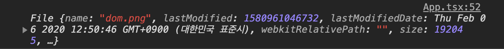
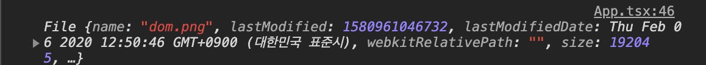
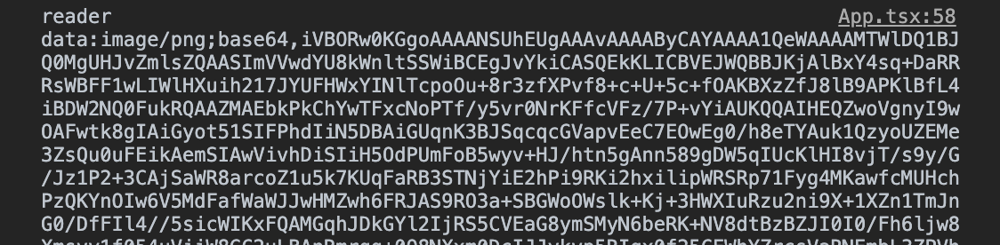

자바스크립트에서 이미지나 동영상, 오디오 등 대용량 파일을 업로드할 때, file 객체를 이용한다. 이번 포스팅에서는 file 객체에 대한 내용을 정리해보았다.

<hr/>

```toc
exclude: Table of Contents
from-heading: 1
to-heading: 2
```

# 1. File 객체

**DOM input 엘리먼트**의 type 프로퍼티의 기본값은 type=text 이다. 이 때, 사용자로부터 입력값을 string 형태로 받는다.그럼 사용자로부터 file을 입력받으려면 어떻게 할까? file을 입력받으려면 input 엘리먼트에 `type=file`로 명시해주면 된다.

사용자가 입력한 파일에 접근하려면 input 엘리먼트에 접근해서 files 프로퍼티를 참조하면 되는데, 직접 DOM에 접근해서 접근할 수도 있고, e.target 을 통하여 onChange 이벤트핸들러를 등록하여 입력받은 값을 가져올 수도 있다.

### 1. 직접 DOM에 접근하는 방법

```jsx
// 리액트 hooks 사용
useEffect(() => {
  const fileElem = document.getElementById('fileInput')
  console.log(fileElem.files)
})

return <input type="file" id="fileInput" />
```

> 🔽 콘솔 출력화면



### 2. [e.target](https://taeny.dev/javascript/4%EC%9E%90%EB%B0%94%EC%8A%A4%ED%81%AC%EB%A6%BD%ED%8A%B8x%EB%B8%8C%EB%9D%BC%EC%9A%B0%EC%A0%802/#6-4-%EC%9D%B4%EB%B2%A4%ED%8A%B8-%EC%86%8D%EC%84%B1)으로 이벤트가 일어난 위치 DOM 접근

```jsx
const handleImage = e => {
  console.log(e.target.files)
}

return <input type="file" id="fileInput" onChange={handleFiles} />
```

> 🔽 콘솔 출력화면



<hr/>

파일을 업로드 한 후, file input 엘리먼트에 접근해서 files 프로퍼티를 출력해보면 `fileList` 라는 객체가 출력되는 것을 볼 수 있다. fileList 객체 프로퍼티는 0,1 ... 형태의 숫자로, 그리고 값에는 File객체가 들어있다. 그래서 files[i] 이런 식으로 i 번째의 file 객체에도 접근이 가능하다.

```
FileList {0: File, length: 1}
```

그럼 `file 객체`는 어떤 형태로 이루어져있을까? 기본적으로 file 객체는 4가지 속성을 가진다. 모든 속성은 읽기전용으로 주어진다.

```js
const file = {
  lastModified: 1580961046732,
  lastModifiedDate: 'Thu Feb 06 2020 12:50:46 GMT+0900 (대한민국 표준시) {}',
  name: 'dom.png',
  size: 192045,
  type: 'image/png',
}
```

<hr/>

1️⃣ **lastModified** : 마지막 수정 날짜 number타입으로 반환 (없을 경우, 현재 시간)

2️⃣ ~~lastModifiedDate~~ : 마지막 수정 날짜 Date객체타입으로 반환 (Deprecated)

> Date 객체타입을 이용하고 싶으면, new Date(lastModified) 방식으로 사용하기!!

3️⃣ **name** : 단순 파일의 이름 string타입으로 반환 (경로는 포함하지 않는다.)

4️⃣ **size** : 64비트 정수의 바이트 단위 파일의 크기 number타입으로 반환

> 해당파일은 192KB 크기임을 알 수 있다.

5️⃣ **type** : 문자열인 파일의 `MIME` 타입 string타입으로 반환

> MIME 타입의 형태는 type/subtype 의 구조를 가지며, 다음과 같은 형태로 쓰인다.

```
text/plain
text/html
image/jpeg
image/png
audio/mpeg
video/mp4
...
```

# 2. URL로 접근

위에서는 사용자가 입력한 File객체에 대한 정보를 얻는 방법에 대해서 알아보았다. 그럼 File 객체의 실제 데이터에는 어떻게 접근할까?

먼저 file 객체 URL을 생성해서 해당 file에 접근하는 방법이 있다. 이 방법은 window 브라우저 전역객체의 URL 속성의 메소드를 사용하면 된다.

```js
const img = document.createElement('img')
img.src = window.URL.createObjectURL(files[0])
img.onload = function() {
  window.URL.revokeObjectURL(this.src)
}
```

<hr/>

1️⃣ **createObjectURL()** : 인자로 File객체를 받으며, 해당 file의 고유 URL 정보 생성하고 반환한다.

2️⃣ **revokeObjectURL()** : file이 로드가 완료되었을 시, 더이상 URL정보는 사용되지 않기 때문에 메모리 누수를 막기 위해 해체해주어야 한다.

<hr/>

URL로 접근 하는 경우, 주요 특징으로는

**🍎. URL을 생성하는 것이기 때문에 동기적으로 실행되며 시간이 빠르다.**

**🍎. 하지만 URL이 사용되었으면 수동적으로 해체해주어야하는 단점이 있다.**

# 3. FileReader로 접근

또다른 방법은 FileReader 객체를 사용하는 것인데, FileReader 객체는 비동기적으로 file을 읽고 저장하는 것을 가능하게 해준다.

위의 URL로 접근하는 방법과 비교했을 때, 이러한 특징을 가진다.

**🍎. 비동기적으로 실제 file의 데이터를 읽기 때문에, 시간이 느리고 메모리 사용량도 높다.**

**🍎. 하지만 수동으로 해체하지 않아도 된다.(가비지 컬렉터에 의해 자동으로 해체)**

FileReader 객체의 메소드는 5가지가 존재한다.

<hr/>

1️⃣ **FileReader.abort()** : 파일 읽기를 중단함.

2️⃣ **FileReader.readAsArrayBuffer()** : 파일을 읽고, result속성에 파일의 ArrayBuffer 형태를 저장.

> 데이터를 일정한 크기로 잘라 서버로 보낼 때 사용.

3️⃣ **FileReader.readAsBinaryString()** : 파일을 읽고, result속성에 파일의 원시 이진 데이터 형태를 저장.

4️⃣ **FileReader.readAsDataURL()** : 파일을 읽고, result속성에 파일을 나타내는 URL을 저장.

5️⃣ **FileReader.readAsText()** : 파일을 읽고, result속성에 파일의 텍스트 문자열 형태를 저장.

<hr/>

그리고 FileReader는 비동기 매커니즘을 사용하기 때문에, 이벤트핸들러를 등록하여 사용할 수도 있다. 총 6개의 이벤트핸들러를 사용할 수 있다.

1️⃣ **FileReader.onabort** : 읽기 중단 시, 트리거 됨.

2️⃣ **FileReader.onerror** : 읽는 도중 오류 발생시, 트리거 됨.

3️⃣ **FileReader.onload** : 읽기 완료 시(성공만), 트리거 됨.

4️⃣ **FileReader.onloadstart** : 읽기 시작 시, 트리거 됨.

5️⃣ **FileReader.onloadend** : 읽기 완료 시(성공,실패), 트리거 됨.

6️⃣ **FileReader.onprogress** : 읽는 도중, 트리거 됨.

<hr/>

이러한 이벤트핸들러와 메소드를 이용해서, 파일의 실제 데이터에 접근하는 방법은 다음과 같다.

```js
const reader = new FileReader()

reader.onload = (event: any) => {
  console.log('reader', event.target.result)
}
reader.readAsDataURL(e.target.files[0])
```

코드의 흐름은 다음과 같다. "FileReader 객체 인스턴스 reader를 생성 > onload 이벤트 핸들러 등록 > readAsDataURL() 메소드를 사용해서 해당 파일을 읽음 > onload 이벤트 핸들러 트리거 됨 > 해당 파일의 result 속성값 출력



> 실제 이러한 값으로 출력되며, img.src 값으로 넣어서 사용도 가능하다. 마찬가지로 올린 파일을 다시 다운로드하는 것도 이러한 data URL을 이용하면 된다.

# 4. Blob 객체

지금까지 File 객체의 읽기전용 속성들과, URL로 접근 혹은 FileReader객체 메소드를 이용해서 접근하는 방법에 대해서 알아보았는데, 그럼 사용자로부터 입력받은 file을 다른 곳으로 전송하려면 어떻게 할까? 이럴 때는 Blob (Binary large object)객체를 이용하면 된다.

사실 File 인터페이스도 사용자에게 file의 형태를 입력값으로 받기 위해서 Blob 인터페이스를 확장한 것이고, 모든 blob 기능을 상속한다. 그래서 blob객체도 file객체와 비슷한 형태를 가진다.

```js
console.log(e.target.files[0] instanceof File) // true
console.log(e.target.files[0] instanceof Blob) // true
```

blob은 file객체의 name, lastModified 속성이 없고 size와 type(MIME)속성만 갖는다.

```js
const blob = {
  //   lastModified: 1580961046732,
  //   lastModifiedDate: 'Thu Feb 06 2020 12:50:46 GMT+0900 (대한민국 표준시) {}',
  //   name: 'dom.png',
  size: 192045,
  type: 'image/png',
}
```

그럼 어떻게 blob객체를 생성해서 다른 곳으로 전송할까?

위에서 File객체의 실제 데이터에 **FileReader.readAsDataURL()**를 통하여 접근했을 때, 이런식의 URL 값이 출력되는 것을 확인할 수 있었다.


이러한 URL형태를 기반으로 새로운 blob 인스턴스를 생성해서 다른 곳으로 전송하면 된다.

[[코드 출처 : 필오님 블로그](https://feel5ny.github.io/2018/05/27/JS_12/)]

> 코드가 깔끔해서 이해하기 쉬웠다.

```js
const dataURLToBlob = dataURL => {
  const BASE64_MARKER = ';base64,'

  // base64로 인코딩 되어있지 않을 경우
  if (dataURL.indexOf(BASE64_MARKER) === -1) {
    const parts = dataURL.split(',')
    const contentType = parts[0].split(':')[1]
    const raw = parts[1]
    return new Blob([raw], {
      type: contentType,
    })
  }
  // base64로 인코딩 된 이진데이터일 경우
  const parts = dataURL.split(BASE64_MARKER)
  const contentType = parts[0].split(':')[1]
  const raw = window.atob(parts[1])
  // atob()는 Base64를 디코딩하는 메서드
  const rawLength = raw.length
  // 부호 없는 1byte 정수 배열을 생성
  const uInt8Array = new Uint8Array(rawLength) // 길이만 지정된 배열
  let i = 0
  while (i < rawLength) {
    uInt8Array[i] = raw.charCodeAt(i)
    i++
  }
  return new Blob([uInt8Array], {
    type: contentType,
  })
}
```

# 5. 마치며

이번 포스팅으로 사용자가 입력한 file을 접근하는 방법을 두가지로 알아보았고, 다시 재전송될 수 있는 blob객체로 만드는 법까지 알아보았다.

프론트엔드는 사용자로 하여금 View에서 넘어오는 action들을 처리하기 때문에, 여러 다양한 이벤트가 발생할 수 있고, 또한 요청하는 데이터의 형태도 다양할 수 있다. 이러한 action을 적절히 처리하는 것도 프론트엔드 개발자의 역량 중 하나가 아닐까 다시한번 생각해보았다.

# 6. reference

[https://developer.mozilla.org/ko/docs/Web/API/File](https://developer.mozilla.org/ko/docs/Web/API/File)

[https://stackoverflow.com/questions/31742072/filereader-vs-window-url-createobjecturl](https://stackoverflow.com/questions/31742072/filereader-vs-window-url-createobjecturl)

[https://developer.mozilla.org/ko/docs/Web/API/Blob](https://developer.mozilla.org/ko/docs/Web/API/Blob)

[https://feel5ny.github.io/2018/05/27/JS_12/](https://feel5ny.github.io/2018/05/27/JS_12/)
