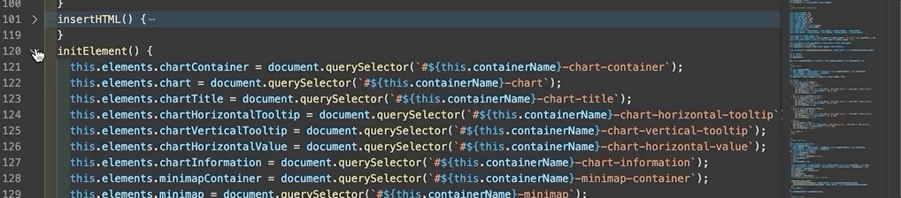
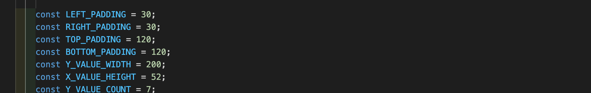
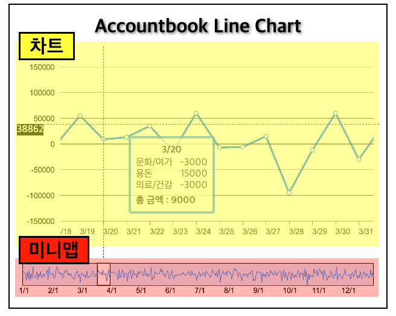

[부스트캠프](https://boostcamp.connect.or.kr/) 학습스프린트 마지막 미션에는 라이브러리를 사용하지 않고 차트를 구현하는 내용이 있었다. **canvas** 와 **svg** 중에 선택해서 구현하는 것이었는데 이번 기회에 둘다 써보고 직접 라이브러리로 만들어보자! 라는 개인적인 욕심이 생겼다. 그렇게 [Interactive-chart](https://github.com/taenykim/interactive-chart) 라는 라이브러리 제작을 완료하였고 만들면서 습득한 것을 공유해보고자 한다.

> 지식보다는 경험의 의존하므로 정보가 주관적일 수 있습니다. 틀린 정보 제보는 언제나 환영입니다!

# Table of Contents

```toc
exclude: Table of Contents
from-heading: 1
to-heading: 1
```

# 1. canvas vs svg

canvas와 svg의 차이점과 각각 어떤 경우에 써야하는지는 인터넷에 정말 많이 퍼져있지만 글 서두에도 언급했듯, 경험으로 의존해서 내 생각을 적어보려한다.

먼저 canvas는 하나의 image이기 때문에 그려야할 데이터가 엄~청 많거나 인터랙션이 자주 발생할 경우 적합하다. 예를들어, 주식차트처럼 몇년치 데이터가 화면에 다 표시되어야할 경우, 몇 천개의 element를 만드는 것보다 하나의 엘리먼트에 픽셀로 표시하는 것이 효율적일 것이다.

그리고 svg의 경우, 벡터그래픽이기 때문에 엘리어싱이 일어나지 않는다. 그래서 원이나 곡선같은 도형을 그릴 때 적합하고, JavaScript로 element를 접근할 수 있기 때문에 색상을 바꾸거나 크기를 키우거나 변형 작업을 하기도 용이하다.

나는 이러한 특성을 반영해 전체 데이터를 모두 보여주는 **Line Chart**에는 `canvas`를, 카테고리별 퍼센트데이터를 원형으로 보여주는 **Pie Chart**에는 `svg`를 사용하기로 결정하였다.

# 2. Line Chart class 설계

우선 Line Chart를 객체로 추상화시키고 데이터를 가져오거나 canvas에 그림을 그리는 과정들을 메소드로 하나하나 만들어주었다.

### 1. constructor

```ts
export default class Line {
  constructor(chartProps: ChartProps) {
    this.initProps(chartProps)
    this.insertHTML()
    this.initElement()
    this.initStyle()
    this.initChart()
    this.initMinimap()
    this.drawChart(this.moveX)
    this.drawMinimap(this.moveX)
    this.addEventListener()
  }
  ...
}
```

Line Class가 인스턴스화되면 동기적으로 총 9번의 메소드를 실행하게 하였다. 처음부터 이렇게 설계한 건 아니고, 코드가 길어지면서 관리하기 쉽게 메소드로 역할을 나눠주었다.

점점 메소드 내의 코드도 길어졌는데, 메소드를 화면에 보이지 않도록 접어둘 수가 있는 **vscode 접기기능**을 이용하니까 그다지 작업이 어렵지는 않았다.



### 2. initProps

> Props를 가져와 차트 데이터에 맞게 변환

initProps에서는 Props에 넘어온 정보들을 실제 차트 field로 넣어주는 단계로, selector명이나, 차트이름, Props 에 넘어온 data를 차트가 그리기 쉬운 데이터형식으로 변환해서 field에 저장해주었다.

### 3. insertHTML

> 필요한 element 생성 및 삽입

필요한 엘리먼트들을 문자열로 root 엘리먼트에 삽입해주었다. 엘리먼트들은 나중에 인터랙션을 위해서 고유의 selector를 가져야했는데 Props로 넘어온 root 선택자 이름과 템플릿 리터럴을 이용해서 고유의 selector를 만들어주었다.

### 4. initElement

> element에 접근해서 this.elements에 저장

나중에 element에 접근하기 쉽고 다시 탐색하는 불필요한 작업을 하기 싫어서 한꺼번에 elements에 저장해주었다.

### 5. initStyle

> element들에 스타일 부여

element 스타일은 모두 인라인 스타일로 적용해주었다. 우선은 선택자가 사용자가 입력한 선택자 이름에 맞게 만들어지기 때문에 CSS로 작업하기 애매했고, 인라인으로 하면 선택자 중복으로 인한 에러가 발생할 확률도 적어서 element.style을 이용해서 스타일을 적용해주었다.

### 6. initChart, initMinimap

> 차트, 미니맵 관련 크기 정보 초기화

canvas 엘리먼트에 width, height를 지정해주는 작업과 canvas의 실제크기 (DOM 크기)를 계산해서 저장해주는 작업을 수행하였다.

### 7. drawChart, drawMinimap

> 실제 드로잉

canvas.getContext('2d')를 이용해서 실제로 그림을 그리는 메소드.

### 8. addEventListener

> 차트 이벤트리스너 추가

마우스 이동부터 드래그까지 사용하는 모든 이벤트 핸들러를 여기서 등록해주었다.

### #. 설계 셀프피드백

9단계로 나누긴했지만 코드가 길어지고 덩치가 커지면서 코드를 수정하기 불편해졌다. 그래도 커버할 수 있는 수준의 작업이어서 하나의 파일로 작업을 하긴 했지만, draw부분이나 event부분은 따로 파일을 분리해서 관리하는 게 좋을 것 같다.

또한, 상수들도 전역으로 빼주면 더 좋을 텐데, 메소드 내에서 선언하였다. 그리고 곳곳에 매직넘버도.. 아직 존재한다. 😅



> 👆 drawChart 메소드에서 변수들이 선언되고 있다..(ㅠ)

프로젝트 전체 데드라인이 2주였고, 그 안에 라이브러리까지 만들어서 적용까지 했어야해서, 구현위주로 진행했고 성능은 하나도 고려를 못했다. (ㅠㅠ x100) 근데 구현자체가 목표였고, 내가 생각한 디자인 그대로 만든 것 같아서 만족한다!

# 3. LineChart(canvas)를 만들며 배운것들

이번에 Line Chart를 만들면서 canvas에 대해서도 더 많이 알게 되어서 좋았다.

### 1. canvas.width와 canvas.style.width는 같을까?

canvas도 이미지인지라 실제크기와 해상도가 별도로 존재했다. canvas의 width,height 속성은 해상도를 의미하고, canvas 엘리먼트의 style값의 width는 실제크기를 의미한다. 기본 해상도는 300 x 150이며, 고해상도의 그림을 그리려면 별도로 width, height를 부여해주어야한다.

> svg도 테스트해봤는데 벡터라 그런지 width와 style.width가 오버라이딩 되면서 하나만 적용되었다.

### 2. canvas는 프레임 작업을 직접 해줘야함

DOM의 경우 translate나 scale같은 애니메이션 작업을 하면 선택된 엘리먼트만 변화하고 배경(나머지 엘리먼트들)에는 영향을 주지 않는다. 즉 브라우저가 변경된 엘리먼트만 변경되도록 자동으로 해주지만, canvas는 애니메이션할 경우, 배경을 덮어씌워 영향을 줘버린다. 그렇기 때문에 배경을 기억해서 다시 그려준다던지 해줘야한다.

> 실제로 canvas API에는 save, restore로 상태를 스택으로 저장해둘 수 있다.

### 3. 비례식

이번 Line Chart의 경우 비례식이 되게 많이 쓰였다. 예를들어, 차트를 클릭하고 마우스를 조금 움직였을 때, 실제 마우스가 움직인 거리를 실제 차트의 해상도의 비율로 바꿔줘야했고, 미니맵도 바꿔줘야해서 미니맵의 해상도의 비율로도 바꿔줘야했다. 근데 차트와 미니맵은 모두 canvas 내부의 자체 패딩을 가지고 있어서 얘네들도 다 계산해주어야했다.



> 차트와 미니맵이 서로 바인딩되어있어서 차트에서 일어난 이벤트는 미니맵에도 적용되고, 미니맵에 적용된 이벤트는 차트에도 적용된다.

처음에는 하나하나 계산하다가 내 머리의 한계를 느끼고 따로 유틸함수로 빼서 계산이 필요할 때마다 함수를 불러서 써주었다. 역시, 바퀴를 계속 발명할 필요가 없는데 괜한 고생을 계속 했었던 것 같았다.ㅠ

```ts
// 직접 만들어본 resize utils
export const trueLengthToCanvasLength = (trueLength, canvasSize, trueSize) => {
  return (trueLength * canvasSize) / trueSize
}

export const canvasLengthToTrueLength = (
  canvasLength,
  canvasSize,
  trueSize
) => {
  return (canvasLength / canvasSize) * trueSize
}

export const chartLengthToMinimapLength = (
  chartLength,
  chartSize,
  minimapSize,
  visibleRatio
) => {
  return chartLength * (minimapSize / chartSize) * visibleRatio
}

export const minimapLengthToChartLength = (
  minimapLength,
  chartSize,
  minimapSize,
  visibleRatio
) => {
  return ((minimapLength / minimapSize) * chartSize) / visibleRatio
}
```

> 계속 수학적인 계산을 할 필요없이, 유틸함수를 만들어두면 함수명과 파라미터만 적절히 넣어주기만 하면 된다.

# 4. 프로젝트 복기하면서 느낀점

예전 나의 프로젝트를 복기하면서 제일 많이 느꼈던 점은 시간이 지나면 내가 쓴 코드도 까먹는다는 점이었다..!! 라이브러리를 만들 때는 기간도 짧게 잡고 모든 정신이 거기에 몰입이 되어있어서 하루가 지나서 다시 코드를 봐도 다 이해하고, 버그를 수정할 때도 어딜 고쳐야할지 바로바로 나왔는데, 두달이 지난 지금보니까 내가 짠 코드였어도 읽는데 시간이 꽤 걸렸다. 코드를 잘 못짜서 그런 것일수도 있는데 어쨋든 인간은 망각의 동물이니까 프로젝트진행 중이나 혹은 마무리하는 시점에, 꼭 복기하면서 문서화해두는 게 좋다는 생각이 들었다.

선배개발자분도 프로젝트를 할 때, 인수인계를 염두에 두고 작업하는 것이 좋다고 말씀해주셨는데 그 말씀의 의도를 확실히 이해할 수 있었다.

> 프로젝트 복기, 문서정리는 타인이 아니여도 미래의 나에게로의 인수인계를 위해서도 꼭! 해주자. 👍

급하게 만들어서 아쉬운점도 많고 개선점도 너무너무 많이 보이지만, 기존에 있는 차트 라이브러리를 사용하지 않고 직접 canvas와 svg를 사용해서 차트를 만든 경험은 canvas, svg에 대한 공포(?)를 줄여주었고, 앞으로 canvas나 svg를 쓸 일이 있을 때, 큰 도움이 될 것 같다!!

---

PS. 이번 글에서는 canvas를 이용한 Line Chart만 다뤘지만, 다음에는 svg를 이용한 Pie Chart에 대해서 배운 내용을 정리해봐야겠다.! (복기를 미리미리 해두자!😂)
