여러 기능들을 구현하는 연습을 하기위해서 [소마법 프로젝트](https://github.com/taenykim/small-magic-project)라는 것을 하고 있다. 배포는 Vercel을 이용했었는데 어느순간, Vercel이 내 프로젝트와 맞지 않다는 것을 깨닫게 되었다. 그래서 다른 배포 플랫폼으로 이전할 겸, 서버리스에 대한 개념을 알아보고 대표적인 3개의 배포 플랫폼을 `Netlify`, `Vercel`, `Github page` 모두 사용해보며 비교해보기로 했다.

> ✏️ Vercel 배포시, 빌드명령어를 잘못 넣어주어서 생긴 나의 잘못된 생각이었다. Vercel 미안해유.. [관련아티클로 이동](#%EF%B8%8F-serverless-functions-관련-추가)

> [Vercel](https://vercel.com/blog/zeit-is-now-vercel)은 기존에는 zeit now였었는데, '2020년 4월 21일'부터 **zeit**에서 Vercel로 브랜드 네임을 바꿨다.

> 현재 진행중인 [소마법 프로젝트 배포용](https://github.com/taenykim/small-magic-project-deployment)에 대한 배포를 기준으로 알아보았으며, 프로젝트마다, 사람마다 선호하는 방식이 다를 수 있다.

<hr/>

```toc
exclude: Table of Contents
from-heading: 1
to-heading: 1
```

# \#. Source

> 배포할 프로젝트 메인화면

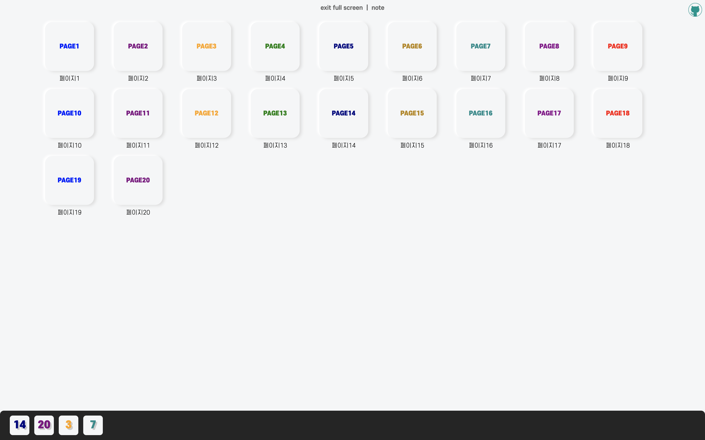

<details open>
<summary>배포된 사이트링크[접기/펼치기]</summary>
<div markdown="1">

- Github page : [https://taenykim.github.io/small-magic-project-deployment/](https://taenykim.github.io/small-magic-project-deployment/)

- Netlify : [https://small-magic-project-deployment.netlify.app/](https://small-magic-project-deployment.netlify.app/)

- Vercel : [https://small-magic-project-deployment.now.sh/](https://small-magic-project-deployment.now.sh/)

</div>
</details>

<details>
<summary>깃허브 소스[접기/펼치기]</summary>
<div markdown="1">

- [taenykim/small-magic-project-deployment](https://github.com/taenykim/small-magic-project-deployment)

</div>
</details>

# 1. nextJS란?

**nextJS**는 `리액트 프레임워크` 로 매우 편리한 라우팅시스템과 서버사이드렌더링(SSR)을 지원한다.

> 나는 개인 프로젝트를 할 때, 라우팅이 필요없는 어플리케이션이어도 프로젝트가 확장될 경우를 미리 대비하여 **nextJS** 프레임워크를 사용한다.

nextJS의 Routing system은 프로젝트 pages 디렉토리에서 이루어진다.

[참고 : nextJS 관련포스팅](https://taeny.dev/javascript/17%EC%9E%90%EB%B0%94%EC%8A%A4%ED%81%AC%EB%A6%BD%ED%8A%B8x%EB%A6%AC%EC%95%A1%ED%8A%B8xnext/)

```
root
├── components
├── pages
│   ├── _app.jsx
│   ├── _document.jsx
│   ├── index.jsx
│   ├── page1.jsx
│   ├── page2.jsx
│   ├── page3.jsx
│   ├── page4.jsx
...
```

next 프레임워크의 주소 체계에서 `'/'` 즉, 해당 프로그램의 homepage는 기본적으로 `index.js`를 실행한다.

그리고 pages 안에 디렉토리를 넣거나 jsx 파일 (정확히는 리액트 컴포넌트)을 넣으면 next 프레임워크에서 이를 반영해 자동으로 routing system을 구축해준다.

> pages/page1.jsx => sitename.com/page1

> pages/page2.jsx => sitename.com/page2

이처럼 nextJS 프레임워크는 프로젝트의 라우팅을 직관적이고 편리하게 관리할 수 있다.

# 2. 서버리스 배포플랫폼

그럼 이러한 nextJS로 만들어진 웹사이트를 어떻게 배포할까?

과거에는 웹사이트를 배포할 때, 작성된 프로그램을 돌리는 서버를 두고, 직접 하드웨어나 운영체제 그외의 모든 부분들을 직접 관리했어야 했다. 그렇기 때문에 간단한 웹사이트를 배포하기 위해서도 비용과 시간이 많이 들었다.

그러다 AWS나 Azure같은 클라우드 컴퓨팅 서비스가 등장하게 되고 서버 인프라들을 공급업체에서 관리하고 사용자는 보다 쉽게 웹사이트를 배포할 수 있게 되었다. 이러한 방식을 `IaaS` (Infrastructure as a Service)라고 한다.

더 나아가 서버리스라는 개념도 등장했는데, 위의 IaaS처럼 서버를 관리할 필요도 없이 클라우드 제공업체에 리소스(프로그램)만 할당하면 바로 프로덕션 환경으로 배포할 수 있게 되었다. 서버리스는 **서버가 없다는 의미**가 아니라 개발자에게 서버 인프라 구성의 부담을 덜고 코드에 집중할 수 있기 때문에 **서버를 생각할 필요가 없다는 의미**로서 쓰이는 것 같다.

Netlify 와 Vercel 가 바로 서버리스 플랫폼이다. 정확히 말하면 AWS lambda를 기반으로 하는 `FaaS` (Functions as a Service) 플랫폼이다. IaaS의 경우에는 서버 인프라를 구성하고 웹사이트를 배포하면 24시간 그 코드가 돌아가지만, FaaS 는 프로젝트를 여러개의 함수로 쪼개서 매우 거대하고 분산된 컴퓨팅 자원에 함수를 등록하고, 이 함수들이 실행되는 횟수 (그리고 실행된 시간) 만큼 비용을 내는 방식을 말한다. [서버리스 아키텍쳐란?](https://velopert.com/3543)

> ✏️ 추가로 Netlify 와 Vercel은 Lambda 뿐만 아니라 백엔드 기능도 제공해서 리소스를 접근하기도 쉽다.

그럼 두 개의 서버리스 플랫폼과 추가로 깃헙페이지까지 어떤 차이점이 있을까?

# 3. Netlify vs Vercel

> Overview (무료 기준)

|                               | Netlify      | Vercel             |
| ----------------------------- | ------------ | ------------------ |
| 메모리 제한                   | 1024 MB      | 1024 MB            |
| 실행시간 제한                 | 10s          | 10s                |
| 페이로드                      | 6 MB         | 5 MB               |
| bandwidth                     | 100GB/month  | 100GB/month        |
| Extra bandwidth               | \$20/100GB   | Pro 등록(월별요금) |
| Builds/day                    | ~~제한없음~~ | 100개              |
| ㄴExtra Builds                | ~~제한없음~~ | Pro 등록(월별요금) |
| Build minutes                 | 300m/month   | ~~제한없음~~       |
| ㄴExtra build minutes         | \$7/500m     | ~~제한없음~~       |
| Serverless Functions 개수제한 | ~~제한없음~~ | 12                 |
| Serverless Function 크기제한  | ~~제한없음~~ | 50 MB.             |

아직 학생인 나는 과금이 들어가는 부분은 쳐다도보지 않고 무료 사용자 기준의 스펙,제한만 비교해보았다.

> 공부용으로 만든 AWS 계정에서 이것저것 눌러보다 1만 5천원을 빼앗긴 아픈 기억이 있다..

> 해당 스펙은 변경될 수 있다. (현재 2020.4.24 기준)

<hr/>

## 메모리 제한 / 실행시간 제한 / 페이로드

메모리, 실행시간, 페이로드는 두 플랫폼이 비슷한 제한을 두고 있었다. AWS lambda를 기반으로 하는 FaaS 플랫폼이기 때문에 lambda함수의 형태로 계산된다.

## bandwidth

bandwidth 는 기본적으로 두 플랫폼 모두 100GB/month 이지만, Netlify의 경우 100GB당 \$20로 추가 구매를 할 수 있지만, Vercel의 경우 월별 요금제로 등록해야만 제한을 늘릴 수 있다.

## Builds/day

하루 당 빌드 개수 제한은 `Vercel`에만 있는 조건인데, 무료 사용자의 경우 하루의 100개 이하의 빌드를 할 수 있다.

## Build minutes

빌드 시간은 `Netlify`에만 있는 조건이다. 한달에 빌드에 걸린 시간 300분 제한이 있다.

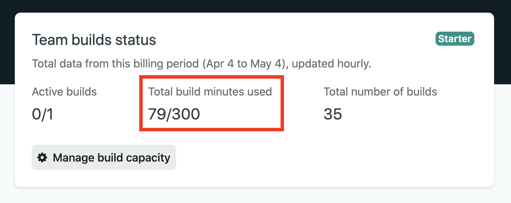

> 이 블로그도 Netlify를 이용햇는데, 내 계정을 들어가 확인해보니 현재까지 79분 사용했다고 나와있었다.

## Serverless Functions 개수/크기제한

serverless function은 실제 서버사이드에서 렌더링 되는 함수를 의미한다. 즉, nextJS에서의 pages들을 의미한다. `Vercel`의 경우, 이러한 serverless function을 12개로 제한한다. 또한 50MB를 넘어서는 안된다.

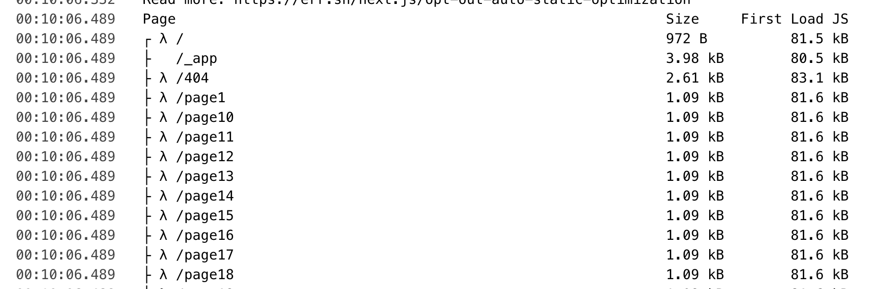

> vercel이 빌드 로그인데 λ 요게 serverless function를 의미한다.

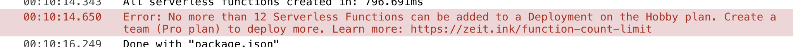

> 12개를 넘으면 빌드를 실패한다.

## ✏️ Serverless Functions 관련 추가

`vercel` 에서 위의 사진 처럼 nextJS 페이지가 11개(404페이지까지 12개)를 넘어가면 Serverless Functions 제한으로 인해 빌드가 안되었다. 근데 Vercel은 nextJS로 export한 Static HTML에서 대해서는 Serverless Functions로 카운트 하지 않는다고 공식문서에 언급이 되어있었다.


호스팅옵션을 node 로 할시, **next start**를 사용하지만, static HTML 배포시에는 **next export**를 해야한다. 즉 vercel 배포시, 배포 명령어 커맨드를 `next build` 대신 `next export`를 해주어야한다.

즉, 람다방식이 아니라 정적html 방식으로 바꿔주어야 12개 이상의 페이지를 사용할 수 있다.

[참고링크 : Vercel limit](https://vercel.com/docs/v2/platform/limits?query=limit#)

[참고링크 : nextJS 호스팅 옵션](https://nextjs.org/docs/deployment#other-hosting-options)

vercel Source탭에서 lambda 방식의 페이지인지 정적 html 타입의 페이지인지 확인 할 수 있다.

> 람다방식의 페이지

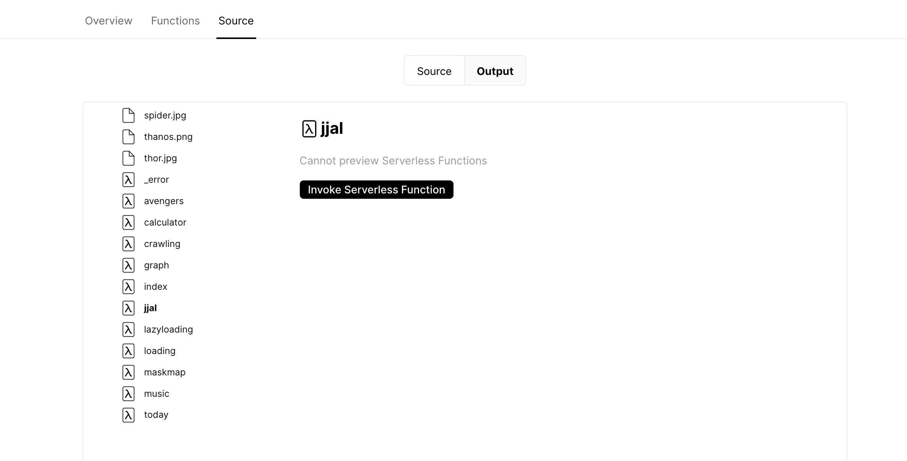

> html방식의 페이지

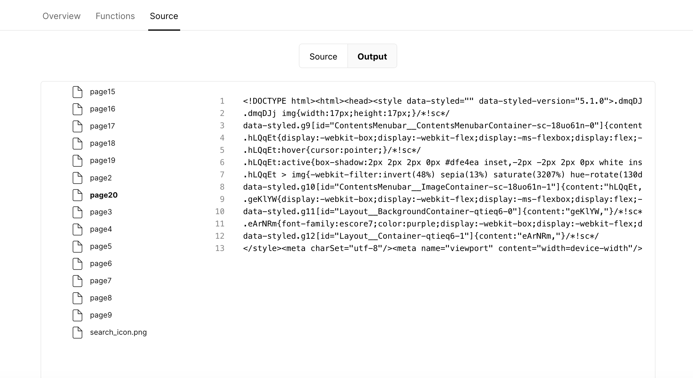

# 4. Faas vs Github page

Github page는 FaaS 플랫폼과 달리

1️⃣ 배포시, 코드를 수정해줘야 한다. (페이지라우팅이나 default Url을 넣어주는 작업)

2️⃣ 커스텀 도메인 과정이 까다롭다.

3️⃣ 앞선 FaaS 플랫폼과 달리 저장소의 크기가 1024MB만 넘지 않게 해주면 된다.

라는 특징이 있다.

[참고링크 : Github page vs Netlify](https://www.netlify.com/github-pages-vs-netlify/)

<hr/>

다음으로 [소마법 프로젝트 배포용](https://github.com/taenykim/small-magic-project-deployment)을 이용해서 각각의 플랫폼별로 모두 배포해보았다.

# 5. 🚀 Github page 배포하기

배포코드의 공식예제는 [zeit/next.js/examples/gh-page](https://github.com/zeit/next.js/tree/canary/examples/gh-pages) 에서, 배포 방법은 [nextjs gh-pages로 배포하기](https://boramyy.github.io/dev/front-end/nextjs/deploy-gh-pages/) 에서 참고했다.

> Github page로 배포한 [소마법 프로젝트 배포용](https://taenykim.github.io/small-magic-project-deployment/)

## 5-1. 스크립트 작성하기

package.json 파일 안의 "script" 속성에 "deploy"하는 명령어를 추가한다.

```json
  "scripts": {
    "dev": "next",
    "build": "next build",
    "start": "next start",
    "deploy": "rm -rf node_modules/.cache && next build && next export && touch out/.nojekyll && git add out/ && git commit -m \"Deploy Next.js to gh-pages\" && git subtree push --prefix out origin gh-pages"
  },
```

1️⃣ **rm -rf node_modules/.cache** : node_modules 캐시제거

2️⃣ **next build** : next 프로젝트 빌드

3️⃣ **next export** : next 프로젝트를 static html앱으로 컴파일한 out/ 폴더를 생성해 줌

4️⃣ **touch out/.nojekyll** : Github page의 [jekyll 처리과정](https://github.blog/2009-12-29-bypassing-jekyll-on-github-pages/)에서 `_next` 이러한 파일을 특수 리소스로 간주하고 최종 사이트에 복사하지 않는데 `.nojekyll` 파일을 만들면 이를 막을 수 있다.

5️⃣ **git add out/** : git add

6️⃣ **git commit -m** : 커밋메시지 작성

7️⃣ **git subtree push --prefix out origin gh-pages** : github 저장소 gh-pages브랜치에 push

```
npm run deploy // 배포명령어
```

## 5-2. next.config.js

next.config.js 파일이 루트 폴더에 없다면 파일을 생성하고 다음과 같은 코드를 넣어준다. name은 깃허브 저장소 이름을 넣어준다.

```js
// next.config.js
const debug = process.env.NODE_ENV !== 'production'
const name = 'small-magic-project-deployment'

module.exports = {
  assetPrefix: !debug ? `/${name}/` : '',
}
```

개발모드에서는 **requestURL=localhost:3000/** 에 리소스를 요청하지만,

배포모드에는 **requestURL = taenykim.github.io/** 에 요청한다.

하지만 배포모드 시, 정상적인 리소스 요청주소는

**requestURL = taenykim.github.io/small-magic-project-deployment**

이기 때문에, assetPrefix 속성을 통해 리소스 요청 주소를 따로 넣어주어야 한다.

<hr/>

## 5-3. env-config.js

env-config.js 파일을 루트 폴더에 만들어주고, `.babelrc.js` 파일 안의 플러그인에 등록해준다.

```js
// env-config.js
const debug = process.env.NODE_ENV !== 'production'
const name = 'small-magic-project-deployment'

module.exports = {
  'process.env.BACKEND_URL': !debug ? `/${name}` : '',
}
```

```js
// .babelrc.js
const env = require('./env-config')

module.exports = {
  presets: ['next/babel'],
  plugins: [['transform-define', env]],
}
```

이 파일을 통해 `process.env.BACKEND_URL` 라는 환경변수를 사용할 수 있다. 이 환경변수는 이미지, 동영상 등의 리소스에 접근하거나 사용자에게 보여지는 URL을 설정할 때 쓰인다. (밑에서 계속)

<hr/>

## 5-4. 이미지 리소스 접근

이미지, 동영상 등의 리소스에 접근할 때도 마찬가지로 위에서 만든 환경변수를 사용해서 `process.env.BACKEND_URL` 리소스에 접근해야 한다.

```jsx
<ImageContainer onClick={storeReset}>
  
</ImageContainer>
```

위에서 언급했듯, /cancle.png 만 적으면,

**requestURL = taenykim.github.io/cancel.png** 에 요청한다.

<hr/>

## 5-5. 사용자에게 보여지는 URL 설정

> nextJS의 페이지 라우팅은 `Link` 를 이용하며, `a`를 사용하는 것과 달리 새로고침이 발생하지 않는다. (싱글페이지 어플리케이션)

Link로 라우팅시, href만 적어줄 경우, 어플리케이션이 동작하는 데에는 무리가 없지만, 사용자에게 보여지는 URL이 이상하게 찍힌다. 즉 as와 위에서 만든 환경변수를 이용해 사용에게 보여지는 URL도 직접 넣어주어야한다.

> as를 넣어주지 않은경우

taenykim.github.io / page1

> as를 넣어준 경우

taenykim.github.io / small - magic - project - deployment / page1

```jsx
const AppIcon = ({ idx }) => {
  const url = `/page${idx}`
  const appIconName = 'PAGE' + idx

  return (
    <Link href={url} as={process.env.BACKEND_URL + url}>
      <a style={{ textDecoration: 'none' }}>
        <AppIconContainer idx={idx}>
          <div>{appIconName}</div>
        </AppIconContainer>
      </a>
    </Link>
  )
}
```

# 6. 🚀 Netlify 배포하기

[netlify](https://www.netlify.com/) 배포방법은 매우 간단하다.

> Netlify로 배포한 [소마법 프로젝트 배포용](https://small-magic-project-deployment.netlify.app/)

## 6-1. 스크립트 작성하기

package.json 파일 안의 "script" 속성에 "deploy"하는 명령어를 추가한다.

> github page 배포와 구분을 두기 위해 "netlify-deploy" 라는 이름으로 작성했다.

```json
 "scripts": {
    "dev": "next",
    "build": "next build",
    "start": "next start",
    "netlify-deploy": "next build && next export"
  },
```

## 6-1. 실제 배포하기

[netlify](https://www.netlify.com/) 사이트에 접속해서 가입 혹은 로그인을 한 후, new site from Git 클릭!

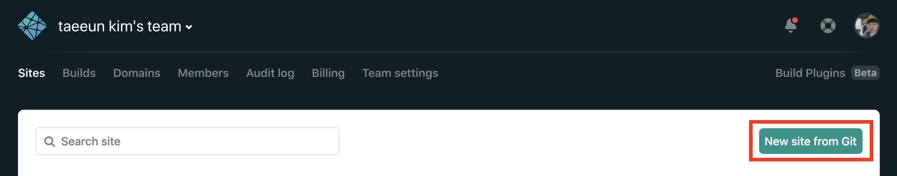

github 클릭

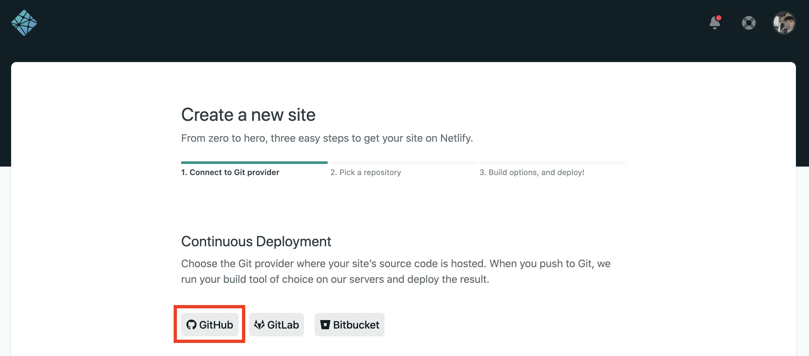

먼저 자신의 github 계정에 netlify 어플리케이션을 설치하고 배포할 프로젝트 repository의 access를 열어주어야 한다. **Configure the Netlify app on GitHub**를 누르면 쉽게 진행할 수 있다.

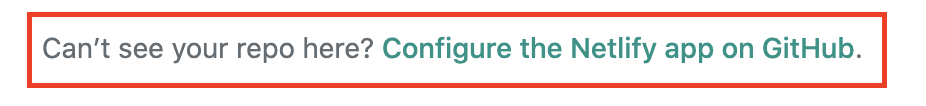

그다음 배포할 프로젝트 repository를 체크해주고 save!

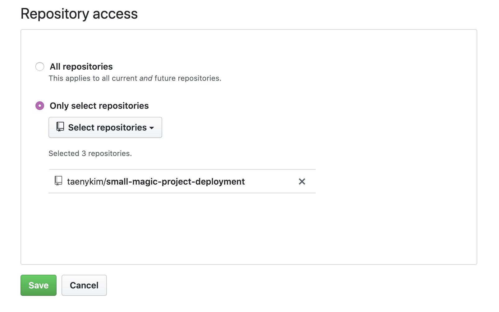

배포시 빌드 명령어와 폴더이름을 설정하여야 하는데, 빌드 명령어는 실제 배포 시, 사용될 명령어를 입력해주고 폴더이름은 아무거나 넣어주어도 된다.

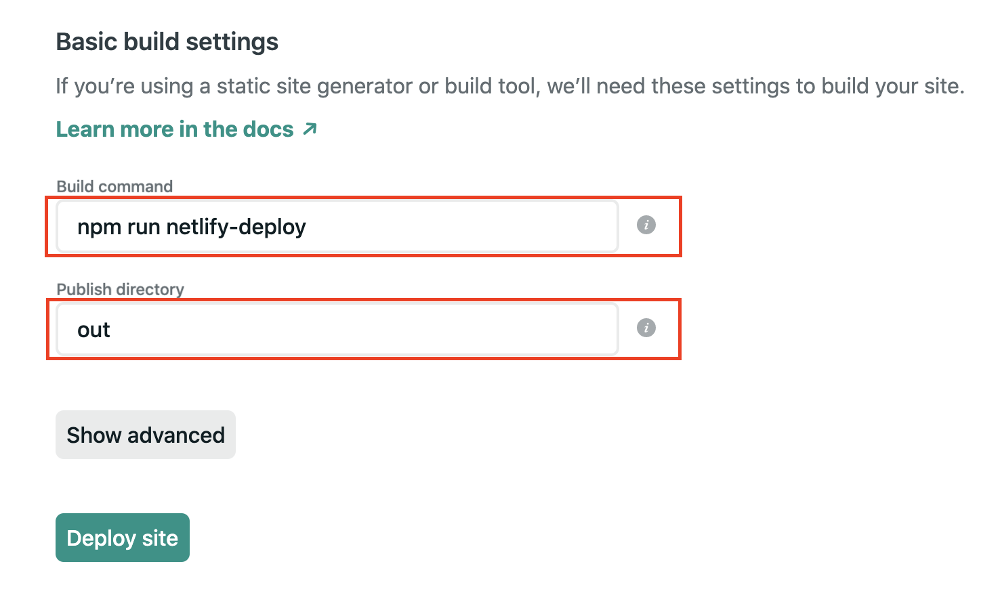

배포가 완료되었다!

처음에는 매우 이상한 도메인을 주는데 `Domain Setting` 에 들어가서 **사이트이름.netlify.app** 형식의 도메인을 받을 수 있다.

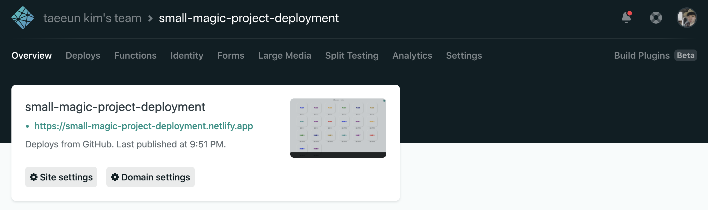

# 7. 🚀 Vercel 배포하기

[Vercel](https://vercel.com/) 또한 배포방법은 매우 간단하다.

> Vercel로 배포한 [소마법 프로젝트 배포용](https://small-magic-project-deployment.now.sh/)

## 7-1. 스크립트 작성하기

package.json 파일 안의 "script" 속성에 "deploy"하는 명령어를 추가한다.

> github page 배포와 구분을 두기 위해 "vercel-deploy" 라는 이름으로 작성했다.

```json
 "scripts": {
    "dev": "next",
    "build": "next build",
    "start": "next start",
    "vercel-deploy": "next build && next export"
  },
```

## 7-2. 실제 배포하기

[Vercel](https://vercel.com/) 사이트에 접속해서 가입 혹은 로그인을 한 후, Import Project 클릭!

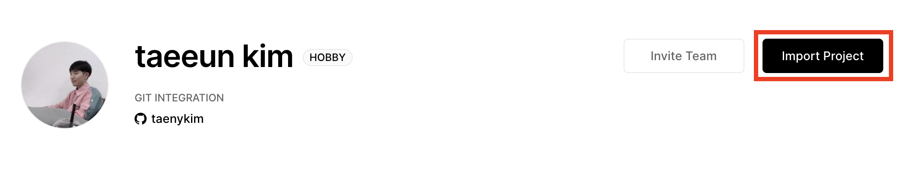

From Git Repository 박스 안의 continue 클릭!


Import Project from Github 클릭!

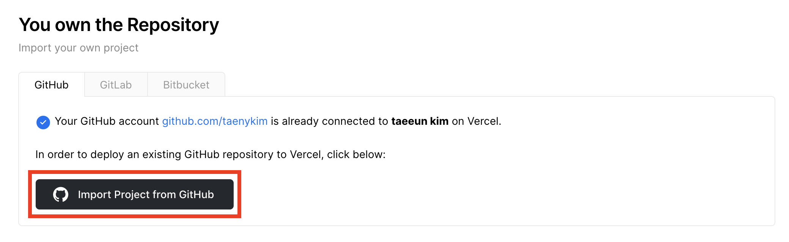

Vercel 도 자신의 github 계정에 Vercel 어플리케이션을 설치하고 배포할 프로젝트 repository의 access를 열어주어야 한다. **repository access settings**를 누르면 쉽게 진행할 수 있다.


그다음 배포할 프로젝트 repository를 체크해주고 save!

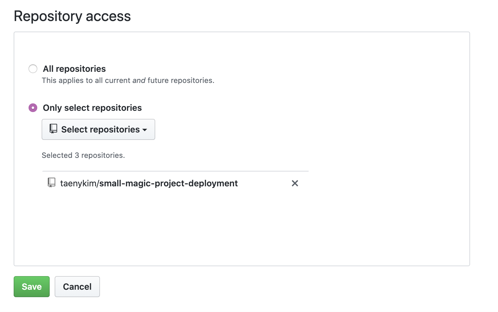

Root Directory 를 설정하는 창. 빈칸으로 진행해도 상관없다.

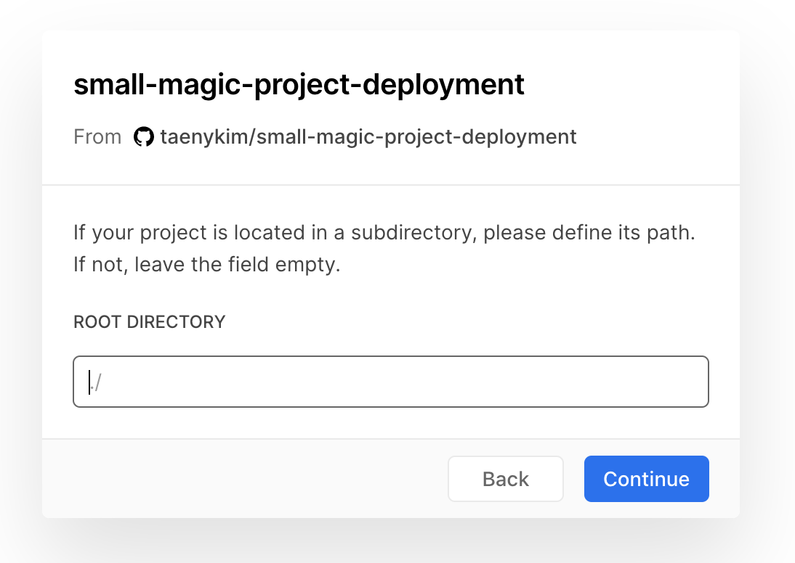

마지막으로 배포시에 사용할 빌드 명령어와 폴더이름을 설정하여야 하는데 위에 **framework preset** 을 Next.js로 설정하고 빌드 명령어를 실제 배포 시, 사용될 명령어를 입력해주고 바로 deploy를 눌러주면 된다.

> 빌드명령어는 `next export`를 실행해야 함.

> nextJS 이외에도 create-react-app, Gatsby, vue.js, angular, jekyll 등 다양한 framework preset 들이 있다.

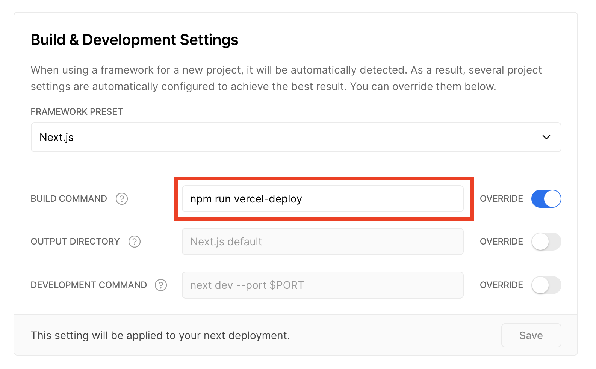

배포가 완료되었다!

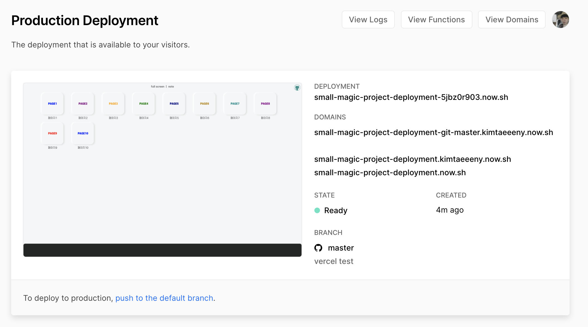

# 8. 결론

해당 포스팅을 하면서 여러 플랫폼끼리 비교하다 보니 플랫폼별로 장단점이 보였다. 또한 nextJS 프레임워크에 대한 여러 다양한 견해들도 접할 수 있었다.

> 람다방식에 대해서도 처음 알게되었는데 언젠가 적재적소에 잘 사용할 수 있는 기회가 있었으면 좋겠다..!

아직 어떤 플랫폼을 사용해야 좋다고 말할 수 있는 수준이 아니지만, 자신이 진행하는 프로젝트에 잘맞는 플랫폼을 선택하는 것도 하나의 역량이 아닐까 생각해보게 되었다.

추가로 **WDever** 님의 댓글 덕분에 nextJS의 호스팅 옵션이 두가지가 있다는 것을 알게 되었다. 다음에는 nextJS의 서버사이드 렌더링 방식에 대해서 깊게 공부해봐야겠다.

[nextJS/two forms of pre-rendering](https://nextjs.org/docs/basic-features/pages#two-forms-of-pre-rendering)

[nextJS/other hosting options](https://nextjs.org/docs/deployment#other-hosting-options)

<details>
<summary>참고링크[접기/펼치기]</summary>
<div markdown="1">

- [https://www.redhat.com/ko/topics/cloud-native-apps/what-is-serverless](https://www.redhat.com/ko/topics/cloud-native-apps/what-is-serverless)

- [https://velopert.com/3543](https://velopert.com/3543)

- [https://www.netlify.com/github-pages-vs-netlify/](https://www.netlify.com/github-pages-vs-netlify/)

- [https://aws.amazon.com/ko/lambda/faqs/](https://aws.amazon.com/ko/lambda/faqs/)

- [https://fauna.com/blog/comparison-faas-providers](https://fauna.com/blog/comparison-faas-providers)

</div>
</details>
