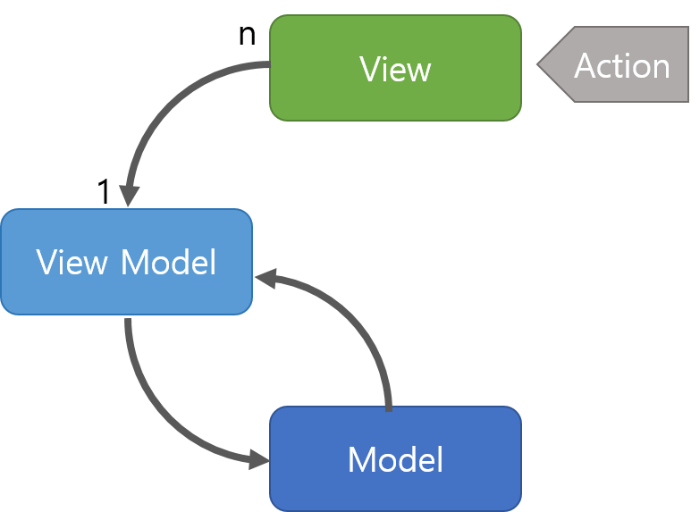
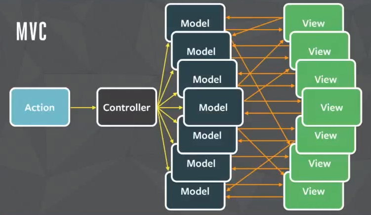
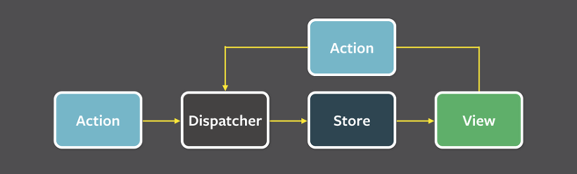

이번주에는 [자동차경주게임](https://github.com/taenykim/java-racingCar-1) 미션을 진행했는데, **mvc패턴으로 디자인**하는 것과 **모든 로직에 단위 테스트를 구현**하는 것이 중심의 미션이었다. 이번 미션부터는 vanillaJS가 아닌 리액트와 타입스크립트로 진행해보았다. UI테스트는 아직 하기가 까다로워서 이번 미션에서는 제외하였고 단위테스트를 하기 위해서 뷰단의 코드(컴포넌트)와 로직부분의 코드(모듈)을 분리해서 코드를 작성해보았다.

이번 포스팅에서는 여러디자인패턴을 비교해보고, 내가 작성한 코드를 리뷰해보며, 코드를 어떤 식으로 짜야할 지, 생각해보았다.

<hr/>

```toc
exclude: Table of Contents
from-heading: 1
to-heading: 2
```

# \#. Series

<details>
<summary>시리즈 한눈에보기[접기/펼치기]</summary>
<div markdown="1">

- [자바스크립트 코딩 컨벤션과 테스트 - OOP Study 1](https://taeny.dev/javascript/oopstudy1/)

- [MVC, MVVM, FLUX 패턴과 코드의 흐름 - OOP Study 2](https://taeny.dev/javascript/oopstudy2/)

</div>
</details>

# \#\#. Source

<details>
<summary>깃허브 소스[접기/펼치기]</summary>
<div markdown="1">

- [java-racingCar-1](https://github.com/taenykim/java-racingCar-1)

</div>
</details>

# 1. MVC 패턴

MVC 패턴은 Model + View + Controller 를 합친 용어로, 다음과 같은 구조를 갖는다.


- **Model** : 어플리케이션에서 사용되는 데이터와 그 데이터를 처리하는 부분

- **View** : 사용자에서 보여지는 UI 부분

- **Controller** : 사용자의 입력(Action)을 받고 처리하는 부분

> 출처: [https://beomy.tistory.com/43](https://beomy.tistory.com/43)

즉, action이 Controller에 전달되면 action에 따라 Model을 업데이트하고 View를 통해 그것을 출력한다.

MVC 패턴은 서버 측 디자인패턴으로, 웹의 경우에 적용 시켜보았다. "클라이언트(프론트)에서 요청을 controller에 전달 > action에 따라 Model을 업데이트 > View로 전달(?) > View는 다시 응답을 클라이언트(프론트)에 전달.(?)" 하지만 이럴 경우, View는 클라이언트(프론트)에서 구현되는 것이지 서버측에 과연 View가 있는지 의문이 들었다.

그래서 관련 자료를 찾아보니 MVC패턴은 객체지향 시스템이 UI를 가질 수 있도록 설계된 패러다임이며, 웹 서비스에 완벽히 대입하려하는 것은 옳지 않다는 견해가 있었다. [https://softwareengineering.stackexchange.com/questions/324730/mvc-and-restful-api-service](https://softwareengineering.stackexchange.com/questions/324730/mvc-and-restful-api-service) MVC를 제대로 따르고 있는지 보다는 MVC 패턴의 이점(코드를 역할에 맞게 나누는 것)을 이해하고 그것을 고려한 설계하는 것이 더 중요하지 않나 생각이 들었다.

# 2. MVVM 패턴

MVVM 패턴은 MVC에서 파생된 패턴으로 Model + View + View Model 를 합친 용어이다. MVVM 패턴은 다음과 같은 구조를 갖는다.



- **Model** : 어플리케이션에서 사용되는 데이터와 그 데이터를 처리하는 부분

- **View** : 사용자에서 보여지는 UI 부분

- **View Model** : View를 표현하기 위해 만든 View를 위한 Model. View를 나타내 주기 위한 Model이자 View를 나타내기 위한 데이터 처리를 하는 부분.

> 출처: [https://beomy.tistory.com/43](https://beomy.tistory.com/43)

View에 action이 전달되며, 프론트엔드측에서 주로사용되는 패턴이다.

"View에서 action발생 > View가 View Model로 action 전달 > View Model은 Model을 업데이트하고 응답을 다시 가져옴 > View Model은 데이터 바인딩을 통하여 View를 갱신" 이렇게 model 의 변화에 따라, view를 바로바로 업데이트 해주는 `데이터 바인딩` 특징을 가지고 있다. Angular, vuejs 의 경우에는 **양방향 데이터 바인딩**을, 리액트는 **단방향 데이터 바인딩**을 이용한다.

# 3. FLUX 패턴

기존의 MVC모델의 양방향 데이터 바인딩 방식은 모델의 변화에 따라 바로바로 뷰가 변하기 때문에 시스템이 복잡해질 수록 예측 불가능한 상황들이 생기고 데이터들이 꼬여버릴 수 있다는 단점을 가지고 있었다.

업데이트할 Model들이 다수이고, 서로 의존성이 얽혀있을 경우 이런 경우가 자주 발생한다.



FLUX 패턴은 MVC의 **양방향 데이터 바인딩**의 단점을 해결하고자 페이스북에서 고안한 `단방향 데이터 바인딩` 방식의 디자인 패턴이다. 구조는 다음과 같다.



- **Dispatcher** : Flux의 모든 데이터 흐름을 관리하는 허브 역할을 하는 부분

- **Store** : 데이터(상태)를 저장하는 부분

- **View** : Store의 변화를 감지하고 View를 업데이트해주는 부분. Controller View라고도 부른다.

출처: [https://taegon.kim/archives/5288](https://taegon.kim/archives/5288)

즉, "Action이 dispatch > dispatcher는 action에 맞게 store를 업데이트 > View는 store의 변화가 감지되면 view업데이트" 의 방식으로 진행된다. 대표적으로 React와 Redux가 flux패턴을 사용하며, Vuex라이브러리도 flux패턴에 영감을 받아 만들어졌다고 한다.

# 4. 코드의 흐름

2020년 4월 26일, 잠실 오프라인 스터디에서 코드리뷰 방식에 대해서 들을 수 있었다. 코드리뷰를 해주시는 분에 따르면 mvc모델의 컨트롤러를 시작점으로 한줄한줄 코드의 흐름대로 읽어내려가신다고 하였다. 예를들어, "컨트롤러를 실행 > 인풋을 받고 자동차배열을 생성 > 모델을 불러오고 업데이트 > 출력" 이런식으로 말이다. 그렇기 때문에 코드를 읽는 흐름이 잘 이해되고 중간에 흐름이 끊기지 않으려면 함수(메소드)명, 변수명 짓는 것도 중요하겠구나를 느끼게 되었다.

위에서 언급했던 여러 디자인패턴의 경우도 공통적으로는 action이 존재한다. 프론트의 경우 뷰가 여러개가 존재하고 여러 action들이 발생된다. 그렇기 때문에 action을 처리하는 로직 하나하나를 흐름을 타고 가면서 이해하기 쉽고, 흐름이 끊기지 않도록 스스로 점검하는 연습도 많이 해봐야겠다고 느끼게 되었다.

# 5. 패턴 적용(racing Car)

racing Car 미션은 **mvc패턴으로 디자인**하는 것과 **모든 로직에 단위 테스트를 구현**하는 것이 중심의 미션이었는데, 나는 java가 아니라 javascript였기 때문에 **MVVM**과 **FLUX** 모델을 사용해서 디자인해보았다. 정확히 대입시키는 것은 어렵겠지만, containers 폴더의 App.tsx를 `View Model` 로 사용자의 View에서 action을 전달받는 역할을, components의 Processes.tsx와 Result.tsx를 변경된 View를 출력하는 `View` 의 역할을 하도록 하였다. 그리고 마지막으로 modules라는 폴더에는 `Model` 의 역할을 하는 함수들을 모듈형태로 모아두었다. 그리고 React hooks 를 통해서 FLUX패턴을 구현해보았다.

> 이번 미션에 게임적인 요소까지 추가해서 소마법 프로젝트에도 추가해보았다. [소마법프로젝트/racingcar](https://small-magic-project.now.sh/racingcar)

```
java-racingCar-1
├── src
│   ├── components
│   │   ├── Processes.tsx (실행과정만 출력)
│   │   ├── Result.tsx (실행결과만 출력)
│   ├── containers
│   │   ├── App.test.tsx
│   │   ├── App.tsx (메인 컨테이너)
│   ├── modules
│   │   ├── Car.test.ts
│   │   ├── Car.ts (Car 객체)
│   │   ├── formValidator.test.ts
│   │   ├── formValidator.ts (사용자 인풋 검증)
│   │   ├── racingCar.test.tsx
│   │   ├── racingCar.tsx (자동차 관련 함수)
```

# 6. 테스트코드 작성규칙 & 팁

그리고 `jest` 를 이용해서 모듈들의 유닛 테스트를 수행할 테스트코드도 작성해주었다. 테스트코드를 작성하는 것은 아직도 익숙치 않아서 어려운 것 같다. 저번 시리즈에서 포스팅했던 테스트 코드 작성 팁에 이번주 오프라인 스터디에서 배운 내용을 추가해서 다시 적어보려한다.

<hr/>

1️⃣ 테스트 이름은 **한글로 작성**하는 것이 좋다. 위의 테스트는 매우 간단하지만 프로그램이 복잡해지면 테스트명도 길어질 것이고 각각 테스트마다 이해하기 쉽고 의미를 잘 전달해주어야 하기 때문이다.

2️⃣ 테스트는 **가장 작은 단위의 기능부터** 테스트한다. 예를들어, A,B가 C라는 기능에 의존될 경우, A,B를 테스트하고 검증이 완료되면 C에서 A,B가 포함되지 않은 기능만 테스트하면 된다.

3️⃣ 하나의 테스트는 **독립적**이어야 한다. 테스트끼리 의존해서는 안된다.

4️⃣ 테스트는 **하나의 개념만 테스트** 한다. 이번 미션의 경우, 자동차가 가는지 안가는지 테스트하는 것이 아니라, 가는 경우 하나, 안가는 경우 하나 이런 방식으로 테스트 한다.

5️⃣ 테스트는 **3단계로 나누기**. 첫 번째로 테스트 데이터를 만드는 부분. (given) 두 번째로 테스트 데이터를 조작하는 부분. (when)세 번째로 조작한 결과가 올바른지 확인하는 부분. (then)

# 7. 참고

[https://softwareengineering.stackexchange.com/questions/324730/mvc-and-restful-api-service](https://softwareengineering.stackexchange.com/questions/324730/mvc-and-restful-api-service)

[https://beomy.tistory.com/43](https://beomy.tistory.com/43)

[https://velopert.com/3612](https://velopert.com/3612)

[https://beomy.tistory.com/44](https://beomy.tistory.com/44)

[https://taegon.kim/archives/5288](https://taegon.kim/archives/5288)

# 8. 마치며

스터디를 하면서 코드를 자신만 알 수 있게 짜는 것이 실력이 아니라 누구나 알아볼 수 있게 짜는 것이 실력이라는 말을 듣게 되었다. 이번 주에는 **쉽고, 편하게 흐름대로 읽을 수 있는 클린한 코드**를 짜는 것도 정말 중요하구나를 느낄 수 있었다. 다음 미션부터는 구현보다는 코드를 나말고 다른 사람이 읽을 때도 쉽게 이해할 수 있도록 짜는 것에 더 중점을 두고 진행해보아야겠다.
