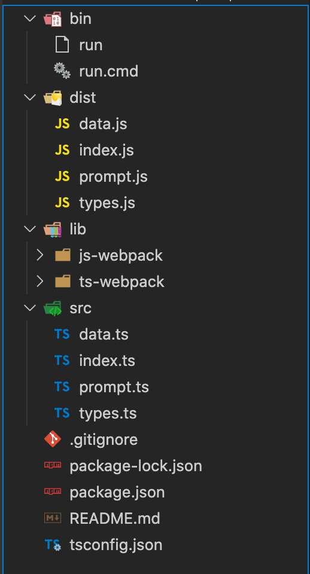
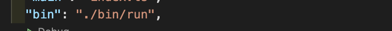
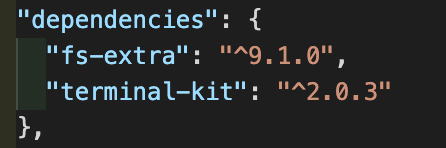

작업하는 환경이 어디건 자주 사용하거나, 환경설정하는데 오래걸리는 코드들이 존재한다. 나의 경우는 웹팩이 그랬다.

하나의 프로젝트를 시작할 때 한번 설정하면 그외에는 변경하지 않는 부분이지만, 간단하게 JS나 TS 코드를 작성해서 돌려보고 싶은데 크롬개발자도구 콘솔창에서는 한계가 있을 때마다 예전 웹팩 설정을 클론해서 프로젝트를 만들거나 코드를 일일히 복붙해서 사용하곤했다.

요런 방식은 너무 비효율적이고, 앞으로도 이런 경우가 자주 생길 것 같아서 직접 [보일러플레이트 생성기](https://github.com/taenykim/generator)를 만들어보기로 하였다!!

```toc
exclude: Table of Contents
from-heading: 1
to-heading: 3
```

## 1. 프로젝트 설정

프로젝트 구조는 이렇게 설정했다.



- bin : 프로젝트 설치, 실행시 실행될 스크립트가 들어갈 디렉토리
- dist : 빌드된 프로그램 디렉토리
- lib : 보일러플레이트들
- src : 보일러플레이트 생성기 소스

먼저 package.json의 **bin** 에, 패키지를 설치할 때, 실행될 스크립트 경로를 넣어주었다.



그리고 `run` 스크립트에서는 실제 실행될 파일을 실행시켜주도록 코드를 작성해주었다.

```sh
#!/usr/bin/env node

require("../dist")().run();

```

이 때, `run` 스크립트는 어떠한 사용자도 모두 실행할 수 있도록 권한을 변경해주었다. (권한 설정을 하지 않을경우, 스크립트 실행시, permission 오류가 뜬다.)

```sh
chmod 755 run
chmod 755 run.cmd
```

그리고 typescript와 directory를 복사하는 메소드를 사용하기 위한 `fs-extra` 패키지, 예쁜 터미널입출력을 도와줄 `terminal-kit` 패키지를 추가로 설치해주었다.



## 2. index.ts

엔트리포인트인 `index.ts` 에서는 run 메소드만 가지는 모듈의 형태로 작성해주었다.

그리고 변경가능한 데이터(보일러플레이트 정보, 입출력, 에러메시지 등)은 모두 따로 빼고, 데이터를 `createPrompt` 라는 함수에 전달하는 역할만 주었다.

```ts
const run = () => {
  const selectItemMap: SelectItemMap = new Map(selectItems)
  const options: PromptOptions = {
    DEFAULT_DEST_DIR_NAME,
    QUESTION_MESSAGE1,
    QUESTION_MESSAGE2,
  }

  createPrompt(selectItemMap, options)
}

module.exports = () => {
  return {
    run,
  }
}
```

데이터 구조는 순서를 갖는 객체의 형태를 위해 `Map` 을 사용했다.

## 3. data.ts

보일러플레이트 정보는 type, dirName, description 세개의 key를 갖게 하였다.

- type : 보일러플레이트인지, quit인지에 대한 정보 ('boiler-plate' | 'quit')
- dirName : 보일러플레이트의 경우 디렉토리이름
- description : 터미널에 출력될 문자열

그리고 그 외 입출력메시지나, 만들어질 default 디렉토리명, 에러메시지 등도 적어주었다.

```ts
export const selectItems: SelectItems = [
  [
    0,
    {
      type: 'boiler-plate',
      dirName: 'ts-webpack',
      description: '- TypeScript + Webpack',
    },
  ],
  [
    1,
    {
      type: 'boiler-plate',
      dirName: 'js-webpack',
      description: '- JavaScript + Webpack',
    },
  ],
  [
    2,
    {
      type: 'quit',
      description: '- quit',
    },
  ],
]

export const defaultDestDirName = 'my-app'
export const QUESTION_MESSAGE1 =
  '생성할 프로젝트명을 입력하세요(default : my-app, 현재위치: . ) > '
export const QUESTION_MESSAGE2 = '\n\n생성할 보일러 플레이트를 선택해주세요.\n'
export const SUCCESS_MESSAGE = '\n생성되었습니다!\n'
export const FAILURE_MESSAGE = '\n아무일도 일어나지 않았습니다!\n'
export const QUIT_MESSAGE = '\n종료되었습니다!\n'
export const EXIST_DEST_ERROR_MESSAGE = '\n디렉토리가 존재합니다.\n"'
export const EXIST_TARGET_ERROR_MESSAGE =
  '\n현재 디렉토리에 파일들이 존재합니다\n'
```

프로그램 로직과 데이터(와 상수들)은 분리하는 게 좋을 것 같아서 따로 분리해주었다.

## 4. types.ts

`types.ts`에서는 데이터에 들어갈 QuitSelectItem (quit 정보), BoilerSelectItem (보일러플레이트 정보) 와 options에 들어갈 정보에 대한 타입을 지정해주었다.

```ts
interface QuitSelectItem {
  type: 'quit'
  description: string
}

interface BoilerSelectItem {
  type: 'boiler-plate'
  dirName: string
  description: string
}

export type SelectItems = Array<[number, QuitSelectItem | BoilerSelectItem]>

export type SelectItemMap = Map<number, QuitSelectItem | BoilerSelectItem>

export interface PromptOptions {
  defaultDestDirName?: string
  QUESTION_MESSAGE1?: string
  QUESTION_MESSAGE2?: string
  SUCCESS_MESSAGE?: string
  FAILURE_MESSAGE?: string
  QUIT_MESSAGE?: string
  EXIST_DEST_ERROR_MESSAGE?: string
  EXIST_TARGET_ERROR_MESSAGE?: string
}

export type DefaultPromptOptions = Required<PromptOptions>
```

사실 type이 꼭 필요한 프로그램은 아닐수도 있지만 타입스크립트 공부겸 겸사겸사 타입들도 지정해주었다. ㅋㅋ; 그래도 타입을 지정해주니까 오히려 작업하면서도 어떤 인터페이스인지 확인이 가능해서 개발도 빠르게 할 수 있고 좀더 안정적일 것이라는 생각에 프로그램에 애정도 더 생겼던 것 같다.

## 5. prompt.ts

`prompt.ts` 에서는 실제 생성기에서 동작할 내용들을 담아주었다.

먼저 인자로 넘어온 options에 키값이 없을 경우에는 default로 적용하고 키값이 있으면 해당 키값을 사용하도록 설정해주었다.

```ts
const {
  defaultDestDirName,
  QUESTION_MESSAGE1,
  QUESTION_MESSAGE2,
  SUCCESS_MESSAGE,
  FAILURE_MESSAGE,
  QUIT_MESSAGE,
  EXIST_DEST_ERROR_MESSAGE,
  EXIST_TARGET_ERROR_MESSAGE,
} = { ...defaultOptions, ...options }
```

그리고 `getDestDirName` 함수와 `getSelectItemType` 함수를 만들어 사용자로부터 입력을 받고

```ts
term.cyan(QUESTION_MESSAGE1)

const destDirName = await getDestDirName(defaultDestDirName)

const selectItemValues = selectItemMap.values()
const descriptions = Array.from(selectItemValues).map(
  value => value.description
)

term.cyan(QUESTION_MESSAGE2)

const selectedItem = await getSelectItemType(descriptions)
```

받은 정보를 바탕으로 `createDirectory` 함수를 실행해 보일러플레이트를 만들도록 해주었다.

```ts
const selectedItemType = await createDirectory(
  selectItemMap,
  selectedItem.selectedIndex,
  destDirName
)
```

그리고 잘 적용이 되었는지, 에러가 있었는지에 대한 처리를 해주었다.

```ts
if (selectedItemType === 'exist-dest') {
  term.red(EXIST_DEST_ERROR_MESSAGE)
  createPrompt(selectItemMap, options)
}
if (selectedItemType === 'exist-target') {
  term.red(EXIST_TARGET_ERROR_MESSAGE)
  createPrompt(selectItemMap, options)
}
if (selectedItemType === 'boiler-plate') {
  term.cyan(SUCCESS_MESSAGE)
  process.exit(0)
}
if (selectedItemType === 'quit') {
  term.red(FAILURE_MESSAGE)
  process.exit(0)
}
if (!selectedItemType) {
  term.white(QUIT_MESSAGE)
  process.exit(0)
}
```

## 6. 배포

`npm run dev` 로 생성기가 의도대로 잘 작동하는지 확인하고, version을 올려준 뒤, `npm publish` 로 배포해주었다.

```json
{
  "name": "@taenykim/generator",
  "version": "0.0.3",
  "scripts": {
    "dev": "tsc && ./bin/run",
    "build": "tsc"
  }
}
```

## 7. 사용

사용은 `npx @taenykim/generator` 로 사용할 수 있다.


> npx는 `node_module` 로 패키지가 저장되지 않고, 패키지 실행 후, 제거된다.

## 8. 후기

미루고미루다가 후딱 만들어서 배포까지 해봤는데 앞으로 유용하게 많이 쓸 수 있을 것 같다. nodeJS fs 모듈과 npm과 쪼끔더 친해진 것 같아서 너무 좋았고 앞으로 롤업 보일러플레이트나 리액트 등등 더 추가해나가 보아야겠다.

~~그리고 시간이된다면 리팩토링도 좀 하고,, 다양한 에러처리도 해봐야겠다.~~
