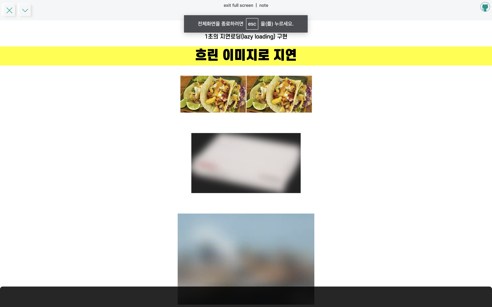

페이지 로드 시, 이미지나 동영상 같은 용량이 큰 데이터를 한꺼번에 불러오는 게 아니라 사용자의 뷰 영역에 도달 했을 때, 해당 이미지를 로드하는 **지연로딩 (lazy loading)**을 이용해보았다.

<hr/>

```toc
exclude: Table of Contents
from-heading: 1
to-heading: 5
```

# \#. Project Map

- :apple: <a href="https://small-magic-project.now.sh/" target="_blank">프로젝트 사이트</a>

- :apple: <a href="https://small-magic-project.now.sh/lazyloading" target="_blank">프로젝트 사이트/lazyloading</a>

* :fire: <a href="https://github.com/taenykim/small-magic-project" target="_blank">프로젝트 깃허브소스</a>

<br/>

<details>
<summary>제작노트 한눈에보기[접기/펼치기]</summary>
<div markdown="1">

- [소마법 프로젝트 - 1 (container)](https://taeny.dev/project/%EC%86%8C%EB%A7%88%EB%B2%95-%ED%94%84%EB%A1%9C%EC%A0%9D%ED%8A%B81/)

- [소마법 프로젝트 - 2 (calculator)](https://taeny.dev/project/%EC%86%8C%EB%A7%88%EB%B2%95-%ED%94%84%EB%A1%9C%EC%A0%9D%ED%8A%B82/)

- [소마법 프로젝트 - 3 (graph)](https://taeny.dev/project/%EC%86%8C%EB%A7%88%EB%B2%95-%ED%94%84%EB%A1%9C%EC%A0%9D%ED%8A%B83/)

- [소마법 프로젝트 - 4 (crawling)](https://taeny.dev/project/%EC%86%8C%EB%A7%88%EB%B2%95-%ED%94%84%EB%A1%9C%EC%A0%9D%ED%8A%B84/)

- [소마법 프로젝트 - 5 (today)](https://taeny.dev/project/%EC%86%8C%EB%A7%88%EB%B2%95-%ED%94%84%EB%A1%9C%EC%A0%9D%ED%8A%B85/)

- [소마법 프로젝트 - 6 (jjal)](https://taeny.dev/project/%EC%86%8C%EB%A7%88%EB%B2%95-%ED%94%84%EB%A1%9C%EC%A0%9D%ED%8A%B86/)

- [소마법 프로젝트 - 7 (avengers)](https://taeny.dev/project/%EC%86%8C%EB%A7%88%EB%B2%95-%ED%94%84%EB%A1%9C%EC%A0%9D%ED%8A%B87/)

- [소마법 프로젝트 - 8 (maskmap)](https://taeny.dev/project/%EC%86%8C%EB%A7%88%EB%B2%95-%ED%94%84%EB%A1%9C%EC%A0%9D%ED%8A%B88/)

- [소마법 프로젝트 - 9 (loading)](https://taeny.dev/project/%EC%86%8C%EB%A7%88%EB%B2%95-%ED%94%84%EB%A1%9C%EC%A0%9D%ED%8A%B89/)

- [소마법 프로젝트 - 10 (lazyloading)](https://taeny.dev/project/%EC%86%8C%EB%A7%88%EB%B2%95-%ED%94%84%EB%A1%9C%EC%A0%9D%ED%8A%B810/)

</div>
</details>

# 1. 레이아웃

## 1-1. 메인화면



> 우연히 원본 이미지와 blur된 이미지 모두 찍혔다...!

## 1-2. 컴포넌트

```js
<Contents style={{ marginTop: '100px' }}>
  <p>1초의 지연로딩(lazy loading) 구현</p>
  <div>흐린 이미지로 지연</div>
  {obj.map(item => {
    return item
  })}
  <div>단색 이미지로 지연</div>
  {obj2.map(item => {
    return item
  })}
</Contents>
```

Contents 라는 styled-component를 사용해서, Container 뿐만 아니라 내부 p나 div의 스타일도 조정해주었다.

# 2. 지연로딩

### 2-1. :star: src, data-src

```jsx

```

`data-src` 속성 값에는 원본 이미지 URL을 넣고, `src` 속성 값에는 비교적 용량이 낮은 대체 이미지 URL을 넣어준다.

### 2-2. :star: nodeList -> Array

```js
let lazyImages = [].slice.call(document.querySelectorAll('img.lazy'))
// or
let lazyImages = Array.slice.call(document.querySelectorAll('img.lazy'))
```

`querySelectorAll` 메소드를 사용하면 DOM 엘리먼트들이 배열형태가 아니라 노드리스트 형태로 불러와진다.

그래서 배열의 형태로 변환해주어야함.

배열 메소드의 `slice`를 사용하고 `call()`을 통해 바인딩 해주면 됨.

### 2-3. scroll 이벤트

```js
const lazyLoad = () => {
  if (active === false) {
    active = true

    setTimeout(() => {
      // image lazy loading 부분
      // ...

      active = false
    }, 1000)
  }
}

document.addEventListener('scroll', lazyLoad)
```

스크롤 이벤트 핸들러를 등록하고, 내부에 image lazy loading 코드를 넣어주었는데,

lazy loading이 직관적으로 보이지 않아서 setTimeout() 함수로 1초간 강제로 지연시켜주었다. 😂

### 2-4. :star: 지연로딩 : getBoundingClientRect()

```js
lazyImages.map(lazyImage => {
  if (
    lazyImage.getBoundingClientRect().top <= window.innerHeight &&
    lazyImage.getBoundingClientRect().bottom >= 0 &&
    getComputedStyle(lazyImage).display !== 'none'
  ) {
    lazyImage.src = lazyImage.dataset.src
    lazyImage.classList.remove('lazy')

    lazyImages = lazyImages.filter(function(image) {
      return image !== lazyImage
    })

    if (lazyImages.length === 0) {
      document.removeEventListener('scroll', lazyLoad)
    }
  }
})
```

먼저 `getBoundingClientRect()`를 통하여 이미지의 크기요소를 구하고, 조건문을 통해 스크린에 등장할 때 다음 코드를 실행하도록 해주었다.


> `getComputedStyle()` 는 DOM element의 style 속성과 속성값을 객체 형태로 가져오는 window 내부 메소드이다.

그리고 조건문을 통과하면 src값을 바꾸도록 하였다.

**그리고 데이터를 읽어오면 class를 삭제하고 배열을 비웠고, 모든 배열이 비워지면 스크롤 이벤트를 삭제하는 등 최적화 작업도 해주었다.**

# 3. 개인적인 피드백

### 3-1. Chrome Native lazy loading

```js

```

> 이런 방식도 쓸 수 있다고 한다..!

# 4. 참고

- [Lazy Loading Example(codepen.io) By Jeremy Wagner](https://codepen.io/malchata/pen/mXoZGx)

- [이미지 및 동영상의 지연 로딩 By Jeremy Wagner](https://developers.google.com/web/fundamentals/performance/lazy-loading-guidance/images-and-video?hl=ko#%EC%9D%B4%EB%AF%B8%EC%A7%80_%EC%A7%80%EC%97%B0_%EB%A1%9C%EB%94%A9)
