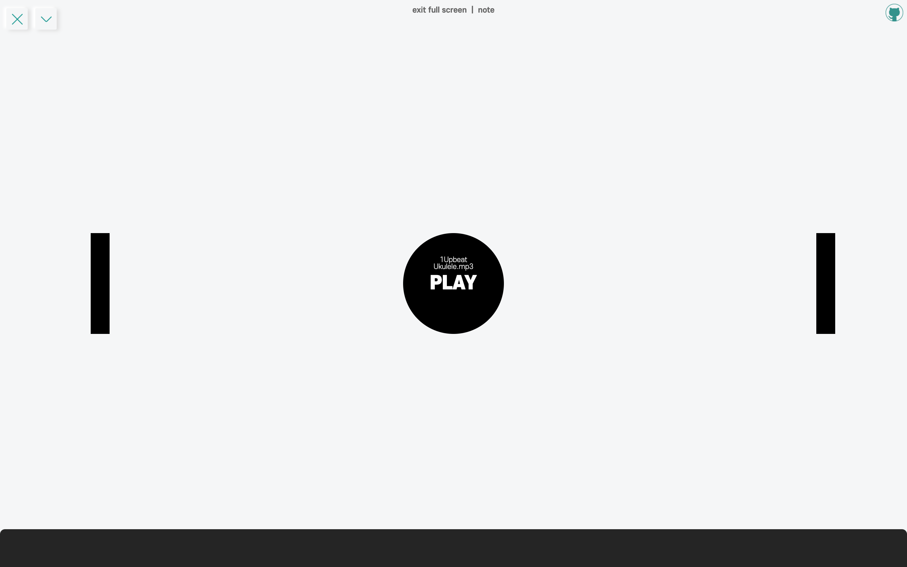
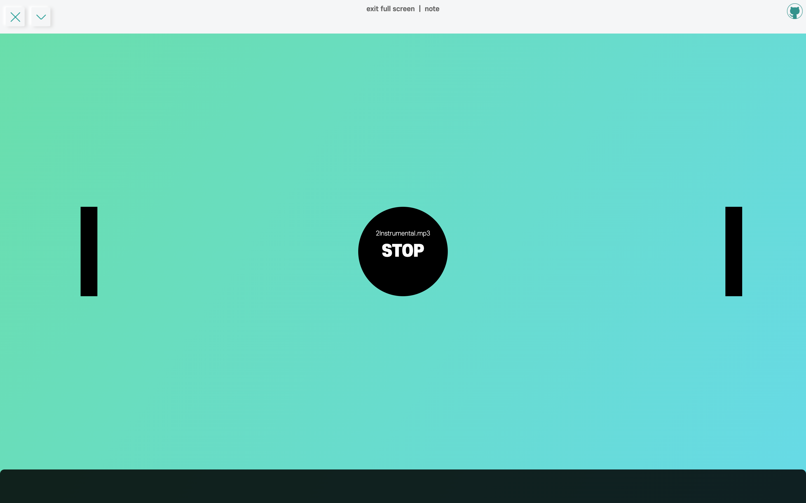

**뮤직 플레이어 앱**을 간단히 만들어보았다. audio DOM element를 처음 다뤄보았고, class를 활용해 OOP도 신경써서 구현해보았다.

<hr/>

```toc
exclude: Table of Contents
from-heading: 1
to-heading: 2
```

# \#. Project Map

- :apple: <a href="https://small-magic-project.now.sh/" target="_blank">프로젝트 사이트</a>

- :apple: <a href="https://small-magic-project.now.sh/music" target="_blank">프로젝트 사이트/music</a>

* :fire: <a href="https://github.com/taenykim/small-magic-project" target="_blank">프로젝트 깃허브소스</a>

<br/>

<details>
<summary>제작노트 한눈에보기[접기/펼치기]</summary>
<div markdown="1">

- [소마법 프로젝트 - 1 (container)](https://taeny.dev/project/%EC%86%8C%EB%A7%88%EB%B2%95-%ED%94%84%EB%A1%9C%EC%A0%9D%ED%8A%B81/)

- [소마법 프로젝트 - 2 (calculator)](https://taeny.dev/project/%EC%86%8C%EB%A7%88%EB%B2%95-%ED%94%84%EB%A1%9C%EC%A0%9D%ED%8A%B82/)

- [소마법 프로젝트 - 3 (graph)](https://taeny.dev/project/%EC%86%8C%EB%A7%88%EB%B2%95-%ED%94%84%EB%A1%9C%EC%A0%9D%ED%8A%B83/)

- [소마법 프로젝트 - 4 (crawling)](https://taeny.dev/project/%EC%86%8C%EB%A7%88%EB%B2%95-%ED%94%84%EB%A1%9C%EC%A0%9D%ED%8A%B84/)

- [소마법 프로젝트 - 5 (today)](https://taeny.dev/project/%EC%86%8C%EB%A7%88%EB%B2%95-%ED%94%84%EB%A1%9C%EC%A0%9D%ED%8A%B85/)

- [소마법 프로젝트 - 6 (jjal)](https://taeny.dev/project/%EC%86%8C%EB%A7%88%EB%B2%95-%ED%94%84%EB%A1%9C%EC%A0%9D%ED%8A%B86/)

- [소마법 프로젝트 - 7 (avengers)](https://taeny.dev/project/%EC%86%8C%EB%A7%88%EB%B2%95-%ED%94%84%EB%A1%9C%EC%A0%9D%ED%8A%B87/)

- [소마법 프로젝트 - 8 (maskmap)](https://taeny.dev/project/%EC%86%8C%EB%A7%88%EB%B2%95-%ED%94%84%EB%A1%9C%EC%A0%9D%ED%8A%B88/)

- [소마법 프로젝트 - 9 (loading)](https://taeny.dev/project/%EC%86%8C%EB%A7%88%EB%B2%95-%ED%94%84%EB%A1%9C%EC%A0%9D%ED%8A%B89/)

- [소마법 프로젝트 - 10 (lazyloading)](https://taeny.dev/project/%EC%86%8C%EB%A7%88%EB%B2%95-%ED%94%84%EB%A1%9C%EC%A0%9D%ED%8A%B810/)

- [소마법 프로젝트 - 11 (music)](https://taeny.dev/project/%EC%86%8C%EB%A7%88%EB%B2%95-%ED%94%84%EB%A1%9C%EC%A0%9D%ED%8A%B811/)

- [소마법 프로젝트 - 12 (racingcar)](https://taeny.dev/project/%EC%86%8C%EB%A7%88%EB%B2%95-%ED%94%84%EB%A1%9C%EC%A0%9D%ED%8A%B812/)

</div>
</details>

# 1. Layout

### 1-1. 메인화면



화면 중앙에는 Play/Stop 버튼과 양옆으로는 이전곡 버튼, 다음곡 버튼을 두었다.

<hr/>

### 1-2. 🎵음악재생중



그리고 음악이 재생중일 때는 배경 그라디언트 애니메이션이 보이도록 해주었다.

<hr/>

### 1-3. 컴포넌트

```jsx
<BackgroundContainer className="musicBackground" playToggle={playToggle}>
  <ContentsMenubar name="music" />
  <audio preload="auto" controls="none" style={{ display: 'none' }}></audio>
  <SideButton position="left" onClick={() => anotherMusicPlay('left')} />
  <PlayButton onClick={playMusic}>
    <div>{myMusic.name}</div>
    <p>{!playToggle ? `PLAY` : `STOP`}</p>
  </PlayButton>
  <SideButton position="right" onClick={() => anotherMusicPlay('right')} />
</BackgroundContainer>
```

| Component              | Description                                           |
| ---------------------- | ----------------------------------------------------- |
| BackgroundContainer    | 해당 어플리케이션의 Full Container `styled-component` |
| ContentsMenubar        | 메뉴바 `import`                                       |
| audio                  | 음악 관련 html element `HTMLAudioElement`             |
| SideButton, PlayButton | 버튼 element `styled-component`                       |

# 2. Sound Class

먼저 음악을 컨트롤 해줄 class를 따로 만들어주었다.

```js
export default class Sound {
  sound = null // HTMLAuioElement
  name = ''
  constructor(src) {
    this.sound = document.querySelector('audio')
    this.name = src
    this.sound.src = src
  }
  play() {
    this.sound.play()
  }
  stop() {
    this.sound.pause()
  }
}
```

state로는 HTMLAudioElement에 접근하는 sound와 음악이름 name을 두었고, 모든 음악 컨트롤을 Sound객체에서 할 수 있게끔 해주었다.

# 3. Sound Control

### 3-1. Sound 객체 생성

```jsx
const musics = ['1Upbeat Ukulele.mp3', '2Instrumental.mp3', '3Inspiration.mp3']
```

먼저 musics 배열에 음악 이름을 넣어주었다.

```jsx
useEffect(() => {
  setMyMusic(new Sound(musics[0]))
}, [])
```

그리고 처음 컴포넌트가 마운트될 때, Sound 객체를 생성하고 생성자 인자로 첫번째 음악 ('1Upbeat Ukulele.mp3')을 넣어주었다. 그리고 해당 객체를 React Hooks의 useState를 이용해서 MyMusic state에 넣어주었다.

<hr/>

### 3-2. 음악재생

```jsx
const playMusic = () => {
  !playToggle && myMusic.play()
  playToggle && myMusic.stop()
  setPlayToggle(!playToggle)
}
```

playMusic 함수는 가운데 Play/Stop 버튼을 누르면 실행되는 함수로, 현재 playToggle 값에 따라, myMusic 의 메소드에 접근하게 해주었다.

<hr/>

### 3-3. 다음곡, 이전곡

```jsx
const anotherMusicPlay = direction => {
  myMusic.stop()
  if (direction === 'left') {
    return setMyMusic(
      new Sound(
        musics[
          (musics.indexOf(myMusic.name) + musics.length - 1) % musics.length
        ]
      )
    )
  }
  if (direction === 'right') {
    return setMyMusic(
      new Sound(musics[(musics.indexOf(myMusic.name) + 1) % musics.length])
    )
  }
}
```

anotherMusicPlay 함수는 사이드버튼을 눌렀을 때 실행되며, direction이라는 인자(이전곡인지,다음곡인지 체크)를 받는다. 우선 현재 myMusic 객체의 음악을 멈추고 인자에 따른 조건문을 두었다. 조건문은 else문을 사용하지 않고 if와 return 값으로 처리해주었다.

```jsx
useEffect(() => {
  playToggle && myMusic.play()
}, [myMusic])
```

다음곡 혹은 이전곡으로 객체가 바뀌면 useEffect를 이용해서 음악을 플레이할지 계속 유지할 것인지 정할 수 있도록 하였다.

# 4. Background Animation

백그라운드 애니메이션은 styled-component 를 이용했고, [codepen.io](https://codepen.io/nohoid/pen/kIfto)의 소스를 참고하였다.

```jsx
const rainbow = keyframes`
0%{background-position:0% 82%}
50%{background-position:100% 19%}
100%{background-position:0% 82%}
`

const BackgroundContainer = styled.div`
  position: relative;
  display: flex;
  justify-content: center;
  align-items: center;
  width: 100vw;
  height: 100vh;
  background: ${(props) => {
    return props.playToggle
      ? 'linear-gradient(124deg,#ff2400,#e81d1d,#e8b71d,#e3e81d,#1de840,#1ddde8,#2b1de8,#dd00f3,#dd00f3);'
      : 'white'
  }}
  background-size: 1800% 1800%;
  animation: ${rainbow} 18s ease infinite;
```

# 5. Feedback

### 5-1. Too simple

만들고나니 너무 간단했던 것 같다. 그래서 다음에는 웹에서 할 수 있는 드럼이나 신디사이저 어플이나 정말 뮤직 플레이어 처럼 여러 기능들을 넣어보고 싶다.

<hr/>

### 5-2. Animation

애니메이션 기능도 버튼에 반응하도록 하고 싶었는데 좀처럼 쉽게 되지 않았다. 중복 애니메이션이 안되는 것 같기도하고... 다음 소마법 프로젝트는 애니메이션에 대해서 다뤄볼까 한다.
