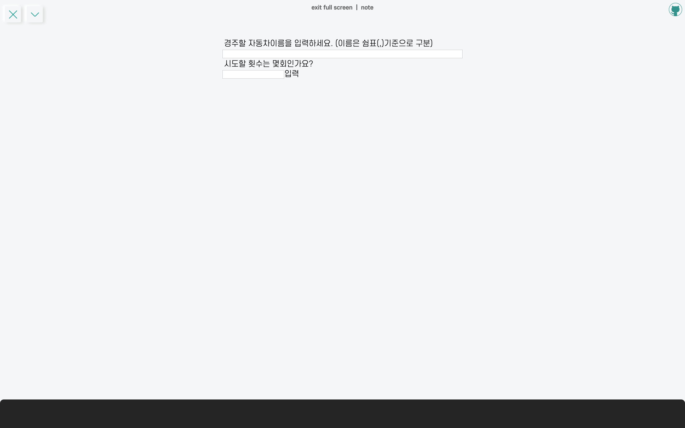
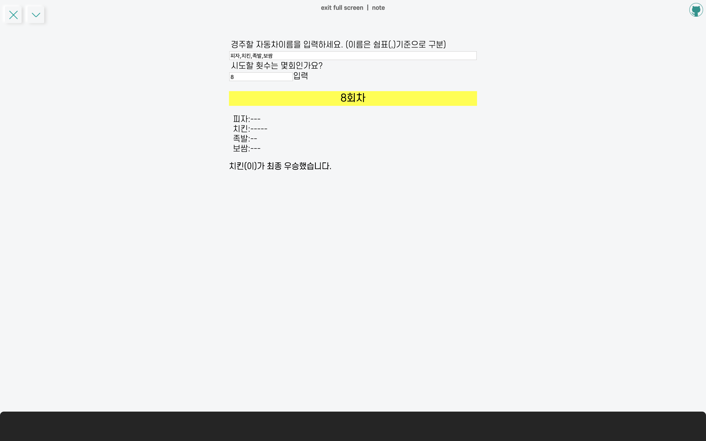

이번에 만들어본 소마법 프로젝트는 자동차 경주게임 어플리케이션으로, OOP study 미션을 변형해서 제작해보았다. **MVVM** 패턴과 **FLUX** 패턴 구현과 **유닛테스트**에 중심을 두어서 코드를 짜보았다. 디자인 패턴에 대한 설명과 테스트코드 작성 방법 및 팁은 [여기](https://taeny.dev/javascript/oopstudy2/)에 포스팅하였고, 여기서는 구현한 코드에 대해서 정리해보고자 한다.

<hr/>

```toc
exclude: Table of Contents
from-heading: 1
to-heading: 1
```

# \#. Project Map

- :apple: <a href="https://small-magic-project.now.sh/" target="_blank">프로젝트 사이트</a>

- :apple: <a href="https://small-magic-project.now.sh/racingcar" target="_blank">프로젝트 사이트/racingcar</a>

* :fire: <a href="https://github.com/taenykim/small-magic-project" target="_blank">프로젝트 깃허브소스</a>

<br/>

<details>
<summary>제작노트 한눈에보기[접기/펼치기]</summary>
<div markdown="1">

- [소마법 프로젝트 - 1 (container)](https://taeny.dev/project/%EC%86%8C%EB%A7%88%EB%B2%95-%ED%94%84%EB%A1%9C%EC%A0%9D%ED%8A%B81/)

- [소마법 프로젝트 - 2 (calculator)](https://taeny.dev/project/%EC%86%8C%EB%A7%88%EB%B2%95-%ED%94%84%EB%A1%9C%EC%A0%9D%ED%8A%B82/)

- [소마법 프로젝트 - 3 (graph)](https://taeny.dev/project/%EC%86%8C%EB%A7%88%EB%B2%95-%ED%94%84%EB%A1%9C%EC%A0%9D%ED%8A%B83/)

- [소마법 프로젝트 - 4 (crawling)](https://taeny.dev/project/%EC%86%8C%EB%A7%88%EB%B2%95-%ED%94%84%EB%A1%9C%EC%A0%9D%ED%8A%B84/)

- [소마법 프로젝트 - 5 (today)](https://taeny.dev/project/%EC%86%8C%EB%A7%88%EB%B2%95-%ED%94%84%EB%A1%9C%EC%A0%9D%ED%8A%B85/)

- [소마법 프로젝트 - 6 (jjal)](https://taeny.dev/project/%EC%86%8C%EB%A7%88%EB%B2%95-%ED%94%84%EB%A1%9C%EC%A0%9D%ED%8A%B86/)

- [소마법 프로젝트 - 7 (avengers)](https://taeny.dev/project/%EC%86%8C%EB%A7%88%EB%B2%95-%ED%94%84%EB%A1%9C%EC%A0%9D%ED%8A%B87/)

- [소마법 프로젝트 - 8 (maskmap)](https://taeny.dev/project/%EC%86%8C%EB%A7%88%EB%B2%95-%ED%94%84%EB%A1%9C%EC%A0%9D%ED%8A%B88/)

- [소마법 프로젝트 - 9 (loading)](https://taeny.dev/project/%EC%86%8C%EB%A7%88%EB%B2%95-%ED%94%84%EB%A1%9C%EC%A0%9D%ED%8A%B89/)

- [소마법 프로젝트 - 10 (lazyloading)](https://taeny.dev/project/%EC%86%8C%EB%A7%88%EB%B2%95-%ED%94%84%EB%A1%9C%EC%A0%9D%ED%8A%B810/)

- [소마법 프로젝트 - 11 (music)](https://taeny.dev/project/%EC%86%8C%EB%A7%88%EB%B2%95-%ED%94%84%EB%A1%9C%EC%A0%9D%ED%8A%B811/)

- [소마법 프로젝트 - 12 (racingcar)](https://taeny.dev/project/%EC%86%8C%EB%A7%88%EB%B2%95-%ED%94%84%EB%A1%9C%EC%A0%9D%ED%8A%B812/)

</div>
</details>

# 1. Layout

## 1-1. 메인화면



메인화면에는 자동차이름 입력 input과 시도횟수 입력 input을 두었다.

## 1-2. 결과화면



결과화면에서는 1초마다 횟수를 늘리며 각 횟수마다 자동차의 이동거리를 표시하고, 마지막에는 최종 우승자를 출력하도록 하였다.

# 2. Container

## 2-1. App.tsx

```tsx
// App.tsx
const App = () => {
    return (
        <Container>
            <form onSubmit={onSubmit}>
                {/*...*/}
            </form>
            <Processes process={process} />
            <Result result={result} />
        </Container>
    )
```

전체 컨텐츠 레이아웃을 구성하는 App.tsx 에는 사용자에게 입력을 받는 **form 엘리먼트**, 결과를 출력하는 **Processes 컴포넌트**, 그리고 결과를 출력하는 **Result 컴포넌트** 총 3개로 구성하였다.

## 2-2. input value

```tsx
const [carNames, setCarNames] = useState('')
const [count, setCount] = useState('')

const onChangeCarNames = useCallback(e => {
  setCarNames(e.target.value)
}, [])

const onChangeCount = useCallback(e => {
  setCount(e.target.value)
}, [])

return (
  <input id="carNames" type="text" value={carNames} onChange={onChangeCarNames}></input>
  <input id="count" type="text" value={count} onChange={onChangeCount}></input>
)
```

사용자의 입력 상태관리는 react hooks 를 사용했다.

# 3. Validator

유효성 검사는 formValidator 모듈을 만들어서 따로 관리하였다.

```ts
// formValidator.ts

const validateInput = (carNames: string, count: string) => {
  let _carNames = carNames.split(',')
  _carNames = trimCarNameBlank(_carNames)
  _carNames = _carNames.filter(v => v !== '')

  if (_carNames.length === 0) {
    return 'CAR_NAME_IS_BLANK_ERROR'
  }

  if (count === '') {
    return 'COUNT_IS_BLANK_ERROR'
  }

  if (!checkCarNameLength(_carNames)) {
    return 'CAR_NAME_LENGTH_ERROR'
  }

  if (!checkCountIsNumber(count)) {
    return 'COUNT_IS_NOT_NUMBER_ERROR'
  }
  return _carNames
}

const checkCarNameLength = (carNames: string[]) => {
  const MAX_CARNAME_LENGTH = 5
  for (let i = 0; i < carNames.length; i++) {
    if (carNames[i].length > MAX_CARNAME_LENGTH) return false
  }
  return true
}

const trimCarNameBlank = (carNames: string[]) => {
  return carNames.map(carName => carName.trim())
}

const checkCountIsNumber = (count: string) => {
  if (count.match(/\D/g)) return false
  return true
}

export {
  validateInput,
  checkCarNameLength,
  trimCarNameBlank,
  checkCountIsNumber,
}
```

```tsx
// App.tsx

import { validateInput } from '../modules/formValidator'

const validator = validateInput(carNames, count)
if (validator === 'CAR_NAME_IS_BLANK_ERROR') {
  return setCarNameIsBlankError(true)
}
if (validator === 'COUNT_IS_BLANK_ERROR') {
  return setCountIsBlankError(true)
}
if (validator === 'CAR_NAME_LENGTH_ERROR') {
  return setCarNameLengthError(true)
}
if (validator === 'COUNT_IS_NOT_NUMBER_ERROR') {
  return setCountIsNotNumberError(true)
}
const _carNames = validator
```

validateInput 함수로 사용자가 입력한 자동차들 이름과 시도횟수를 받아, 자동차이름이 공백이 아닌지, 자동차이름이 5보다 큰 경우가 없는지, 시도횟수가 공백이 아닌지, 시도횟수가 숫자인지 검사하는 코드를 넣어주었다.

만약에 에러가 발생했을 시, react hooks를 이용해서 해당 조건에 맞게 Error 상태를 변경하도록 짜주었다.

```tsx
// App.tsx

return (
  <div>
    {carNameLengthError && (
      <div style={{ color: 'red' }}>에러! 자동차이름은 5이하로 해야합니다</div>
    )}
    {carNameIsBlankError && (
      <div style={{ color: 'red' }}>
        에러! 자동차이름은 공백이 될 수 없습니다
      </div>
    )}
    {countIsBlankError && (
      <div style={{ color: 'blue' }}>
        에러! 시도할 횟수는 공백이 될 수 없습니다
      </div>
    )}
    {countIsNotNumberError && (
      <div style={{ color: 'blue' }}>에러! 시도할 횟수는 숫자를 입력하세오</div>
    )}
  </div>
)
```

Error 상태는 사용자가 다시 새로운 정보를 입력했을 때는 reset 되도록 코드를 짜주었다.

```tsx
// App.tsx

const onSubmit = useCallback(
  e => {
    e.preventDefault()

    setCarNameIsBlankError(false)
    setCarNameLengthError(false)
    setCountIsBlankError(false)
    setCountIsNotNumberError(false)
  },
  [carNames, count]
)
```

# 4. Car 객체

## 4-1. Car class

Car 객체는 class형태로 만들어주었고, name,position 프로퍼티와 go 메소드를 넣었다.

```ts
// Car.ts

export default class Car {
  name: string
  position = 0

  constructor(name: string) {
    this.name = name
  }
  go() {
    this.position = this.position + 1
  }
}
```

## 4-1. Car 인스턴스 생성

Car객체는 생성자함수를 이용해서 Car 객체 인스턴스를 만들고, 입력한 자동차의 숫자만큼 배열에 push하도록 코드를 짰다. 그리고 모든 자동차에 대한 로직은 cars 배열에서 담당할 수 있게끔 해주었다.

```tsx
const makeCars = (carNames: string[]) => {
  const _cars = []
  for (let i = 0; i < carNames.length; i++) {
    _cars.push(new Car(carNames[i]))
  }
  return _cars
}

const cars = makeCars(carNames)
```

# 5. racingCar 모듈

## 5-1. 자동차 이동과 결과 출력

자동차 이동에 대한 출력과 결과 출력은 `setTimeout` API와 hooks를 이용해서, 1초마다 자동차를 이동하고 출력을 갱신하도록 코드를 짜주었다.

```tsx
const [process, setProcess] = useState<null | JSX.Element>(null)
const [result, setResult] = useState<null | JSX.Element>(null)

let _count = Number(count)
for (let i = 0; i < _count; i++) {
  timer = setTimeout(() => {
    moveCars(cars)
    setProcess(makeProcess(i, cars))
    if (i === _count - 1) {
      setResult(makeResult(cars))
    }
  }, 1000 * i)
}
```

## 5-2. racingCar 함수 흐름

```js
// racingCarModule
{
moveCars : '자동차들 이동',
moveCar  : '자동차 객체 하나 이동',
checkMoveCarCondition : '자동차가 이동할지말지 조건처리',
makeProcess : '자동차 이동거리에 대한 출력(jsx) 리턴',
makeDistance : '자동차 이동거리(-) 문자열 리턴',
makeResult : '최종 결과에 대한 출력(jsx) 리턴',
getWinner : 'position값이 가장 큰 자동차 리턴',
}

```

이런 식으로, 함수는 자기 기능만 수행할 수 있도록 최대한 많이 쪼개주었다.

# 6. Test

```ts
import {
  checkCarNameLength,
  trimCarNameBlank,
  checkCountIsNumber,
  validateInput,
} from './formValidator'

describe('validateInput 함수', () => {
  it('빈문자열일 때, 잘 걸러내는지 확인', () => {
    expect(validateInput('', '')).toBe('CAR_NAME_IS_BLANK_ERROR')
  })
  it('자동차이름길이가 5초과할 경우 잘 걸러내는지 확인', () => {
    expect(validateInput('123456', '')).toBe('CAR_NAME_LENGTH_ERROR')
  })
  it('시도할 횟수가 숫자가 아닐 경우 잘 제거되는지 확인', () => {
    expect(validateInput('126,a', 'aa')).toBe('COUNT_IS_NOT_NUMBER_ERROR')
  })
})

describe('checkCarNameLength 함수', () => {
  it('자동차이름길이가 5초과할 경우 잘 걸러내는지 확인', () => {
    expect(checkCarNameLength(['123456', '123'])).toBe(false)
  })
})

describe('trimCarNameBlank 함수', () => {
  it('자동차이름이 공백일 경우 잘 제거되는지 확인', () => {
    expect(trimCarNameBlank(['   ', ' '])).toStrictEqual(['', ''])
  })
})

describe('checkCountIsNumber 함수', () => {
  it('시도할 횟수가 숫자가 아닐 경우 잘 제거되는지 확인', () => {
    expect(checkCountIsNumber('ㅁ')).toStrictEqual(false)
  })
  it('시도할 횟수가 숫자가 아닐 경우 잘 제거되는지 확인', () => {
    expect(checkCountIsNumber('123a')).toStrictEqual(false)
  })
  it('시도할 횟수가 숫자가 아닐 경우 잘 제거되는지 확인', () => {
    expect(checkCountIsNumber('123')).toStrictEqual(true)
  })
})
```

> 테스트는 아직 익숙지 않는 것 같다. 좀 더 학습할 것! [테스트 작성규칙 및 팁](https://taeny.dev/javascript/oopstudy2/#6-%ED%85%8C%EC%8A%A4%ED%8A%B8%EC%BD%94%EB%93%9C-%EC%9E%91%EC%84%B1%EA%B7%9C%EC%B9%99--%ED%8C%81)

# 7. Self-Feedback

## 7-1. clearTimeout

사용자가 `submit` 을 연속적으로 수행했을 때, 기존의 timer들도 같이 중첩되어 실행되며, 뷰를 겹쳐서 업데이트하는 오류가 있다. 입력 이벤트를 제한하거나 timer를 재설정해주는 등의 작업이 필요할 것 같다.
