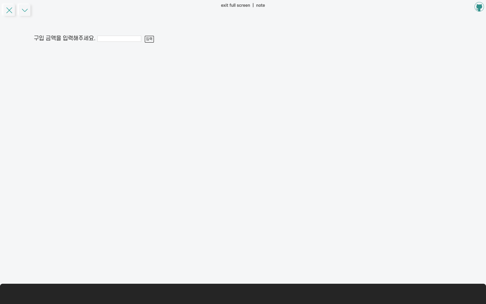
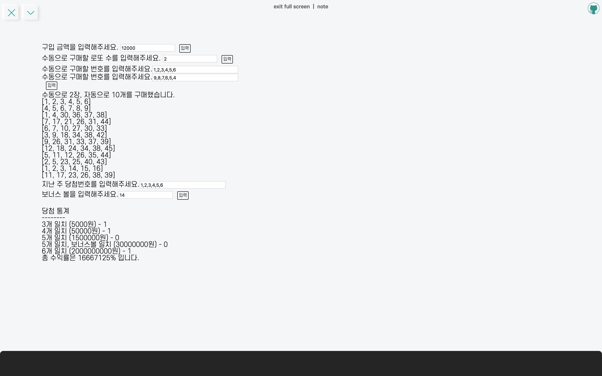

이번에 만들어본 소마법 프로젝트는 로또 어플리케이션으로, OOP study 미션 중 하나이다. **OOP** 와 **유닛테스트**에 중심을 두어서 코드를 짜보았고, 쓰이는 함수들은 최대한 **모듈화**시켜서 코드를 짜보았다.

<hr/>

```toc
exclude: Table of Contents
from-heading: 1
to-heading: 1
```

# \#. Project Map

- :apple: <a href="https://small-magic-project.now.sh/" target="_blank">프로젝트 사이트</a>

- :apple: <a href="https://small-magic-project.now.sh/lotto" target="_blank">프로젝트 사이트/lotto</a>

* :fire: <a href="https://github.com/taenykim/small-magic-project" target="_blank">프로젝트 깃허브소스</a>

<br/>

<details>
<summary>제작노트 한눈에보기[접기/펼치기]</summary>
<div markdown="1">

- [소마법 프로젝트 - 1 (container)](https://taeny.dev/project/%EC%86%8C%EB%A7%88%EB%B2%95-%ED%94%84%EB%A1%9C%EC%A0%9D%ED%8A%B81/)

- [소마법 프로젝트 - 2 (calculator)](https://taeny.dev/project/%EC%86%8C%EB%A7%88%EB%B2%95-%ED%94%84%EB%A1%9C%EC%A0%9D%ED%8A%B82/)

- [소마법 프로젝트 - 3 (graph)](https://taeny.dev/project/%EC%86%8C%EB%A7%88%EB%B2%95-%ED%94%84%EB%A1%9C%EC%A0%9D%ED%8A%B83/)

- [소마법 프로젝트 - 4 (crawling)](https://taeny.dev/project/%EC%86%8C%EB%A7%88%EB%B2%95-%ED%94%84%EB%A1%9C%EC%A0%9D%ED%8A%B84/)

- [소마법 프로젝트 - 5 (today)](https://taeny.dev/project/%EC%86%8C%EB%A7%88%EB%B2%95-%ED%94%84%EB%A1%9C%EC%A0%9D%ED%8A%B85/)

- [소마법 프로젝트 - 6 (jjal)](https://taeny.dev/project/%EC%86%8C%EB%A7%88%EB%B2%95-%ED%94%84%EB%A1%9C%EC%A0%9D%ED%8A%B86/)

- [소마법 프로젝트 - 7 (avengers)](https://taeny.dev/project/%EC%86%8C%EB%A7%88%EB%B2%95-%ED%94%84%EB%A1%9C%EC%A0%9D%ED%8A%B87/)

- [소마법 프로젝트 - 8 (maskmap)](https://taeny.dev/project/%EC%86%8C%EB%A7%88%EB%B2%95-%ED%94%84%EB%A1%9C%EC%A0%9D%ED%8A%B88/)

- [소마법 프로젝트 - 9 (loading)](https://taeny.dev/project/%EC%86%8C%EB%A7%88%EB%B2%95-%ED%94%84%EB%A1%9C%EC%A0%9D%ED%8A%B89/)

- [소마법 프로젝트 - 10 (lazyloading)](https://taeny.dev/project/%EC%86%8C%EB%A7%88%EB%B2%95-%ED%94%84%EB%A1%9C%EC%A0%9D%ED%8A%B810/)

- [소마법 프로젝트 - 11 (music)](https://taeny.dev/project/%EC%86%8C%EB%A7%88%EB%B2%95-%ED%94%84%EB%A1%9C%EC%A0%9D%ED%8A%B811/)

- [소마법 프로젝트 - 12 (racingcar)](https://taeny.dev/project/%EC%86%8C%EB%A7%88%EB%B2%95-%ED%94%84%EB%A1%9C%EC%A0%9D%ED%8A%B812/)

- [소마법 프로젝트 - 13 (lotto)](https://taeny.dev/project/%EC%86%8C%EB%A7%88%EB%B2%95-%ED%94%84%EB%A1%9C%EC%A0%9D%ED%8A%B813/)

</div>
</details>

# 1. Layout

## 1-1. 메인화면



구입 금액으로 시작. (숫자입력)

## 1-2. 결과화면



> 로또 1등에 당첨되었다..! ㅎㅎ

# 2. Code flow

로또 프로그램의 경우, 입력폼 submit 이벤트가 발생한 후, 조건에 맞는 다음 입력폼이 나와야 하기 때문에 react hooks를 이용해서 값이 true가 되었을 시, 다음 입력폼을 생성해주도록 해주었다.

```tsx
const [gotALottoCount, setGotALottoCount] = useState(false)

const onSubmitPurchaseAmount = (e: any) => {
  e.preventDefault()
  setGotALottoCount(false)

  //...
  setGotALottoCount(true)
}

return
{
  gotALottoCount && (
    <form onSubmit={onSubmitManualLottoCount}>
      <label htmlFor="manualLottoCountInput">
        수동으로 구매할 로또 수를 입력해주세요.{' '}
      </label>
      <input
        id="manualLottoCountInput"
        type="text"
        value={manualLottoCount}
        onChange={onChangeManualLottoCount}
      ></input>
      <button type="submit">입력</button>
    </form>
  )
}
```

예를 들어, `onSubmitPurchaseAmount` 가 구입금액 입력폼에 대한 submit 이벤트핸들러 함수인데, 해당 함수가 끝나고 `setGotALottoCount(true)` 를 통해 gotALottoCount를 true로 바꿔 주어서, 다음 form 엘리먼트가 생성되도록 해주었다. 그리고 submit 이벤트핸들러 함수 초반에 `setGotALottoCount(false)` 라는 초기값 리셋코드도 넣어주었다.

# 3. Validator

## 3-1. 유효성검사 에러 메시지 출력

react hooks 를 통해, 유효성 검사에 따른 에러메시지 출력도 해주었다. 에러메시지에 대한 네이밍을 하다보니 변수명이 40자가 넘어가는 경우가 허다했다. ㅠㅠ 변수명에 대한 고민도 다시 해봐야겠다..

```tsx
const [purchaseAmountIsBlankError, setPurchaseAmountIsBlankError] = useState(
  false
)
const [
  purchaseAmountIsNotNumberError,
  setPurchaseAmountIsNotNumberError,
] = useState(false)
const [
  purchaseAmountIsLessThanMinimumAmountError,
  setPurchaseAmountIsLessThanMinimumAmountError,
] = useState(false)

return
{
  purchaseAmountIsBlankError && (
    <div style={{ color: 'red' }}>구입 금액을 입력하지 않았습니다.</div>
  )
}
{
  purchaseAmountIsNotNumberError && (
    <div style={{ color: 'red' }}>구입 금액은 숫자로 입력해주세요.</div>
  )
}
{
  purchaseAmountIsLessThanMinimumAmountError && (
    <div style={{ color: 'red' }}>
      로또 최소 구입 가격은 {LOTTO_PRICE}원입니다.
    </div>
  )
}
```

## 3-2. Validator 모듈

Validator(유효성검사)는 모듈로 따로 관리해주었고 에러발생시 에러메시지 문자열을 리턴하고, 에러가 없으면 입력값을 그대로 리턴하도록 해주었다.

```tsx
// App.tsx

import { validatePurchaseAmountInput } from './modules/formValidator'

const onSubmitPurchaseAmount = (e: any) => {
  e.preventDefault()
  setPurchaseAmountIsBlankError(false)
  setPurchaseAmountIsNotNumberError(false)
  setPurchaseAmountIsLessThanMinimumAmountError(false)
  setGotALottoCount(false)

  const validatedPurchaseAmount = validatePurchaseAmountInput(
    purchaseAmount,
    LOTTO_PRICE
  )
  if (validatedPurchaseAmount === 'PURCHASE_AMOUNT_IS_BLANK_ERROR') {
    return setPurchaseAmountIsBlankError(true)
  }
  if (validatedPurchaseAmount === 'PURCHASE_AMOUNT_IS_NOT_NUMBER_ERROR') {
    return setPurchaseAmountIsNotNumberError(true)
  }
  if (
    validatedPurchaseAmount ===
    'PURCHASE_AMOUNT_IS_LESS_THAN_MINIMUM_AMOUNT_ERROR'
  ) {
    return setPurchaseAmountIsLessThanMinimumAmountError(true)
  }
  const _purchaseAmount = Number(validatedPurchaseAmount)
  const lottoCount = Math.floor(_purchaseAmount / LOTTO_PRICE)
  setLottoCount(lottoCount)
  setGotALottoCount(true)
}
```

유효성검사 모듈 `formValidator.ts` 파일 안에서 함수하나하나 export 해주었다.

```ts
// formValidator.ts

export const validatePurchaseAmountInput = (
  purchaseAmount: string,
  lottoPrice: number
) => {
  let _purchaseAmount = purchaseAmount.trim()

  if (_purchaseAmount.length === 0) {
    return 'PURCHASE_AMOUNT_IS_BLANK_ERROR'
  }

  const purchaseAmountHasString =
    _purchaseAmount && _purchaseAmount.match(/\D/g)
  if (purchaseAmountHasString !== null && purchaseAmountHasString.length >= 0) {
    return 'PURCHASE_AMOUNT_IS_NOT_NUMBER_ERROR'
  }
  if (_purchaseAmount.length < String(lottoPrice).length) {
    return 'PURCHASE_AMOUNT_IS_LESS_THAN_MINIMUM_AMOUNT_ERROR'
  }

  return _purchaseAmount
}
```

# 4. Lotto 객체

로또 한장을 의미하는 Lotto 객체를 class 문법을 사용해서 만들어주었다.

```ts
export class Lotto {
  numbers: number[] = []

  constructor(numbers: number[]) {
    this.numbers = numbers
  }
}
```

아래 코드는 수동로또 번호를 Lotto 객체 배열 안에 넣는 예시인데, 입력받은 문자열을 분리하고 숫자로 변환한 후 sorting까지 해서 Lotto객체에 담아주었다. 그리고 Lotto 객체 배열에 push 해주었다.

> 이 역시, 제대로 수행하기 위해서는 Validator(유효성 검사)를 통해 모든 에러를 잡아주는 것이 선결조건이었다.

```ts
const _myLottos: Lotto[] = []
for (let i = 0; i < Number(manualLottoCount); i++) {
  const _manualLotto = manualLottos[i].split(',')
  const manualLottoNumbers = _manualLotto.map(lottoNumber =>
    Number(lottoNumber)
  )
  const sortedManualLottoNumbers = manualLottoNumbers.sort((a, b) => a - b)
  _myLottos.push(new Lotto(sortedManualLottoNumbers))
}
```

# 5. WinningLotto 객체

WinningLotto 객체는 우승로또에 대한 정보와 유저로또와 비교하는 메소드를 갖는 객체로, 마찬가지로 class 문법을 이용해서 만들어주었다.

```ts
import { Lotto } from './Lotto'

export class WinningLotto {
  lotto: Lotto
  bonusNo: number = 0

  constructor(lotto: Lotto, bonusNo: number) {
    this.lotto = lotto
    this.bonusNo = bonusNo
  }

  match(userLotto: Lotto) {
    let count = 0
    let bonusCount = 0
    this.lotto.numbers.map(number => {
      userLotto.numbers.indexOf(number) >= 0 && count++
    })
    userLotto.numbers.indexOf(this.bonusNo) >= 0 && bonusCount++
    if (count === 6) return 'FIRST'
    if (count === 5 && bonusCount) return 'SECOND'
    if (count + bonusCount === 5) return 'THIRD'
    if (count + bonusCount === 4) return 'FOURTH'
    if (count + bonusCount === 3) return 'FIFTH'
    return 'MISS'
  }
}
```

`match` 메소드는 맞은 로또 개수에 따른 등수를 리턴하므로 이런식으로 사용해주었다.

```ts
const RANKS = {
  FIRST: 0,
  SECOND: 0,
  THIRD: 0,
  FOURTH: 0,
  FIFTH: 0,
  MISS: 0,
}

for (let i = 0; i < myLottos.length; i++) {
  RANKS[winningLotto.match(myLottos[i])]++
}
```

# 6. LottoFunctions 모듈

로또에 대한 함수모듈을 모아두는 lottoFunctions.ts 를 만들어주었다. 이 파일 내에서는 랜덤 로또넘버를 생성하는 함수와, 그에 맞는 로또 객체를 생성해서 로또 객체배열을 리턴하는 함수 두개를 만들어주었다. 그리고 로또 규칙이 달라질 수 있으니, 상수또한 외부에서 관리할 수 있도록 `LOTTO_NUMBERS` (모든 로또번호가 들어있는 배열 : [1,2,3...45]), `LOTTO_COUNT` (로또를 선택할 수 있는 횟수 : 6) 을 parameter로 넣게 해주었다.

```ts
// lottoFunctions.ts
import { Lotto } from './Lotto'

export const makeAutomaticLotto = (
  lottoCount: number,
  LOTTO_NUMBERS: number[],
  LOTTO_COUNT: number
) => {
  const lottos: Lotto[] = []
  for (let i = 0; i < lottoCount; i++) {
    lottos.push(
      new Lotto(
        setRandomNumbers(LOTTO_NUMBERS, LOTTO_COUNT).sort(
          (a: number, b: number) => a - b
        )
      )
    )
  }
  return lottos
}

export const setRandomNumbers = (
  LOTTO_NUMBERS: number[],
  LOTTO_COUNT: number
) => {
  let takenLottoNumbers = [...LOTTO_NUMBERS]
  const resultNumbers: number[] = []
  for (let j = 0; j < LOTTO_COUNT; j++) {
    const randomNumber = Math.floor(
      Math.random() * (LOTTO_NUMBERS[LOTTO_NUMBERS.length - 1] - j)
    )
    const chosen = takenLottoNumbers.splice(randomNumber, 1)[0]
    resultNumbers.push(Number(chosen))
  }
  return resultNumbers
}
```

# 7. UnitTest

유닛테스트는 given, when, then 3가지 단계로 발생할 수 있는 모든 경우를 (최대한 ㅠ) 테스트 해주었다. 아래는 WinningLotto의 match 메소드에 대한 테스트의 예이다.

```ts
// WinningLotto.test.ts

import { WinningLotto } from './WinningLotto'
import { Lotto } from './Lotto'

describe('WinningLotto객체 match메소드', () => {
  // given
  const FirstLotto = new Lotto([1, 2, 3, 4, 5, 6])
  const winningLotto = new WinningLotto(FirstLotto, 7)
  it('WinningLotto객체에 6개의 숫자 모두 맞을 경우, 1등을 리턴하는지 확인', () => {
    // when
    const myLotto = new Lotto([1, 2, 3, 4, 5, 6])
    const result = winningLotto.match(myLotto)
    // then
    expect(result).toStrictEqual('FIRST')
  })
  it('WinningLotto객체에 5개의 숫자, 1개의 보너스볼이 맞을 경우, 2등을 리턴하는지 확인', () => {
    // when
    const myLotto = new Lotto([1, 2, 3, 4, 5, 7])
    const result = winningLotto.match(myLotto)
    // then
    expect(result).toStrictEqual('SECOND')
  })
  it('WinningLotto객체에 5개의 숫자만 맞을 경우, 3등을 리턴하는지 확인', () => {
    // when
    const myLotto = new Lotto([1, 2, 3, 4, 5, 8])
    const result = winningLotto.match(myLotto)
    // then
    expect(result).toStrictEqual('THIRD')
  })
  it('WinningLotto객체에 4개의 숫자만 맞을 경우, 4등을 리턴하는지 확인', () => {
    // when
    const myLotto = new Lotto([1, 2, 3, 4, 8, 9])
    const result = winningLotto.match(myLotto)
    // then
    expect(result).toStrictEqual('FOURTH')
  })
  it('WinningLotto객체에 3개의 숫자만 맞을 경우, 5등을 리턴하는지 확인', () => {
    // when
    const myLotto = new Lotto([1, 2, 3, 8, 9, 10])
    const result = winningLotto.match(myLotto)
    // then
    expect(result).toStrictEqual('FIFTH')
  })
  it('WinningLotto객체에 맞는 숫자가 3개도 없을 경우 MISS를 리턴하는지 확인', () => {
    // when
    const myLotto = new Lotto([8, 9, 10, 11, 12, 13])
    const result = winningLotto.match(myLotto)
    // then
    expect(result).toStrictEqual('MISS')
  })
})
```

테스트를 하면서 무조건 에러가 나지 않겠지? 생각했지만 실수는 곳곳에 숨겨져 있었다. ㅎㅎ;; 이번에 테스트의 필요성을 확실히 느끼게 되었던 것 같다.

# 8. Self-feedback

## 8-1. 변수명 짓기

에러 출력에 대한 변수명이 기본 30자에서 40자까지 넘어가는 경우가 있었다. 최대한 기능을 알아볼 수 있게 쓰려했지만 너무 길어도 한눈에 파악하기가 쉽지 않았다. 이럴 경우는 어떻게 해야 좋을 지 좀 더 고민 해봐야할 것 같다.

## 8-2. 컴포넌트 스플리팅

이번 lotto 어플리케이션은 컴포넌트를 따로 분리하지 않고 `App.tsx` 에서 모든 로직을 실행했다. 상태관리가 쉽다는 점 때문이었는데, 나중에 한번 form 태그들을 분리해보는 것도 좋은 연습이 될 것 같다.
