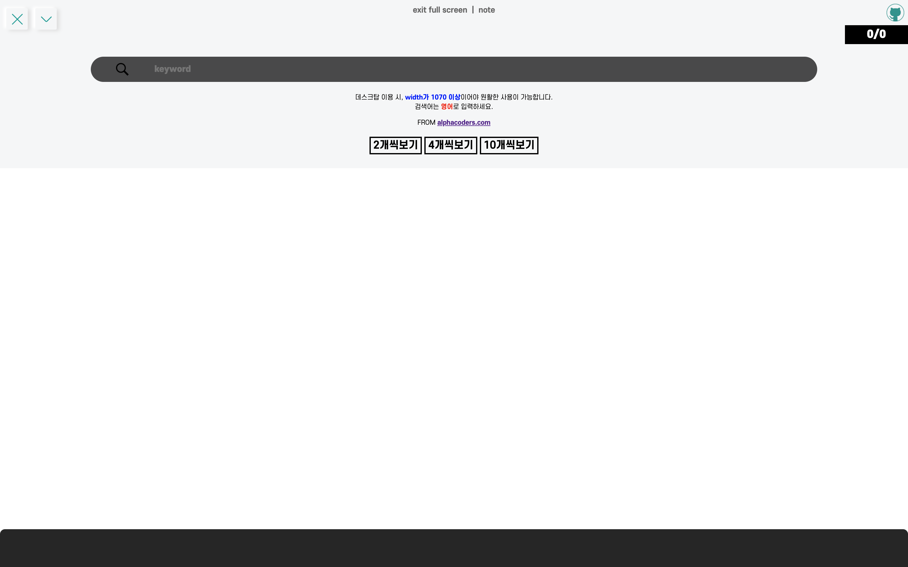
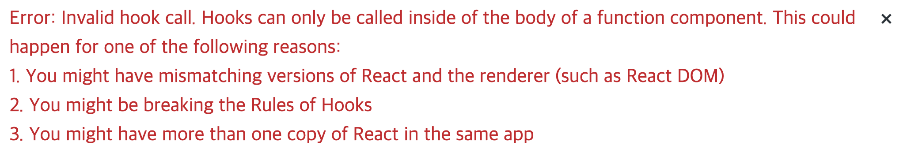

배경화면을 찾을 때, alpacoders라는 대형 Wallpaper 사이트를 자주 이용하는 편인데

키워드를 검색했을 때, 30개씩 정보를 보여주고 다음페이지를 **클릭**해서 넘어가야지만 다음 정보를 가져오는데에 **불편함**을 느껴 키워드를 검색했을 때 클릭하는 번거로움 없이 **한눈에** 이미지들을 보면 좋을 것 같다는 생각에 웹사이트를 기획해보았다.

> 전통적인 web게시판 -> SPA형태

이번에는 리액트 **functial component + hooks** 가 아니라 **class component**를 이용하였다.

<hr/>

```toc
exclude: Table of Contents
from-heading: 1
to-heading: 5
```

# \#. Project Map

- :apple: <a href="https://small-magic-project.now.sh/" target="_blank">프로젝트 사이트</a>

- :apple: <a href="https://small-magic-project.now.sh/crawling" target="_blank">프로젝트 사이트/crawling</a>

* :fire: <a href="https://github.com/taenykim/small-magic-project" target="_blank">프로젝트 깃허브소스</a>

<br/>

> 제작노트

- [소마법 프로젝트 - 1 (container)](https://taeny.dev/project/%EC%86%8C%EB%A7%88%EB%B2%95-%ED%94%84%EB%A1%9C%EC%A0%9D%ED%8A%B81/)

- [소마법 프로젝트 - 2 (calculator)](https://taeny.dev/project/%EC%86%8C%EB%A7%88%EB%B2%95-%ED%94%84%EB%A1%9C%EC%A0%9D%ED%8A%B82/)

- [소마법 프로젝트 - 3 (graph)](https://taeny.dev/project/%EC%86%8C%EB%A7%88%EB%B2%95-%ED%94%84%EB%A1%9C%EC%A0%9D%ED%8A%B83/)

- [소마법 프로젝트 - 4 (crawling)](https://taeny.dev/project/%EC%86%8C%EB%A7%88%EB%B2%95-%ED%94%84%EB%A1%9C%EC%A0%9D%ED%8A%B84/)

- [소마법 프로젝트 - 5 (today)](https://taeny.dev/project/%EC%86%8C%EB%A7%88%EB%B2%95-%ED%94%84%EB%A1%9C%EC%A0%9D%ED%8A%B85/)

- [소마법 프로젝트 - 6 (jjal)](https://taeny.dev/project/%EC%86%8C%EB%A7%88%EB%B2%95-%ED%94%84%EB%A1%9C%EC%A0%9D%ED%8A%B86/)

- [소마법 프로젝트 - 7 (avengers)](https://taeny.dev/project/%EC%86%8C%EB%A7%88%EB%B2%95-%ED%94%84%EB%A1%9C%EC%A0%9D%ED%8A%B87/)

- [소마법 프로젝트 - 8 (maskmap)](https://taeny.dev/project/%EC%86%8C%EB%A7%88%EB%B2%95-%ED%94%84%EB%A1%9C%EC%A0%9D%ED%8A%B88/)

# 1. 레이아웃

## 1-1. 메인화면 (검색전)



1. `page 뷰` : 우측 상단에 page 뷰를 만들어서 해당 키워드에 대한 **현재 이미지 수 / 전체 이미지 수** 를 보이도록 했다.

2. `검색 창` : 중앙에 검색 창을 두었다.

3. `설명` : 검색 창 아래에는 어플리케이션에 대한 설명을 적었다.

4. `이미지 보기방식 버튼` : 설명 밑에 이미지 보기 방식에 대한 버튼을 두었다.

## 1-2. 서칭화면 (검색후)

> keyword : captain


1. `z-index`: 해당 화면을 메인화면의 z-index보다 낮게 하여 검색결과를 보면서 다시 검색을 하거나 버튼등을 이용할 수 있게 하였다.

2. `image Link` : 이미지를 크롤링 할 때, 해당 url을 같이 크롤링하여 이미지를 클릭하면 해당 이미지의 고화질 이미지를 볼 수 있는 링크로 이동되게 하였다.

## 1-3. 이미지 보기방식 버튼

> 버튼을 클릭하면 state의 gridmode를 변경하도록 하였다.

```js
<div
  onClick={() => {
    this.setState({
      gridmode: 10,
    })
  }}
>
  10개씩보기
</div>
```

> 그리고 state의 gridmode 에 따라 이미지를 레이아웃을 변경하도록 하였다.

```js
{
  this.state.gridmode === 10 &&
    this.state.result_arr.map((item, i) => (
      <a
        key={i}
        href={'https://wall.alphacoders.com/' + item.link}
        target="_blank"
      >
        </img>
      </a>
    ))
}
```

# 2. 상태관리

```jsx
class Layout extends Component {
  state = {
    searchingName: '',
    page: 1,
    imageNumber: 0,
    imageMaxNumber: 0,
    gridmode: 4,
    result_arr: []
  }
```

## 2-1. 리액트 state

기존 프로젝트의 하위 어플리케이션의 상태들은 functional component + hooks로 만들었었는데, 이번 크롤링 어플리케이션은 `class component` + `state` 로 만들었다.

상태변수는

> 1. `searchingName` : 검색어

> 2. `page` : 해당 검색어에 대한 크롤링 페이지 인덱스

> 3. `imageNumber` : 해당 검색어에 대한 이미지 수

> 4. `imageMaxNumber` : 해당 검색어에 대한 전체 이미지 수

> 5. `gridmode` : 이미지 보기방식

> 6. `result_arr` : 이미지 정보가 들어갈 배열

# 3. 크롤링

## 3-1. fetch (AJAX)

ajax 방식은 내장 API `fetch` 를 사용했다.

```js
const url = 'url + searchingName info + page info'
fetch(url).then(res => {
  return res.text()
})
```

> url 에 대한 html을 text() 메소드로 가져오게끔 함.

## 3-2. proxy (CORS)

주소가 다른 서버의 요청 때문에 CORS 이슈가 발생했는데 내가 서버를 제어할 수 없는 입장이어서

`https://cors-anywhere.herokuapp.com` proxy API를 이용했다.

> :hatched_chick: 혹시나 해서 nodeJS에서 크롤링코드를 돌려봤는데 CORS이슈가 없었다. 다시 공부할 것!

## 3-3. Cheerio (Parsing)

불러온 html 정보를 파싱하기 위해 cheerio 모듈을 사용했다.

```
npm i cheerio
```

```js
const cheerio = require('cheerio')
 fetch(url)
      .then(res => {
        return res.text()
      })
      .then(text => {
        const $ = cheerio.load(text)
        let json = [],
          id,
          link,
          img
        const maxNum = Number(
          $('#page_container > h1')
            .text()
            .split(' ')[8]
        )
        // :star: 반응형 처리
        if (window.innerWidth < 1070) {
          $('#page_container > div:nth-child(6) > div.thumb-container').each(function(i, elem) {
            id = i
            link = $(this)
              .find('div.thumb-container > a')
              .attr('href')
            img = $(this)
              .find('div.thumb-container > a.wallpaper-thumb > img')
              .attr('data-src')
            json.push({ id: id, link: link, img: img })
          })
        } else {
          $('#page_container > div:nth-child(6) > div.thumb-container-big').each(function(i, elem) {
            id = i
            link = $(this)
              .find('div.thumb-container > div.boxgrid > a')
              .attr('href')
            img = $(this)
              .find('div.thumb-container > div.boxgrid > a > img')
              .attr('data-src')
            json.push({ id: id, link: link, img: img })
          })
        }
        // :star: 마지막 페이지 처리
        if (this.state.imageMaxNumber >= this.state.imageNumber) {
          this.setState({
            result_arr: this.state.result_arr.concat(json),
            imageMaxNumber: maxNum,
            imageNumber: this.state.imageNumber + 30
          })
        }
      })
      .catch(error => console.log(error))
  }
```

### :star: 반응형 처리

또한 크롤링을 하려면 해당 웹사이트의 css 선택자에 접근을 해야하는데 해당사이트는 디바이스에 따라 선택자가 달랐다.

> 즉, 모바일과 데스크탑 css 선택자가 달랐다.

그래서 innerWidth가 1070보다 클 경우 데스크탑으로 인식하게끔, 1070 이하일 경우는 모바일로 인식하게끔 조건문 처리를 해주었다.

###### :question: innerWidth 말고 현재 환경(데스크탑, 모바일)을 인식하는 방법을 찾아볼 것.

### :star: 마지막 페이지 처리

스크롤 이벤트로 인한 HTTP 요청,응답 부분이 **요청,응답,요청,응답** 순이 아닌 **요청,요청,응답,응답** 순의 `비동기 방식`으로 인해 마지막 페이지에 갔을 때 마지막페이지에 대한 요청을 여러번 응답해서 중복되는 경우가 발생했다.

> 마지막 페이지가 아니라 중간 페이지일 경우, 여러 요청을 받아도 상관 없으나 마지막 페이지는 이미지를 중복으로 가져오는 오류를 낳는다.

그래서 `요청`하는 부분이 아닌 `응답` 부분인 데이터를 넣는 과정에서 조건문을 넣어 이를 해결하였다.

# 4. 무한스크롤

```js
  componentDidMount() {
    window.addEventListener(
      'scroll',
      _.debounce(() => {
        if (
          window.scrollY + document.documentElement.clientHeight >
            document.documentElement.scrollHeight - 260 &&
          this.state.imageMaxNumber >= this.state.imageNumber
        ) {
          this.setState(
            {
              page: this.state.page + 1
            },
            () => this.crawling()
          )
        }
      }, 1000)
    )
  }
```

## 4-1. scroll event

스크롤 이벤트는 `componentDidMount()` 메소드를 통해 추가해주었다.

그리고 마지막 페이지에는 이벤트에 대한 콜백함수가 실행되지 않도록 조건문 처리를 해주었다.

## 4-2. \_.debounce (lodash)

그리고 스크롤 이벤트 부분에 lodash 라이브러리의 \_.debounce 메소드를 넣어주어 최적화 작업도 해주었다.

```
npm i lodash
```

```js
const _ = require('lodash')
```

# 5. 비동기처리 (callback)

```js
submitHandler = e => {
  e.preventDefault()
  this.setState(
    {
      result_arr: [],
      imageNumber: 0,
      imageMaxNumber: 0,
      page: 1,
    },
    () => {
      this.crawling()
    }
  )
}
```

크롤링 함수를 state가 바꾼 후에 실행되도록 `callback` 을 이용했다.

> 무한스크롤 부분도 마찬가지 callback을 사용했다.

이번 프로젝트를 하면서 가장 막히고 이해하려고 애썼던 부분이 javascript의 비동기방식이었던 것 같다.

# 6. 개인적인 피드백

## 6-1. 리덕스 기능 없음

리덕스 hooks (useDispatch(), useSelector())는 함수형 컴포넌트에만 쓸 수 있다는 것을 마지막에 깨달았다..



> 다른 방식으로 리듀서를 장착할 수 있겠지만, 다음부터는 최대한 함수형 컴포넌트를 사용하자는 생각을 하며, 리덕스 기능을 포기했다.

## 6-2. class 형 컴포넌트

그럼 더 원론적으로 함수형을 하지 못한 이유는?

처음에는 함수형 컴포넌트 + hooks를 사용해서 만들려고 했으나, hooks 로 만든 상태들이 계속 리셋되고 하는 문제가 발생했다. 그리고 useState hooks 의 setState 부분에서 콜백함수를 만들 줄 몰라 그냥 class 로 다시 작성하였다.

> hooks의 원리를 좀더 깊게 학습할 필요를 느꼈다.

## 6-3. 로딩 애니메이션

스크롤을 내리면 데이터를 불러오긴 하는데 로딩 애니메이션을 넣지 않았다.

> 사용자가 데이터를 불러오는지 마는지 모르기 때문에 ux적인 면에서 별루다..

> 로딩 애니메이션도 공부하기!

# 7. 이스터에그

> 스크롤이 답답하다면 `10개씩 보기` 버튼을 마구 클릭하자. 크롤링 코드를 여기에도 넣어두어서 데이터를 더 빨리 불러올 수 있다.
