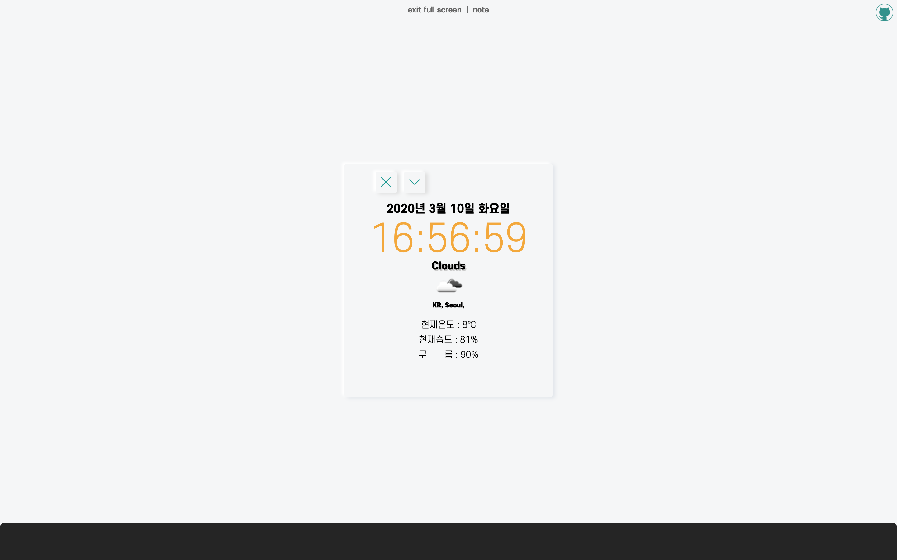
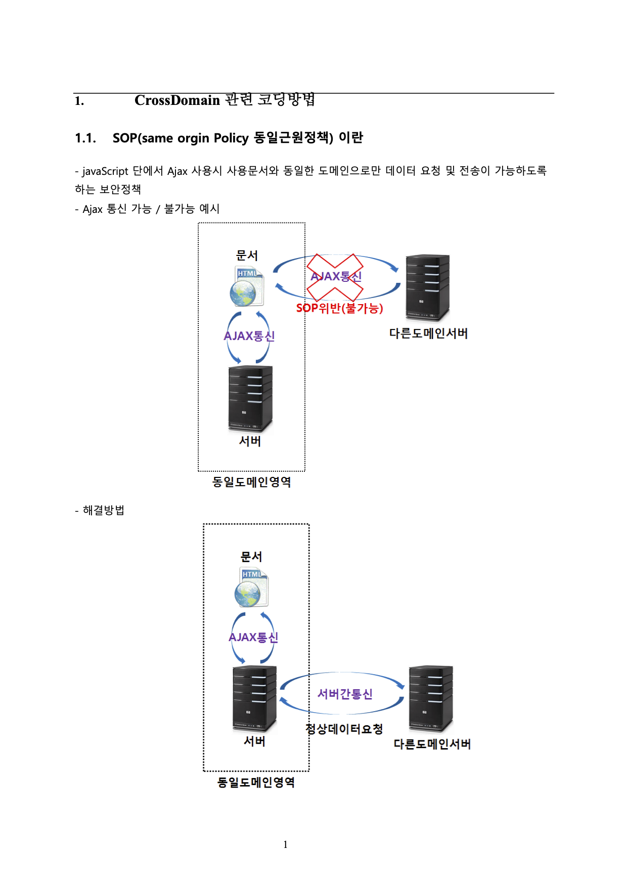

```toc
exclude: Table of Contents
from-heading: 1
to-heading: 5
```

# \#. Project Map

- <a href="https://small-magic-project.now.sh/" target="_blank">프로젝트 사이트</a> :apple:

- <a href="https://github.com/taenykim/small-magic-project" target="_blank">프로젝트 깃허브소스</a>

<br/>

> 제작노트

- [소마법 프로젝트 - 1 (container)](https://taeny.dev/project/%EC%86%8C%EB%A7%88%EB%B2%95-%ED%94%84%EB%A1%9C%EC%A0%9D%ED%8A%B81/)

- [소마법 프로젝트 - 2 (calculator)](https://taeny.dev/project/%EC%86%8C%EB%A7%88%EB%B2%95-%ED%94%84%EB%A1%9C%EC%A0%9D%ED%8A%B82/)

- [소마법 프로젝트 - 3 (graph)](https://taeny.dev/project/%EC%86%8C%EB%A7%88%EB%B2%95-%ED%94%84%EB%A1%9C%EC%A0%9D%ED%8A%B83/)

- [소마법 프로젝트 - 4 (crawling)](https://taeny.dev/project/%EC%86%8C%EB%A7%88%EB%B2%95-%ED%94%84%EB%A1%9C%EC%A0%9D%ED%8A%B84/)

- [소마법 프로젝트 - 5 (today)](https://taeny.dev/project/%EC%86%8C%EB%A7%88%EB%B2%95-%ED%94%84%EB%A1%9C%EC%A0%9D%ED%8A%B85/)

- [소마법 프로젝트 - 6 (jjal)](https://taeny.dev/project/%EC%86%8C%EB%A7%88%EB%B2%95-%ED%94%84%EB%A1%9C%EC%A0%9D%ED%8A%B86/)

- [소마법 프로젝트 - 7 (avengers)](https://taeny.dev/project/%EC%86%8C%EB%A7%88%EB%B2%95-%ED%94%84%EB%A1%9C%EC%A0%9D%ED%8A%B87/)

# 0. Intro

`Date` 객체와 `날씨 api` 를 이용한 오늘의 날짜, 시계, 날씨 앱을 볼 수 있는 어플리케이션.

시계는 매초마다 리로드되며, 날씨는 초기로딩 때만 로드되게 설정해주었다.

> 코드 스플리팅

# 1. 레이아웃



> 위에서부터 날짜, 시간, 날씨 순..

# 2. 시계 (Clock)

## 2-1. 상태관리 (state)

```jsx
const weekArr = ['일', '월', '화', '수', '목', '금', '토']

const [year, setYear] = useState('')
const [month, setMonth] = useState('')
const [day, setDay] = useState('')
const [week, setWeek] = useState('')

const [hours, setHours] = useState('')
const [minutes, setMinutes] = useState('')
const [seconds, setSeconds] = useState('')
```

년, 월, 일, 요일, 시간, 분, 초를 각각 hooks 로 만들어주었다.

그리고 요일을 한글로 출력해줄 배열을 따로 만들어주었다.

## 2-2. 동작 (setInterval)

```jsx
useEffect(() => {
  clock()
  setInterval(clock, 1000)
})

const clock = () => {
  const date = new Date()

  // setTodayDate(date)
  setYear(date.getFullYear())
  setMonth(date.getMonth())
  setDay(date.getDate())
  setWeek(date.getDay())

  setHours(date.getHours())
  setMinutes(date.getMinutes())
  setSeconds(date.getSeconds())
}
```

마운트가 끝나고 `useEffect` 함수를 실행할 때, **clock** 함수를 한번 실행하게 하고

그다음부터는 `setInterval` 함수로 **clock**함수를 주기적으로 실행되도록 해주었다.

## 2-3. 뷰 (View)

```jsx
<>
  <div style={{ marginTop: '5px', fontSize: '18px', fontFamily: 'escore7' }}>
    {year}년 {month + 1}월 {day}일 {weekArr[week]}요일
  </div>
  <div style={{ marginTop: '10px', fontSize: '60px', color: 'orange' }}>
    {hours < 10 ? `0${hours}` : hours}:{minutes < 10 ? `0${minutes}` : minutes}:
    {seconds < 10 ? `0${seconds}` : seconds}
  </div>
</>
```

1.

태그들이 복잡한 구조가 아니여서, styled Component 말고 `style 속성`을 사용했다.

2.

시간, 분, 초가 한자리일 경우 앞에 `0`을 붙여 어색하지 않게 해주었다.

> 삼항 연산자와 템플릿 리터럴을 사용해보았다.

# 3. 날씨 (Weather)

## 3-1. 상태관리 (state)

```jsx
const [temp, setTemp] = useState('')
const [humidity, setHumidity] = useState('')
const [weather, setWeather] = useState('')
const [weatherIcon, setWeatherIcon] = useState('')
const [country, setCountry] = useState('')
const [city, setCity] = useState('')
const [cloud, setCloud] = useState('')
```

날씨의 상태 (state) 도 마찬가지로 hooks를 이용했다.

각각, 기온, 습도, 날씨, 날씨아이콘, 나라, 도시, 구름의 양 이다.

## 3-2. 동작 (openweathermap API)

```jsx
useEffect(() => {
  weather_clock()
})

const weather_clock = () => {
  const url =
    'https://api.openweathermap.org/data/2.5/weather?q=Seoul&appid=5a852cca928001166e0c28dca72c5987'
  fetch(url)
    .then(res => {
      return res.json()
    })
    .then(json => {
      setTemp(Math.round(json.main.temp - 273.15))
      setHumidity(json.main.humidity)
      setWeather(json.weather[0].main)
      setWeatherIcon(json.weather[0].icon)
      setCountry(json.sys.country)
      setCity(json.name)
      setCloud(json.clouds.all + '%')
    })
}
```

날씨도 마찬가지로 `useEffect`를 이용해서 함수를 실행시켜 동작하도록 하였다.

api로는 `openweathermap API` 를 사용했다.

[https://openweathermap.org/](https://openweathermap.org/)

AJAX 는 `fetch` 메소드를 사용하였다.

## 3-3. 뷰 (View)

```jsx
<>
  <div
    style={{
      marginTop: '4px',
      fontFamily: 'escore8',
      fontSize: '16px',
      textShadow: '2px 2px #ccc',
    }}
  >
    {weather}
  </div>
  
  <div
    style={{
      fontSize: '10px',
      fontFamily: 'escore9',
    }}
  >
    {country}, {city},
  </div>
  <div style={{ marginTop: '20px', fontSize: '14px' }}>현재온도 : {temp}℃</div>
  <div style={{ marginTop: '10px', fontSize: '14px' }}>
    현재습도 : {humidity}%
  </div>
  <div style={{ marginTop: '10px', fontSize: '14px' }}>
    구 &nbsp; &nbsp; &nbsp; 름 : {cloud}
  </div>
</>
```

마찬가지로 styled component가 아닌 style 속성을 이용했다.

그리고 날씨 이미지 아이콘도 openweathermap API 에서 제공을 해줘서 같이 사용하였다.

# 4. 코드 스플리팅

## 4-1. today > layout.js

```jsx
// today > layout.js
import React from 'react'
import styled from 'styled-components'
import Weather from './Weather'
import Clock from './Clock'
import ContentsMenubar from '../ContentsMenubar'

const BackgroundContainer = styled.div`
  display: flex;
  flex-direction: column;
  justify-content: center;
  align-items: center;
  width: 100vw;
  height: 100vh;
  background: #f5f6f7;
`

const TodayContainer = styled.div`
  display: flex;
  flex-direction: column;
  justify-content: center;
  align-items: center;
  border-radius: 3px;
  box-shadow: -4px -2px 4px 0px white, 4px 2px 6px 0px #dfe4ea;
  padding: 0px 40px 60px 40px;
`

const Layout = () => {
  return (
    <>
      <BackgroundContainer>
        <TodayContainer>
          <ContentsMenubar name="today" />
          <Clock />
          <Weather />
        </TodayContainer>
      </BackgroundContainer>
    </>
  )
}

export default Layout
```

## 4-2. Error code : 429 (Too many Request)

처음에는 Date 객체로 상태를 계속 업데이트해주는 코드와 날씨 api로 데이터를 요청, 응답하는 코드를 한 곳에 두었었다.

근데, 쓸데없이 시간을 카운트하면서 계속 날씨 api 요청도 계속 보내서 나중에는 api 서버에서 에러(`429 Too many Request`)를 뱉어냈다.

> 내가 사용한 api는 무료였고, 초당 데이터를 더많이 요청하려면 유료로 전환해야함.

그래서 초당 업데이트가 필요한 Clock 컴포넌트와 기능들,

그리고 초기 로딩 때만 요청해도 괜찮은 Weather 컴포넌트와 기능들을 따로 빼주었다.

> api를 사용할 때, 요청의 양이 커짐에 따라 비용도 커진다는 것을 알게 되었다.

# 5. 개인적인 피드백

## 5-1. 서버리스

> [공공데이터포털](https://www.data.go.kr/)의 open API 지침서 중..



원래는 기상청 API 를 사용하려 했으나 브라우저 내 javascript 코드로 api에 접근할 경우 CORS 이슈가 있다는 이야기를 듣고 다른 api를 사용했다.

이전의 [소마법 프로젝트 - 4 (crawling)](https://taeny.dev/project/%EC%86%8C%EB%A7%88%EB%B2%95-%ED%94%84%EB%A1%9C%EC%A0%9D%ED%8A%B84/)크롤링 앱에서도 발생했었는데 CORS문제를 잘 해결하기 위해서는 서버를 하나 두고 `서버와 프론트의 AJAX`, 그리고 `서버와 api 통신` 이런식으로 하는 것이 좋을 것 같다고 생각했다.

> 사실 nodeJS 에서 따로 api 통신을 해보지는 않았지만 나중에 꼭 동일한 api 통신을 가지고 `웹 브라우저의 자바스크립트와 api통신`, 서버의 `nodeJS의 자바스크립트와 api통신` 둘다 하면서 비교해봐야겠다.

> [소마법 프로젝트 - 4 (crawling)](https://taeny.dev/project/%EC%86%8C%EB%A7%88%EB%B2%95-%ED%94%84%EB%A1%9C%EC%A0%9D%ED%8A%B84/)에서도 브라우저에서 발생했던 CORS 이슈가 nodeJS 에서는 발생하지 않았다.
