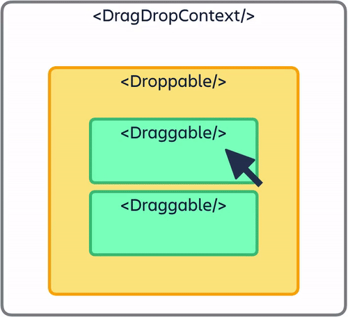

드래그 앤 드랍 기능을 간단하게 구현한 어플리케이션.

**react-beautiful-dnd** 라이브러리를 사용했고, 어벤져스 캐릭터들을 컨텐츠로 사용해보았다.

<hr/>

```toc
exclude: Table of Contents
from-heading: 1
to-heading: 5
```

# \#. Project Map

- :apple: <a href="https://small-magic-project.now.sh/" target="_blank">프로젝트 사이트</a>

- :apple: <a href="https://small-magic-project.now.sh/avengers" target="_blank">프로젝트 사이트/avengers</a>

* :fire: <a href="https://github.com/taenykim/small-magic-project" target="_blank">프로젝트 깃허브소스</a>

<br/>

<details>
<summary>제작노트 한눈에보기[접기/펼치기]</summary>
<div markdown="1">

- [소마법 프로젝트 - 1 (container)](https://taeny.dev/project/%EC%86%8C%EB%A7%88%EB%B2%95-%ED%94%84%EB%A1%9C%EC%A0%9D%ED%8A%B81/)

- [소마법 프로젝트 - 2 (calculator)](https://taeny.dev/project/%EC%86%8C%EB%A7%88%EB%B2%95-%ED%94%84%EB%A1%9C%EC%A0%9D%ED%8A%B82/)

- [소마법 프로젝트 - 3 (graph)](https://taeny.dev/project/%EC%86%8C%EB%A7%88%EB%B2%95-%ED%94%84%EB%A1%9C%EC%A0%9D%ED%8A%B83/)

- [소마법 프로젝트 - 4 (crawling)](https://taeny.dev/project/%EC%86%8C%EB%A7%88%EB%B2%95-%ED%94%84%EB%A1%9C%EC%A0%9D%ED%8A%B84/)

- [소마법 프로젝트 - 5 (today)](https://taeny.dev/project/%EC%86%8C%EB%A7%88%EB%B2%95-%ED%94%84%EB%A1%9C%EC%A0%9D%ED%8A%B85/)

- [소마법 프로젝트 - 6 (jjal)](https://taeny.dev/project/%EC%86%8C%EB%A7%88%EB%B2%95-%ED%94%84%EB%A1%9C%EC%A0%9D%ED%8A%B86/)

- [소마법 프로젝트 - 7 (avengers)](https://taeny.dev/project/%EC%86%8C%EB%A7%88%EB%B2%95-%ED%94%84%EB%A1%9C%EC%A0%9D%ED%8A%B87/)

- [소마법 프로젝트 - 8 (maskmap)](https://taeny.dev/project/%EC%86%8C%EB%A7%88%EB%B2%95-%ED%94%84%EB%A1%9C%EC%A0%9D%ED%8A%B88/)

- [소마법 프로젝트 - 9 (loading)](https://taeny.dev/project/%EC%86%8C%EB%A7%88%EB%B2%95-%ED%94%84%EB%A1%9C%EC%A0%9D%ED%8A%B89/)

- [소마법 프로젝트 - 10 (lazyloading)](https://taeny.dev/project/%EC%86%8C%EB%A7%88%EB%B2%95-%ED%94%84%EB%A1%9C%EC%A0%9D%ED%8A%B810/)

- [소마법 프로젝트 - 11 (music)](https://taeny.dev/project/%EC%86%8C%EB%A7%88%EB%B2%95-%ED%94%84%EB%A1%9C%EC%A0%9D%ED%8A%B811/)

  </div>
  </details>

# 1. 레이아웃

## 1-1. 메인화면


화면 구성은 드래그앤드랍 기능이 들어있는 상단 컨테이너와 데이터를 화면에 그려주는 하단 컨테이너, 크게 두 개로 구성하였다.

## 1-2. 컴포넌트

```jsx
<BackgroundContainer>
  <ContentsMenubar name="avengers" data={dndData} />
  <Description>Try Drag & Drop</Description>
  <TopContainer>
    <DragDropContext>
      <DndContainer>{/* 드래그앤 드랍 관련 code */}</DndContainer>
    </DragDropContext>
  </TopContainer>
  <Description>Make them friends</Description>
  <div className="mobile_description">scroll >>> </div>
  <BottomContainer>{/* 데이터 -> 뷰 code */}</BottomContainer>
</BackgroundContainer>
```

> **ContentsMenubar** : 리듀서에 데이터를 저장하거나 데이터를 리셋시킬 수 있는 메뉴바

> **Description** : 설명 (styled-component)

> **TopContainer** : 드래그앤 드랍 기능, react-beautiful-dnd 의 `DragDropContext API`를 사용했다.

> **div.mobile_description** : width가 BottomContainer 보다 작아지면 스크롤하라는 설명도 보이도록 해주었다.

> **BottomContainer** : 데이터를 화면에 그려주는 역할

# 2. 상태관리

```jsx
const data = useSelector(state => state.avengers)
const [dndData, setDndData] = useState(data)
```

## 2-1. 리액트 state

**리액트 hooks**를 이용해서 컴포넌트 내에서의 상태관리를 하였다.

그리고 드래그앤 드랍으로 데이터의 변경시, 불변성을 유지시켜주며 데이터를 바꾸어주었다.

> **dndData** : 객체형태의 현재 column, item들의 데이터

## 2-2. 리덕스 store

**리덕스 hooks**를 이용했다.

contentsMenuBar에서 데이터를 저장하는 버튼을 누르면 `useDispatch`를 통해 데이터를 저장하고

`useSelector`로 저장된 데이터를 불러왔다.

```js
// reducers > avengers.js

const initialState = {
  items: {
    'item-1': { id: 'item-1', content: 'Captain America', src: 'captain.jpg' },
    'item-2': { id: 'item-2', content: 'IonMan', src: 'ironman.jpg' },
    'item-3': { id: 'item-3', content: 'Thor', src: 'thor.jpg' },
    'item-4': { id: 'item-4', content: 'Hulk', src: 'hulk.jpg' },
    'item-5': { id: 'item-5', content: 'Spiderman', src: 'spider.jpg' },
    'item-6': { id: 'item-6', content: 'Groot', src: 'groot.jpg' },
    'item-7': { id: 'item-7', content: 'Rocket', src: 'rocket.jpg' },
    'item-8': { id: 'item-8', content: 'Thanos', src: 'thanos.png' },
  },
  columns: {
    'column-1': {
      id: 'column-1',
      title: 'Heros',
      itemIds: [
        'item-1',
        'item-2',
        'item-3',
        'item-4',
        'item-5',
        'item-6',
        'item-7',
      ],
    },
    'column-2': {
      id: 'column-2',
      title: 'villain',
      itemIds: ['item-8'],
    },
  },
  columnOrder: ['column-1', 'column-2'],
}
```

> avengers 리듀서의 초기 state

# 3. react-beauifult-dnd

## 3-1. DragDropContext

[https://github.com/atlassian/react-beautiful-dnd](https://github.com/atlassian/react-beautiful-dnd)



```jsx
<DragDropContext
  onDragStart={onDrageStartHandler}
  onDragUpdate={onDrageUpdateHandler}
  onDragEnd={onDrageEndHandler}
>
  <DndContainer>
    {dndData.columnOrder.map(columnId => {
      const column = dndData.columns[columnId]
      const items = column.itemIds.map(itemId => dndData.items[itemId])

      return <Column key={column.id} column={column} items={items} />
    })}
  </DndContainer>
</DragDropContext>
```

<hr/>

### :apple: onDrageStartHandler

> dnd 시작시점

```jsx
const onDrageStartHandler = () => {
  for (
    let i = 0;
    i < document.querySelectorAll('.droppable_table').length;
    i++
  ) {
    document.querySelectorAll('.droppable_table')[
      i
    ].style.background = `rgba(255,141,217,0.2)`
  }
}
```

TopConatiner에서 드래그앤드랍이 발생하는 column 부분의 class를 '.droppable_table'로 정의해주고 dnd가 시작되면 그 column 배경색을 변경해주었다.

<hr/>

### :apple: onDrageUpdateHandler

> dnd 업데이트되는 시점

```jsx
const onDrageUpdateHandler = update => {
  // ...
}
```

드래그앤드랍 중, 드래그 도중 발생하는 함수. 사용하지 않음.

<hr/>

### :apple: onDrageEndHandler

> dnd 종료시점

```jsx
const onDrageEndHandler = result => {
  document.body.style.color = 'inherit'
  document.body.style.background = 'inherit'
  for (
    let i = 0;
    i < document.querySelectorAll('.droppable_table').length;
    i++
  ) {
    document.querySelectorAll('.droppable_table')[
      i
    ].style.background = `inherit`
  }
  const { destination, source, draggableId } = result
  if (!destination) {
    return
  }
  if (
    destination.droppableId === source.droppableId &&
    destination.index === source.index
  ) {
    return
  }
  const start = dndData.columns[source.droppableId] // 'column-1'
  const finish = dndData.columns[destination.droppableId]

  if (start === finish) {
    const newItemIds = Array.from(start.itemIds)
    newItemIds.splice(source.index, 1)
    newItemIds.splice(destination.index, 0, draggableId)
    const newColumn = {
      ...start,
      itemIds: newItemIds,
    }
    const newDndData = {
      ...dndData,
      columns: {
        ...dndData.columns,
        [newColumn.id]: newColumn,
      },
    }
    setDndData(newDndData)
    return
  }

  const startItemIds = Array.from(start.itemIds)
  startItemIds.splice(source.index, 1)
  const newStart = {
    ...start,
    itemIds: startItemIds,
  }

  const finishItemIds = Array.from(finish.itemIds)
  finishItemIds.splice(destination.index, 0, draggableId)
  const newFinish = {
    ...finish,
    itemIds: finishItemIds,
  }

  const newDndData = {
    ...dndData,
    columns: {
      ...dndData.columns,
      [newStart.id]: newStart,
      [newFinish.id]: newFinish,
    },
  }
  setDndData(newDndData)
  return
}
```

> 드래그 가능한 아이템을 드래그해서 드랍하면 발생하는 함수

함수가 실행될 때, result라는 객체를 전달받는다. result객체 내부는 다음과 같이 생겼다.

```jsx
const result = {
  // 드래그 한 item ID
  draggableId: '',
  // 드래그 시작 시점 column 정보
  source: {
    index: 2,
    droppableId: '',
  },
  // 드래그 종료 시점 column 정보
  destination: {
    index: 1,
    droppableId: '',
  },
}
```

이 정보를 통해서 실제 데이터를 업데이트해주었다.

먼저, 드래그 종료 시, 시작점과 목적지가 동일할 경우는 조건문 처리를 통해 다음 코드를 실행하지 않게끔 해주었고

실제 변경이 일어났을 경우, **동일한 column에서 변경**이 일어났을 때와 **다른 column으로 이동했을 경우**, 두가지를 조건문을 통해 따로 코드를 작성해주었다.

<hr/>

### 동일한 column에서 변경

```jsx
const newItemIds = Array.from(start.itemIds)
newItemIds.splice(source.index, 1)
newItemIds.splice(destination.index, 0, draggableId)
const newColumn = {
  ...start,
  itemIds: newItemIds,
}
const newDndData = {
  ...dndData,
  columns: {
    ...dndData.columns,
    [newColumn.id]: newColumn,
  },
}
setDndData(newDndData)
return
```

리액트에서 상태 변경을 감지하기 위해서 객체를 직접 변경하는 것이 아닌 새로운 객체를 만들어서 hooks로 넣어주어야한다.

> flux 패턴

그래서 객체 내부 column 배열을 변경해 주어야 하기 때문에 새로운 객체를 생성하고 source 정보와 destination 정보에 맞게 배열을 업데이트 해준 후에, 스프레드 문법으로 불변성을 유지하면서 hooks로 상태를 업데이트 해주었다.

<hr/>

### 다른 column으로 이동

```jsx
const startItemIds = Array.from(start.itemIds)
startItemIds.splice(source.index, 1)
const newStart = {
  ...start,
  itemIds: startItemIds,
}

const finishItemIds = Array.from(finish.itemIds)
finishItemIds.splice(destination.index, 0, draggableId)
const newFinish = {
  ...finish,
  itemIds: finishItemIds,
}

const newDndData = {
  ...dndData,
  columns: {
    ...dndData.columns,
    [newStart.id]: newStart,
    [newFinish.id]: newFinish,
  },
}
setDndData(newDndData)
return
```

드래그한 item이 다른 column으로 이동했을 경우는 column을 각각 수정하고 업데이트해주었다.

## 3-2. Droppable

```jsx
// column.js

const Column = ({ column, items }) => {
  return (
    <Container>
      <Title>{column.title}</Title>
      <Droppable droppableId={column.id}>
        {provided => (
          <ItemList
            className="droppable_table"
            ref={provided.innerRef}
            {...provided.droppableProps}
          >
            {items.map((item, i) => (
              <Item key={item.id} item={item} index={i} />
            ))}
            {provided.placeholder}
          </ItemList>
        )}
      </Droppable>
    </Container>
  )
}

export default Column
```

### droppableId

> required property

droppableId는 필수 속성으로, 전달받은 column props의 id 를 넣어주었다.

<hr/>

### :apple: provided

react-beautiful-dnd 의 Droppable 컴포넌트는 react 함수형태를 반환한다.

> The React children of a \<Droppable \/\> must be a function that returns a ReactElement.

```jsx
<Droppable droppableId="droppable-1">
  {(provided, snapshot) => ({
    /*...*/
  })}
</Droppable>
```

그리고 provided 변수의 속성 및 메소드를 함수 내부 컴포넌트의 props로 전달해주었다.

> 자세한 용법 [react-beautiful-dnd Droppable 메뉴얼(깃허브)](https://github.com/atlassian/react-beautiful-dnd/blob/master/docs/api/droppable.md)

<hr/>

## 3-3. Draggable

```jsx
// item.js

const Item = ({ item, index }) => {
  return (
    <Draggable draggableId={item.id} index={index}>
      {(provided, snapshot) => (
        <Container
          {...provided.draggableProps}
          {...provided.dragHandleProps}
          ref={provided.innerRef}
          isDragging={snapshot.isDragging}
        >
          {item.content}
        </Container>
      )}
    </Draggable>
  )
}

export default Item
```

### draggableId, index

> required property

draggableId와 index 또한 필수 속성으로, 전달받은 item.id와 index를 넣어주었다.

<hr/>

### :apple: snapshot

provided 가 환경에 관련된 요소라면 snapshot은 인터렉션에 관련된 요소인 것 같다. 여러 용법이 있는데 여기서는 isDragging 속성에 넣어주었다.

> 자세한 용법 [react-beautiful-dnd Draggable 메뉴얼(깃허브)](https://github.com/atlassian/react-beautiful-dnd/blob/master/docs/api/draggable.md)

<hr/>

# 4. 뷰 (View)

## 4-1. 드래그앤드랍 컨테이너

```jsx
<DndContainer>
  {dndData.columnOrder.map(columnId => {
    const column = dndData.columns[columnId]
    const items = column.itemIds.map(itemId => dndData.items[itemId])

    return <Column key={column.id} column={column} items={items} />
  })}
</DndContainer>
```

먼저 `DndContainer` styled-component 로 감싸주었고, column 배열을 map 함수를 통해 나누고, 각 column에 대한 item 정보를 다시 items 배열에 넣어주었다.

그리고 column과 items 를 가지고 Column 컴포넌트를 리턴해주었다.

## 4-2. 이미지 컨테이너

```jsx
<div>
  {dndData.columns['column-1'].itemIds.map((v, i) => {
    return (
      
    )
  })}
</div>
```

> column 하나에 대한 뷰 (총 2개 있음)

column의 items 정보들을 map 함수를 이용해서 각각의 정보들을 img 태그 속성에 담아 리턴해주었다.

## 4-3. VS 컨테이너

```jsx
{
  dndData.columns['column-1'].itemIds.length === 0 ||
  dndData.columns['column-2'].itemIds.length === 0 ? (
    <VSContainer>
      Friend <span>❤️</span>
    </VSContainer>
  ) : (
    <VSContainer>vs</VSContainer>
  )
}
```

마지막으로 column 과 column 사이에 VS 텍스트를 넣었는데,

각 column 중에서 하나가 item을 가지고 있지 않게되면 Friend 라는 텍스트가 출력되도록 삼항연산자를 통해 해주었다.

# 5. 개인적인 피드백

## 5-1. 아쉬운 드래그앤드랍 기능

이 어플리케이션은 상단에 드래그앤드랍 컨테이너가 있고 하단에 그 정보에 맞는 이미지가 존재하는데 아싸리 이미지를 드래그앤드랍 해서 컨테이너를 하나로 통합시키는 것이 더 괜찮을것 같다는 생각을 하게 되었다.

> 참고사이트 [롤체지지 (롤토체스 배치툴)](https://lolchess.gg/builder)
