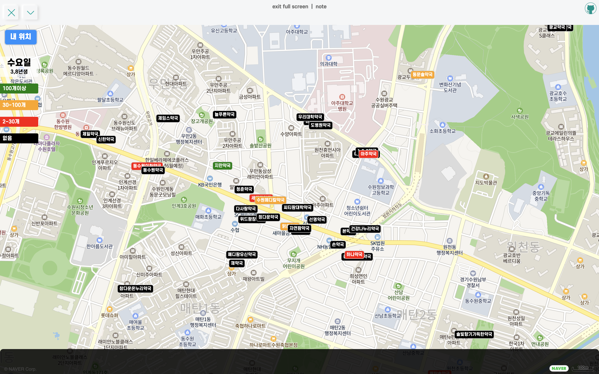

**네이버 지도 API**와 **공적 마스크 판매 현황 조회 API**를 이용해서 만든 코로나 마스크 판매처 찾기 어플리케이션

<hr/>

```toc
exclude: Table of Contents
from-heading: 1
to-heading: 5
```

# \#. Project Map

- :apple: <a href="https://small-magic-project.now.sh/" target="_blank">프로젝트 사이트</a>

- :apple: <a href="https://small-magic-project.now.sh/maskmap" target="_blank">프로젝트 사이트/maskmap</a>

* :fire: <a href="https://github.com/taenykim/small-magic-project" target="_blank">프로젝트 깃허브소스</a>

<br/>

<details>
<summary>제작노트 한눈에보기[접기/펼치기]</summary>
<div markdown="1">

- [소마법 프로젝트 - 1 (container)](https://taeny.dev/project/%EC%86%8C%EB%A7%88%EB%B2%95-%ED%94%84%EB%A1%9C%EC%A0%9D%ED%8A%B81/)

- [소마법 프로젝트 - 2 (calculator)](https://taeny.dev/project/%EC%86%8C%EB%A7%88%EB%B2%95-%ED%94%84%EB%A1%9C%EC%A0%9D%ED%8A%B82/)

- [소마법 프로젝트 - 3 (graph)](https://taeny.dev/project/%EC%86%8C%EB%A7%88%EB%B2%95-%ED%94%84%EB%A1%9C%EC%A0%9D%ED%8A%B83/)

- [소마법 프로젝트 - 4 (crawling)](https://taeny.dev/project/%EC%86%8C%EB%A7%88%EB%B2%95-%ED%94%84%EB%A1%9C%EC%A0%9D%ED%8A%B84/)

- [소마법 프로젝트 - 5 (today)](https://taeny.dev/project/%EC%86%8C%EB%A7%88%EB%B2%95-%ED%94%84%EB%A1%9C%EC%A0%9D%ED%8A%B85/)

- [소마법 프로젝트 - 6 (jjal)](https://taeny.dev/project/%EC%86%8C%EB%A7%88%EB%B2%95-%ED%94%84%EB%A1%9C%EC%A0%9D%ED%8A%B86/)

- [소마법 프로젝트 - 7 (avengers)](https://taeny.dev/project/%EC%86%8C%EB%A7%88%EB%B2%95-%ED%94%84%EB%A1%9C%EC%A0%9D%ED%8A%B87/)

- [소마법 프로젝트 - 8 (maskmap)](https://taeny.dev/project/%EC%86%8C%EB%A7%88%EB%B2%95-%ED%94%84%EB%A1%9C%EC%A0%9D%ED%8A%B88/)

- [소마법 프로젝트 - 9 (loading)](https://taeny.dev/project/%EC%86%8C%EB%A7%88%EB%B2%95-%ED%94%84%EB%A1%9C%EC%A0%9D%ED%8A%B89/)

</div>
</details>

# 1. 레이아웃

## 1-1. 메인화면



전체 화면크기에 맞게 네이버지도로 채우고, 화면 좌측에

1. **내 위치** 버튼

2. 마스크 5부제에 해당하는 오늘 요일과 마스크 구입 년생 표시창

3. 마스크 판매처의 마스크 보유개수에 대한 색상 설명창을 두었다.

## 1-2. 컴포넌트

```jsx
<BackgroundContainer>
  <ContentsMenubar name="maskmap" />
  <Description>
    <button onClick={mylocationHandler}>내 위치</button>
    <div>
      <span
        style={{
          textAlign: 'center',
          color: 'black',
          background: 'rgba(255,255,255,0.7)',
        }}
      >
        <div style={{ fontSize: '20px', fontFamily: 'escore8' }}>
          {weekArr[week]}요일
        </div>
        <div style={{ marginTop: '5px' }}>{weekMask[week]}</div>
      </span>
      <span style={{ background: 'green' }}>100개이상</span>
      <span style={{ background: 'orange' }}>30~100개</span>
      <span style={{ background: 'red' }}>2~30개</span>
      <span style={{ background: 'black' }}>없음</span>
    </div>
  </Description>
  <MapContainer id="map"></MapContainer>
</BackgroundContainer>
```

컴포넌트는 크게

1. **Description** : 화면 좌측 내위치 버튼과 설명창

2. **MapContainer** : 지도

두 개로 구성하였고 두 컴포넌트 모두 `styled-component` 로 구성하였다.

# 2. 상태관리

```jsx
let map = null
const week = new Date().getDay()
const weekArr = ['일', '월', '화', '수', '목', '금', '토']
const weekMask = [
  '누구나',
  '1,6년생',
  '2,7년생',
  '3,8년생',
  '4,9년생',
  '5,0년생',
  '누구나',
]
```

> 1. `map` : 네이버 지도 API **naver.maps.Map** 객체가 담길 변수

> 2. `week` : 현재 요일

> 3. `weekArr` : 현재 요일에 대한 한글출력

> 4. `weekMask` : 요일에 대한 마스크 5부제 정보

# 3. 네이버지도 API

## 3-1. 지도가 들어갈 엘리먼트 지정

```jsx
<MapContainer id="map"></MapContainer>
```

먼저 지도가 들어갈 엘리먼트를 지정하고 id 값을 붙여, DOM에 접근할 수 있도록 해주었다.

## 3-2. 지도 생성

```jsx
useEffect(() => {
    map = new naver.maps.Map('map', {
      center: new naver.maps.LatLng(37.5666805, 126.9784147),
      zoom: 10,
      mapTypeId: naver.maps.MapTypeId.NORMAL
    })
```

지도는 마운트된 후에 실행되는 `useEffect` 함수를 통해 생성해주었다.

기본적인 정보(지도현재위치, 줌, 타입)은 네이버지도에서 제공한 기본적인 정보로 사용하였다. (서울시청)

## 3-3. 내 위치 찾기

```jsx
<button onClick={mylocationHandler}>내 위치</button>
```

우선 button 클릭 이벤트핸들러에 mylocationHandler 함수를 등록하고,

```jsx
const onSuccessGeolocation = position => {
  var location = new naver.maps.LatLng(
    position.coords.latitude,
    position.coords.longitude
  )

  map.setCenter(location)
  map.setZoom(16)
}

const onErrorGeolocation = () => {
  // 에러!!
}

const mylocationHandler = () => {
  if (navigator.geolocation) {
    navigator.geolocation.getCurrentPosition(
      onSuccessGeolocation,
      onErrorGeolocation
    )
  } else {
    // 에러
  }
}
```

유저가 위치권한을 허용했다면 getCurrentPosition 메소드를 통하여 현재 위치정보를 map 객체변수에 넣어주었다.

# 4. 마스크 판매현황 API

## 4-1. addListener

```jsx
naver.maps.Event.addListener(map, 'dragend', function(e) {
  // ...
})
```

먼저 API 통신은 유저가 지도를 드래그할 때마다 요청하게끔 구현해보았는데

maps.Event의 addListener 메소드 parameter 안에 현재지도 `map`, `dragend` 이벤트, `콜백함수`를 넣어주었다.

## 4-2. fetch (AJAX)

```jsx
const url =
  'https://8oi9s0nnth.apigw.ntruss.com/corona19-masks/v1/storesByGeo/json'
const query = `?lat=${map.getCenter().y}&lng=${map.getCenter().x}`
fetch(url + query)
  .then(res => {
    return res.json()
  })
  .then(json => {
    // ...
  })
```

API 통신은 fetch를 이용했고 then 메소드 체이닝을 통해 요청받은 데이터를 처리해주었다.

그리고 [공적 마스크 판매 현황 조회 API](https://app.swaggerhub.com/apis-docs/Promptech/public-mask-info/20200307-oas3) 에 필요한 parameter나 전달받을 JSON 데이터 형식이 잘 나와있어서 참고하며 url을 구성하였다.

## 4-3. 마스크판매현황 marker

```jsx
const remain_stat = {
  plenty: 'green',
  some: 'orange',
  few: 'red',
  empty: 'black',
  break: 'black',
}
for (let i = 0; i < json.count; i++) {
  var marker = new naver.maps.Marker({
    icon: {
      content: `<div style="font-size:10px; font-family:escore6; border:1px solid lightgrey; color:white; background:${
        remain_stat[json.stores[i].remain_stat]
      }; border-radius:5px; padding:4px;">${json.stores[i].name}</div>`,
    },
    position: new naver.maps.LatLng(json.stores[i].lat, json.stores[i].lng),
    map: map,
  })
}
```

마지막으로 마스크판매하는 곳의 판매현황을 표시하는 마커를 넣어주었는데 [공적 마스크 판매 현황 조회 API](https://app.swaggerhub.com/apis-docs/Promptech/public-mask-info/20200307-oas3) 에서는 마스크갯수에 따른 색깔을 통일해주는 것을 권장하여서 그에 맞게 색깔을 지정해주었다.

> 녹색(100개 이상)/노랑색(30~99개)/빨강색(2~29개)/회색(0~1개)

# 5. 개인적인 피드백

## 5-1. 마커표시 이벤트

해당 앱에서 지도에 마스크 현황 마커를 표시하려면 우선 사용자는 지도를 드래그해야한다.

`dragend` 이벤트라 드래그가 완료된 시점에 한번만 api를 호출한다는 점에서 효율적이지만 ux적으로는 별로 좋지 못한 것 같다.

초기 지도 구성시 (혹은, 현재위치 버튼을 처음 클릭한 시점)에도 마커를 표시해주는 기능을 넣으면 좋을 것 같다.

## 5-2. 지도의 부정확함

이거는 지도 API의 문젠지 내 코드의 문젠지 아직 파악을 못했지만 내 위치가 정확히 표시되지 않는 것 같다.

> 그래도 내 위치 근방까지는 잘 표시해주는 것 같아서 유저가 헷갈리지 않게 그냥내위치 마커를 빼버렸다!
