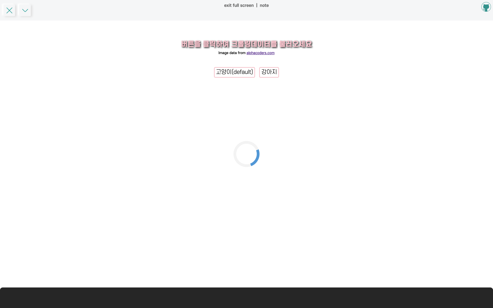

**스플래시 화면**과 **데이터 로딩 창**을 구현한 크롤링이미지 열람 어플리케이션

크롤링은 [소마법 프로젝트 - 4 (crawling)](https://taeny.dev/project/%EC%86%8C%EB%A7%88%EB%B2%95-%ED%94%84%EB%A1%9C%EC%A0%9D%ED%8A%B84/)에 있는 크롤링 함수를 재사용하였다.

<hr/>

```toc
exclude: Table of Contents
from-heading: 1
to-heading: 5
```

# \#. Project Map

- :apple: <a href="https://small-magic-project.now.sh/" target="_blank">프로젝트 사이트</a>

- :apple: <a href="https://small-magic-project.now.sh/loading" target="_blank">프로젝트 사이트/loading</a>

* :fire: <a href="https://github.com/taenykim/small-magic-project" target="_blank">프로젝트 깃허브소스</a>

<br/>

<details>
<summary>제작노트 한눈에보기[접기/펼치기]</summary>
<div markdown="1">

- [소마법 프로젝트 - 1 (container)](https://taeny.dev/project/%EC%86%8C%EB%A7%88%EB%B2%95-%ED%94%84%EB%A1%9C%EC%A0%9D%ED%8A%B81/)

- [소마법 프로젝트 - 2 (calculator)](https://taeny.dev/project/%EC%86%8C%EB%A7%88%EB%B2%95-%ED%94%84%EB%A1%9C%EC%A0%9D%ED%8A%B82/)

- [소마법 프로젝트 - 3 (graph)](https://taeny.dev/project/%EC%86%8C%EB%A7%88%EB%B2%95-%ED%94%84%EB%A1%9C%EC%A0%9D%ED%8A%B83/)

- [소마법 프로젝트 - 4 (crawling)](https://taeny.dev/project/%EC%86%8C%EB%A7%88%EB%B2%95-%ED%94%84%EB%A1%9C%EC%A0%9D%ED%8A%B84/)

- [소마법 프로젝트 - 5 (today)](https://taeny.dev/project/%EC%86%8C%EB%A7%88%EB%B2%95-%ED%94%84%EB%A1%9C%EC%A0%9D%ED%8A%B85/)

- [소마법 프로젝트 - 6 (jjal)](https://taeny.dev/project/%EC%86%8C%EB%A7%88%EB%B2%95-%ED%94%84%EB%A1%9C%EC%A0%9D%ED%8A%B86/)

- [소마법 프로젝트 - 7 (avengers)](https://taeny.dev/project/%EC%86%8C%EB%A7%88%EB%B2%95-%ED%94%84%EB%A1%9C%EC%A0%9D%ED%8A%B87/)

- [소마법 프로젝트 - 8 (maskmap)](https://taeny.dev/project/%EC%86%8C%EB%A7%88%EB%B2%95-%ED%94%84%EB%A1%9C%EC%A0%9D%ED%8A%B88/)

- [소마법 프로젝트 - 9 (loading)](https://taeny.dev/project/%EC%86%8C%EB%A7%88%EB%B2%95-%ED%94%84%EB%A1%9C%EC%A0%9D%ED%8A%B89/)

</div>
</details>

# 1. 레이아웃

## 1-1. 스플래시 화면


> LOADING 텍스트에 애니메이션을 주었다.

## 1-2. 데이터 로딩화면



> 회전하는 원형 엘리먼트 애니메이션..

## 1-3. 데이터 로딩완료화면


> "Hello cats!"

## 1-4. 컴포넌트

```jsx
<BackgroundContainer>
  <ContentsMenubar name="loading" />
  <MainLoader id="main_loader">
    <MainLoaderText transX="12px" delay="0.35s" color="firebrick">
      LOADING
    </MainLoaderText>
    <MainLoaderText transX="10px" delay="0.28s" color="darkgoldenrod">
      LOADING
    </MainLoaderText>
    <MainLoaderText transX="8px" delay="0.21s" color="darkolivegreen">
      LOADING
    </MainLoaderText>
    <MainLoaderText transX="6px" delay="0.14s" color="darksalmon">
      LOADING
    </MainLoaderText>
    <MainLoaderText transX="4px" delay="0.07s" color="cornflowerblue">
      LOADING
    </MainLoaderText>
    <MainLoaderText delay="0s" color="white">
      LOADING
    </MainLoaderText>
  </MainLoader>
  <Loader id="first_loader"></Loader>
  <Description>
    <p
      style={{
        fontSize: '20px',
        fontFamily: 'escore7',
        color: 'pink',
        textShadow: '2px 2px 4px black',
        textAlign: 'center',
      }}
    >
      버튼을 클릭하여 크롤링데이터를 불러오세요
    </p>
    <p style={{ fontSize: '10px', fontFamily: 'escore5', marginTop: '10px' }}>
      Image data from{'  '}
      <a href="https://wall.alphacoders.com/" target="_blank">
        alphacoders.com
      </a>
    </p>
  </Description>
  <ButtonContainer>
    <button id="cat_button">고양이(default)</button>
    <button id="dog_button">강아지</button>
  </ButtonContainer>
  <TextContainer id="myDiv" style={{ display: 'none' }}>
    {imgArr.map((item, i) => {
      return </img>
    })}
  </TextContainer>
</BackgroundContainer>
```

모든 컴포넌트는 `styled-component`로 구성하였다.

1. **MainLoader**, **MainLoaderText** : 스플래시 로딩화면

> 한눈에 보기 좋지 않아서 코드스플리팅이 필요해보임 ㅠㅠ setTimeout() 메소드로 3초간 지속되게 해주었다.

2. **Loader** : 데이터 로딩화면

> 로딩화면은 div 태그로 구성했고 fetch의 then 체이닝으로 데이터가 불러와지면 로딩화면이 사라지고 데이터이미지가 보여지도록 해주었다.

3. **Description** : 설명창

> 어플리케이션 설명 창

4. **ButtonContainer** : 크롤링 함수 실행버튼

> 고양이와 강아지 이미지를 불러오는 크롤링함수를 실행하는 버튼 2개 Container

5. **TextContainer** : 이미지 데이터 뷰 Container

> 크롤링한 고양이와 강아지 이미지데이터를 보여주는 뷰 Container

> 초기 style 값으로 `display:none`을 설정해주었다.

# 2. 상태관리

(작성중)
